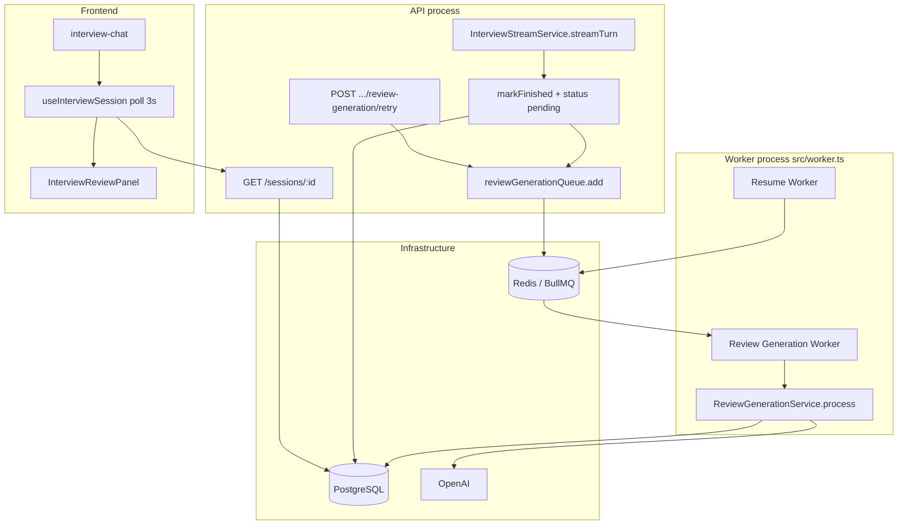
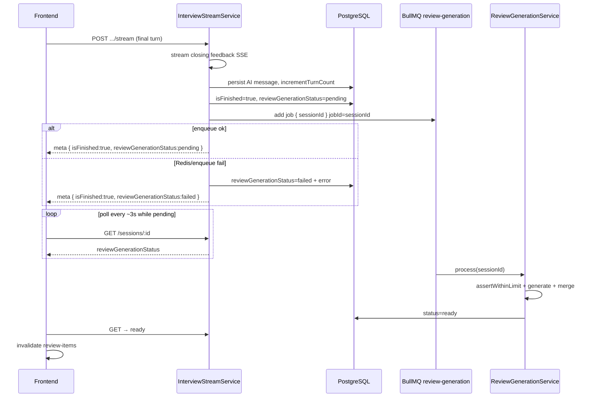

# Async Review Items Generation — Design

**Spec**: `.specs/features/async-review-items-generation/spec.md`  
**Context**: `.specs/features/async-review-items-generation/context.md`  
**Status**: Approved (tasks drafted)

---

## Architecture Overview

Move review-item LLM extraction out of `InterviewStreamService`’s final-turn SSE path. The API finishes the conversation (`isFinished` + locale), sets `reviewGenerationStatus=pending`, enqueues a BullMQ job, and returns SSE `meta` immediately. The existing worker process (`src/worker.ts`) consumes a new `review-generation` queue, runs the same `IReviewItemsGenerator` + `ReviewMergeService.insertNewTopicsOnly` path, and converges status to `ready` or `failed`. Frontend polls **session detail** (new GET) until terminal status, then refreshes review items.





---

## Code Reuse Analysis

### Existing Components to Leverage

| Component | Location | How to Use |
| --------- | -------- | ---------- |
| Resume queue pattern | `Backend/src/infrastructure/queue/resume-queue.ts` | Mirror for `review-generation-queue.ts` (shared `redisConnection`) |
| Resume queue protocol | `Backend/src/modules/resumes/protocols/resume-queue.ts` | Mirror `IReviewGenerationQueue` with `add({ sessionId })` |
| Worker entry | `Backend/src/worker.ts` | Register a **second** `Worker` on the review queue (keep resume worker) |
| `ResumeService.process` result style | `resume-service.ts` | Same `ready \| failed \| skipped` result + logging helpers |
| `IReviewItemsGenerator` + adapter | `protocols/review-items-generator.ts`, `review-items-generator-adapter.ts` | Call from worker service, not from stream |
| `ReviewMergeService.insertNewTopicsOnly` | `review-merge-service.ts` | Unchanged merge semantics |
| `createUsageCaptureCallback` / `TokenUsageService` | token-usage module | Worker path: assert + record (same as resume `process`) |
| `SessionRepository.markFinished` | `session-repository.ts` | Extend to set status `pending` (+ clear error) in same UPDATE |
| `SessionService` / controller / routes | interview module | Add `getSession`, `retryReviewGeneration`; extend `SessionSummary` |
| FE resume poll | `frontend/src/lib/query/hooks/use-resume.ts` | Copy `refetchInterval` pattern for session detail |
| `InterviewReviewPanel` | `interview-review-panel.tsx` | Branch on status: preparing / error+retry / grid |
| Factories | `factories/interview/*` | Wire queue into stream; new factory for review-generation service |
| `ConflictError` / `NotFoundError` | `@/shared` | Retry invalid state → 409; ownership → 404 |

### Integration Points

| System | Integration Method |
| ------ | ------------------ |
| Prisma `InterviewSession` | New enum + two columns; migration backfill |
| BullMQ / Redis | New queue name; reuse `redisConnection` from resume-queue |
| SSE `meta` | Final turn only: add `reviewGenerationStatus` |
| OpenAPI / FE types | Extend `SessionSummary`, `StreamMeta`; add get + retry clients |
| Docker `worker` service | No compose change — same `bun run worker` loads both workers |

### Fragile areas / mitigations

| Concern | Mitigation |
| ------- | ---------- |
| Current limbo: generate fails before `markFinished` | Finish **before** enqueue; generator errors never clear `isFinished` |
| FE race: invalidate review-items on finish | Stop immediate invalidate-as-ready; poll status; invalidate only on `ready` |
| Resume worker swallows errors (no BullMQ retry) | Review worker **throws** transient errors so attempts/backoff apply; permanent failures mark DB `failed` without throw |
| No `GET /sessions/:id` today (FE uses list) | Add detail GET as canonical poll target; also expose status on list for consistency |
| Duplicate `jobId` on manual retry | Remove existing BullMQ job for `sessionId` before re-add |

---

## Components

### Prisma: `ReviewGenerationStatus` + session columns

- **Purpose**: Persist generation lifecycle independently of `isFinished`
- **Location**: `Backend/prisma/schema/ai-mock-interview.prisma`
- **Model**:

```prisma
enum ReviewGenerationStatus {
  idle
  pending
  ready
  failed
}

model InterviewSession {
  // ...existing fields...
  reviewGenerationStatus ReviewGenerationStatus @default(idle) @map("review_generation_status")
  reviewGenerationError  String?                @map("review_generation_error") @db.Text
}
```

- **Migration backfill**: `UPDATE interview_sessions SET review_generation_status = 'ready' WHERE is_finished = true;` (old sync path already generated items). Non-finished rows keep default `idle`.
- **Dependencies**: Prisma migrate
- **Reuses**: Same enum style as `ResumeStatus`

---

### `IReviewGenerationQueue` + `review-generation-queue.ts`

- **Purpose**: Enqueue idempotent review-generation jobs
- **Location**:
  - Protocol: `Backend/src/modules/interview/protocols/review-generation-queue.ts`
  - Infra: `Backend/src/infrastructure/queue/review-generation-queue.ts`
- **Interfaces**:

```typescript
export type ReviewGenerationJobData = { sessionId: string };

export interface IReviewGenerationQueue {
  add(params: { sessionId: string }): Promise<void>;
  /** Remove prior job (failed/completed) so the same jobId can be re-enqueued on manual retry */
  remove(sessionId: string): Promise<void>;
}
```

- **Queue config** (locked in Design — was Agent Discretion):
  - Queue name: `review-generation`
  - Job name: `generate`
  - `jobId`: `sessionId` (dedupe concurrent finish)
  - `attempts: 3`
  - `backoff: { type: "exponential", delay: 2000 }` → ~2s, 4s
  - `removeOnComplete: true`
  - `removeOnFail: false` (manual retry removes explicitly)
- **Dependencies**: shared `redisConnection` from `resume-queue.ts` (export already exists)
- **Reuses**: `resume-queue.ts` structure; BullMQ `Queue.add` options per docs

---

### `ReviewGenerationService`

- **Purpose**: Worker-side orchestration: load context → quota → generate → merge → status
- **Location**: `Backend/src/modules/interview/service/review-generation-service.ts`
- **Interfaces**:

```typescript
type ReviewGenerationProcessResult =
  | { status: "ready"; sessionId: string }
  | { status: "failed"; sessionId: string; error: string; cause?: unknown; retryable: false }
  | { status: "skipped"; sessionId: string; reason: string };

class ReviewGenerationService {
  process(sessionId: string): Promise<ReviewGenerationProcessResult>;
  /** API path: mark pending, clear error, enqueue (after remove if needed) */
  enqueueForSession(sessionId: string): Promise<"pending" | "failed">;
  retry(userId: number, sessionId: string): Promise<SessionSummary>;
}
```

- **`process` behavior**:
  1. Load session by id; missing → `skipped`
  2. If `reviewGenerationStatus === "ready"` → `skipped` (idempotent)
  3. If `!isFinished` → `skipped` (guard)
  4. `assertWithinLimit(userId)` — on `TokenLimitExceededError`: mark `failed`, return `{ failed, retryable: false }` (**do not throw**)
  5. Load messages → transcript; load resume `structuredSummary`; use session `interviewLocale` + `jobDescription`
  6. `reviewItemsGenerator.generate(...)` + `insertNewTopicsOnly` + `recordUsage`
  7. Mark `ready`, clear error → `{ ready }`
  8. Other errors: **rethrow** so BullMQ retries; leave status `pending`
- **Dependencies**: SessionRepository, MessageRepository, ResumeRepository, IReviewItemsGenerator, ReviewMergeService, TokenUsageService, IReviewGenerationQueue (for enqueue/retry)
- **Reuses**: Same inputs as current final-turn block in `stream-service.ts`

---

### `InterviewStreamService` (final-turn change)

- **Purpose**: Finish conversation without awaiting review LLM
- **Location**: `Backend/src/modules/interview/service/stream-service.ts`
- **Final-turn flow** (replace generate+merge block):

```
incrementTurnCount
→ markFinished(sessionId, locale)  // also sets reviewGenerationStatus=pending, clears error
→ try reviewGenerationQueue.add({ sessionId })
     catch → markReviewGenerationFailed(sessionId, message); statusForMeta = failed
→ meta { turnCount, maxTurns, isFinished: true, reviewGenerationStatus }
```

- **Remove** from constructor: `reviewItemsGenerator`, `reviewMergeService`, and the final-turn `assertWithinLimit` that existed only for review generation
- **Add**: `IReviewGenerationQueue` (or `ReviewGenerationService.enqueueForSession`)
- **Non-final turns**: unchanged; no status in meta
- **Dependencies**: session/message/resume repos, graph, token usage (interviewer only), review queue
- **Reuses**: existing SSE helpers

---

### `SessionRepository` extensions

- **Purpose**: Persist finish + generation status transitions
- **Location**: `session-repository.ts`
- **Interfaces**:
  - `markFinished(id, interviewLocale)` → also sets `reviewGenerationStatus: pending`, `reviewGenerationError: null`
  - `markReviewGenerationFailed(id, error: string)`
  - `markReviewGenerationReady(id)`
  - `markReviewGenerationPending(id)` — for retry (pending + clear error); does not toggle `isFinished`
- **Reuses**: existing Prisma update style

---

### HTTP: session detail + retry

- **Purpose**: Poll target + manual recovery
- **Location**: routes / controller / `SessionService`
- **Routes**:
  - `GET /api/interview/sessions/:sessionId` → `SessionSummary` (ownership 404)
  - `POST /api/interview/sessions/:sessionId/review-generation/retry` → `SessionSummary` (auth required; no body)
- **`SessionSummary`** (list + detail):

```typescript
{
  id, resumeId, level, turnCount, maxTurns, isFinished,
  hasJobDescription, createdAt,
  reviewGenerationStatus: "idle" | "pending" | "ready" | "failed",
  reviewGenerationError: string | null
}
```

- **Retry rules**: `isFinished && status===failed` else **409**; non-owner **404**
- **Retry steps**: `remove(sessionId)` → `markReviewGenerationPending` → `add({ sessionId })`; if add fails → mark failed + return (still 200 with failed, or 503 — prefer mark failed and return 200 with status payload so FE can show error; document as 200 with `failed` if enqueue fails again)
- **Reuses**: `listSessions` mapping; extend both list and get

---

### Worker registration

- **Purpose**: Process review jobs alongside resumes
- **Location**: `Backend/src/worker.ts`
- **Behavior**:
  - Keep existing resume `Worker` (`concurrency: 1`)
  - Add review `Worker` (`concurrency: 1`)
  - Handler calls `ReviewGenerationService.process`
  - If result is `failed` with `retryable: false`, log and return (no throw)
  - If process throws, BullMQ retries; on `worker.on("failed")` when `attemptsMade >= attempts`, call `markReviewGenerationFailed`
  - Log helpers mirror `logResumeJobResult`
- **Dependencies**: `makeReviewGenerationService()` factory
- **Reuses**: resume worker logging / error handlers

---

### Frontend

#### Types / API

- **Location**: `frontend/src/types/interview.ts`, `lib/api/interview.ts`, `lib/api/interview-stream.ts`
- Extend `StreamMeta` with optional `reviewGenerationStatus?: "pending" | "failed"`
- Extend `SessionSummary` with status + error
- Add `interviewApi.getSession(id)`, `interviewApi.retryReviewGeneration(id)`

#### `useInterviewSession(sessionId)`

- **Location**: `frontend/src/lib/query/hooks/use-interview-session.ts`
- **Behavior**: `refetchInterval: 3000` while `reviewGenerationStatus === "pending"`, else `false` (copy `use-resume.ts`)
- On transition to `ready`, invalidate `["review-items"]` (and sessions list)

#### `interview-chat.tsx` / `InterviewReviewPanel`

- On finish meta: set local/cache status `pending` (or `failed`); **do not** treat topics as ready
- Show Review tab at `isFinished` (closing feedback available)
- Panel:
  - `pending` → preparing copy (existing PT string can stay or be localized later)
  - `failed` → error + Retry button → POST retry → back to pending poll
  - `ready` → current `ReviewItemsGrid` filtered by `sessionId`
- Stop blind `invalidateQueries(["review-items"])` on every turn completion as the readiness signal; keep sessions invalidate; review-items only on `ready`

---

## Data Models

### Session summary (API)

```typescript
type ReviewGenerationStatus = "idle" | "pending" | "ready" | "failed";

type SessionSummary = {
  id: string;
  resumeId: string;
  level: "entry" | "mid" | "senior";
  turnCount: number;
  maxTurns: number;
  isFinished: boolean;
  hasJobDescription: boolean;
  createdAt: string | Date;
  reviewGenerationStatus: ReviewGenerationStatus;
  reviewGenerationError: string | null;
};

type StreamMeta = {
  turnCount: number;
  maxTurns: number;
  isFinished: boolean;
  /** Present on final turn only */
  reviewGenerationStatus?: "pending" | "failed";
};
```

**Relationships**: Status lives on `InterviewSession`. Review items remain rows in `ReviewItem` linked by `sessionId` / `userId`; readiness is **not** inferred from item count.

---

## Error Handling Strategy

| Error Scenario | Handling | User Impact |
| -------------- | -------- | ----------- |
| Redis down on enqueue after finish | `markReviewGenerationFailed`; SSE still `isFinished: true` + status `failed` | Chat locked; Review tab shows error + retry |
| Transient OpenAI / network in worker | Throw → BullMQ retry (3×, exponential 2s) | UI stays on preparing |
| Retries exhausted | `markReviewGenerationFailed` via `worker.on("failed")` | Error + retry |
| Token quota in worker | Mark `failed` immediately, no throw | Error; retry later when under quota |
| Duplicate jobId on finish | Treat as success if job already waiting/active (or ignore duplicate error) | Still pending |
| Manual retry while not `failed` | **409 Conflict** | FE disables retry |
| Missing session / not owner | **404** | Existing pattern |
| Client abort before finish commit | No finish, no job (existing) | Can retry turn |
| Client abort after finish+enqueue | Job continues | Poll later shows ready/failed |
| Empty LLM topics / all duplicates | Status `ready` | Empty topics list is valid |

---

## Tech Decisions

| ID | Decision | Choice | Rationale |
| -- | -------- | ------ | --------- |
| ARG-D-01 | Poll endpoint | Add `GET /sessions/:id` (also include fields on list) | No detail GET today; list-only poll is wasteful; matches resume detail poll |
| ARG-D-02 | BullMQ attempts | `3` attempts, exponential backoff `delay: 2000` | Spec default; enough for 429 blips without long pending UX |
| ARG-D-03 | jobId | `sessionId` | Idempotent finish; one active generation per session |
| ARG-D-04 | Manual retry re-queue | `remove(jobId)` then `add` with same jobId | Required for BullMQ custom jobId reuse |
| ARG-D-05 | Quota errors | Fail permanently (no BullMQ retry) | Retrying immediately cannot fix quota |
| ARG-D-06 | Transient LLM errors | Rethrow for BullMQ retry; keep DB `pending` | Differs from resume worker (which swallows); intentional for ARG-13 |
| ARG-D-07 | Stream deps | Drop generator/merge from stream; inject queue only | Keeps stream thin; generation owned by worker service |
| ARG-D-08 | Worker concurrency | `1` for review worker (same as resume) | Protect OpenAI budget; scale with replica count later |
| ARG-D-09 | Retry HTTP on enqueue fail after mark pending | Return **200** with `reviewGenerationStatus: failed` | FE already handles failed; avoid ambiguous 503 vs status |
| ARG-D-10 | Field names | `reviewGenerationStatus`, `reviewGenerationError` | Matches context Agent Discretion |

---

## Requirement Mapping (Design)

| Requirement ID | Design coverage |
| -------------- | --------------- |
| ARG-01..05 | Stream final-turn flow + quota on worker only |
| ARG-06..13 | Queue + `ReviewGenerationService` + worker |
| ARG-14..16 | Prisma columns + SessionSummary + final meta |
| ARG-17 | FE poll hook + panel states |
| ARG-18 | Retry route + service |

**Coverage after Design:** 18 total, 18 mapped to design components, 0 unmapped. Tasks phase will map to atomic commits.

---

## Test Plan (for Tasks)

| Layer | What |
| ----- | ---- |
| Unit | Stream final turn: no generator call; enqueue; meta status; enqueue fail → failed meta |
| Unit | `ReviewGenerationService.process`: ready / quota failed / rethrow transient / skip if ready |
| Unit | Retry: 409 paths; happy path pending |
| Integration | Repository status transitions + migration defaults |
| E2E | Final turn → pending → (mock worker or real) ready; items appear; retry from failed |
| FE | Hook refetchInterval; panel preparing/failed/ready (component or light integration) |

---

## Out of Scope (design-level)

- Changing resume worker to also use BullMQ throws/retries
- Separate worker deployable / K8s HPA rules
- Webhooks when ready
- Bull Board
