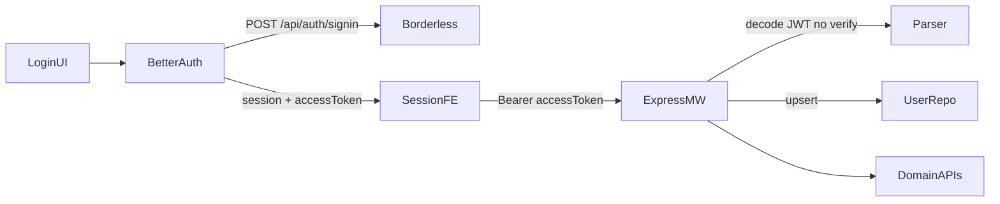

# Borderless Auth via better-auth — Design

**Spec**: `.specs/features/borderless-better-auth/spec.md`  
**Context**: `.specs/features/borderless-better-auth/context.md`  
**Status**: Approved

---

## Architecture Overview

Next.js owns better-auth and proxies credentials to Borderless. Express never validates Borderless passwords; it decodes the Borderless Bearer JWT (no signature verify), upserts a local user by `externalId`, and sets `req.userId` (Int).



---

## Components

### Frontend

| Component | Location | Role |
| --------- | -------- | ---- |
| `auth` (server) | `frontend/src/lib/auth/auth.ts` | betterAuth + credentials plugin → Borderless |
| Auth route | `frontend/src/app/api/auth/[...all]/route.ts` | Mount better-auth handler |
| `authClient` | `frontend/src/lib/auth/auth-client.ts` | Client + credentials plugin types |
| Session provider | `frontend/src/features/auth/session-provider.tsx` | Expose user, `getAccessToken`, `fetchWithAuth`, logout |
| Sign-in form | `frontend/src/components/auth/sign-in-form.tsx` | Email/password → authClient |
| Login page | `frontend/src/app/login/page.tsx` | Login-only (no signup) |

### Backend

| Component | Location | Role |
| --------- | -------- | ---- |
| `IBorderlessTokenVerifier` | `backend/src/modules/auth/protocols/borderless-token-verifier.ts` | Port |
| `BorderlessAccessTokenParser` | `backend/src/modules/auth/adapters/borderless-access-token-parser.ts` | Decode Bearer JWT (no verify); extract claims; reject expired |
| `UserSyncService` | `backend/src/modules/auth/service/user-sync-service.ts` | Upsert by externalId |
| `makeCheckAuthMiddleware` | `backend/src/modules/auth/middlewares/check-auth-middleware.ts` | Bearer → verify → sync → `req.userId` |
| `UserRepository` | `backend/src/modules/auth/repository/user-repository.ts` | `getByExternalId`, `upsertFromBorderless` |

### Removed

- Auth routes: signup/login/refresh/password-reset
- `AuthService` login/signup/refresh/reset flows (and factories/controller wiring)
- FE: `lib/api/auth.ts` local calls, signup form, refresh-token localStorage dance
- Prisma `RefreshToken` model (if unused after removal)

---

## Data Model

```prisma
model User {
  id              Int              @id @default(autoincrement())
  externalId      String?          @unique @map("external_id")
  name            String
  email           String           @unique
  password        String?          // nullable — Borderless-synced users
  interviewLocale InterviewLocale? @map("interview_locale")
  // ... relations unchanged; RefreshToken removed
}
```

JWT claims expected (flexible):

| Claim | Maps to |
| ----- | ------- |
| `sub` or `id` | `externalId` (required) |
| `email` | `email` (required) |
| `name` or `username` | `name` (default: email local-part) |

---

## Env

**Frontend (server):** `BETTER_AUTH_SECRET`, `BETTER_AUTH_URL`, `BORDERLESS_API_BASE`  
**Frontend (client):** `NEXT_PUBLIC_SERVER_URL` (unchanged)  
**Backend:** no Borderless JWT secret — decode-only Bearer claims (+ optional `exp`)

---

## Error Mapping

| Borderless status | FE behavior |
| ----------------- | ----------- |
| 400 / 401 | "Invalid credentials" (or `error.message`) |
| 403 | Forbidden message |
| 429 | Rate-limit / try later |
| 500 | Generic failure |

Express: any verify/upsert failure → `401` with stable message (no token leak).

---

## Code Reuse

- Keep `AuthGuard`, `AuthShell`, form UI patterns
- Keep `fetchWithAuth` shape so interview/resume hooks stay stable
- Keep `UserRepository.updateInterviewLocale` and users PATCH route
- Reuse `jsonwebtoken` for Borderless JWT verify (same package as old local JWT)

---

## Test Strategy

- Unit: verifier claim extraction; middleware 401/200; user sync upsert
- E2E: replace `signUpUser`/`loginUser` with `seedUserAndToken` that creates Prisma user + signs Borderless-shaped JWT with test secret
- Delete or rewrite `auth.e2e.test.ts` local auth cases; keep bearer-protected smoke with new helper
