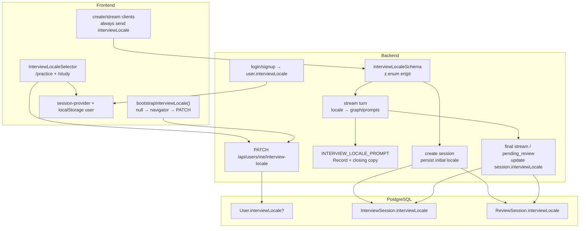
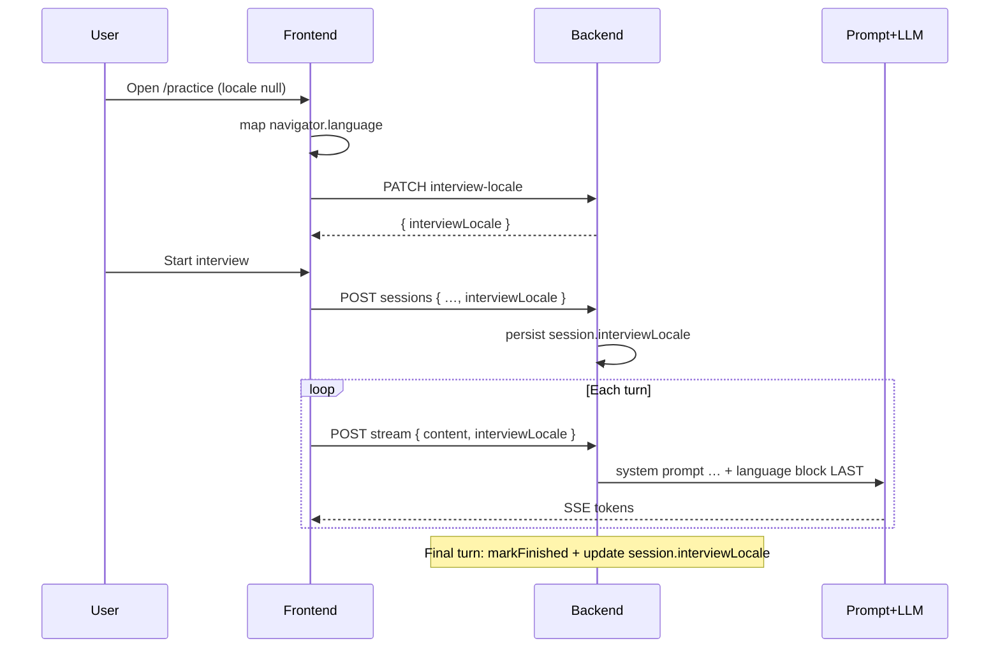

# Interview Locale (EN | PT) — Design

**Spec**: `.specs/features/interview-locale/spec.md`  
**Context**: `.specs/features/interview-locale/context.md`  
**Status**: Approved (tasks drafted)

---

## Architecture Overview

Additive change across auth payload, a small new `users` module, interview/review-session request contracts, five prompt builders, and a Practice/Study selector. Prompt language is resolved **only** from a Zod-validated body enum → server-side const map. Preference on `User` is for UX bootstrap/persistence; session columns are for metrics at completion.





---

## Code Reuse Analysis

### Existing Components to Leverage

| Component | Location | How to Use |
| --------- | -------- | ---------- |
| `validate(schema)` | `Backend/src/shared/middlewares/validation-middleware.ts` | Same middleware; invalid locale → **422** (existing contract; see Tech Decisions) |
| `makeCheckAuth()` | `Backend/src/modules/auth/middlewares/check-auth-middleware.ts` | Protect `PATCH /api/users/me/interview-locale` |
| `toUserWithoutPassword` | `Backend/src/modules/auth/types/user.ts` | Auto-includes new field once `User` type gains `interviewLocale` |
| Zod enum pattern | `interview-schemas.ts`, `review-session-schemas.ts` | Mirror with `interviewLocaleSchema = z.enum(["en","pt"])` |
| `LEVEL_INSTRUCTIONS` map pattern | `interviewer-system-prompt.ts` | Same `Record<Enum, string>` for locale prompt + closing copy |
| `CreateSessionParams` / `markFinished` | `session-repository.ts` | Extend create; extend finish to set locale |
| `markPendingReview` | `review-session-repository.ts` | Accept locale and write with status update |
| `InterviewGraphState` | `interview-state.ts` | Add `interviewLocale` annotation; pass from `streamTurn` |
| Practice level segmented buttons | `frontend/.../practice/page.tsx` | Template for EN/PT 2-col segmented control |
| `useAuth` / `setStoredSession` | `session-provider.tsx`, `session-storage.ts` | Persist updated `user.interviewLocale` after PATCH/bootstrap |
| Route auto-mount | `Backend/src/config/routes.ts` | New `modules/users` mounts at `/api/users` |

### Integration Points

| System | Integration Method |
| ------ | ------------------ |
| Prisma `User` | Nullable `interviewLocale InterviewLocale?` |
| Prisma sessions | Required `interviewLocale` on `InterviewSession` and `ReviewSession` |
| Auth login/signup | No new endpoints; response shape gains field |
| Interview create/stream | Required body field; graph state + prompts |
| Review-session create/stream | Required body field; question/eval prompts |
| Frontend auth types + API clients | Types + always-send body field |

### CONCERNS.md (frontend)

Client-only auth is unchanged. Selector and bootstrap run only inside authenticated `(app)` routes after `AuthGuard`. No new server-auth dependency.

---

## Components

### 1. Shared locale contract (Backend)

- **Purpose**: Single allowlisted enum + prompt instruction map (anti-injection).
- **Location**:
  - `Backend/src/shared/interview-locale/interview-locale.ts` — type + Zod schema + prompt map + closing localized copy
  - Re-export schema into module validations as needed
- **Interfaces**:
  - `export const interviewLocaleSchema = z.enum(["en", "pt"])`
  - `export type InterviewLocale = z.infer<typeof interviewLocaleSchema>`
  - `export function buildInterviewLocalePromptBlock(locale: InterviewLocale): string` — `## Language` / equivalent, **appended last**
  - `export function getClosingFeedbackCopy(locale: InterviewLocale): { wentWellHeader, workOnHeader, cta, replyInstruction }`
- **Dependencies**: Zod only
- **Reuses**: Same section-header style as existing prompts

**Prompt block (agent discretion for exact copy; intent locked):**

| Locale | Instruction (end of system prompt) |
| ------ | ----------------------------------- |
| `en` | Conduct and write **all** user-facing output in English only. |
| `pt` | Conduct and write **all** user-facing output in Portuguese only. |

Closing copy maps headings/CTA per locale (LOC-12).

---

### 2. Prisma / data layer

- **Purpose**: Persist preference and session metrics locale.
- **Location**: `Backend/prisma/schema/user.prisma`, `ai-mock-interview.prisma` + migration
- **Changes**:
  - `enum InterviewLocale { en pt }`
  - `User.interviewLocale InterviewLocale? @map("interview_locale")`
  - `InterviewSession.interviewLocale InterviewLocale @map("interview_locale")`
  - `ReviewSession.interviewLocale InterviewLocale @map("interview_locale")`
- **Migration note**: Existing session rows need a backfill default (`en`) if any exist in shared DBs; preference stays null for existing users until bootstrap.

---

### 3. `users` module — PATCH preference

- **Purpose**: Dedicated preference write path (`LOC-03`).
- **Location**: `Backend/src/modules/users/`
  - `routes/users-routes.ts` → `PATCH /me/interview-locale`
  - `controller/users-controller.ts`
  - `service/users-service.ts`
  - `validations/users-schemas.ts` — `{ interviewLocale: interviewLocaleSchema }`
- **Interfaces**:
  - `updateInterviewLocale(userId: number, locale: InterviewLocale): Promise<{ interviewLocale: InterviewLocale }>`
- **Dependencies**: `UserRepository` (extend auth repo or inject thin users repo that updates User); `makeCheckAuth`
- **Reuses**: Auth middleware, `validate()`, existing Prisma client
- **Agent decision**: Prefer extending `UserRepository` in auth with `updateInterviewLocale` and calling it from `users` service (no duplicate Prisma access patterns). Keep HTTP surface under `/api/users`.

---

### 4. Auth payload

- **Purpose**: Return preference on login/signup (`LOC-02`).
- **Location**: `auth/types/user.ts`, Prisma User, FE `types/auth.ts`
- **Interfaces**: `UserWithoutPassword` includes `interviewLocale: InterviewLocale | null`
- **Dependencies**: Prisma field
- **Reuses**: `toUserWithoutPassword` (no special casing)

---

### 5. Interview create + stream + finish

- **Purpose**: Require locale on API; seed session; drive prompts; persist completion locale.
- **Location**:
  - Schemas: `interview-schemas.ts` — add to `createSessionSchema`, `streamMessageSchema`
  - `session-service.ts` / `session-repository.ts` — create with locale
  - `stream-service.ts` — accept `interviewLocale`; pass into graph input; on final turn update locale with `markFinished`
  - `interview-state.ts` — `interviewLocale: Annotation<InterviewLocale>`
  - `interviewer-node.ts` — pass locale into prompt builders
  - Prompts: `interviewer-system-prompt.ts`, `closing-feedback-prompt.ts`, `review-items-generator-prompt.ts`
- **Interfaces**:
  - `streamTurn(userId, sessionId, { content, interviewLocale }, res)`
  - `markFinished(id, interviewLocale)` — sets `isFinished: true` **and** `interviewLocale`
  - `buildInterviewerSystemPrompt({ …, interviewLocale })` — **remove** mid-prompt `buildLanguageBlock()`; append `buildInterviewLocalePromptBlock` **last** (after Security)
  - Closing: parameterized headings/CTA/format; locale block last
  - Review-items generator: append locale block last; pass locale from `stream-service` into `generate(...)`
- **Dependencies**: Shared locale module; graph state
- **Reuses**: Existing stream/SSE flow; no User read for locale

---

### 6. Review sessions create + stream + pending_review

- **Purpose**: Same contract for Study LLM flows.
- **Location**:
  - `review-session-schemas.ts` — create + stream body
  - `review-sessions-service.ts` / `review-session-repository.ts`
  - `review-session-stream-service.ts` — pass locale into question + evaluation; on `markPendingReview(sessionId, interviewLocale)`
  - Prompts: `review-session-question-prompt.ts`, `review-session-evaluation-prompt.ts`
- **Interfaces**:
  - `create(userId, { reviewItemIds, interviewLocale })`
  - `streamTurn(userId, sessionId, { answer?, interviewLocale }, res)`
  - `markPendingReview(sessionId, interviewLocale)`
- **Dependencies**: Shared locale module
- **Reuses**: Existing evaluation completion path (`allItemsComplete` → evaluate → markPendingReview)

---

### 7. Frontend — preference + selector + API wiring

- **Purpose**: Bootstrap, select, and always send locale (`LOC-05`, `LOC-06`, `LOC-18`, `LOC-19`).
- **Location**:
  - `frontend/src/types/auth.ts` — `interviewLocale`
  - `frontend/src/lib/api/users.ts` — `patchInterviewLocale(token, locale)`
  - `frontend/src/features/interview-locale/map-browser-locale.ts` — `en*`→`en`, `pt*`→`pt`, else `en`
  - `frontend/src/features/interview-locale/use-interview-locale.ts` — read from auth user; bootstrap once if null; `setLocale` → PATCH + update stored session user
  - `frontend/src/features/interview-locale/interview-locale-selector.tsx` — EN | PT segmented control (practice level-button styles)
  - Mount selector: practice sidebar (above level grid); study hub header row
  - API: `interview.ts`, `interview-stream.ts`, `review-sessions.ts`, `review-session-stream.ts` + call sites
  - `session-provider.tsx` — expose `updateUser(partial)` or have hook call `setStoredSession` with merged user
- **Interfaces**:
  - `useInterviewLocale(): { locale: InterviewLocale; setLocale(l): Promise<void>; isReady: boolean }`
  - Selector always enabled (mid-session change allowed)
- **Dependencies**: `useAuth`, users API
- **Reuses**: Practice segmented button styling; localStorage session merge

---

## Data Models

### Prisma

```prisma
enum InterviewLocale {
  en
  pt
}

// User
interviewLocale InterviewLocale? @map("interview_locale")

// InterviewSession / ReviewSession
interviewLocale InterviewLocale @map("interview_locale")
```

### TypeScript (shared)

```typescript
type InterviewLocale = "en" | "pt";

type UserWithoutPassword = {
  id: number;
  name: string;
  email: string;
  interviewLocale: InterviewLocale | null;
  createdAt: Date; // backend
  updatedAt: Date;
};
```

### API contracts

| Endpoint | Body change |
| -------- | ----------- |
| `PATCH /api/users/me/interview-locale` | `{ interviewLocale: "en" \| "pt" }` → `{ interviewLocale }` |
| `POST /api/interview/sessions` | + required `interviewLocale` |
| `POST /api/interview/sessions/:id/stream` | + required `interviewLocale` |
| `POST /api/review-sessions` | + required `interviewLocale` |
| `POST /api/review-sessions/:id/stream` | + required `interviewLocale` |
| `POST /api/auth/login` / `signup` | Response `user.interviewLocale` |

**Relationships**: User preference is independent of session rows. Session `interviewLocale` is written on create and overwritten at completion; it is not the prompt source after create.

---

## Error Handling Strategy

| Error Scenario | Handling | User Impact |
| -------------- | -------- | ----------- |
| Invalid/missing `interviewLocale` on create/stream/PATCH | Zod via `validate()` → **422** `{ message, errors }` | FE should not omit field; show generic validation error if it happens |
| Unauthenticated PATCH | Existing auth middleware → 401 | Redirect/login |
| PATCH while session active | Allowed (200) | Next stream uses new selector value |
| Bootstrap PATCH fails | Keep local selector value; retry on next change; log/toast lightly | User can still practice if create/stream get the in-memory locale |
| Mid-stream disconnect on final turn before markFinished | Existing abort handling; locale update only with successful finish path | Same as today for unfinished sessions |

---

## Tech Decisions (non-obvious)

| Decision | Choice | Rationale |
| -------- | ------ | --------- |
| HTTP module for preference | New `users` module at `/api/users` | Matches domain split; auth stays credentials/tokens |
| Shared locale module path | `src/shared/interview-locale/` | Used by users + interview + review-sessions without circular imports |
| Language block position | **Last** section of system prompt (after Security) | Spec/context: prioritize locale; also removes duplicate mid-prompt English-only block |
| Remove old `buildLanguageBlock()` | Yes — replace with shared end block | Avoid conflicting EN-only + locale instructions |
| Validation status code | Keep **422** (existing `validate`) | Spec said 400 meaning “reject”; codebase convention is 422 for Zod — document as equivalent client error |
| `markFinished` / `markPendingReview` | Single update including locale | One write at completion; no per-turn session locale updates |
| Graph state carries locale | Yes, from stream body each turn | Nodes stay pure; no User lookup |
| Review-items generator locale | From final stream body (same as closing) | Generator runs in same final-turn path |
| FE bootstrap | Hook on practice/study mount only | Lazy write; no auth-time write |
| Selector placement | Practice sidebar + Study header | Visible before/during flows without new shell chrome |

---

## Requirement → Design mapping

| ID | Design component |
| -- | ---------------- |
| LOC-01 | Prisma enum + User field |
| LOC-02 | Auth types + toUserWithoutPassword |
| LOC-03–04 | users module + Zod |
| LOC-05–06, LOC-18–19 | FE hook + selector + API clients |
| LOC-07–10 | Interview + review-session schemas/services |
| LOC-11–14 | Shared prompt map + five builders; resume excluded |
| LOC-15–17 | Session columns + create/finish updates |

---

## Testing focus (for Tasks phase)

- Unit: `map-browser-locale`, `buildInterviewLocalePromptBlock` position (last section), closing copy per locale
- Unit/integration: create/stream reject without locale; PATCH updates User; `markFinished`/`markPendingReview` persist locale
- Service tests: stream passes locale into graph; final turn updates session locale from body (not create snapshot)
- FE: hook bootstraps once when null; create/stream payloads include selector value

---

## Out of design scope (unchanged)

- Resume extraction prompts
- App UI i18n strings
- Analytics dashboard over session locales
```