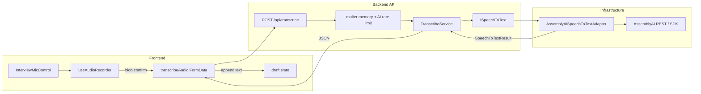
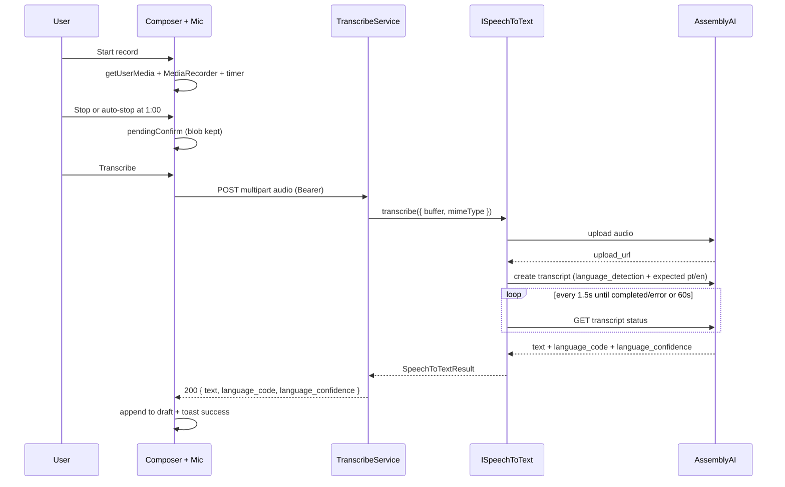
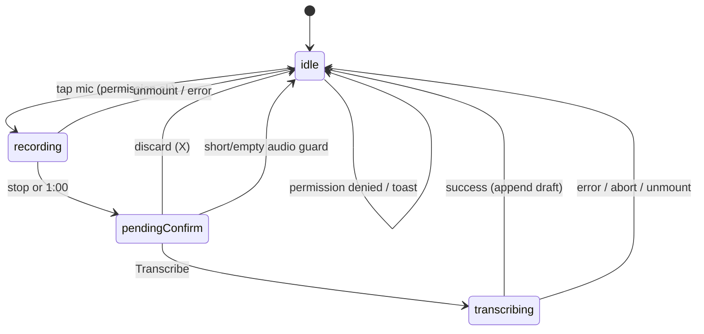

# Interview Speech-to-Text — Design

**Spec**: `.specs/features/interview-speech-to-text/spec.md`  
**Context**: `.specs/features/interview-speech-to-text/context.md`  
**Status**: Approved (tasks drafted)

---

## Architecture Overview

Add a vertical slice: browser `MediaRecorder` → confirm → `POST /api/transcribe` → application service → **`ISpeechToText` port** → **AssemblyAI adapter** (upload + transcript job + poll). The adapter is the only place that knows AssemblyAI URLs/SDK/env key. The shared interview composer gains mic UX; on success it **appends** text to the existing draft and shows a toast. Practice and Review session keep their current Send → stream paths unchanged.







---

## Code Reuse Analysis

### Existing Components to Leverage

| Component | Location | How to Use |
| --------- | -------- | ---------- |
| Module route discovery | `backend/src/config/routes.ts` | New `modules/transcribe/routes/` → mount `/api/transcribe` |
| Multer memory upload | `backend/src/modules/resumes/middlewares/resume-upload-middleware.ts` | Mirror as `audio-upload-middleware.ts` with `TRANSCRIBE_MAX_BYTES`, field `audio` |
| AI rate limiter | `makeAiRateLimiter` + resumes/interview wiring | Same middleware on `POST /` |
| HttpError hierarchy | `backend/src/shared/errors/http-errors.ts` | Map validation/provider/timeout; add `GatewayTimeoutError` (504) |
| Error handler Multer | `error-handler-middleware.ts` | Reuse `LIMIT_FILE_SIZE` → 400 pattern (extend message to cover audio) |
| Factory composition | `backend/src/factories/**` | `makeTranscribeService` / `makeTranscribeController` |
| Service + fake port tests | e.g. `resume-service.test.ts` | Unit-test `TranscribeService` with `vi.fn()` `ISpeechToText` |
| FormData upload client | `frontend/src/lib/api/resumes.ts` | Mirror `transcribeAudio` (raw `fetch`, Bearer, no JSON Content-Type) |
| Shared composer | `interview-chat-input.tsx` | Extend props / compose mic control; parents already own `draft` |
| Locale hook | `use-interview-locale.ts` | Key STT copy map |
| Toasts | `sonner` (resumes page) | Success / error feedback |

### Integration Points

| System | Integration Method |
| ------ | ------------------ |
| Global Bearer auth | No `PUBLIC_ROUTES` change; missing token → 401 |
| Practice / Review chat | Pass mic blockers into composer; `onTranscript` / parent appends draft |
| AssemblyAI | Adapter only; env `ASSEMBLYAI_API_KEY` |
| Existing stream APIs | Untouched — STT only fills draft before Send |

### Fragile areas (frontend CONCERNS)

| Concern | Mitigation |
| ------- | ---------- |
| Client-only `AuthGuard` | Same as streams/uploads today; STT still requires Bearer on API |
| `apiRequest` forces JSON | Do **not** use `apiRequest` for multipart — copy resumes `fetch` pattern |

---

## Components

### Backend module layout

```
backend/src/modules/transcribe/
  protocols/speech-to-text.ts          # ISpeechToText + DTOs
  service/transcribe-service.ts
  service/transcribe-service.test.ts
  controllers/transcribe-controller.ts
  middlewares/audio-upload-middleware.ts
  routes/transcribe-routes.ts

backend/src/infrastructure/speech-to-text/
  assemblyai-speech-to-text-adapter.ts

backend/src/factories/transcribe/
  speech-to-text-factory.ts            # createAssemblyAiSpeechToText()
  transcribe-service-factory.ts
  transcribe-controller-factory.ts
```

### `ISpeechToText` (port)

- **Purpose**: Provider-agnostic transcription contract.
- **Location**: `backend/src/modules/transcribe/protocols/speech-to-text.ts`
- **Interfaces**:

```typescript
export type SpeechToTextInput = {
  audio: Buffer;
  mimeType: string;
};

export type SpeechToTextResult = {
  text: string;
  languageCode: string;
  languageConfidence: number; // 0..1
};

export interface ISpeechToText {
  /**
   * Upload + create job + poll until completed/error or timeout.
   * Implementations MUST NOT leak provider-specific errors/stack to callers;
   * throw mapped HttpError subclasses (or a small SpeectToTextError mapped by the service).
   */
  transcribe(input: SpeechToTextInput): Promise<SpeechToTextResult>;
}
```

- **Dependencies**: None (pure port).
- **Reuses**: Same ports style as `IObjectStorage` / `IMailer`.

**Decision (agent):** One high-level `transcribe` on the port; multi-step AssemblyAI flow stays inside the adapter.

### `AssemblyAiSpeechToTextAdapter`

- **Purpose**: Implement `ISpeechToText` against AssemblyAI batch API.
- **Location**: `backend/src/infrastructure/speech-to-text/assemblyai-speech-to-text-adapter.ts`
- **Behavior**:
  1. `POST https://api.assemblyai.com/v2/upload` with raw audio body + `authorization` header
  2. `POST /v2/transcript` with:
     ```json
     {
       "audio_url": "<upload_url>",
       "language_detection": true,
       "language_detection_options": {
         "expected_languages": ["pt", "en"],
         "fallback_language": "auto"
       }
     }
     ```
  3. Poll `GET /v2/transcript/:id` every **1500 ms** until `completed` | `error`, or **60_000 ms** total elapsed → throw timeout
  4. Map success: `text`, `language_code`, `language_confidence` → `SpeechToTextResult`
  5. Empty/whitespace `text` on `completed` → treat as failure (mapped upstream)
- **Implementation choice**: Prefer **official `assemblyai` Node SDK** *only inside this file* if it supports Buffer upload + `language_detection_options` + controllable polling; otherwise **thin `fetch` REST** in the same adapter (no SDK). Either way, **no** AssemblyAI imports outside this adapter + its factory.
- **Dependencies**: `ASSEMBLYAI_API_KEY` from `env`; optional injectable `fetch` / clock for tests.
- **Reuses**: Infrastructure folder pattern (`infrastructure/storage`, `infrastructure/ai`).

### `TranscribeService`

- **Purpose**: Validate upload presence/type/size semantics and delegate to port; map empty text.
- **Location**: `backend/src/modules/transcribe/service/transcribe-service.ts`
- **Interfaces**:
  - `transcribe(file: { buffer: Buffer; mimetype: string; size: number }): Promise<SpeechToTextResult>`
- **Rules**:
  - Missing file → `BadRequestError`
  - Disallow non-audio mime prefixes when present (`audio/*` preferred; allow `video/webm` if browsers label webm that way — accept `audio/webm`, `audio/mp4`, `audio/mpeg`, `audio/wav`, `audio/ogg`, `video/webm`)
  - Call `speechToText.transcribe`
  - Trim text; if empty → `BadGatewayError("Transcription returned empty text")`
- **Dependencies**: `ISpeechToText`
- **Reuses**: Service + protocol injection pattern from resumes/interview.

### `TranscribeController` + routes

- **Purpose**: HTTP boundary for `POST /`.
- **Location**: `controllers/transcribe-controller.ts`, `routes/transcribe-routes.ts`
- **Route**: `POST /api/transcribe/` (trailing slash consistent with resumes)  
  Middleware order: `aiRateLimiter` → `audioUploadMiddleware.single("audio")` → controller  
  Auth: global Bearer (no public allowlist entry).
- **Response 200**:

```json
{
  "text": "string",
  "language_code": "pt",
  "language_confidence": 0.97
}
```

(snake_case in HTTP DTO to match brief; service may use camelCase internally and map in controller.)

- **Dependencies**: `makeTranscribeController()`, `makeAiRateLimiter(store)` like resumes routes.
- **Reuses**: Resumes route wiring style.

### Audio upload middleware + env

- **Purpose**: Multer memory storage, 5 MB cap.
- **Location**: `middlewares/audio-upload-middleware.ts`
- **Env** (`server-schema.ts`):
  - `ASSEMBLYAI_API_KEY: z.string().min(1)` (required at boot, same as OpenAI)
  - `TRANSCRIBE_MAX_BYTES: z.coerce.number().default(5_242_880)`
  - Optional constants (code, not env): `TRANSCRIBE_POLL_INTERVAL_MS = 1500`, `TRANSCRIBE_TIMEOUT_MS = 60_000`
- **Cleanup**: Memory storage → no disk files (satisfies STT-12 without unlink). Document that disk must not be introduced without cleanup.

### `GatewayTimeoutError`

- **Purpose**: Map poll timeout to **504**.
- **Location**: extend `http-errors.ts` with `GatewayTimeoutError extends HttpError` status `504`.
- **Thrown by**: adapter (or service wrapping adapter timeout).

---

### Frontend components

### `useAudioRecorder` hook

- **Purpose**: Encapsulate `getUserMedia`, `MediaRecorder`, chunks, timer, stop/auto-stop, cleanup tracks.
- **Location**: `frontend/src/features/interview/use-audio-recorder.ts` (or `features/speech-to-text/`)
- **API (sketch)**:
  - State: `idle | recording | pendingConfirm`
  - `start()`, `stop()`, `discard()`, `blob`, `mimeType`, `elapsedMs`, `error`
  - Constants: `MAX_MS = 60_000`, `MIN_MS = 500`
  - Prefer `audio/webm;codecs=opus` when `MediaRecorder.isTypeSupported`, else browser default; if no usable type → surface unsupported error
- **Reuses**: None existing; keep browser APIs out of presentational components.

### `transcribeAudio` API client

- **Purpose**: Multipart upload with abort signal + ~65s client timeout.
- **Location**: `frontend/src/lib/api/transcribe.ts`
- **Signature**: `transcribeAudio(blob: Blob, token: string, options?: { signal?: AbortSignal }): Promise<{ text; language_code; language_confidence }>`
- **Reuses**: Resumes FormData/`ApiError` pattern; `AbortSignal.timeout(65_000)` or combined abort.

### STT copy map

- **Purpose**: EN/PT strings for mic UX (STT-15).
- **Location**: `frontend/src/features/interview/stt-copy.ts` (or `features/speech-to-text/stt-copy.ts`)
- **Interface**: `getSttCopy(locale: "en" | "pt") => { record, stop, transcribe, discard, tooShort, permissionDenied, transcribing, success, genericError, rateLimited, unsupported, cancel }`
- **Reuses**: `useInterviewLocale().locale`

### `InterviewMicControl` + composer integration

- **Purpose**: Mic button UI: idle → recording (pulse + timer) → pendingConfirm (Transcribe + X) → transcribing (spinner + Cancel).
- **Location**: `frontend/src/features/interview/interview-mic-control.tsx`
- **Integration**: Extend `InterviewChatInput` to render mic beside Send (or above form), accepting:

```typescript
type InterviewChatInputProps = {
  // existing…
  locale: "en" | "pt";
  sttBlocked?: boolean; // parent may OR with isStreaming
  onDraftAppend: (text: string) => void; // or handle append inside if draft setters passed
};
```

**Preferred wiring (agent):** Keep draft ownership in parents; mic control calls `onTranscript(text)` and parent does:

```ts
setDraft((prev) => (prev.trim() ? `${prev.trim()} ${text}` : text));
```

Disable input/Send when `isStreaming || recorder.recording || recorder.pendingConfirm || isTranscribing`.

- **Discard**: Always show explicit **X** next to Transcribe (accessible). Long-press on Transcribe may also discard (progressive enhancement).
- **Cancel**: During transcribing, primary control becomes Cancel → `abortController.abort()`.
- **Feedback**: `toast.success(copy.success)` / `toast.error(...)`.
- **Parents to update**: `interview-chat.tsx`, `review-session-chat.tsx` only (not Study hub).

---

## Data Models

No Prisma models. Ephemeral DTOs only:

### HTTP response

```typescript
type TranscribeResponseDto = {
  text: string;
  language_code: string;
  language_confidence: number;
};
```

### Domain result

```typescript
type SpeechToTextResult = {
  text: string;
  languageCode: string;
  languageConfidence: number;
};
```

**Note:** AssemblyAI may return codes like `en` / `pt` or regional variants (e.g. `en_us`). Adapter returns provider `language_code` as-is (string); FE ignores in v1. No DB persistence.

---

## Error Handling Strategy

| Error Scenario | Handling | User Impact |
| -------------- | -------- | ----------- |
| Mic permission denied | FE catch `NotAllowedError` | Toast `permissionDenied`; stay idle |
| Unsupported MediaRecorder | FE before start | Toast `unsupported` |
| Recording &lt; ~500ms or empty blob | FE guard | Toast `tooShort`; no API |
| No/invalid multipart file | `BadRequestError` 400 | Toast message |
| File &gt; `TRANSCRIBE_MAX_BYTES` | Multer `LIMIT_FILE_SIZE` → 400 (existing mapper; message should mention audio) | Toast |
| Rate limit | 429 from `makeAiRateLimiter` | Toast `rateLimited` |
| Missing/invalid AssemblyAI key / upstream 401 | Adapter → `BadGatewayError` 502 | Toast generic transcription error |
| Provider upload/job `error` status | Adapter → `BadGatewayError` 502 with safe message | Toast |
| Poll timeout 60s | `GatewayTimeoutError` 504 | Toast timeout / try again |
| Empty transcript text | `BadGatewayError` 502 | Toast (do not append) |
| Network / abort | FE `AbortError` → silent or soft cancel; other → toast | Cancel returns idle without draft change |
| Unmount mid-flight | Abort + stop tracks | No late `setState` / no append |

Provider stack traces and API keys never appear in `{ message }`.

---

## Tech Decisions

| Decision | Choice | Rationale |
| -------- | ------ | --------- |
| Module name | `transcribe` → `/api/transcribe` | Matches brief URL; auto-mount convention |
| Port shape | Single `transcribe()` | Swap provider without changing service; multi-step stays in adapter |
| Storage | Multer **memory** | Matches resumes; no temp-file cleanup path |
| Oversized upload status | **400** (existing Multer mapping) | Spec allowed 413/400; keep codebase consistency |
| Poll timeout status | **504** `GatewayTimeoutError` | Correct gateway semantics; new small error class |
| AssemblyAI client | SDK **or** fetch, **adapter-only** | Prefer SDK if options/timeout workable; else REST; isolation preserved either way |
| Language options | `expected_languages: ["pt","en"]`, `fallback_language: "auto"` | Spec + AssemblyAI docs |
| HTTP DTO casing | snake_case for language fields | Matches product brief; map in controller |
| FE multipart | Dedicated `transcribe.ts` like resumes | `apiRequest` is JSON-only |
| Draft overflow | Append fully; Send keeps existing max validation | Spec default: no silent truncate |
| Discard UX | Visible **X** (+ optional long-press) | Accessibility over long-press-only |
| UI i18n | Local `stt-copy` map by `interviewLocale` | No global i18n framework |
| Env key | Required `ASSEMBLYAI_API_KEY` at boot | Same failure mode as `OPENAI_API_KEY` |

---

## Requirement Mapping (Design)

| Requirement ID | Design coverage | Status |
| -------------- | --------------- | ------ |
| STT-01 | Mic on shared composer; Practice + Review parents | In Design |
| STT-02 | `useAudioRecorder` max 60s → `pendingConfirm` | In Design |
| STT-03 | Transcribe + X discard | In Design |
| STT-04 | Parent append + `toast.success` | In Design |
| STT-05 | Disable input/Send while recording/pending/transcribing | In Design |
| STT-06 | AbortController + Cancel control | In Design |
| STT-07 | MIN_MS / empty blob guard | In Design |
| STT-08 | Permission denied toast | In Design |
| STT-09 | Route + multer + auth + AI rate limit | In Design |
| STT-10 | Adapter poll 1.5s / 60s | In Design |
| STT-11 | Detection options + response DTO | In Design |
| STT-12 | Errors mapped; memory storage | In Design |
| STT-13 | `ISpeechToText` + AssemblyAI adapter + factories | In Design |
| STT-14 | `ASSEMBLYAI_API_KEY` in schema; adapter-only | In Design |
| STT-15 | `stt-copy` + `useInterviewLocale` | In Design |
| STT-DEC-01…04 | Locked in context; reflected above | Locked |

---

## Test Plan (for Tasks)

| Layer | What |
| ----- | ---- |
| Unit | `TranscribeService` with fake `ISpeechToText` (success, empty text, missing file) |
| Unit | Adapter with mocked `fetch` (completed, error status, timeout) — optional if SDK-heavy; at least service + fake port required |
| E2E | `POST /api/transcribe` with auth + small audio fixture + **stubbed port/adapter** (no live AssemblyAI in CI) |
| FE | Manual UAT: Practice + Review mic flow; permission deny; short audio; cancel mid-transcribe |

Gate commands follow existing backend/frontend `TESTING` / package scripts when Tasks are written.

---

## Out of Scope (design-level)

- BullMQ / webhook completion for STT  
- Persisting audio or transcripts  
- Study hub mic  
- Changing stream body fields  
- Live AssemblyAI calls in CI  

---

## Local configuration (preview for Execute)

After implementation:

1. Set `ASSEMBLYAI_API_KEY` in backend `.env` (from AssemblyAI dashboard).  
2. Ensure `TRANSCRIBE_MAX_BYTES` optional (defaults to 5 MB).  
3. Run API + frontend; open Practice or Review session; allow mic; record → Transcribe → confirm draft → Send.

Detailed test steps remain for Execute / README touch-up when coding.
