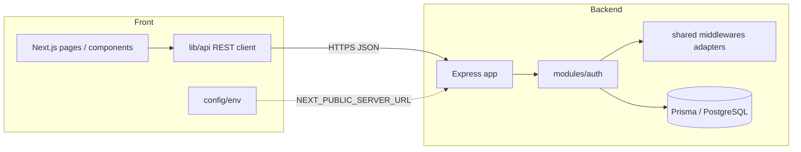
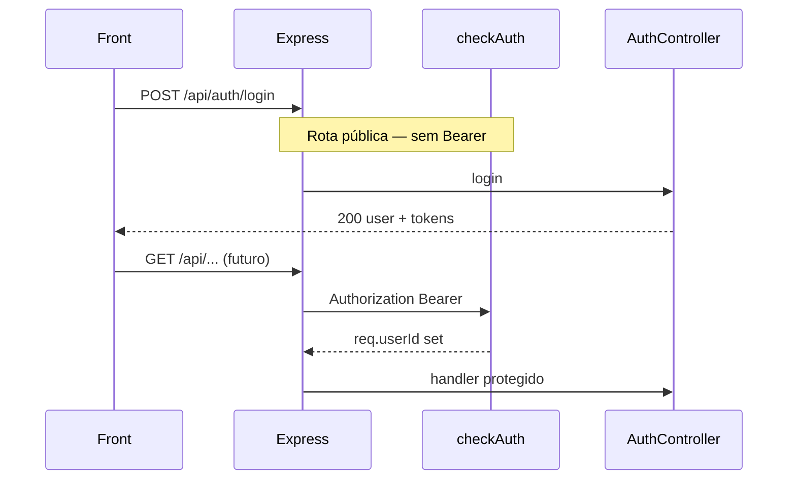
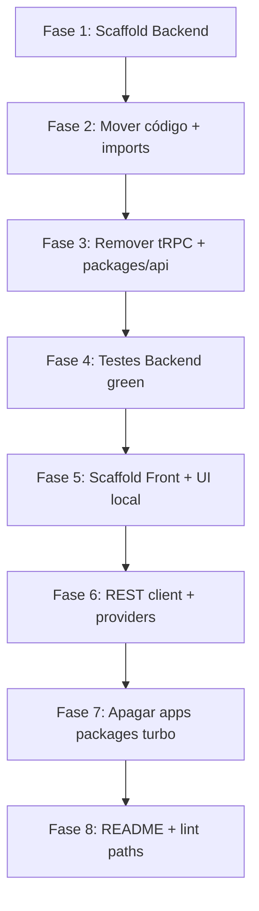

# Reestruturação: Front + Backend — Design

**Spec**: `.specs/features/restructure-front-backend/spec.md`  
**Status**: Approved

---

## Architecture Overview

Dois projetos Node independentes na raiz do mesmo repositório Git. O **Backend** é Express com descoberta automática de rotas por módulo (`/api/{module}/...`). O **Front** é Next.js App Router consumindo apenas REST. Não há workspaces, Turborepo nem pacotes `@hackathon2026/*`.



**Fluxo de request autenticado**



---

## Code Reuse Analysis

### Existing Components to Leverage

| Component | Origem atual | Uso na migração |
|-----------|--------------|-----------------|
| Route discovery | `apps/server/src/config/routes.ts` | Copiar para `Backend/src/config/routes.ts` sem alteração de lógica |
| Auth module (controller, routes, factories) | `apps/server/src/modules/auth/**` | Manter paths relativos; atualizar imports para `@/` |
| Auth domain | `packages/auth/**` | Mover para `Backend/src/modules/auth/{service,repository,validations}` |
| Cross-cutting | `packages/common/**` | Mover para `Backend/src/shared/**` |
| Env server | `packages/env/src/server*` | `Backend/src/config/env/` |
| Prisma | `packages/db/**` | `Backend/prisma/` + `Backend/src/infrastructure/database/` |
| Testes Vitest | `vitest.setup.ts`, testes em common/auth/server | `Backend/vitest.config.ts` + `Backend/vitest.setup.ts` |
| UI shadcn | `packages/ui/src/**` | Copiar para `Front/src/components/ui/` + `Front/src/lib/utils.ts` + estilos |
| Next app | `apps/web/**` | Base de `Front/` |

### Descartar (não migrar)

| Componente | Motivo |
|------------|--------|
| `packages/api/**` | tRPC removido |
| `turbo.json`, workspaces root | Fora de escopo |
| `apps/web/src/utils/trpc.ts` | Substituído por REST |
| `@trpc/*`, `@hono/trpc-server` | Dependências removidas |
| `packages/config` como pacote | Conteúdo inlined em `tsconfig` de cada app |

### Integration Points

| Sistema | Método |
|---------|--------|
| Front ↔ Backend | REST JSON sobre HTTP; `credentials: "include"` se cookies forem adotados depois; hoje tokens no body JSON |
| Backend ↔ Postgres | Prisma client singleton em `infrastructure/database` |
| Email | `NodemailerMailerAdapter` em `shared/adapters/mailer` |

---

## Estrutura de diretórios final

### Backend

```
Backend/
├── package.json
├── tsconfig.json
├── tsdown.config.ts          # noExternal removido ou vazio (tudo local)
├── vitest.config.ts
├── vitest.setup.ts
├── .env.example
├── prisma/
│   ├── schema/               # manter split user.prisma + schema.prisma
│   └── migrations/
├── docker-compose.yml        # ex-packages/db
├── prisma.config.ts
└── src/
    ├── index.ts
    ├── config/
    │   ├── app.ts            # SEM bloco /trpc
    │   ├── routes.ts
    │   └── env/
    │       ├── index.ts        # createEnv + export env
    │       ├── schema.ts       # serverEnv Zod
    │       └── server.test.ts
    ├── factories/
    │   └── auth/
    ├── modules/
    │   └── auth/
    │       ├── controller/
    │       ├── routes/
    │       ├── service/
    │       ├── repository/
    │       └── validations/
    ├── shared/
    │   ├── adapters/
    │   ├── middlewares/
    │   ├── protocols/
    │   ├── errors/
    │   ├── types/
    │   └── logger.ts
    ├── infrastructure/
    │   └── database/
    │       └── index.ts      # export prisma client
    └── types/
        └── express.d.ts
```

### Front

```
Front/
├── package.json
├── tsconfig.json
├── next.config.ts
├── postcss.config.mjs
├── .env.example
└── src/
    ├── app/                  # de apps/web/src/app
    ├── components/
    │   ├── ui/               # de packages/ui
    │   └── ...
    ├── config/
    │   └── env.ts            # de packages/env/web
    ├── lib/
    │   ├── api/
    │   │   ├── client.ts     # fetch wrapper + base URL
    │   │   └── auth.ts       # signup, login, refresh, etc.
    │   └── utils.ts          # cn() de packages/ui
    ├── types/
    │   └── auth.ts           # DTOs espelhando contrato REST
    └── index.css             # globals (tokens shadcn)
```

### Raiz do repositório (mínima)

```
/
├── Front/
├── Backend/
├── .husky/
├── .prettierrc
├── .prettierignore
├── eslint.config.js          # paths: Front/**, Backend/**
├── package.json              # opcional: husky, lint-staged, prepare apenas
├── README.md
└── .specs/
```

Pastas **removidas** ao final: `apps/`, `packages/`, `turbo.json`, `bunfig.toml` (se só existir por workspaces).

---

## Path aliases e imports

### Backend `tsconfig.json`

```json
{
  "compilerOptions": {
    "baseUrl": ".",
    "paths": {
      "@/*": ["./src/*"]
    }
  },
  "include": ["src/**/*"]
}
```

**Regra de importação**

| Antes | Depois |
|-------|--------|
| `@hackathon2026/auth` | `@/modules/auth/service` ou barrel `@/modules/auth` |
| `@hackathon2026/common` | `@/shared/...` ou `@/shared` (index) |
| `@hackathon2026/env/server` | `@/config/env` |
| `@hackathon2026/db` | `@/infrastructure/database` |
| Imports relativos entre módulo auth | Manter relativos dentro de `modules/auth/` |

Criar barrels mínimos onde reduzir ruído:

- `Backend/src/shared/index.ts` — reexporta middlewares, errors, adapters usados por factories
- `Backend/src/modules/auth/index.ts` — schemas + tipos públicos do domínio auth

### Front `tsconfig.json`

Manter alias existente `@/*` → `./src/*`.

| Antes | Depois |
|-------|--------|
| `@hackathon2026/ui/components/button` | `@/components/ui/button` |
| `@hackathon2026/env/web` | `@/config/env` |
| `@hackathon2026/api/*` | Remover |
| `@/utils/trpc` | `@/lib/api/client` + React Query local em `providers` |

---

## REST API Contract (auth)

Base URL: `{SERVER_URL}` (ex. `http://localhost:3000`).  
Prefixo de módulo: `/api/auth` (definido por `setupRoutes` + `auth-routes.ts`).

| Método | Path | Auth | Body (JSON) | Success | Erros comuns |
|--------|------|------|-------------|---------|--------------|
| `POST` | `/api/auth/signup` | Pública | `{ name, email, password }` | `201` `{ user }` | `400` email em uso |
| `POST` | `/api/auth/login` | Pública | `{ email, password }` | `200` `{ user, accessToken, refreshToken }` | `401` credenciais |
| `POST` | `/api/auth/refresh` | Pública | `{ refreshToken }` | `200` `{ accessToken, refreshToken }` | `401` token inválido |
| `POST` | `/api/auth/request-password-reset` | Pública | `{ email }` | `200` `{ message }` | sempre 200 (anti-enumeration) |
| `POST` | `/api/auth/reset-password` | Pública | `{ token, password }` | `200` `{ message }` | `400` token inválido |
| `GET` | `/` | Pública | — | `200` `OK` (texto) | — |

**Formato de erro** (via `errorHandler` em shared): JSON `{ message: string }` + status HTTP.

**Headers para rotas protegidas (futuras)**

```
Authorization: Bearer <accessToken>
```

`check-auth-middleware`: remover entrada `{ method: "POST", path: "/trpc" }` de `PUBLIC_ROUTES`.

---

## Front: cliente REST

### `Front/src/lib/api/client.ts`

```typescript
import { env } from "@/config/env";

export class ApiError extends Error {
  constructor(
    message: string,
    public status: number,
    public body?: unknown,
  ) {
    super(message);
  }
}

type RequestOptions = {
  method?: string;
  body?: unknown;
  token?: string;
};

export async function apiRequest<T>(
  path: string,
  options: RequestOptions = {},
): Promise<T> {
  const headers: Record<string, string> = {
    "Content-Type": "application/json",
  };
  if (options.token) {
    headers.Authorization = `Bearer ${options.token}`;
  }

  const res = await fetch(`${env.NEXT_PUBLIC_SERVER_URL}${path}`, {
    method: options.method ?? "GET",
    headers,
    body: options.body ? JSON.stringify(options.body) : undefined,
    credentials: "include",
  });

  const data = await res.json().catch(() => null);

  if (!res.ok) {
    const message =
      typeof data === "object" && data && "message" in data
        ? String((data as { message: unknown }).message)
        : res.statusText;
    throw new ApiError(message, res.status, data);
  }

  return data as T;
}
```

### `Front/src/lib/api/auth.ts`

Funções finas que chamam `apiRequest` com paths da tabela acima. Tipos em `Front/src/types/auth.ts`:

```typescript
export type UserWithoutPassword = {
  id: number;
  name: string;
  email: string;
  // alinhar com Backend shared/types/user.ts
};

export type LoginResponse = {
  user: UserWithoutPassword;
  accessToken: string;
  refreshToken: string;
};
```

### Providers

- Remover dependência de `trpc.ts`
- `queryClient` definido em `Front/src/lib/query-client.ts` (mesma config de toast on error)
- `auth-client.ts`: implementar com `authApi.login` etc. ou hooks que usam React Query `useMutation` — substitui stub atual

### Dependências Front (pós-migração)

**Manter**: `next`, `react`, `@tanstack/react-query`, `zod`, `tailwind`, componentes Radix via shadcn local.

**Remover**: `@trpc/client`, `@trpc/server`, `@trpc/tanstack-react-query`, `@hackathon2026/*`.

---

## Backend: `config/app.ts` (pós-migração)

```typescript
// Pseudocódigo — apenas o delta em relação ao atual
export async function createApp(): Promise<Express> {
  const app = express();
  app.use(cors({ origin: env.CORS_ORIGIN, credentials: true, ... }));
  app.use(express.json());
  app.use(makeCheckAuth());
  await setupRoutes(app);
  app.get("/", (_req, res) => res.status(200).send("OK"));
  app.use((_req, res) => res.status(404).json({ message: "Not Found" }));
  app.use(errorHandler);
  return app;
}
```

Sem `createExpressMiddleware`, sem import de `appRouter` / `createContext`.

---

## `package.json` scripts

### `Backend/package.json`

| Script | Comando |
|--------|---------|
| `dev` | `bun run --hot src/index.ts` |
| `build` | `tsdown` |
| `start` | `bun run dist/index.mjs` |
| `test` | `vitest run` |
| `test:watch` | `vitest` |
| `check-types` | `tsc --noEmit` |
| `db:push` | `prisma db push` |
| `db:migrate` | `prisma migrate dev` |
| `db:generate` | `prisma generate` |
| `db:studio` | `prisma studio` |
| `db:start` | `docker compose up -d` |
| `postinstall` | `prisma generate` |

**dependencies**: express, cors, bcrypt, jsonwebtoken, nodemailer, zod, dotenv, @prisma/client, pg, @prisma/adapter-pg, @t3-oss/env-core (server env).

**Sem**: `@trpc/*`, `@hono/trpc-server`, `@hackathon2026/*`.

### `Front/package.json`

| Script | Comando |
|--------|---------|
| `dev` | `next dev --port 3001` |
| `build` | `next build` |
| `start` | `next start` |
| `check-types` | `tsc --noEmit` |

Testes Front: opcional nesta feature (sem testes hoje nos forms stub).

### Raiz `package.json` (recomendado)

```json
{
  "private": true,
  "scripts": {
    "prepare": "husky",
    "lint": "eslint Front Backend",
    "format": "prettier --write Front Backend"
  },
  "devDependencies": {
    "husky": "...",
    "lint-staged": "...",
    "prettier": "...",
    "eslint": "..."
  }
}
```

Sem `turbo`, sem `workspaces`, sem catalog.

---

## Prisma

| Decisão | Escolha |
|---------|---------|
| Local do schema | `Backend/prisma/` (padrão Prisma CLI) |
| `prisma.config.ts` | Na raiz de `Backend/`, paths apontando para `./prisma` |
| Client export | `Backend/src/infrastructure/database/index.ts` importa `@prisma/client` gerado |
| Docker Compose | `Backend/docker-compose.yml` |

`AuthService` e `UserRepository` importam prisma via `@/infrastructure/database`.

---

## Error Handling Strategy

| Cenário | Backend | Front |
|---------|---------|-------|
| Validação Zod (`validate` middleware) | `400` + `{ message }` | `ApiError` → toast / field error |
| Credenciais inválidas | `401` | Mensagem na UI de login |
| Sem Bearer em rota protegida | `401` | Redirect login (quando houver rotas protegidas) |
| Erro não tratado | `500` + log | Toast genérico |
| Rate limit auth | `429` (express-rate-limit) | Mensagem "tente novamente" |

---

## Tech Decisions

| Decisão | Escolha | Rationale |
|---------|---------|-----------|
| API protocol | REST only | Pedido do usuário; auth já é REST |
| Repo layout | `Front/` + `Backend/` | Spec aprovada |
| Backend packaging | Inline em `src/` | Sem pacotes workspace internos |
| Route mounting | Manter auto-discovery `/api/{module}` | Já implementado e modular |
| Path alias Backend | `@/*` → `src/*` | Padrão de mercado, imports legíveis |
| Tipos Front/Backend | DTOs duplicados em `Front/src/types` | Sem monorepo shared package; OpenAPI futuro |
| React Query no Front | Manter sem tRPC | Útil para mutations auth e cache de session |
| Bundler Backend | tsdown sem `noExternal` workspace | Tudo é código local |
| Root package.json | Mínimo (husky + eslint) | Git hooks sem orchestrar apps |
| UI components | Copiar shadcn para `Front/src/components/ui` | Spec: sem packages/ui |
| Env validation Front | `@t3-oss/env-nextjs` em `Front/src/config/env.ts` | Mesmo padrão do web atual |
| Env validation Backend | `@t3-oss/env-core` + Zod schema local | Mesmo comportamento de packages/env |

---

## Ordem de migração (fases para tasks)



| Fase | Entregável | Gate |
|------|------------|------|
| 1 | Pastas `Backend/` com package.json, tsconfig, prisma copiado | `bun install` ok |
| 2 | Todo código server + packages inline, imports `@/` | `bun run check-types` |
| 3 | `app.ts` sem tRPC; deps limpas; PUBLIC_ROUTES sem `/trpc` | `rg trpc Backend` vazio |
| 4 | vitest.setup + testes migrados | `bun run test` pass |
| 5 | `Front/` com Next + ui copiado | `bun run build` Front |
| 6 | api client + env; providers sem trpc | login chama `/api/auth/login` |
| 7 | Remover `apps/`, `packages/`, `turbo.json` | repo limpo |
| 8 | README, .env.example, eslint paths | doc review |

**Branch**: `refactor/front-backend-split` (recomendado).

---

## Riscos e mitigação

| Risco | Mitigação |
|-------|-----------|
| Imports quebrados em massa | Fase 2 com barrels; `tsc` como gate |
| Prisma paths errados | Rodar `db:generate` após mover; CI local |
| Front build quebra sem ui package | Copiar todos os componentes referenciados em grep `@hackathon2026/ui` |
| Esquecer dependência tRPC | Gate `rg -i trpc` em P3 |
| Estado híbrido no repo | Não apagar `apps/` até Fase 4 green |

---

## Mapeamento arquivo a arquivo (referência rápida)

| Origem | Destino |
|--------|---------|
| `apps/server/src/**` | `Backend/src/**` |
| `packages/auth/src/service/*` | `Backend/src/modules/auth/service/` |
| `packages/auth/src/repository/*` | `Backend/src/modules/auth/repository/` |
| `packages/auth/src/validations/*` | `Backend/src/modules/auth/validations/` |
| `packages/common/src/**` | `Backend/src/shared/**` |
| `packages/db/prisma/**` | `Backend/prisma/**` |
| `packages/db/src/index.ts` | `Backend/src/infrastructure/database/index.ts` |
| `packages/db/docker-compose.yml` | `Backend/docker-compose.yml` |
| `packages/env/src/server*.ts` | `Backend/src/config/env/` |
| `packages/config/tsconfig.base.json` | merge em `Backend/tsconfig.json` |
| `apps/web/**` (exceto trpc) | `Front/**` |
| `packages/ui/src/components/*` | `Front/src/components/ui/` |
| `packages/ui/src/lib/utils.ts` | `Front/src/lib/utils.ts` |
| `packages/ui/src/styles/globals.css` | merge em `Front/src/index.css` |

---

## Próximo passo

Ver [tasks.md](./tasks.md) — 27 tarefas em 7 fases. Execute em branch `refactor/front-backend-split`.
