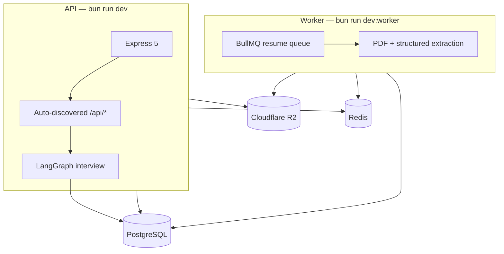

# Hone — AI Mock Interview

Hone is an AI-powered mock interview platform that helps software engineers prepare for technical interviews through personalized, resume-aware practice sessions with real-time feedback.

## Live 

**[Hone AI](https://hone-navy.vercel.app/)**

## Problem

Most engineers practice coding in isolation but struggle in real interviews because they lack structured feedback on communication, depth of answers, and topic coverage. Hone fills that gap by simulating realistic technical interviews driven by your own resume, giving you actionable feedback and a study backlog to close your knowledge gaps.

## Main Features

- **Resume-aware interviews** — upload your PDF resume and the AI tailors questions to your actual experience
- **Streaming AI responses** — real-time Server-Sent Events (SSE) for a natural conversation feel
- **Three difficulty levels** — Entry (5 turns), Mid (7 turns), Senior (8 turns)
- **Automatic feedback** — closing feedback and a review items list generated at the end of each session
- **Session history** — all past interview sessions and messages persisted per user
- **Auth system** — JWT + refresh token with automatic token renewal

## Tech Stack

| Layer | Technology |
| --- | --- |
| Frontend | Next.js 16 (App Router), React 19, TypeScript, Tailwind CSS v4, shadcn/ui |
| Backend | Bun, Express 5, Prisma 7, PostgreSQL (Neon), BullMQ, Redis (Upstash) |
| AI | OpenAI GPT, LangChain JS, LangGraph JS, PostgreSQL checkpointing |
| Storage | Cloudflare R2 |
| Infra | Railway (API + Worker), Vercel (Frontend) |

## How to Run Locally

### Prerequisites

- [Bun](https://bun.sh) installed
- Docker (for PostgreSQL and Redis)
- OpenAI API key

### 1. Clone and install dependencies

```bash
git clone <repo-url>
cd backend && bun install
cd ../frontend && bun install
```

### 2. Configure environment variables

```bash
cp backend/.env.example backend/.env
cp frontend/.env.example frontend/.env.local
```

Fill in `backend/.env` with your OpenAI key, R2 credentials, and SMTP settings.

### 3. Start infrastructure and run migrations

```bash
cd backend
bun run db:start   # starts PostgreSQL + Redis via Docker
bun run db:migrate
```

### 4. Run the apps

```bash
# Terminal 1 — API server
cd backend && bun run dev

# Terminal 2 — Resume processing worker
cd backend && bun run dev:worker

# Terminal 3 — Frontend
cd frontend && bun run dev
```

Frontend runs on **http://localhost:3001**, API on **http://localhost:3000**.

## Team Credits

| Name | Role |
| --- | --- |
| Pablo Cruz | Frontend & Integration |
| Vini Nathan | Backend & AI Orchestration |
| Guilherme | Backend & AI Orchestration |

---

Full-stack TypeScript project for technical mock interviews driven by AI. The repository contains a production-oriented backend for resume processing and interview orchestration, plus a frontend shell for the public landing page and app dashboard.

## Problem

Developers preparing for technical interviews often lack realistic, personalized practice that reflects their résumé and seniority level, plus structured feedback they can revisit over time.

## Main features

- **Authentication** — register, login, JWT refresh, and password reset
- **Résumé processing** — PDF upload to R2, async extraction, and structured summary via worker queue
- **AI mock interview** — sessions by level (`entry`, `mid`, `senior`), streamed turns over SSE, server-side turn limits
- **Closing feedback & study backlog** — final-turn feedback via LangGraph and persisted review topics per user

## Repository layout

| Path | Purpose |
| --- | --- |
| `Backend/` | Express API, Prisma, PostgreSQL, BullMQ worker, LangChain, LangGraph |
| `frontend/` | Next.js App Router frontend |
| `.github/workflows/` | GitHub Actions — backend CI (lint, types, unit) and integration/E2E |
| `.specs/` | Project vision, roadmap, and cross-cutting decisions |
| `Backend/.specs/` | Backend feature specs (`spec.md`, `design.md`, `tasks.md`) |

> On case-insensitive filesystems (Windows), `cd backend` and `cd Backend` refer to the same folder. CI workflows use `working-directory: backend`.

## Product flow

1. The user uploads a resume PDF.
2. The backend stores the file in Cloudflare R2 and enqueues asynchronous processing.
3. A worker extracts PDF text and generates a structured resume summary with OpenAI.
4. The user creates an interview session for `entry`, `mid`, or `senior`.
5. The backend streams interview turns over SSE and enforces turn limits server-side.
6. On the final turn, the graph streams closing feedback; then the backend generates review items and persists the user's study backlog.

## Backend architecture

### Principles

- **Modular monolith** — domain code lives under `Backend/src/modules/{feature}/`.
- **Layered flow** — `controller` → `service` → `repository` (HTTP and validation stay at the edges).
- **Composition root** — `Backend/src/factories/` wires services, repositories, and adapters (no hidden `new` in adapters).
- **Route auto-discovery** — each module exposes `routes/*-routes.ts`; the folder name becomes the mount path `/api/{module}`.
- **Auth at the edge** — JWT via `makeCheckAuth()`; `req.userId` is always the source of truth for ownership (never from the request body).
- **Two runtimes** — HTTP API (`src/index.ts`) and BullMQ worker (`src/worker.ts`) share env, Prisma, and OpenAI config.

### Processes



### Directory structure

```
Backend/
├── .specs/features/          # Feature specifications (see table below)
├── docs/
│   ├── frontend-mock-interview-api.md
│   └── TESTING.md
├── prisma/
│   ├── schema/               # Split Prisma schema (user, ai-mock-interview)
│   └── migrations/
├── src/
│   ├── index.ts              # API entrypoint
│   ├── worker.ts             # BullMQ worker entrypoint
│   ├── config/
│   │   ├── app.ts            # Express app, CORS, Swagger, error handler
│   │   ├── routes.ts         # Discovers module routes → /api/{module}
│   │   └── env/              # @t3-oss/env-core + Zod (server-schema)
│   ├── docs/                 # OpenAPI generation + Swagger UI
│   ├── factories/            # DI: auth, interview, resumes, review-items
│   ├── infrastructure/
│   │   ├── ai/
│   │   │   ├── checkpoint/   # LangGraph PostgresSaver
│   │   │   ├── langgraph/    # Graph, nodes, streaming, review generator adapter
│   │   │   └── openai-models.ts
│   │   ├── database/         # Prisma client
│   │   ├── document-parsing/ # PDF text extraction
│   │   ├── queue/            # BullMQ resume queue + Redis connection
│   │   └── storage/          # Cloudflare R2 client
│   ├── modules/
│   │   ├── auth/
│   │   ├── resumes/
│   │   ├── interview/
│   │   └── review-items/
│   ├── shared/
│   │   ├── adapters/         # bcrypt, mailer
│   │   ├── errors/
│   │   ├── middlewares/      # validation, error handler
│   │   └── utils/            # asyncHandler, SSE helpers
│   └── test/
│       ├── containers/       # Testcontainers global setup
│       ├── e2e/              # HTTP flows (auth, resumes, interview, review-items)
│       ├── integration/      # Repository tests against real PostgreSQL
│       ├── helpers/
│       └── mocks/
└── vitest*.config.ts         # unit | integration | e2e suites
```

### Module layout (per feature)

Each module under `src/modules/{name}/` follows the same shape:

| Folder | Role |
| --- | --- |
| `routes/` | Default export: route registrar mounted at `/api/{name}` |
| `controller/` | HTTP handlers (thin; uses `asyncHandler`) |
| `service/` | Business rules and orchestration |
| `repository/` | Prisma persistence |
| `validations/` | Zod request/response schemas |
| `types/` | DTOs and records (decoupled from Prisma where required) |
| `middlewares/` | Module-specific middleware (e.g. resume upload) |
| `prompts/` | LLM prompt templates (interview module) |
| `protocols/` | Interfaces for test doubles / adapters |

### Modules and API surface

Routes are discovered from `src/modules/{module}/routes/*-routes.ts` and mounted at `/api/{module}`.

| Module | Base path | Responsibility |
| --- | --- | --- |
| `auth` | `/api/auth` | Register, login, refresh, password reset (JWT) |
| `resumes` | `/api/resumes` | PDF upload → R2 + async structuring (BullMQ) |
| `interview` | `/api/interview` | Sessions, SSE stream, message history |
| `review-items` | `/api/review-items` | Read-only list of study topics (persistence owned by `interview`) |

**Mock interview endpoints**

| Method | Path | Description |
| --- | --- | --- |
| `POST` | `/api/resumes` | Upload PDF (multipart); returns `processing` immediately |
| `GET` | `/api/resumes/:id` | Resume status and `structured_summary` when `ready` |
| `POST` | `/api/interview/sessions` | Create session (`resume_id`, `level`) |
| `GET` | `/api/interview/sessions` | List sessions for the authenticated user |
| `GET` | `/api/interview/sessions/:sessionId/messages` | Ordered message history |
| `POST` | `/api/interview/sessions/:sessionId/stream` | SSE turn (`token`, `meta`, `error`, `[DONE]`) |
| `GET` | `/api/review-items` | All review items for the user (`updatedAt` desc) |

Auth routes remain under `/api/auth/*`. OpenAPI/Swagger is served from the API process when running locally.

### LangGraph interview flow

Graph code lives in `src/infrastructure/ai/langgraph/`. Checkpointing uses PostgreSQL (`PostgresSaver`) with `thread_id = sessionId`.

| Node / step | When | Model (env) |
| --- | --- | --- |
| `interviewer` | Non-final turns | `OPENAI_MODEL_INTERVIEW` |
| `closing_feedback` | Final turn (`runReview`) | `OPENAI_MODEL_INTERVIEW` |
| `review_items_generator` | After graph on final turn (outside graph) | `OPENAI_MODEL_REVIEW` |

**Control flow**

- Turn limits (`entry` 5 / `mid` 7 / `senior` 8) are enforced in `InterviewStreamService`, not by the LLM.
- On the final turn, routing skips `interviewer` and uses `closing_feedback` only.
- Review items are generated via structured output, merged by topic (`ReviewMergeService`), then the session is marked finished.
- The agent does not create review items via tools in v1.

Resume extraction runs in the worker (`ResumeProcessor`) with `OPENAI_MODEL_EXTRACTION`.

### Bounded context: review items

| Concern | Owner |
| --- | --- |
| Persistence, merge, generation pipeline | `modules/interview` (`ReviewRepository`, `ReviewMergeService`) |
| HTTP list API | `modules/review-items` (read-only; delegates to `ReviewRepository`) |

See [`Backend/src/modules/interview/README.md`](Backend/src/modules/interview/README.md) for allowed cross-module imports.

### Data model (Prisma)

- **Auth** — `User`, `RefreshToken` (`prisma/schema/user.prisma`)
- **Mock interview** — `Resume`, `InterviewSession`, `InterviewMessage`, `ReviewItem` + enums (`prisma/schema/ai-mock-interview.prisma`)
- **LangGraph** — checkpoint tables managed by `@langchain/langgraph-checkpoint-postgres`

`user_id` on domain tables is `Int` (FK to `users.id`). Entity PKs for resumes, sessions, messages, and review items are `UUID`.

### Environment variables

Copy [`Backend/.env.example`](Backend/.env.example). Minimum for full behavior:

| Group | Variables |
| --- | --- |
| Core | `DATABASE_URL`, `PORT`, `CORS_ORIGIN`, `NODE_ENV` |
| Auth | `JWT_SECRET`, `JWT_EXPIRE_IN`, `REFRESH_EXPIRES`, SMTP vars |
| AI | `OPENAI_API_KEY`, `OPENAI_MODEL_INTERVIEW`, `OPENAI_MODEL_EXTRACTION`, `OPENAI_MODEL_REVIEW` |
| Token limits | `TOKEN_LIMIT_ENABLED`, `TOKEN_LIMIT_MONTHLY_MAX` (monthly per-user cap, UTC) |
| Storage | `R2_ACCOUNT_ID`, `R2_ACCESS_KEY_ID`, `R2_SECRET_ACCESS_KEY`, `R2_BUCKET_NAME` |
| Queue | `REDIS_URL` |
| Upload | `RESUME_MAX_BYTES` (default 5 MB) |

LangSmith tracing is specified in [`Backend/.specs/features/langsmith-tracing/spec.md`](Backend/.specs/features/langsmith-tracing/spec.md) (`LANGSMITH_*` vars).

## Backend stack

| Concern | Technology |
| --- | --- |
| Runtime | Bun |
| HTTP | Express 5 |
| Validation | Zod |
| Persistence | Prisma 7 + PostgreSQL |
| Queue | BullMQ + Redis |
| Storage | Cloudflare R2 |
| AI | OpenAI, LangChain JS, LangGraph JS |
| Checkpointing | `@langchain/langgraph-checkpoint-postgres` |
| Tests | Vitest + Supertest + Testcontainers |
| API docs | OpenAPI (`@asteasolutions/zod-to-openapi`) + Swagger UI |

## Feature specifications

Backend behavior is specified under `Backend/.specs/features/`:

| Feature | Spec | Summary |
| --- | --- | --- |
| AI Mock Interview | [`ai-mock-interview/spec.md`](Backend/.specs/features/ai-mock-interview/spec.md) | Upload, sessions, SSE, review generation, data model |
| Interview closing feedback | [`interview-closing-feedback/spec.md`](Backend/.specs/features/interview-closing-feedback/spec.md) | Final-turn `closing_feedback` node; no tools in v1 |
| Review items list API | [`review-items-list-api/spec.md`](Backend/.specs/features/review-items-list-api/spec.md) | `GET /api/review-items` |
| LangSmith tracing | [`langsmith-tracing/spec.md`](Backend/.specs/features/langsmith-tracing/spec.md) | LLM observability (API + worker) |
| Test structure | [`test-structure-refactor/spec.md`](Backend/.specs/features/test-structure-refactor/spec.md) | Unit / integration / e2e policy, Testcontainers |
| Sustainability hardening | [`backend-sustainability-hardening/spec.md`](Backend/.specs/features/backend-sustainability-hardening/spec.md) | CI, async handlers, DI, error logging |

Project-level docs: [`.specs/project/PROJECT.md`](.specs/project/PROJECT.md), [`.specs/project/ROADMAP.md`](.specs/project/ROADMAP.md).

### Testing strategy

The backend follows a **three-suite Vitest pyramid**. Each production layer has **exactly one** test type — no duplicate coverage across layers (e.g. controllers are not unit-tested; HTTP is exercised only in E2E).

| Code layer | Test type | File suffix | Command |
| --- | --- | --- | --- |
| `validations/`, `service/`, `middlewares/`, `prompts/`, pure infra | **Unit** | `*.test.ts` | `bun run test` |
| `repository/` | **Integration** | `*.integration.test.ts` | `bun run test:integration` |
| HTTP routes (Express + Supertest) | **E2E** | `*.e2e.test.ts` in `src/test/e2e/` | `bun run test:e2e` |
| `controller/`, `routes/` | **None** | — | Covered by E2E |

**Unit tests** — fast, no Docker. Dependencies (Prisma, OpenAI, mailer, queues) are mocked. Focus: business rules, Zod schemas, middleware, prompts, and LangGraph helpers in isolation.

**Integration tests** — real PostgreSQL via [Testcontainers](https://github.com/testcontainers/testcontainers-node). Repositories are **never** tested with mocked Prisma; queries run against a migrated ephemeral database. Each test resets tables (`truncateTables`) for isolation.

**E2E tests** — full app (`createApp()` + Supertest) with PostgreSQL + Redis containers. External services (nodemailer, R2, BullMQ, LangGraph) are mocked at the suite boundary so tests stay deterministic and offline.

**Pre-commit (Husky)** runs `lint` + unit tests only — no Docker, keeps commits fast.

Full guide, examples, and troubleshooting: [`Backend/docs/TESTING.md`](Backend/docs/TESTING.md). Policy spec: [`test-structure-refactor/spec.md`](Backend/.specs/features/test-structure-refactor/spec.md).

### Continuous Integration (CI)

GitHub Actions workflows live in [`.github/workflows/`](.github/workflows/):

| Workflow | File | When it runs | What it runs |
| --- | --- | --- | --- |
| **Backend CI** | [`backend-ci.yml`](.github/workflows/backend-ci.yml) | Every PR and push to `main` / `master` | `lint` → `check-types` → unit tests (`bun run test`) |
| **Backend Integration & E2E** | [`backend-integration-e2e.yml`](.github/workflows/backend-integration-e2e.yml) | Push to `main` only, or manual (`workflow_dispatch`) | `test:integration` → `test:e2e` (Docker on runner) |

PR quality gates do **not** require Docker (unit suite only). Integration and E2E run after merge to `main` (or on demand). Before risky changes to repositories, routes, or Testcontainers setup, run locally:

```bash
cd Backend
bun run test:all
```

**Recommended local gate** (matches PR CI):

```bash
cd Backend
bun run lint && bun run check-types && bun run test
```

## Frontend

### Frontend stack

| Concern | Technology |
| --- | --- |
| Framework | Next.js 16 (App Router) |
| UI | React 19, Base UI, Tailwind CSS 4, shadcn |
| Data & forms | TanStack Query, TanStack Form, Zod |
| Runtime | Bun |

- `/` is the public landing page.
- Authenticated routes (`/dashboard`, `/practice`, `/interview/[id]`, `/feedback`) call the backend API (no mocked data).
- Integration map: [`frontend/docs/api-integration.md`](frontend/docs/api-integration.md).
- API contract: [`Backend/docs/frontend-mock-interview-api.md`](Backend/docs/frontend-mock-interview-api.md).

## Getting started

### 1. Install dependencies

```bash
cd Backend
bun install

cd ../frontend
bun install
```

### 2. Configure environment

```bash
cp Backend/.env.example Backend/.env
cp frontend/.env.example frontend/.env.local
```

Required infrastructure for full backend behavior:

- PostgreSQL
- Redis
- Cloudflare R2 bucket
- OpenAI API key

### 3. Start local services

```bash
cd Backend
bun run db:start
bun run db:push
```

### 4. Run the apps

API server:

```bash
cd Backend
bun run dev
```

Resume worker (required for PDF → `structured_summary`):

```bash
cd Backend
bun run dev:worker
```

Frontend:

```bash
cd frontend
bun run dev
```

## Verification

Backend ([`Backend/docs/TESTING.md`](Backend/docs/TESTING.md)):

```bash
cd Backend
bun run test              # unit (no Docker)
bun run test:integration  # repositories — requires Docker
bun run test:e2e          # HTTP flows — requires Docker
bun run test:all          # all suites
bun run check-types
bun run lint
```

Frontend:

```bash
cd frontend
bun run lint
bun run check-types
bun run build
```

## Team

| Area | Contributors |
| --- | --- |
| Backend | Guilherme |
| Frontend | Nathan, Pablo |

## Current constraints

- Frontend auth protection for `/dashboard` is deferred.
- The dashboard intentionally uses product-faithful mock states until upload and stream UI wiring lands.
- Interview ownership, turn control, and review generation remain backend-controlled.
