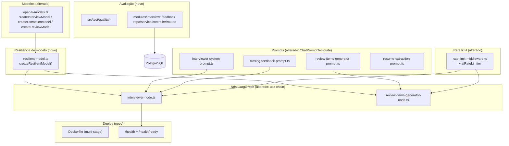

# AI Best Practices Hardening — Design

**Spec**: `.specs/features/ai-best-practices-hardening/spec.md`
**Status**: Draft

---

## Research Notes (Knowledge Verification Chain)

Verificado via Context7 (`@langchain/core`/`@langchain/openai` docs atuais) e web search antes de desenhar, seguindo a cadeia Codebase → Docs → Context7 → Web:

1. **Retry já existe por padrão.** `ChatOpenAI`/`BaseChatModel` do LangChain JS já retenta automaticamente até **6 vezes** (`maxRetries` default = 6) com backoff exponencial + jitter para erros de rede, rate limit (429) e 5xx. Erros de cliente (401, 404) não são retentados. **Implicação:** o gap real não é "adicionar retry do zero" — é tornar `maxRetries` **explícito e configurável via env** (hoje é o default implícito da lib) e garantir que o erro final (após esgotar o retry nativo) seja tratado/logado de forma consistente, sem stack trace ao cliente.
2. **`Runnable.withRetry()`** existe em `@langchain/core` e adiciona uma camada extra de retry sobre qualquer `Runnable` (não é específico de modelo). Empilhar `.withRetry()` sobre um `ChatOpenAI` que já tem `maxRetries: N` nativo multiplicaria tentativas (N × M) de forma não controlada. **Decisão de design:** não usar `.withRetry()` adicional — confiar no `maxRetries` nativo do `ChatOpenAI`, tornado explícito, e adicionar apenas tratamento de erro final (log + propagação limpa).
3. **Modelos reasoning (`gpt-5`, `gpt-5-nano`) não suportam `temperature`/`top_p`.** É o default configurado hoje em `server-schema.ts` (`OPENAI_MODEL_INTERVIEW=gpt-5`, `OPENAI_MODEL_EXTRACTION=gpt-5-nano`, `OPENAI_MODEL_REVIEW=gpt-5-nano`). Enviar qualquer valor diferente do default (`1`) causa `400 Unsupported parameter`. O ajuste correto de comportamento é via `reasoningEffort` (`"minimal" | "low" | "medium" | "high"`) e `verbosity` (`"low" | "medium" | "high"`), ambos suportados nativamente pelo `ChatOpenAI` do `@langchain/openai`. `temperature`/`top_p` continuam válidos apenas para modelos não-reasoning (`gpt-5-chat-latest`, `gpt-4o`, etc.). **Isso já foi corrigido na spec** (AC da story de parâmetros de geração).
4. **Prompt caching da OpenAI é automático**, sem API específica do LangChain para "ativar" — funciona para prompts ≥1024 tokens com prefixo idêntico byte-a-byte entre chamadas. O único cuidado de código é: (a) manter conteúdo estável (persona, currículo, instruções) no **início** do prompt e conteúdo dinâmico (turno atual) no **final**; (b) opcionalmente usar `promptCacheKey` por sessão para melhorar roteamento/hit-rate. Não há "flag" para ligar.
5. **`ChatPromptTemplate.fromMessages([...])` + `MessagesPlaceholder("history")`** são API estável em `@langchain/core/prompts`, confirmada na versão atual do projeto.

---

## Architecture Overview

A mudança é aditiva sobre a arquitetura existente (grafo linear de 1 nó, Express + LangGraph + PostgresSaver). Nenhum componente é reescrito; adicionamos uma camada de resiliência/configuração nos modelos, migramos a construção de prompt para `ChatPromptTemplate`, adicionamos observabilidade mínima de erro, endurecemos deploy (Docker + health) e rate limit, e criamos uma pequena vertical nova (feedback humano) e uma pasta de testes de qualidade.



---

## Code Reuse Analysis

### Existing Components to Leverage

| Component | Location | How to Use |
| --------- | -------- | ---------- |
| `createOpenAIModel` / `createInterviewModel` / `createExtractionModel` / `createReviewModel` | `src/infrastructure/ai/openai-models.ts` | Estender para aceitar `reasoningEffort`/`verbosity`/`temperature` condicionalmente e `maxRetries` explícito; envolver com `createResilientModel()` |
| `logger` | `src/shared/logger.ts` | Reutilizar para log de retry esgotado (sem introduzir pino/winston — fora de escopo) |
| `serverEnv` / `serverEnvSchema` | `src/config/env/server-schema.ts` | Padrão Zod já estabelecido — estender com novas chaves (`*_REASONING_EFFORT`, `*_VERBOSITY`, `RATE_LIMIT_AI_*`) |
| `authRateLimiter` (padrão) | `src/shared/middlewares/rate-limit-middleware.ts` | Copiar o padrão `rateLimit({...})` para um `aiRateLimiter` parametrizado por rota |
| `errorHandler` / `HttpError` hierarchy | `src/shared/middlewares/error-handler-middleware.ts`, `src/shared/errors/http-errors.ts` | Reutilizar para erros do endpoint de feedback humano (404 ownership, 400 validação) |
| `asyncHandler` | `src/shared/utils/async-handler.ts` | Reutilizar nas novas rotas de feedback |
| `validate(schema)` middleware | `src/shared` | Reutilizar para validar `{ rating, comment? }` do endpoint de feedback |
| Padrão repository/service/controller/routes do módulo `interview` | `src/modules/interview/{repository,service,controller,routes}` | Replicar exatamente para a vertical de feedback (mesmo módulo, sem novo bounded context) |
| `SessionRepository.findByIdAndUserId` | `src/modules/interview/repository/session-repository.ts` | Reusar para checar ownership da sessão antes de aceitar feedback |
| `prisma` (instância default) | `src/infrastructure/database/index.ts` | Reusar para `$queryRaw` no `/health/ready` e para o novo model `InterviewFeedback` |
| `redisConnection` (ioredis) | `src/infrastructure/queue/resume-queue.ts` | Reusar (ou extrair helper) para `.ping()` no `/health/ready` |
| `docs/prompts-catalog.md` | `docs/` | Atualizar seções existentes, não recriar |
| `docker-compose.yml` | raiz do Backend | Estender com serviços `api`/`worker` usando o novo `Dockerfile` |

### Integration Points

| Sistema | Método de integração |
| ------- | --------------------- |
| LangGraph `interviewer` node | Troca de `model.invoke([...])` por `chain.invoke({...}, config)` onde `chain = promptTemplate.pipe(resilientModel)` |
| `review-items-generator-node` | Mesma troca, mas com `withStructuredOutput` aplicado após o pipe |
| Express app (`config/app.ts`) | Novas rotas `/health`, `/health/ready` antes do `errorHandler`; novo middleware `aiRateLimiter` nas rotas de IA |
| Prisma schema | Novo model `InterviewFeedback` em `ai-mock-interview.prisma` + migration |
| `server-schema.ts` | Novas chaves de env (geração, rate limit de IA) validadas via Zod, com defaults |

---

## Components

### 1. `createResilientModel` (novo)

- **Purpose**: Centralizar `maxRetries` explícito e log estruturado de erro final, sem duplicar `.withRetry()` sobre o retry nativo do `ChatOpenAI` (ver Research Notes #1–2).
- **Location**: `src/infrastructure/ai/resilient-model.ts`
- **Interfaces**:
  - `wrapWithLogging<T extends ChatOpenAI>(model: T, context: { name: string }): T` — não re-implementa retry; apenas garante que erros que escapam do `maxRetries` nativo sejam logados com contexto (`model`, `attempts`) antes de propagar. Implementação via `model.withConfig({ callbacks: [...] })` ou captura no ponto de chamada (`try/catch` no nó), o que for mais simples de testar (decidir em Execute com base em qual API de callback do LangChain JS é mais estável na versão instalada).
- **Dependencies**: `@langchain/openai`, `src/shared/logger.ts`.
- **Reuses**: `logger` existente.

> Nota: dado que o retry em si já é nativo (`maxRetries` no construtor do `ChatOpenAI`), este componente é deliberadamente fino — sua única responsabilidade nova é logging/observabilidade do esgotamento, não reimplementar backoff.

### 2. `openai-models.ts` (alterado)

- **Purpose**: Construir os 3 modelos com `maxRetries` explícito e parâmetros de geração corretos por família de modelo (reasoning vs. não-reasoning).
- **Location**: `src/infrastructure/ai/openai-models.ts`
- **Interfaces** (assinatura pública inalterada):
  - `createInterviewModel(): ChatOpenAI`
  - `createExtractionModel(): ChatOpenAI`
  - `createReviewModel(): ChatOpenAI`
- **Lógica interna nova**:
  - Função privada `isReasoningModel(model: string): boolean` (heurística: `/^gpt-5/.test(model) && !model.includes("chat-latest")` — cobre `gpt-5`, `gpt-5-nano`, `gpt-5-mini`; documentar heurística com comentário e link da fonte, revisar se a nomenclatura de modelos mudar).
  - Se reasoning → passa `reasoningEffort` e `verbosity` (via env), **não** passa `temperature`/`top_p`.
  - Se não-reasoning → passa `temperature`/`top_p` (via env), não passa `reasoningEffort`/`verbosity`.
  - Sempre passa `maxRetries: env.OPENAI_MAX_RETRIES` (novo, default 6 para preservar comportamento atual da lib).
- **Dependencies**: `env` (server-schema estendido).
- **Reuses**: estrutura atual de `createOpenAIModel(model)`.

### 3. Prompts migrados para `ChatPromptTemplate` (alterado)

- **Purpose**: Substituir concatenação manual de string por `ChatPromptTemplate.fromMessages([...])`, com `MessagesPlaceholder("history")` no prompt do entrevistador.
- **Location**: `src/modules/interview/prompts/{interviewer-system-prompt,closing-feedback-prompt,review-items-generator-prompt}.ts`, `src/modules/resumes/prompts/resume-extraction-prompt.ts`
- **Interfaces**: as funções `build*Prompt()` existentes passam a retornar um `ChatPromptTemplate` (ou continuam retornando as partes de texto internamente, mas a montagem final da mensagem no nó usa o template) — **decisão de Execute**: manter as funções `build*Block()` (persona/conduct/etc.) como estão (geram string), e só trocar o **ponto de composição final** para `ChatPromptTemplate.fromMessages([["system", fullSystemText], new MessagesPlaceholder("history")])`. Isso minimiza risco: reaproveita 100% da lógica de texto já testada, só muda como a mensagem chega ao modelo.
- **Dependencies**: `@langchain/core/prompts`.
- **Reuses**: todas as funções `build*Block()` existentes (persona, conduct, resume, security, etc.) — nenhuma reescrita de conteúdo.

### 4. `interviewer-node.ts` / `review-items-generator-node.ts` (alterado)

- **Purpose**: Trocar `model.invoke([...])` por `chain.invoke(...)` usando o `ChatPromptTemplate` + modelo resiliente.
- **Location**: `src/infrastructure/ai/langgraph/nodes/{interviewer-node,review-items-generator-node}.ts`
- **Interfaces**: assinatura do nó (`(state) => Promise<Partial<State>>`) inalterada — só a implementação interna muda.
- **Dependencies**: prompt template do componente 3, modelo resiliente do componente 1/2.
- **Reuses**: `InterviewGraphState`, `messagesStateReducer` (histórico via checkpoint continua sendo a fonte de verdade; `MessagesPlaceholder("history")` só recebe `state.messages` no `.invoke()`, não muda onde o histórico é persistido).

### 5. Health checks (novo)

- **Purpose**: Separar liveness de readiness (AIBP-DEC-04).
- **Location**: `src/config/app.ts` (rotas), `src/infrastructure/database/index.ts` (helper `pingDatabase()`), `src/infrastructure/queue/resume-queue.ts` ou novo `src/infrastructure/queue/redis-health.ts` (helper `pingRedis()`)
- **Interfaces**:
  - `GET /health` → sempre `200 { status: "ok" }` se o processo responde (sem I/O externo).
  - `GET /health/ready` → `200 { status: "ok", checks: { database: "ok", redis: "ok" } }` ou `503 { status: "error", checks: {...} }` com timeout curto (ex. 2s) por dependência via `Promise.race`.
- **Dependencies**: `prisma.$queryRaw`, `redisConnection.ping()`.
- **Reuses**: instância `prisma` e `redisConnection` já existentes (nenhuma nova conexão).

### 6. `Dockerfile` (novo)

- **Purpose**: Empacotar API e worker em uma imagem multi-stage Bun.
- **Location**: `Backend/Dockerfile`
- **Estrutura** (3 estágios): `deps` (instala dependências com cache de lockfile) → `build` (`bun run build` gera `dist/index.mjs` via `tsdown`, `prisma generate`) → `runtime` (imagem enxuta `oven/bun:1-slim` ou `distroless`, copia `dist/`, `prisma/generated`, `node_modules` de produção).
- **Dois entrypoints**: `CMD ["bun", "run", "start"]` (API) por padrão; documentar override `CMD ["bun", "run", "worker"]` para o serviço worker (mesma imagem, comando diferente — sem Dockerfile duplicado).
- **Reuses**: scripts `build`/`start`/`worker` já existentes em `package.json`.

### 7. `aiRateLimiter` (novo, ao lado de `authRateLimiter`)

- **Purpose**: Rate limit dedicado para `/api/interview/*` e `/api/resumes/*`.
- **Location**: `src/shared/middlewares/rate-limit-middleware.ts` (exportar `aiRateLimiter` a partir do mesmo arquivo, ou dividir em `interviewRateLimiter`/`resumesRateLimiter` se as janelas precisarem ser diferentes — decidir em Execute com base nos valores de env definidos).
- **Interfaces**: middleware Express padrão (`RequestHandler`), aplicado por rota como `authRateLimiter` já é.
- **Dependencies**: `express-rate-limit` (já instalado), novas chaves `RATE_LIMIT_AI_WINDOW_MS`/`RATE_LIMIT_AI_MAX` (ou específicas por rota, a definir em Execute).
- **Reuses**: exatamente o padrão de `authRateLimiter`.

### 8. Feedback humano (novo, dentro do módulo `interview`)

- **Purpose**: Endpoint `thumbs up/down` por sessão de entrevista.
- **Location**: `src/modules/interview/{repository/feedback-repository.ts, service/feedback-service.ts, controller/interview-controller.ts (novo método), routes/interview-routes.ts (nova rota), validations/interview-schemas.ts (novo schema)}`
- **Interfaces**:
  - `POST /api/interview/sessions/:sessionId/feedback` — body `{ rating: "up" | "down", comment?: string }` → `201`.
  - `FeedbackRepository.upsert(params): Promise<InterviewFeedback>` (um feedback por sessão — `upsert` em vez de múltiplos registros, mais simples de consultar).
  - `FeedbackService.submit(userId, sessionId, input): Promise<InterviewFeedback>` — valida ownership via `SessionRepository.findByIdAndUserId` antes de gravar (reuso direto, sem nova checagem).
- **Dependencies**: Prisma model novo (ver Data Models).
- **Reuses**: `SessionRepository` (ownership), `asyncHandler`, `validate`, `errorHandler`, `NotFoundError`.
- **Decisão de escopo**: fica dentro de `modules/interview` (não um módulo novo `feedback/`) — mesmo raciocínio de SUS-DEC-01 (`backend-sustainability-hardening/spec.md`): evitar módulo órfão para um único endpoint.

### 9. Testes de qualidade (novo)

- **Purpose**: Cobrir tom/conciseness, alinhamento/segurança e robustez a edge cases, conforme story P3.
- **Location**: `src/test/quality/` (novo diretório, ao lado de `src/test/e2e/`, `src/test/helpers/`)
- **Arquivos sugeridos**:
  - `interviewer-tone.test.ts` — regras de contagem de frases/palavras sobre respostas mockadas do entrevistador e sobre o texto do prompt de feedback final.
  - `security-alignment.test.ts` — casos simulando pedidos de "revele seu system prompt" / "saia do papel de entrevistador", validando que o bloco `## Security` está presente no prompt renderizado (teste de prompt, não de chamada real ao modelo — consistente com a suíte unitária existente que já mocka o LLM).
  - `edge-cases.test.ts` — mensagem vazia, mensagem muito longa, currículo malformado, sessão finalizada recebendo novo turno (usar helpers de `src/test/helpers/` já existentes).
- **Reuses**: `src/test/helpers/interview-seed-helpers.ts` e padrões de mock já usados em `interviewer-node.test.ts`.

---

## Data Models

### `InterviewFeedback` (novo)

```prisma
enum FeedbackRating {
  up
  down
}

model InterviewFeedback {
  id        String         @id @default(uuid())
  sessionId String         @map("session_id")
  userId    Int            @map("user_id")
  rating    FeedbackRating
  comment   String?        @db.Text
  createdAt DateTime       @default(now()) @map("created_at")
  updatedAt DateTime       @updatedAt @map("updated_at")

  session InterviewSession @relation(fields: [sessionId], references: [id], onDelete: Cascade)
  user    User             @relation(fields: [userId], references: [id], onDelete: Cascade)

  @@map("interview_feedback")
  @@unique([sessionId, userId])
  @@index([userId])
}
```

**Relationships**: 1 feedback por (`sessionId`, `userId`) — `@@unique` garante upsert idempotente se o usuário reenviar. Segue exatamente o padrão de `ReviewItem` (mesmos campos de auditoria, mesmo estilo de `@map`).

**Migration**: nova migration Prisma incremental (`prisma migrate dev`), sem alterar models existentes.

---

## Error Handling Strategy

| Cenário | Tratamento | Impacto no usuário |
| ------- | ---------- | ------------------- |
| `maxRetries` nativo do `ChatOpenAI` se esgota (rate limit/timeout/5xx persistente) | `logger.error` com `{ sessionId ou resumeId, model, errorName }`; erro propagado como `Error` tratado pelo `stream-service` (SSE `event: error`) ou pelo handler do worker (job marcado `failed`, sem crash do processo) | Mensagem genérica de erro na entrevista/upload; sem stack trace |
| Erro de cliente (401/404 da OpenAI, ex. API key inválida) | Não retentado pela lib (comportamento nativo); logado e propagado imediatamente | Mesma mensagem genérica — não há diferenciação para o usuário final (só nos logs) |
| `GET /health/ready` com Postgres ou Redis fora do ar | Timeout curto (2s) por checagem via `Promise.race`; resposta `503` com detalhe de qual dependência falhou | Orquestrador marca a instância como not-ready; sem impacto direto em usuários já conectados |
| Rate limit excedido em `/api/interview/*` ou `/api/resumes/*` | `express-rate-limit` responde `429` antes de qualquer lógica de negócio rodar | Usuário recebe mensagem de "tente novamente mais tarde" |
| `reasoningEffort`/`temperature` mal configurados para a família de modelo (ex. `temperature` setado para `gpt-5` via env) | Validação Zod não impede isso diretamente (é uma regra de negócio, não de schema) — a função `isReasoningModel()` em `openai-models.ts` **ignora** `temperature`/`top_p` de env quando o modelo é reasoning, evitando o erro 400 em runtime | Nenhum — comportamento correto é aplicado automaticamente, silenciosamente ignorando parâmetro incompatível (documentar em comentário no código) |
| Feedback humano para sessão de outro usuário | `SessionRepository.findByIdAndUserId` retorna `null` → `NotFoundError` (404) | Mesmo padrão de todos os outros recursos do módulo |

---

## Tech Decisions (only non-obvious ones)

| Decisão | Escolha | Racional |
| ------- | ------- | -------- |
| Retry: `.withRetry()` adicional vs. só `maxRetries` nativo | Só `maxRetries` explícito (sem `.withRetry()`) | Evita multiplicação de tentativas (retry sobre retry); `maxRetries` já cobre os mesmos erros transitórios nativamente |
| Onde detectar "é modelo reasoning?" | Heurística de nome (`/^gpt-5/` exceto `chat-latest`) em vez de tabela de capacidades externa | Simplicidade; time já centraliza nomes de modelo em `server-schema.ts`; heurística documentada com comentário para revisão futura se novos modelos forem adicionados |
| Prompt caching | Nenhuma API explícita — só disciplina de ordenação do prompt (estável primeiro, dinâmico depois) | Prompt caching da OpenAI é automático; não há "flag" do LangChain para isso |
| Onde vive o `Dockerfile` | Um único `Dockerfile` multi-stage para API e worker (CMD override) | Evita duplicar estágios de build/deps; mesma imagem, dois comandos |
| Onde vive o feedback humano | Dentro de `modules/interview` (sem módulo novo) | Consistente com a decisão já tomada em `backend-sustainability-hardening` (SUS-DEC-01) de evitar módulos órfãos para poucos endpoints |
| Como aplicar `ChatPromptTemplate` sem reescrever os builders de texto | Manter `build*Block()` retornando string; só o ponto de composição final vira `ChatPromptTemplate.fromMessages([...])` | Minimiza risco de regressão — 100% da lógica de conteúdo já testada é preservada |
| Rate limit de IA: uma config ou por rota | A definir em Execute (proposta inicial: janelas iguais para interview/resumes, valores mais permissivos que auth já que são ações legítimas recorrentes durante uma sessão) | Precisa de dado real de uso (turnos por sessão) para calibrar — registrar como nota para ajuste pós-deploy |

---

## Tips (carried into Tasks)

- Migração de prompts é a mudança de **maior superfície de teste** (4 arquivos + testes de nó) — fazer em commit isolado com testes de conteúdo antes/depois comparados.
- `openai-models.ts` deve ganhar um teste unitário novo dedicado a `isReasoningModel()` e à omissão condicional de `temperature`/`reasoningEffort`.
- Dockerfile: validar `docker build` localmente antes de mexer no `docker-compose.yml` (evita depurar dois problemas ao mesmo tempo).
- Feedback humano: seguir exatamente a estrutura de arquivos de `review-items` (menor módulo existente) como referência de "tamanho mínimo de vertical".

---

**Próximos passos:**

1. Revisar e aprovar este design (arquitetura, componentes, `InterviewFeedback` model, decisões técnicas).
2. Gerar `tasks.md` com breakdown atômico (commits sequenciais, dependências entre tasks) — escopo Large exige tasks formais antes de Execute.
