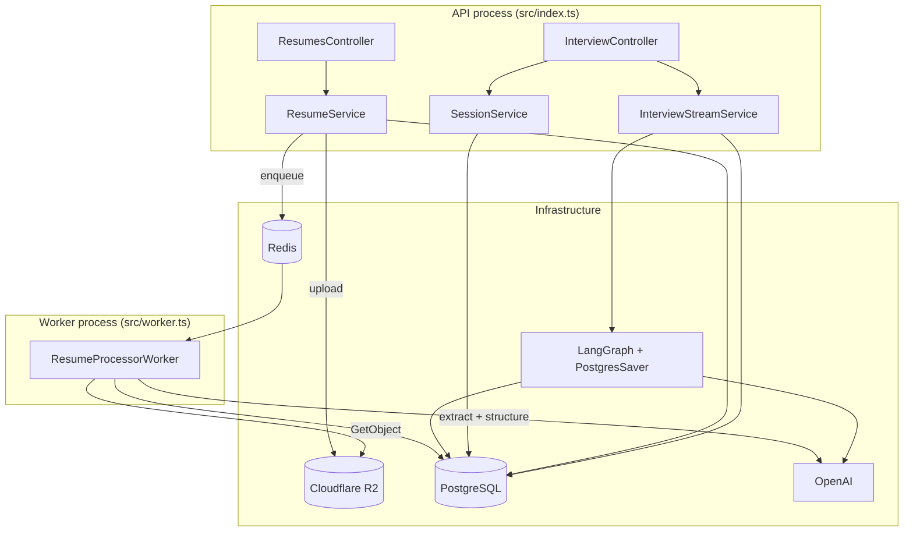
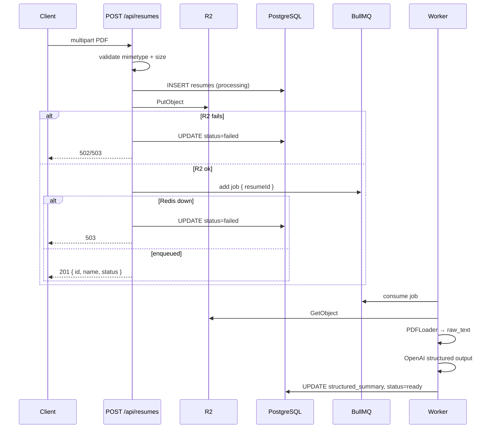
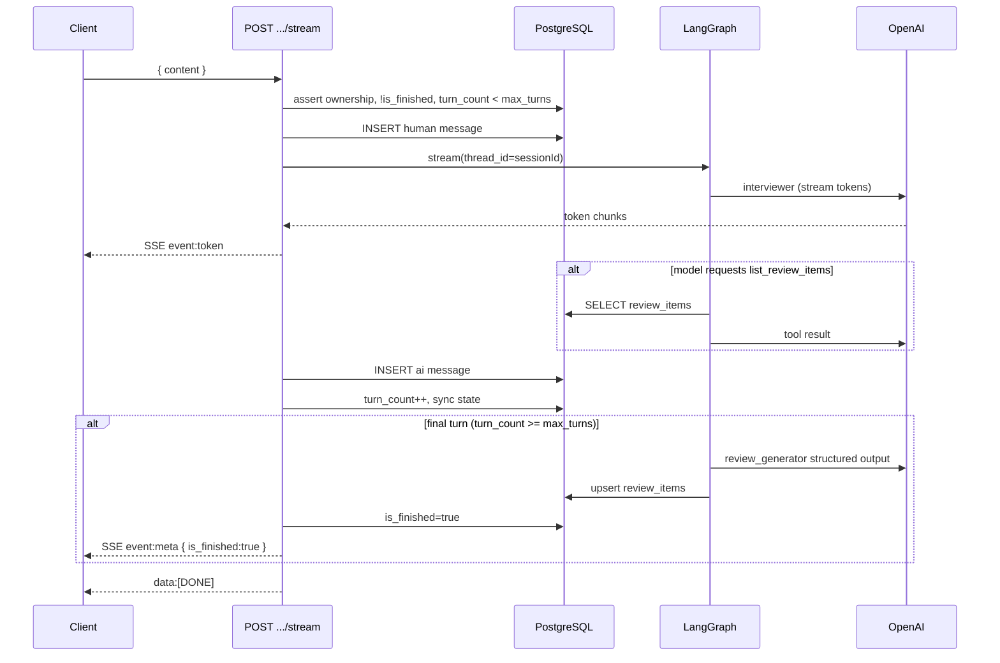

# AI Mock Interview — Design

**Spec**: `.specs/features/ai-mock-interview/spec.md`
**Status**: Draft

---

## Architecture Overview

Two feature modules (`resumes`, `interview`) follow the existing controller → service → repository pattern. Async résumé processing runs in a **separate Bun worker process** via BullMQ + Redis. Interview turns are handled synchronously in the API process: the stream handler persists messages, invokes a LangGraph graph compiled with **PostgresSaver** (`thread_id = session.id`), forwards LLM tokens over SSE, and on the final turn runs the `review_generator` node before closing the stream.




### Request flows

**Résumé upload (async)**




**Interview stream (sync + SSE)**




---

## Design Decisions


| ID         | Decision                     | Choice                                                                                                            | Rationale                                                                                                             |
| ---------- | ---------------------------- | ----------------------------------------------------------------------------------------------------------------- | --------------------------------------------------------------------------------------------------------------------- |
| AMI-DEC-01 | `user_id` FK type            | **Int** FKs to `users.id`; UUID PKs for résumé/session/message/review                                             | Matches brownfield `User.id`; avoids migration in v1                                                                  |
| AMI-DEC-02 | Near-duplicate topic merge   | **Exact case-insensitive match only** in v1                                                                       | Spec safety net covers LLM-reused topics; fuzzy merge adds complexity without clear threshold                         |
| AMI-DEC-03 | Client disconnect mid-stream | **Discard partial AI message**                                                                                    | No checkpoint/DB write for incomplete AI reply; client retries the turn; `turn_count` unchanged until full completion |
| AMI-DEC-04 | Worker deployment            | **Separate entry** `src/worker.ts` + npm script `dev:worker`                                                      | Isolates long PDF jobs from API latency; same codebase, shared Prisma + `IObjectStorage` (factory wires `R2ObjectStorage`) |
| AMI-DEC-05 | R2 access                    | **Server-only via S3 SDK**; store object **key** in `pdf_url`                                                     | Bucket private; no signed URLs exposed to clients; worker/API fetch by key                                            |
| AMI-DEC-06 | Description on merge         | **Always latest LLM description**                                                                                 | Resolved in spec                                                                                                      |
| AMI-DEC-07 | First interview turn         | **Client sends opening human message** (e.g. "I'm ready")                                                         | Spec requires human message before graph; no extra endpoint                                                           |
| AMI-DEC-08 | Module split                 | `**resumes` + `interview` modules**                                                                               | Auto-routing mounts `/api/resumes` and `/api/interview/`* per `routes.ts` discovery                                   |
| AMI-DEC-09 | Turn semantics               | `**turn_count` = completed human→AI pairs**; reject when `turn_count >= max_turns` before accepting human message | Aligns with spec edge case and final-turn hook `turnCount + 1 >= maxTurns` before invoke                              |
| AMI-DEC-10 | OpenAI model defaults        | **`gpt-5` interview, `gpt-5-nano` extraction + review** via env; override per `OPENAI_MODEL_*` when needed           | Env-driven; only GPT-5 family in v1                                                                                   |


---

## Code Reuse Analysis

### Existing components to leverage


| Component             | Location                                                | How to use                                                               |
| --------------------- | ------------------------------------------------------- | ------------------------------------------------------------------------ |
| Route auto-discovery  | `src/config/routes.ts`                                  | Add `resumes/` and `interview/` modules; no registry edits               |
| Auth middleware       | `src/modules/auth/middlewares/check-auth-middleware.ts` | All endpoints protected by default; `req.userId: number`                 |
| Validation middleware | `src/shared/middlewares/validation-middleware.ts`       | JSON bodies; add `validateParams` / `validateQuery` only if needed       |
| HttpError hierarchy   | `src/shared/errors/http-errors.ts`                      | Extend with `ForbiddenError`, `ConflictError`, `ServiceUnavailableError` |
| Error handler         | `src/shared/middlewares/error-handler-middleware.ts`    | Controllers use `try/catch → next(error)`                                |
| Env validation        | `src/config/env/server-schema.ts`                       | Add OpenAI, R2, Redis, résumé limits                                     |
| Prisma client         | `src/infrastructure/database/index.ts`                  | Repositories import singleton `prisma`                                   |
| Factory pattern       | `src/factories/auth/*`                                  | Mirror for resumes/interview + infrastructure                            |
| Logger                | `src/shared/logger.ts`                                  | Worker and stream error logging                                          |
| Vitest setup          | `vitest.setup.ts`                                       | Add new env defaults for tests                                           |


### Integration points


| System        | Integration method                                                                                |
| ------------- | ------------------------------------------------------------------------------------------------- |
| PostgreSQL    | Prisma models + LangGraph `@langchain/langgraph-checkpoint-postgres` tables (same `DATABASE_URL`) |
| Redis         | `ioredis` connection shared by Queue (API) and Worker                                             |
| Cloudflare R2 | `@aws-sdk/client-s3` with R2 endpoint + path-style addressing                                     |
| OpenAI        | `@langchain/openai` `ChatOpenAI` with `.stream()` and `.withStructuredOutput()`                   |


---

## Module & File Layout

```
src/
├── worker.ts                          # BullMQ worker entry (AMI-DEC-04)
├── modules/
│   ├── resumes/
│   │   ├── controller/resumes-controller.ts
│   │   ├── service/resume-service.ts
│   │   ├── repository/resume-repository.ts
│   │   ├── validations/resume-schemas.ts      # structured_summary Zod
│   │   ├── protocols/object-storage.ts
│   │   ├── routes/resumes-routes.ts           # POST /, GET /:id
│   │   └── index.ts
│   └── interview/
│       ├── controller/interview-controller.ts
│       ├── service/
│       │   ├── session-service.ts
│       │   ├── stream-service.ts              # SSE + graph orchestration
│       │   └── review-merge-service.ts        # priority upsert logic
│       ├── repository/
│       │   ├── session-repository.ts
│       │   ├── message-repository.ts
│       │   └── review-repository.ts
│       ├── validations/interview-schemas.ts
│       ├── prompts/                           # system prompt builders
│       │   ├── interviewer-system-prompt.ts
│       │   └── review-generator-prompt.ts
│       ├── protocols/interview-graph.ts
│       ├── routes/interview-routes.ts
│       └── index.ts
├── infrastructure/
│   ├── storage/r2-client.ts
│   ├── queue/resume-queue.ts
│   └── ai/
│       ├── langgraph/
│       │   ├── interview-state.ts
│       │   ├── build-interview-graph.ts
│       │   ├── nodes/interviewer-node.ts
│       │   ├── nodes/tool-executor-node.ts
│       │   ├── nodes/review-generator-node.ts
│       │   └── tools/list-review-items-tool.ts
│       ├── openai-models.ts                   # model factory from env
│       └── checkpoint/postgres-checkpointer.ts
└── factories/
    ├── resumes/
    └── interview/
```

**Route map** (auto-mounted):


| Module folder | Mount prefix     | Route file paths                                                                                           |
| ------------- | ---------------- | ---------------------------------------------------------------------------------------------------------- |
| `resumes`     | `/api/resumes`   | `POST /`, `GET /:id`                                                                                       |
| `interview`   | `/api/interview` | `POST /sessions`, `GET /sessions`, `POST /sessions/:sessionId/stream`, `GET /sessions/:sessionId/messages` |


---

## Data Models

### Prisma enums (`prisma/schema/ai-mock-interview.prisma`)

```prisma
enum ResumeStatus {
  processing
  ready
  failed
}

enum InterviewLevel {
  entry
  mid
  senior
}

enum MessageRole {
  human
  ai
}

enum ReviewPriority {
  high
  medium
  low
}
```

### Prisma models

```prisma
model Resume {
  id                 String       @id @default(uuid())
  userId             Int
  name               String
  pdfUrl             String       @map("pdf_url")      // R2 object key (AMI-DEC-05)
  structuredSummary  Json?        @map("structured_summary")
  rawText            String?      @map("raw_text") @db.Text
  status             ResumeStatus @default(processing)
  errorMessage       String?      @map("error_message") @db.Text
  createdAt          DateTime     @default(now()) @map("created_at")

  user               User         @relation(fields: [userId], references: [id], onDelete: Cascade)
  sessions           InterviewSession[]

  @@map("resumes")
  @@index([userId])
  @@index([userId, status])
}

model InterviewSession {
  id          String         @id @default(uuid())
  userId      Int
  resumeId    String         @map("resume_id")
  level       InterviewLevel
  turnCount   Int            @default(0) @map("turn_count")
  maxTurns    Int            @map("max_turns")
  isFinished  Boolean        @default(false) @map("is_finished")
  createdAt   DateTime       @default(now()) @map("created_at")

  user        User           @relation(fields: [userId], references: [id], onDelete: Cascade)
  resume      Resume         @relation(fields: [resumeId], references: [id])
  messages    InterviewMessage[]
  reviewItems ReviewItem[]

  @@map("interview_sessions")
  @@index([userId])
  @@index([resumeId])
}

model InterviewMessage {
  id        String      @id @default(uuid())
  sessionId String      @map("session_id")
  userId    Int         @map("user_id")
  role      MessageRole
  content   String      @db.Text
  createdAt DateTime    @default(now()) @map("created_at")

  session   InterviewSession @relation(fields: [sessionId], references: [id], onDelete: Cascade)

  @@map("interview_messages")
  @@index([sessionId])
  @@index([userId])
}

model ReviewItem {
  id          String         @id @default(uuid())
  sessionId   String         @map("session_id")   // last session that updated
  userId      Int            @map("user_id")
  topic       String
  description String         @db.Text
  priority    ReviewPriority
  createdAt   DateTime       @default(now()) @map("created_at")
  updatedAt   DateTime       @updatedAt @map("updated_at")

  session     InterviewSession @relation(fields: [sessionId], references: [id])
  user        User             @relation(fields: [userId], references: [id], onDelete: Cascade)

  @@map("review_items")
  @@unique([userId, topic])   // case handled in app layer via normalized lookup
  @@index([userId])
}
```

**User model extension** — add relations in `user.prisma`:

```prisma
resumes           Resume[]
interviewSessions InterviewSession[]
reviewItems       ReviewItem[]
```

> **Note:** Prisma `@@unique([userId, topic])` is case-sensitive in PostgreSQL. Application layer performs case-insensitive lookup before insert; consider a functional index or `topicNormalized` column in a follow-up if duplicates appear.

### Zod schemas (application layer)


| Schema                        | Location                                     | Used by                            |
| ----------------------------- | -------------------------------------------- | ---------------------------------- |
| `structuredSummarySchema`     | `resumes/validations/resume-schemas.ts`      | Worker write, session create guard |
| `reviewGeneratorOutputSchema` | `interview/validations/interview-schemas.ts` | `review_generator` node            |
| `createSessionSchema`         | `interview/validations/interview-schemas.ts` | `POST /sessions`                   |
| `streamMessageSchema`         | `interview/validations/interview-schemas.ts` | `POST .../stream`                  |


### LangGraph state (`interview-state.ts`)

```typescript
interface InterviewGraphState {
  messages: BaseMessage[];
  turnCount: number;
  maxTurns: number;
  level: InterviewLevel;
  userId: number;              // server-injected, never from client
  resumeSummary: StructuredSummary;
  isFinished: boolean;
  runReview: boolean;          // set by stream service on final turn
}
```

LangGraph checkpoint tables are managed by `@langchain/langgraph-checkpoint-postgres` (`PostgresSaver.fromConnString(DATABASE_URL)`). Call `await checkpointer.setup()` once at API startup (idempotent).

---

## Components

### ResumesController

- **Purpose**: HTTP adapter for résumé upload and status.
- **Location**: `src/modules/resumes/controller/resumes-controller.ts`
- **Interfaces**:
  - `upload(req, res, next)` — `multipart/form-data` field `file`
  - `getById(req, res, next)` — AMI-30 status polling
- **Dependencies**: `ResumeService`
- **Reuses**: Auth controller try/catch pattern

### ResumeService

- **Purpose**: Validate PDF, persist row, upload to R2, enqueue processing job.
- **Location**: `src/modules/resumes/service/resume-service.ts`
- **Interfaces**:
  - `uploadPdf(userId: number, file: Express.Multer.File): Promise<ResumePreview>`
  - `getResume(userId: number, id: string): Promise<ResumeDetail>`
- **Dependencies**: `ResumeRepository`, `IObjectStorage`, `ResumeQueue`
- **Upload order**: validate → insert DB (`processing`) → R2 put → enqueue → return preview; on R2/queue failure update `failed` / throw `ServiceUnavailableError`
- **Reuses**: `NotFoundError` for cross-user access (404, no enumeration)

### ResumeProcessorWorker

- **Purpose**: BullMQ consumer; extract text and structured summary.
- **Location**: `src/worker.ts` (registers handler from `infrastructure/queue/resume-processor.ts`)
- **Interfaces**:
  - `process(job: { resumeId: string }): Promise<void>`
- **Steps**: load row → `IObjectStorage.get(pdfUrl)` → `PDFLoader` → `ChatOpenAI.withStructuredOutput(structuredSummarySchema)` → validate → update `ready` / `failed`
- **Dependencies**: Prisma, `IObjectStorage`, OpenAI extraction model
- **Reuses**: Same `IObjectStorage` contract as `ResumeService`; factory injects `R2ObjectStorage`
- **Concurrency**: `1` per worker instance (LLM-bound); scale horizontally if needed

### SessionService

- **Purpose**: Create and list interview sessions.
- **Location**: `src/modules/interview/service/session-service.ts`
- **Interfaces**:
  - `createSession(userId, { resumeId, level }): Promise<{ id: string }>`
  - `listSessions(userId): Promise<SessionSummary[]>`
  - `getMessages(userId, sessionId): Promise<Message[]>`
- **Validation**: résumé owned + `status=ready` + `structuredSummary` passes Zod
- `**maxTurns` map**: `{ entry: 5, mid: 7, senior: 8 }`

### InterviewStreamService

- **Purpose**: SSE orchestration, graph invoke, DB sync, final-turn review trigger.
- **Location**: `src/modules/interview/service/stream-service.ts`
- **Interfaces**:
  - `streamTurn(userId, sessionId, content, res: Response): Promise<void>`
- **Preconditions** (throw before SSE headers):
  - Session exists, owned, `!isFinished`, `turnCount < maxTurns`
- **Flow**:
  1. Set SSE headers (`Content-Type: text/event-stream`, `Cache-Control: no-cache`, `Connection: keep-alive`)
  2. Persist human message
  3. Compute `isFinalTurn = session.turnCount + 1 >= session.maxTurns`
  4. Invoke `graph.stream(input, { configurable: { thread_id: sessionId }, streamMode: "messages" })`
  5. Forward chunks as `event: token`
  6. On `res.close` / client abort → stop streaming, **do not** persist AI message (AMI-DEC-03)
  7. On complete → persist AI message, `turnCount++`
  8. If `isFinalTurn` → invoke `review_generator`, upsert reviews, set `isFinished=true`
  9. Emit `event: meta`, then `data: [DONE]\n\n`, `res.end()`
- **Dependencies**: Compiled graph, repositories, `ReviewMergeService`

### ReviewMergeService

- **Purpose**: Deterministic persistence of LLM review output (AMI-25, AMI-31 safety net).
- **Location**: `src/modules/interview/service/review-merge-service.ts`
- **Interfaces**:
  - `upsertItems(userId, sessionId, items: ReviewItemOutput[]): Promise<void>`
- **Logic**:

```typescript
const RANK = { low: 0, medium: 1, high: 2 } as const;

function bump(p: ReviewPriority): ReviewPriority {
  return p === "low" ? "medium" : p === "medium" ? "high" : "high";
}

// For each item:
//   existing = findByUserIdAndTopicCaseInsensitive(userId, item.topic)
//   if (!existing) INSERT
//   else:
//     priority = max(existing.priority, item.priority)
//     if (existing was in LLM input list && priority === existing.priority)
//       priority = bump(existing.priority)
//     UPDATE description=item.description, priority, updatedAt, sessionId
```

### LangGraph — `buildInterviewGraph`

- **Purpose**: Compile stateful interview graph with checkpointing.
- **Location**: `src/infrastructure/ai/langgraph/build-interview-graph.ts`
- **Nodes**:
  - `**interviewer`**: `ChatOpenAI` (interview model) with 4-block system prompt (guardrails → level → résumé summary → context); binds `list_review_items` tool only
  - `**tool_executor**`: Executes `list_review_items(userId)` — userId from state, not tool args
  - `**review_generator**`: Separate invocation from stream service (not on every turn); structured output `{ items[] }`; inputs: transcript from DB, `structuredSummary`, existing review items
- **Edges**: `START → interviewer → (tool_calls?) tool_executor → interviewer → END`
- **Checkpoint**: `PostgresSaver`, `thread_id = session.id`

### SSE helper

- **Purpose**: Normalize SSE framing.
- **Location**: `src/shared/utils/sse.ts`
- **Interfaces**:
  - `writeEvent(res, event: "token" | "meta" | "error", data: unknown): void`
  - `writeDone(res): void`

Example events:

```
event: token
data: {"content":"Hello"}

event: meta
data: {"turnCount":3,"maxTurns":5,"isFinished":false}

event: error
data: {"message":"OpenAI rate limit"}

data: [DONE]
```

### Infrastructure adapters


| Component              | Location                                                | Notes                                                                      |
| ---------------------- | ------------------------------------------------------- | -------------------------------------------------------------------------- |
| `R2ObjectStorage`      | `infrastructure/storage/r2-client.ts`                   | Implements `IObjectStorage` (`put`, `get`, `delete`); injected into `ResumeService` and `ResumeProcessorWorker` via factory |
| `ResumeQueue`          | `infrastructure/queue/resume-queue.ts`                  | `Queue<ResumeJobData>` name `resume-processing`                            |
| `PostgresCheckpointer` | `infrastructure/ai/checkpoint/postgres-checkpointer.ts` | Singleton; `setup()` on boot                                               |
| `OpenAIModels`         | `infrastructure/ai/openai-models.ts`                    | `createInterviewModel()`, `createExtractionModel()`, `createReviewModel()` |


---

## Environment Variables

Extend `src/config/env/server-schema.ts` and `.env.example`:


| Variable                  | Required | Default                                        | Purpose              |
| ------------------------- | -------- | ---------------------------------------------- | -------------------- |
| `OPENAI_API_KEY`          | yes      | —                                              | All LLM calls        |
| `OPENAI_MODEL_INTERVIEW`  | no       | `gpt-5`                                        | Interviewer node     |
| `OPENAI_MODEL_EXTRACTION` | no       | `gpt-5-nano`                                   | Résumé structuring   |
| `OPENAI_MODEL_REVIEW`     | no       | `gpt-5-nano`                                   | Review generator     |
| `R2_ACCOUNT_ID`           | yes      | —                                              | Cloudflare account   |
| `R2_ACCESS_KEY_ID`        | yes      | —                                              | S3-compatible key    |
| `R2_SECRET_ACCESS_KEY`    | yes      | —                                              | S3-compatible secret |
| `R2_BUCKET_NAME`          | yes      | —                                              | Private bucket       |
| `R2_ENDPOINT`             | no       | `https://{accountId}.r2.cloudflarestorage.com` | Override endpoint    |
| `REDIS_URL`               | yes      | `redis://localhost:6379`                       | BullMQ               |
| `RESUME_MAX_BYTES`        | no       | `5242880`                                      | 5 MB upload cap      |


Also update `vitest.setup.ts` with test placeholders.

---

## Docker Compose Extension

Add Redis service to `docker-compose.yml`:

```yaml
redis:
  image: redis:7-alpine
  container_name: hackathon2026-redis
  ports:
    - "6379:6379"
  healthcheck:
    test: ["CMD", "redis-cli", "ping"]
    interval: 10s
    timeout: 5s
    retries: 5
  restart: unless-stopped
```

---

## Dependencies (new)


| Package                                    | Purpose             |
| ------------------------------------------ | ------------------- |
| `@langchain/langgraph`                     | Graph orchestration |
| `@langchain/langgraph-checkpoint-postgres` | PostgresSaver       |
| `@langchain/core`                          | Messages, tools     |
| `@langchain/openai`                        | ChatOpenAI          |
| `langchain`                                | `PDFLoader`         |
| `bullmq`                                   | Job queue           |
| `ioredis`                                  | Redis client        |
| `@aws-sdk/client-s3`                       | R2 storage          |
| `multer`                                   | Multipart upload    |


---

## Error Handling Strategy

Add to `src/shared/errors/http-errors.ts`:


| Class                     | Status | When                                                                     |
| ------------------------- | ------ | ------------------------------------------------------------------------ |
| `ForbiddenError`          | 403    | Reserved; prefer 404 for cross-user resources per auth module convention |
| `ConflictError`           | 409    | Stream to finished session or `turnCount >= maxTurns`                    |
| `ServiceUnavailableError` | 503    | Redis/BullMQ unavailable on enqueue                                      |


| Scenario                                         | Handling                                                                                  | Client response             |
| ------------------------------------------------ | ----------------------------------------------------------------------------------------- | --------------------------- |
| Invalid PDF type/size                            | `BadRequestError` before DB/R2                                                            | 400                         |
| R2 upload failure                                | Mark résumé `failed`, throw                                                               | 502                         |
| Redis down on enqueue                            | Mark résumé `failed` or leave `processing` + dead letter — **mark `failed` with message** | 503                         |
| Résumé not ready / wrong owner                   | `NotFoundError`                                                                           | 404                         |
| Finished session stream                          | `ConflictError` **before** SSE headers                                                    | 409                         |
| OpenAI rate limit mid-stream                     | SSE `event: error`, close                                                                 | 200 stream with error event |
| Client disconnect                                | Abort stream, no AI persist                                                               | Connection closed           |
| Malformed `structured_summary` at session create | `BadRequestError`                                                                         | 400                         |
| Validation (Zod body)                            | Existing middleware                                                                       | 422                         |


**Cross-user access**: Always `NotFoundError` (404) for résumé/session/message — matches auth anti-enumeration pattern.

---

## Security


| ID         | Implementation                                                          |
| ---------- | ----------------------------------------------------------------------- |
| AMI-SEC-01 | All `userId` from `req.userId`; graph state injected in `StreamService` |
| AMI-SEC-02 | Private R2 bucket; store key only; no client-facing URLs                |
| AMI-SEC-03 | Prompts use `structuredSummary` JSON only                               |
| AMI-SEC-04 | `ConflictError` in stream pre-check                                     |
| AMI-SEC-05 | Repository queries always filter `userId`                               |
| AMI-SEC-06 | Guardrails block first in `interviewer-system-prompt.ts`                |


---

## API Contracts (response shapes)

### `POST /api/resumes` → 201

```json
{
  "id": "uuid",
  "name": "resume.pdf",
  "status": "processing",
  "createdAt": "ISO-8601"
}
```

### `GET /api/resumes/:id` → 200

```json
{
  "id": "uuid",
  "name": "resume.pdf",
  "status": "ready",
  "structuredSummary": { /* when ready */ },
  "createdAt": "ISO-8601"
}
```

Omit `structuredSummary` when not `ready`; omit `rawText`, `pdfUrl`, `errorMessage` from client response.

### `POST /api/interview/sessions` → 201

```json
{ "id": "uuid" }
```

### `POST /api/interview/sessions/:sessionId/stream`

Request: `{ "content": "string" }` (min length 1)

### `GET /api/interview/sessions` → 200

```json
{
  "sessions": [
    {
      "id": "uuid",
      "resumeId": "uuid",
      "level": "mid",
      "turnCount": 3,
      "maxTurns": 7,
      "isFinished": false,
      "createdAt": "ISO-8601"
    }
  ]
}
```

---

## Application Startup

`src/index.ts` / `createApp()` additions:

1. `await getCheckpointer().setup()` — LangGraph tables
2. Register multer only on résumé upload route (memory storage, `limits.fileSize = RESUME_MAX_BYTES`)
3. No worker in API process — document `bun run dev:worker` alongside `bun run dev`

**npm scripts**:

```json
"dev:worker": "bun run --hot src/worker.ts",
"worker": "bun run src/worker.ts"
```

---

## Testing Strategy

Follow existing Vitest unit-test patterns (no integration DB in CI v1):


| Layer                | Approach                                                                    |
| -------------------- | --------------------------------------------------------------------------- |
| `ReviewMergeService` | Pure function tests: priority max, bump safety net, case-insensitive match  |
| `SessionService`     | Stub repositories; résumé not ready / wrong user                            |
| `StreamService`      | Mock graph stream iterator; assert SSE events, final-turn review invocation |
| `ResumeService`      | Mock storage + queue; R2/Redis failure paths                                |
| Repositories         | Mock `prisma` (hoisted `vi.mock`)                                           |
| Controllers          | Mock services; assert status codes                                          |
| Prompt builders      | Snapshot or keyword assertions for guardrail ordering                       |


Gate command per task: `bun test` + `bun run check-types`.

---

## Requirement Traceability (design coverage)


| Requirement       | Design section                                |
| ----------------- | --------------------------------------------- |
| AMI-01–06         | ResumeService, ResumeProcessorWorker, IObjectStorage, Queue |
| AMI-07–09         | SessionService, maxTurns map                  |
| AMI-10–22         | InterviewStreamService, LangGraph, SSE helper |
| AMI-23–26, AMI-31 | review_generator node, ReviewMergeService     |
| AMI-27–29         | SessionService list/get                       |
| AMI-30            | ResumesController.getById                     |
| AMI-SEC-01–06     | Security section                              |


---

## Out of Scope (unchanged from spec)

- Frontend, review item CRUD API, non-PDF formats, concurrent session limits, User UUID migration.

---

## Next Steps

1. **Review and approve** this design (especially AMI-DEC-01, AMI-DEC-03, AMI-DEC-04, AMI-DEC-07).
2. **Review and approve** `tasks.md` (39 atomic tasks, 9 phases).
3. **Execute** starting at T1/T2 (deps + Prisma), then T5–T7 (env + Redis).

