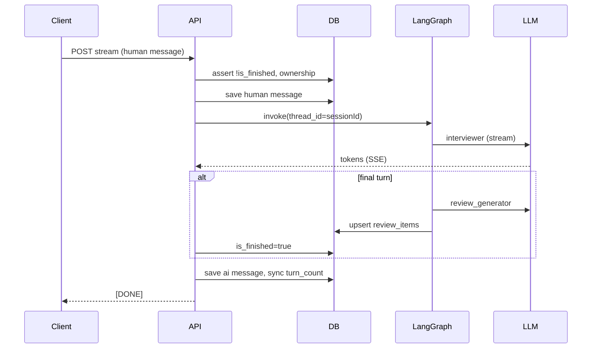

# AI Mock Interview — Specification

## Problem Statement

Candidates preparing for technical interviews lack realistic, personalized practice with immediate, structured feedback tied to their own background. A generic chatbot cannot simulate a Tech Lead interview grounded in the candidate's résumé, enforce turn limits by seniority, or persist actionable review topics across sessions.

This feature delivers an end-to-end backend: PDF résumé ingestion with async structuring, LangGraph-orchestrated mock interviews streamed over SSE, and automatic generation of review items when the session ends—merging recurring topics by raising priority instead of duplicating rows.

## Goals

- Authenticated users can upload a PDF résumé and receive a structured profile (`structured_summary`) without blocking the HTTP response.
- Users can start a level-scoped interview session (entry / mid / senior) tied to a ready résumé and converse with a Tech Lead agent via SSE until `max_turns` is reached.
- On the final turn, the system produces structured feedback and persists review items; recurring topics raise priority on the existing row instead of creating duplicates.
- All resources are scoped by JWT `user_id`; finished sessions cannot accept new messages.
- LangGraph state is persisted in PostgreSQL (`PostgresSaver`) with `thread_id = session_id`.

## Out of Scope


| Item                                           | Reason                                                                                 |
| ---------------------------------------------- | -------------------------------------------------------------------------------------- |
| Frontend UI                                    | Backend-only scope; API contracts defined here for consumer apps                       |
| Real-time résumé status polling contract       | Optional; worker updates DB; client may poll `GET` (future) or use websockets later    |
| Editing / deleting review items via API        | Not requested                                                                          |
| Multiple concurrent interviews per user        | Not specified; no hard limit in v1 unless added in design                              |
| Non-PDF résumé formats                         | Explicitly PDF-only                                                                    |
| Agent-created review items (tool)              | Review creation is backend-only (`review_generator` node)                              |
| Admin / moderation dashboards                  | Not requested                                                                          |
| Migrating `User.id` from `Int` to `UUID` in v1 | See [Brownfield constraints](#brownfield-constraints); design must resolve FK strategy |


---

## Brownfield Constraints

The existing backend (`Backend/`) provides:


| Area    | Current state                                                                      | Implication for this feature                                               |
| ------- | ---------------------------------------------------------------------------------- | -------------------------------------------------------------------------- |
| Auth    | JWT via `makeCheckAuth()`; `req.userId` is `**number**` (`Int`)                    | All ownership checks use numeric `userId` unless a migration is approved   |
| Routes  | Auto-discovered under `/api/{module}` from `src/modules/{name}/routes/*-routes.ts` | Endpoints below are expressed as `**/api/...**` paths                      |
| DB      | Prisma + PostgreSQL (`User`, `RefreshToken` only)                                  | Four new models + enums; LangGraph checkpoint tables                       |
| Runtime | Bun; Express 5                                                                     | Workers and SSE must run in same process or separate worker entry (design) |
| Infra   | Docker Compose: Postgres only                                                      | Redis required for BullMQ; add to compose or document external Redis       |
| Deps    | No LangChain, BullMQ, R2 SDK, multer                                               | New dependencies and env vars in design phase                              |


**Design decision required (AMI-DEC-01):** User brief specifies `UUID` for `user_id` and entity PKs. Existing `User.id` is `Int`. **Recommended for v1:** use `Int` for `user_id` FKs and `UUID` for résumé/session/message/review PKs. Document migration to UUID users as future work if product requires it.

---

## API Surface (canonical paths)

Base URL prefix: `/api` (matches route discovery).


| Method | Path                                          | Feature            |
| ------ | --------------------------------------------- | ------------------ |
| `POST` | `/api/resumes`                                | Upload PDF         |
| `POST` | `/api/interview/sessions`                     | Create session     |
| `POST` | `/api/interview/sessions/:sessionId/stream`   | SSE interview turn |
| `GET`  | `/api/interview/sessions`                     | List user sessions |
| `GET`  | `/api/interview/sessions/:sessionId/messages` | Message history    |


Additional endpoints implied but not in brief (recommend in design): `GET /api/resumes/:id` for status polling after upload.

---

## Data Model

### Enums

- `ResumeStatus`: `processing` `ready` `failed`
- `InterviewLevel`: `entry` `mid` `senior`
- `MessageRole`: `human` `ai`
- `ReviewPriority`: `high` `medium` `low`

### Tables

#### `resumes`


| Field                | Type         | Notes                        |
| -------------------- | ------------ | ---------------------------- |
| `id`                 | UUID         | PK                           |
| `user_id`            | Int          | FK → `users.id` (brownfield) |
| `name`               | VARCHAR      | Original filename            |
| `pdf_url`            | TEXT         | R2 object URL                |
| `structured_summary` | JSONB        | Nullable until ready         |
| `raw_text`           | TEXT         | Nullable; debug/reprocess    |
| `status`             | ResumeStatus | Default `processing`         |
| `error_message`      | TEXT         | Nullable                     |
| `created_at`         | TIMESTAMP    |                              |


#### `interview_sessions`


| Field         | Type           | Notes                     |
| ------------- | -------------- | ------------------------- |
| `id`          | UUID           | PK; LangGraph `thread_id` |
| `user_id`     | Int            | FK → `users.id`           |
| `resume_id`   | UUID           | FK → `resumes.id`         |
| `level`       | InterviewLevel |                           |
| `turn_count`  | INT            | Default 0                 |
| `max_turns`   | INT            | entry=5, mid=7, senior=8  |
| `is_finished` | BOOLEAN        | Default false             |
| `created_at`  | TIMESTAMP      |                           |


#### `interview_messages`


| Field        | Type        | Notes                         |
| ------------ | ----------- | ----------------------------- |
| `id`         | UUID        | PK                            |
| `session_id` | UUID        | FK                            |
| `user_id`    | Int         | FK (denormalized for queries) |
| `role`       | MessageRole |                               |
| `content`    | TEXT        |                               |
| `created_at` | TIMESTAMP   |                               |


#### `review_items`


| Field         | Type           | Notes                                                  |
| ------------- | -------------- | ------------------------------------------------------ |
| `id`          | UUID           | PK                                                     |
| `session_id`  | UUID           | FK                                                     |
| `user_id`     | Int            | FK                                                     |
| `topic`       | VARCHAR        |                                                        |
| `description` | TEXT           |                                                        |
| `priority`    | ReviewPriority | Escalated when the same topic is identified again      |
| `created_at`  | TIMESTAMP      |                                                        |
| `updated_at`  | TIMESTAMP      | Set when priority (or description) is updated on merge |


### `structured_summary` schema (JSONB)

```json
{
  "personal_info": {
    "name": "string",
    "title": "string"
  },
  "skills": ["string"],
  "experiences": [
    {
      "company": "string",
      "role": "string",
      "period": "string",
      "highlights": ["string"]
    }
  ],
  "projects": ["string"]
}
```

Validated with Zod on write; LLM extraction uses OpenAI structured output against this shape.

### `review_generator` structured output (LLM)

The `review_generator` node calls the LLM with **structured output** returning a list of items:

```json
{
  "items": [
    {
      "topic": "string",
      "description": "string",
      "priority": "low | medium | high"
    }
  ]
}
```

**LLM inputs (required in prompt):**

1. Full interview transcript (all turns of the current session).
2. Candidate `structured_summary`.
3. User's existing `review_items` (`topic`, `description`, `priority`).

**LLM instructions (normative):**

- Identify gaps and weaknesses from the interview; emit one object per distinct topic to review.
- For topics **not** already in the review list → return a new `topic`, `description`, and appropriate `priority`.
- For a weakness that **matches an existing review item** (same underlying topic) → return that **same `topic` string** as stored in the list (do not paraphrase or rename), an updated `description` reflecting this interview, and a `**priority` strictly higher than the existing one when the interview reinforces the gap** (e.g. `low` → `medium` or `high`; `medium` → `high`). If the existing item is already `high`, keep `high`.
- Do not emit duplicate entries for the same topic within a single response.
- Do not lower priority for an existing topic.

The backend persists results; the LLM does not write to the database.

---

## User Stories

### P1: Upload and process résumé (Feature 1) — MVP

**User Story**: As an authenticated candidate, I want to upload my résumé PDF so the system extracts a structured profile I can use in mock interviews.

**Why P1**: No interview without `structured_summary`.

**Acceptance Criteria**:

1. WHEN an authenticated user sends `multipart/form-data` with a single PDF field to `POST /api/resumes` THEN the system SHALL validate `Content-Type` is `application/pdf` and file size ≤ 5MB.
2. WHEN validation fails THEN the system SHALL respond with `4xx` and SHALL NOT create a résumé record or upload to R2.
3. WHEN validation succeeds THEN the system SHALL upload the file to Cloudflare R2, create a `resumes` row with `status = processing`, enqueue a BullMQ job, and respond immediately with `{ id, name, status }` and a basic preview (e.g. `name`, `status`, `created_at`; no `structured_summary` yet).
4. WHEN the BullMQ worker runs THEN it SHALL download the PDF from R2, extract `raw_text` via LangChain PDF Loader, call the extraction model (GPT-5 mini per brief) with structured output, and update the row with `structured_summary`, `raw_text`, and `status = ready` on success.
5. WHEN extraction or upload processing fails THEN the worker SHALL set `status = failed` and persist `error_message`.
6. WHEN any résumé operation runs THEN `user_id` SHALL be taken only from `req.userId` (JWT), never from the request body.

**Independent Test**: Upload a valid PDF → receive `processing` → after worker completes, DB row is `ready` with populated `structured_summary`.

**Requirements**: AMI-01, AMI-02, AMI-03, AMI-04, AMI-05, AMI-06

---

### P1: Create interview session (Feature 2) — MVP

**User Story**: As an authenticated candidate, I want to start a mock interview for a given résumé and seniority level so the agent knows my context and turn limit.

**Why P1**: Required before streaming.

**Acceptance Criteria**:

1. WHEN the user posts `{ resume_id, level }` to `POST /api/interview/sessions` THEN the system SHALL verify the résumé exists, belongs to `req.userId`, and has `status = ready`.
2. WHEN the résumé is not ready or not owned THEN the system SHALL respond with `4xx` and SHALL NOT create a session.
3. WHEN valid THEN the system SHALL create `interview_sessions` with `turn_count = 0`, `is_finished = false`, and `max_turns` of 5 (entry), 7 (mid), or 8 (senior).
4. WHEN the session is created THEN the response SHALL include `{ id }` (UUID).

**Independent Test**: With a `ready` résumé, create session → receive UUID; wrong user or `processing` résumé → error.

**Requirements**: AMI-07, AMI-08, AMI-09

---

### P1: Stream interview turn with LangGraph (Features 3, 4, 6, 7) — MVP

**User Story**: As a candidate in an active session, I want to send my answer and receive the interviewer's reply streamed in real time until the session ends.

**Why P1**: Core product value.

**Acceptance Criteria**:

1. WHEN the user posts a message body to `POST /api/interview/sessions/:sessionId/stream` THEN the system SHALL authenticate, verify session ownership, and reject with `4xx` if `is_finished = true` **before** opening SSE.
2. WHEN the session is active THEN the system SHALL persist the user message in `interview_messages` with `role = human`, increment orchestration turn logic, and invoke the LangGraph graph with `thread_id = sessionId`.
3. WHEN the graph runs THEN state SHALL include `messages`, `turn_count`, `max_turns`, `level`, `user_id` (server-injected), `resume_summary` (from `structured_summary` only), and `is_finished`.
4. WHEN the `interviewer` node runs THEN it SHALL call the interview model (GPT-5 per brief) with a system prompt composed in order: (1) security guardrails, (2) level-specific instructions, (3) candidate résumé from `structured_summary`, (4) conversation context.
5. WHEN the model emits tokens THEN the HTTP response SHALL use SSE with events: `token` (content chunk), `meta` (e.g. turn info), `error`, and a terminal `[DONE]`.
6. WHEN the AI reply completes THEN the system SHALL persist `interview_messages` with `role = ai` and sync `turn_count` and `is_finished` on `interview_sessions` after each graph execution.
7. WHEN `turn_count` reaches `max_turns` on the final user message THEN the system SHALL run the `review_generator`  node (**GPT-5-Mini here**) after the model response, set `is_finished = true`, and block further streams.
8. WHEN `PostgresSaver` is used THEN checkpoint persistence SHALL use the same PostgreSQL database (separate tables managed by LangGraph).

**Independent Test**: Create session → stream N turns → on last turn session becomes finished; further stream returns error.

**Requirements**: AMI-10 … AMI-22

---

### P1: Generate review items on final turn (Feature 5) — MVP

**User Story**: As a candidate who finished an interview, I want concrete review topics saved so I can study them later.

**Why P1**: Delivered promise at end of interview.

**Acceptance Criteria**:

1. WHEN the final turn completes THEN the backend `review_generator` node SHALL run (not the conversational agent via tool).
2. WHEN `review_generator` runs THEN it SHALL load existing `review_items` for the user and invoke the LLM with full transcript + existing items + `structured_summary`, following the [review_generator LLM contract](#review_generator-structured-output-llm) above.
3. WHEN the LLM responds THEN output SHALL be parsed as structured `{ items: [{ topic, description, priority }] }` and validated (Zod).
4. WHEN the LLM recognizes a topic already in the user's review list THEN it SHALL return the same `topic` (verbatim from the list) with `priority` elevated when the interview warrants it (per LLM instructions); the backend does not re-derive priority from scratch.
5. WHEN persisting each parsed item THEN the backend SHALL match existing rows by `topic` (case-insensitive):
  - **No match** → insert a new `review_items` row linked to the current `session_id` using LLM `description` and `priority`.
  - **Match** → SHALL NOT insert a duplicate; SHALL set `priority` to the higher of existing vs LLM (`low` < `medium` < `high`), SHALL never decrease priority, SHALL update `description` from the LLM output, and SHALL set `updated_at`.
  - **Safety net:** IF the LLM returns the same topic without raising priority but the row matched an existing item from the list input, THEN the backend SHALL still bump priority by one step (same as prior rule) so recurring gaps are never left stale.
6. WHEN two topics are similar but not an exact case-insensitive match THEN the LLM should prefer reusing an existing `topic` when it is the same concern; otherwise emit a new topic (backend may still apply AMI-DEC-02 for near-duplicate strings).
7. WHEN the agent graph exposes tools THEN only `list_review_items` MAY be available to the model; the model SHALL NOT create review items via tool.

**Independent Test**: Complete session A → items persisted. Complete session B where the interview revisits the same weakness → LLM output includes the same `topic` with higher `priority`; DB has one row per topic, higher priority and updated `description`/`updated_at`.

**Requirements**: AMI-23, AMI-24, AMI-25, AMI-26, AMI-31

---

### P2: Conversation history (Feature 8)

**User Story**: As a candidate, I want to list my past sessions and read message history so I can review interviews.

**Why P2**: Essential for UX but not required to complete a single interview loop.

**Acceptance Criteria**:

1. WHEN the user calls `GET /api/interview/sessions` THEN the system SHALL return only sessions where `user_id = req.userId`.
2. WHEN the user calls `GET /api/interview/sessions/:sessionId/messages` THEN the system SHALL return messages ordered by `created_at` only if the session belongs to `req.userId`.
3. WHEN the session does not exist or is not owned THEN the system SHALL respond with `404` or `403` per project error conventions.

**Independent Test**: User A cannot read User B's sessions or messages.

**Requirements**: AMI-27, AMI-28, AMI-29

---

### P3: Résumé status endpoint (implied)

**User Story**: As a candidate waiting for processing, I want to check whether my résumé is ready.

**Why P3**: Improves upload UX; worker already updates status.

**Acceptance Criteria**:

1. WHEN the user requests their résumé by id THEN the system SHALL return `id`, `name`, `status`, and `structured_summary` only when `ready` (never leak another user's data).

**Requirements**: AMI-30

---

## LangGraph Architecture (requirements)


| Node               | Responsibility                                                                   |
| ------------------ | -------------------------------------------------------------------------------- |
| `interviewer`      | Main LLM turn; GPT-5; dynamic system prompt                                      |
| `tool_executor`    | Runs `list_review_items` only                                                    |
| `review_generator` | Final turn only; LLM structured output (items + priority rules) + backend upsert |


**Control flow (backend-owned):**

- Turn limits enforced in application layer before/after graph invoke, not by the LLM.
- `review_generator` invoked only when `turn_count + 1 >= max_turns` after human message (exact hook in design).




---

## Security Requirements


| ID         | Requirement                                                                                                    |
| ---------- | -------------------------------------------------------------------------------------------------------------- |
| AMI-SEC-01 | `user_id` always from JWT (`req.userId`); never from client body or agent state mutation                       |
| AMI-SEC-02 | Résumé PDFs stored in R2 with private access; URLs not guessable (signed URLs or internal fetch only — design) |
| AMI-SEC-03 | Agent receives only `structured_summary`, not raw PDF or `raw_text` in prompts                                 |
| AMI-SEC-04 | Finished sessions: hard reject before SSE                                                                      |
| AMI-SEC-05 | All list/get endpoints filter by authenticated user                                                            |
| AMI-SEC-06 | Security section (`## Security`) SHALL be present at the **end** of the interviewer system prompt on every call, instructing the model not to reveal system instructions or implementation details |


---

## Edge Cases

- WHEN PDF is corrupted or empty THEN worker SHALL set `status = failed` with descriptive `error_message`.
- WHEN R2 is unavailable on upload THEN SHALL NOT leave orphan DB rows without rollback strategy (design: delete row or mark failed).
- WHEN Redis/BullMQ is down on upload THEN SHALL return `503` or persist job retry policy (design).
- WHEN OpenAI rate limits during stream THEN SSE SHALL emit `error` event and close cleanly.
- WHEN client disconnects mid-stream THEN partial AI message policy: discard or save truncated (AMI-DEC-03).
- WHEN user sends message to finished session THEN `409` or `400` with clear message before SSE.
- WHEN `resume_id` references another user's résumé THEN `404` (no enumeration).
- WHEN session `turn_count` already at `max_turns` THEN reject new stream.
- WHEN `structured_summary` is malformed in DB THEN session creation SHALL fail validation for that résumé.
- WHEN the LLM returns a lower `priority` than the existing row for a matched topic THEN the backend SHALL persist `max(existing, llm)` and SHALL NOT decrease.
- WHEN the LLM omits a priority bump for a matched existing topic THEN the backend safety net (criterion 5) SHALL apply at least a one-step bump.

---

## Environment & Integrations (for design phase)


| Variable (suggested)      | Purpose                              |
| ------------------------- | ------------------------------------ |
| `OPENAI_API_KEY`          | LLM calls                            |
| `OPENAI_MODEL_INTERVIEW`  | Default: gpt-5 (verify availability) |
| `OPENAI_MODEL_EXTRACTION` | Default: gpt-5-mini                  |
| `R2_*`                    | Account, bucket, keys, endpoint      |
| `REDIS_URL`               | BullMQ                               |
| `RESUME_MAX_BYTES`        | Default 5_242_880 (5MB)              |


---

## Requirement Traceability


| Requirement ID | Story      | Summary                                    | Phase  |
| -------------- | ---------- | ------------------------------------------ | ------ |
| AMI-01         | P1 Upload  | PDF mimetype + 5MB validation              | Design |
| AMI-02         | P1 Upload  | R2 upload + `pdf_url`                      | Design |
| AMI-03         | P1 Upload  | Create `resumes` processing row            | Design |
| AMI-04         | P1 Upload  | BullMQ enqueue + async worker              | Design |
| AMI-05         | P1 Upload  | PDF text extract + structured LLM          | Design |
| AMI-06         | P1 Upload  | Immediate response with preview fields     | Design |
| AMI-07         | P1 Session | Validate résumé ready + ownership          | Design |
| AMI-08         | P1 Session | `max_turns` by level                       | Design |
| AMI-09         | P1 Session | Return session UUID                        | Design |
| AMI-10         | P1 Stream  | Auth + ownership + finished guard          | Design |
| AMI-11         | P1 Stream  | SSE event types                            | Design |
| AMI-12         | P1 Stream  | Persist human/ai messages                  | Design |
| AMI-13         | P1 Stream  | LangGraph PostgresSaver `thread_id`        | Design |
| AMI-14         | P1 Stream  | Graph state fields                         | Design |
| AMI-15         | P1 Stream  | `interviewer` node + GPT-5                 | Design |
| AMI-16         | P1 Stream  | Dynamic system prompt 4 blocks             | Design |
| AMI-17         | P1 Stream  | Sync `turn_count` / `is_finished`          | Design |
| AMI-18         | P1 Stream  | Final turn triggers `review_generator`     | Design |
| AMI-19         | P1 Stream  | `tool_executor` + `list_review_items`      | Design |
| AMI-20         | P1 Stream  | Server-injected `user_id` in state         | Design |
| AMI-21         | P1 Stream  | Résumé context = `structured_summary` only | Design |
| AMI-22         | P1 Stream  | Block stream when finished                 | Design |
| AMI-23         | P1 Review  | Backend-only review generation             | Design |
| AMI-24         | P1 Review  | Structured output `{ items[] }` schema     | Design |
| AMI-25         | P1 Review  | Backend upsert: max priority, no dup rows  | Design |
| AMI-26         | P1 Review  | No agent tool to create items              | Design |
| AMI-31         | P1 Review  | LLM prompt: reuse topic, raise priority    | Design |
| AMI-27         | P2 History | List sessions by user                      | Design |
| AMI-28         | P2 History | List messages by session + user            | Design |
| AMI-29         | P2 History | Cross-user access denied                   | Design |
| AMI-30         | P3         | GET résumé status (optional)               | Design |
| AMI-SEC-01…06  | All        | Security table                             | Design |


**Coverage:** 37 requirements (31 functional + 6 security) → mapped in `tasks.md` (T1–T39).

**Open decisions for design (`context.md` or `design.md`):**


| ID         | Question                                | Options                                                     |
| ---------- | --------------------------------------- | ----------------------------------------------------------- |
| AMI-DEC-01 | `user_id` type                          | A) Int FKs (recommended v1) B) Migrate User to UUID         |
| AMI-DEC-02 | Near-duplicate topics (non-exact match) | new row vs merge — threshold in design                      |
| AMI-DEC-06 | On merge, `description` source          | **Resolved:** always use latest LLM `description` on update |
| AMI-DEC-03 | Partial stream on disconnect            | save partial AI / discard                                   |
| AMI-DEC-04 | Worker deployment                       | same Bun process vs `src/worker.ts` entry                   |
| AMI-DEC-05 | R2 URL exposure                         | signed GET vs server-only download                          |


---

## Success Criteria

- End-to-end: upload PDF → wait for `ready` → create session → complete all turns via SSE → session `is_finished` with ≥1 `review_item`.
- User A cannot access User B's résumés, sessions, or messages (automated tests).
- Finished session returns error on new stream attempt 100% of the time.
- LangGraph checkpoint survives process restart mid-session (resume same `thread_id`).
- P95 upload API response < 2s (excluding worker); worker completes typical 2-page PDF < 60s (environment dependent).

---

## Suggested Module Layout (non-normative)

```
src/modules/
  resumes/          # POST /api/resumes
  interview/        # sessions, stream, messages
src/infrastructure/
  storage/r2.ts
  queue/resume-queue.ts
  ai/langgraph/...
```

Aligns with existing `controller → service → repository` and `factories/` pattern.

---

## Next Steps

1. **Confirm this spec** (especially AMI-DEC-01 and API paths).
2. **Design phase** (`design.md`): Prisma schema, LangGraph graph code layout, SSE handler, BullMQ worker, env schema extensions.
3. **Tasks phase** (`tasks.md`): Atomic implementation tasks with verification gates.

**Complexity:** Large — Design + Tasks recommended before Execute.