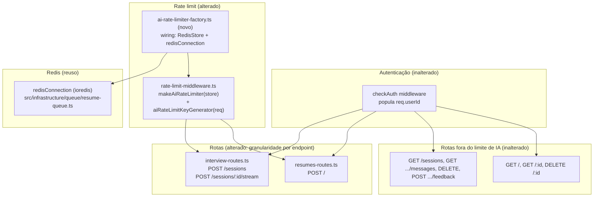

# AI Rate Limit by User — Design

**Spec**: `.specs/features/ai-rate-limit-by-user/spec.md`
**Status**: Draft

---

## Research Notes (Knowledge Verification Chain)

Verificado via leitura direta do código-fonte instalado (`node_modules/express-rate-limit`) e do source do `rate-limit-redis` no GitHub (pacote ainda não instalado no projeto), seguindo a cadeia Codebase → Docs → Context7/Web:

1. **`keyGenerator` que lança erro já é tratado pelo `errorHandler` existente, sem mudança nenhuma nele.** O middleware gerado por `express-rate-limit` (`node_modules/express-rate-limit/dist/index.cjs`) envolve toda a função interna (incluindo a chamada a `config.keyGenerator(request, response)`) com um wrapper `handleAsyncErrors` que faz `try { await ... } catch (error) { next(error) }`. Um `throw` síncrono ou uma `Promise` rejeitada dentro do `keyGenerator` chega ao `errorHandler` como qualquer outro erro de middleware. Como o erro lançado **não** será uma instância de `HttpError`, `errorHandler` já retorna `500 { message: "Internal Server Error" }` — exatamente o comportamento pedido em AIRL-DEC-01, **sem precisar tocar em `error-handler-middleware.ts`**.
2. **Falha do store (Redis indisponível) já falha de forma explícita por padrão.** Na mesma implementação, o `store.increment(key)` roda dentro de um `try/catch` que só "engole" o erro e deixa a requisição passar (`next()`) se a opção `passOnStoreError` estiver setada como `true`. O default é `false` (não configurado), então qualquer erro do Redis (conexão recusada, timeout) é relançado e cai no mesmo fluxo do `errorHandler` (`500`). **Decisão de design:** não setar `passOnStoreError` — o default já satisfaz AIRL-11 (nenhum bypass silencioso).
3. **`rate-limit-redis` usa scripts Lua (`EVALSHA`/`SCRIPT LOAD`) via `sendCommand`, não comandos simples como `INCR`.** Isso inviabiliza um mock de Redis "de mão" em teste unitário puro (replicar corretamente `SCRIPT LOAD` + `EVALSHA` com TTL exigiria reimplementar boa parte do Lua). **Implicação para Design:** a lógica testável isoladamente (sem Redis) é o `keyGenerator` (extraído como função pura exportada); o comportamento fim-a-fim de contagem/expiração/limite (`429`) continua validado nos testes E2E, que já sobem um Redis real via Testcontainers (`src/test/containers/vitest.e2e.global-setup.ts`) para o BullMQ — o mesmo Redis passa a ser reutilizado para o rate limiter, sem infraestrutura de teste nova.
4. **Assinatura confirmada do adaptador `ioredis` para `sendCommand`:** `sendCommand: (command: string, ...args: string[]) => redisConnection.call(command, ...args)`. `redisConnection` (exportado por `resume-queue.ts`) já é uma instância real de `ioredis.Redis`, apenas com o tipo estreitado para `ConnectionOptions` (uso do BullMQ); o mesmo cast que `redis-health.ts` já faz (`redisConnection as Redis`) é reaplicado aqui.
5. **`express-rate-limit` valida o `keyGenerator` customizado em busca de `req.ip`/`request.ip` no `.toString()` da função** (proteção contra bypass de IPv6). Como o novo `keyGenerator` usa apenas `req.userId`, essa validação não é acionada — nenhum ajuste necessário.

---

## Architecture Overview

Mudança concentrada em uma única peça de infraestrutura compartilhada (`aiRateLimiter`) e no ponto de montagem das rotas dos dois módulos que chamam IA. Nenhuma camada de domínio (service/repository/controller) é alterada. O `keyGenerator` passa a depender de `req.userId` (já populado globalmente por `checkAuth` em `config/app.ts`, antes de `setupRoutes`), e o `store` passa de `MemoryStore` implícito para `RedisStore` sobre a conexão `ioredis` já existente do BullMQ.

---

## Code Reuse Analysis

### Existing Components to Leverage

| Component | Location | How to Use |
| --------- | -------- | ---------- |
| `authRateLimiter` (padrão de configuração) | `src/shared/middlewares/rate-limit-middleware.ts` | Mantido exatamente como está (por IP) — fora de escopo (`RATE_LIMIT_WINDOW_MS`/`RATE_LIMIT_MAX` intactos) |
| `redisConnection` (ioredis) | `src/infrastructure/queue/resume-queue.ts` | Reusar a mesma instância/conexão para o `RedisStore` do rate limiter — mesmo cast já usado em `redis-health.ts` (`redisConnection as Redis`) |
| `errorHandler` | `src/shared/middlewares/error-handler-middleware.ts` | Reutilizado sem alteração — erro não-`HttpError` já vira `500` (ver Research Notes #1–2) |
| `env` / `serverEnvSchema` | `src/config/env/server-schema.ts` | `RATE_LIMIT_AI_WINDOW_MS`/`RATE_LIMIT_AI_MAX` mantidos sem mudança (fora de escopo, conforme spec) |
| Padrão `make*Factory()` | `src/factories/auth/check-auth-factory.ts` (referência de estilo) | Aplicar o mesmo padrão para isolar a criação do `RedisStore` (dependência de infraestrutura) da lógica pura do middleware, mantendo `rate-limit-middleware.ts` testável sem Redis real |
| `req.userId` (augmentation) | `src/types/express.d.ts` | Reusado como está — já `number \| undefined`, populado por `checkAuth` antes de qualquer rota autenticada |
| Testcontainers Redis já usado em E2E | `src/test/containers/vitest.e2e.global-setup.ts` | Reusar a mesma instância de Redis subida para o BullMQ — nenhum container novo necessário para os testes E2E de rate limit |
| Padrão de teste E2E com `vi.resetModules()` + import dinâmico de `createApp` | `src/test/e2e/interview.e2e.test.ts` (`describe("AI rate limiting")`) | Mesmo padrão reaproveitado para os novos cenários (por-usuário, múltiplas instâncias) |

### Integration Points

| Sistema | Método de integração |
| ------- | --------------------- |
| `ioredis` (`redisConnection`) | `RedisStore({ sendCommand: (command, ...args) => (redisConnection as Redis).call(command, ...args), prefix: "rl:ai:" })` |
| `interview-routes.ts` / `resumes-routes.ts` | `aiRateLimiter` deixa de ser aplicado via `router.use(...)` e passa a ser inserido como middleware de rota individual, apenas nos endpoints que chamam a OpenAI |
| `errorHandler` | Nenhuma mudança de código — apenas comportamento observado (erro do `keyGenerator`/store vira `500` via caminho já existente) |

---

## Components

### 1. `rate-limit-middleware.ts` (alterado)

- **Purpose**: Manter `authRateLimiter` intacto; transformar `aiRateLimiter` de uma instância fixa (`MemoryStore` + chave por IP implícita) em uma função de fábrica pura, testável sem Redis, que recebe o `store` como dependência.
- **Location**: `src/shared/middlewares/rate-limit-middleware.ts`
- **Interfaces**:
  - `aiRateLimitKeyGenerator(req: Request): string` — retorna `String(req.userId)`; lança `Error("aiRateLimiter: req.userId is not set")` se `req.userId` for `undefined` (AIRL-DEC-01). Exportada isoladamente para permitir teste unitário direto, sem precisar montar um app Express nem um store.
  - `makeAiRateLimiter(store: Store): RequestHandler` — monta o `rateLimit({...})` com `keyGenerator: aiRateLimitKeyGenerator`, `store`, mesmas opções de mensagem/headers já usadas hoje (`windowMs`/`max` a partir de `env`, `message`, `standardHeaders: true`, `legacyHeaders: false`). `Store` é o tipo importado de `express-rate-limit` — permite injetar `MemoryStore` em teste unitário e `RedisStore` em produção/E2E sem duplicar a configuração do limiter.
  - `authRateLimiter` — inalterado (export direto, mesma configuração de hoje).
- **Dependencies**: `express-rate-limit` (já instalado), `env`.
- **Reuses**: 100% da configuração atual de `windowMs`/`max`/`message`/headers do `aiRateLimiter` existente — só extrai `keyGenerator`/`store` como pontos variáveis.

### 2. `ai-rate-limiter-factory.ts` (novo)

- **Purpose**: Isolar a única parte não testável em unidade (dependência de Redis real) — cria o `RedisStore` sobre `redisConnection` e devolve o middleware pronto para uso nas rotas. Segue o mesmo padrão de `make*Factory()` já usado em `src/factories/auth/check-auth-factory.ts`.
- **Location**: `src/factories/shared/ai-rate-limiter-factory.ts`
- **Interfaces**:
  - `makeAiRateLimiter(): RequestHandler` — constrói `new RedisStore({ sendCommand: (command, ...args) => (redisConnection as Redis).call(command, ...args), prefix: "rl:ai:" })` e chama `makeAiRateLimiter(store)` de `rate-limit-middleware.ts` (nomes iguais propositalmente — mesmo padrão do projeto onde `makeCheckAuth()` em `factories/` chama `makeCheckAuthMiddleware()` em `shared/`/`modules/`).
- **Dependencies**: `redisConnection` (`src/infrastructure/queue/resume-queue.ts`), `rate-limit-redis`, `rate-limit-middleware.ts`.
- **Reuses**: `redisConnection` já existente — nenhuma segunda conexão Redis é criada.
- **Nota de nomenclatura (a confirmar em Execute)**: se o linter/convenção do projeto não aceitar dois símbolos com o mesmo nome em arquivos diferentes de forma confusa, renomear a função de baixo nível para `createAiRateLimiter(store)` em `rate-limit-middleware.ts`, mantendo `makeAiRateLimiter()` (sem argumentos) só na factory — decisão de nomenclatura, não de arquitetura.

### 3. `interview-routes.ts` (alterado)

- **Purpose**: Remover `router.use(aiRateLimiter)` (todas as rotas) e aplicar o limiter apenas às duas rotas que chamam a OpenAI.
- **Location**: `src/modules/interview/routes/interview-routes.ts`
- **Mudança**:
  - Remove `router.use(aiRateLimiter);`.
  - `router.post("/sessions", aiRateLimiter, validate(createSessionSchema), asyncHandler(controller.createSession))`.
  - `router.post("/sessions/:sessionId/stream", aiRateLimiter, validate(streamMessageSchema), asyncHandler(controller.stream))`.
  - `GET /sessions`, `GET /sessions/:sessionId/messages`, `DELETE /sessions/:sessionId`, `POST /sessions/:sessionId/feedback` **não** recebem `aiRateLimiter` (feedback deixa de receber o limiter que herdava do `router.use` anterior, conforme nota da spec).
- **Dependencies**: `aiRateLimiter` agora vindo da factory (`src/factories/shared/ai-rate-limiter-factory.ts`) em vez de `src/shared`.
- **Reuses**: `validate`, `asyncHandler`, `makeInterviewController` — inalterados.

### 4. `resumes-routes.ts` (alterado)

- **Purpose**: Mesma mudança de granularidade para o módulo de currículos.
- **Location**: `src/modules/resumes/routes/resumes-routes.ts`
- **Mudança**:
  - Remove `router.use(aiRateLimiter);`.
  - `router.post("/", aiRateLimiter, resumeUploadMiddleware.single("file"), asyncHandler(controller.upload))`.
  - `GET /`, `GET /:id`, `DELETE /:id` **não** recebem `aiRateLimiter`.
- **Dependencies/Reuses**: idem componente 3.

### 5. `src/shared/index.ts` (alterado)

- **Purpose**: Ajustar barrel export — `aiRateLimiter` deixa de ser reexportado como instância fixa de `src/shared` (já que agora depende de uma factory de infraestrutura); `authRateLimiter` continua exportado normalmente.
- **Location**: `src/shared/index.ts`
- **Mudança**: remover `aiRateLimiter` do export list; rotas passam a importar `makeAiRateLimiter` de `@/factories/shared/ai-rate-limiter-factory` (ou receber a instância já construída, a decidir em Execute — ver Tech Decisions) e `authRateLimiter` continua vindo de `@/shared`.

---

## Data Models

Não aplicável — feature não introduz nem altera modelos Prisma. O estado de contagem vive inteiramente no Redis (chaves `rl:ai:<userId>`, geridas internamente pelo `RedisStore` via scripts Lua, sem schema explícito do lado da aplicação).

---

## Error Handling Strategy

| Cenário | Tratamento | Impacto no usuário |
| ------- | ---------- | ------------------- |
| `req.userId` ausente quando `aiRateLimiter` roda (bug de configuração: limiter antes do `checkAuth`, ou aplicado em rota pública) | `aiRateLimitKeyGenerator` lança `Error`; capturado pelo wrapper interno do `express-rate-limit` (`handleAsyncErrors`) → `next(error)` → `errorHandler` existente → `500 { message: "Internal Server Error" }` (não é `HttpError`, então não usa mensagem customizada) | Erro genérico 500; nenhum fallback silencioso por IP (AIRL-DEC-01) |
| Redis indisponível no momento do `increment()` | `store.increment` relança o erro (default `passOnStoreError: false`) → mesmo caminho `errorHandler` → `500` | Erro genérico 500; requisição de IA não é processada sem rate limit aplicado (nunca "libera" silenciosamente) |
| Limite excedido (`totalHits > max`) | Comportamento nativo do `express-rate-limit`, inalterado | `429 { message: "Too many requests, please try again later." }` — contrato preservado |
| Redis indisponível no **boot** (falha ao carregar os scripts Lua via `store.init()`) | `express-rate-limit` já captura erro de `store.init()` de forma assíncrona e loga via `config.logger.error(...)`, sem derrubar o processo — comportamento da própria lib, não customizado por este design. Consistente com o que a spec pede ("não subir silenciosamente sem rate limit funcional"): primeira requisição real após isso ainda tentará `increment()` e falhará explicitamente (ver linha acima), então não há bypass silencioso mesmo nesse caso | Primeira(s) requisição(ões) de IA após boot com Redis fora do ar recebem `500`, não passam sem limite |
| `maxTurns` de sessão atingido (`ConflictError` de domínio) | Roda em camada totalmente separada (service de domínio), depois que o `aiRateLimiter` já deixou a requisição passar — sem interseção de código (AIRL-08) | `409` de negócio, independente do rate limiter |

---

## Tech Decisions (only non-obvious ones)

| Decisão | Escolha | Racional |
| ------- | ------- | -------- |
| Um limiter só ou um por rota/módulo | **Um único `aiRateLimiter`** (mesma config `RATE_LIMIT_AI_*`, mesmo prefixo Redis `rl:ai:`) aplicado a 3 rotas em 2 módulos | A spec não pede janelas diferentes por módulo; um único limiter com chave por `userId` já soma corretamente o uso de IA do usuário entre interview e resumes — que é o comportamento desejado de "budget por usuário", não por feature |
| Onde criar o `RedisStore` | Extrair para `src/factories/shared/ai-rate-limiter-factory.ts`, separado de `rate-limit-middleware.ts` | Mantém `rate-limit-middleware.ts` testável em unidade (injeção de `Store`) sem exigir Redis real; segue o padrão já estabelecido de `factories/` para wiring de dependências de infraestrutura (`check-auth-factory.ts`) |
| Estratégia de teste unitário para `aiRateLimiter` | Testar `aiRateLimitKeyGenerator` isoladamente (função pura) + manter um teste de fluxo `429` usando `MemoryStore` (não `RedisStore`) injetado via `makeAiRateLimiter(store)` | `RedisStore` usa `EVALSHA`/scripts Lua — mocká-lo fielmente em unidade é caro e frágil; o fluxo fim-a-fim com Redis real já é coberto pelos testes E2E (Testcontainers) |
| Reaproveitar Redis dos testes E2E | Sim — mesma instância de Testcontainers já subida para o BullMQ (`vitest.e2e.global-setup.ts`); nenhum container novo | Evita custo/tempo de subir um segundo Redis; `REDIS_URL` já é injetado no `process.env` antes dos testes |
| Isolamento entre testes E2E paralelos no mesmo Redis | Nenhuma limpeza (`flushdb`) necessária — cada teste autentica um usuário novo (`authenticate()` cria conta nova), então a chave `rl:ai:<userId>` é única por teste automaticamente | Mais simples que gerenciar `flushdb`/prefixo por execução; evita acoplar testes a uma ordem de limpeza |
| `passOnStoreError` | Não configurar (manter default `false`) | Já é o comportamento "falha explícita" pedido pela spec (AIRL-11); configurar `true` reintroduziria bypass silencioso |
| Onde a rota importa `aiRateLimiter` | Rotas passam a importar de `@/factories/shared/ai-rate-limiter-factory` em vez de `@/shared` | `@/shared` deve permanecer livre de dependências de infraestrutura concreta (Redis); a instância "pronta para uso" nas rotas é construída uma vez no ponto de composição (factory), padrão já usado para controllers/services no projeto |

---

## Testing Strategy

| Nível | O que muda |
| ----- | ---------- |
| Unitário (`rate-limit-middleware.test.ts`) | Novo `describe("aiRateLimitKeyGenerator")`: retorna `String(userId)` quando presente; lança erro quando `req.userId` é `undefined`. `describe("makeAiRateLimiter")` mantém o teste de `429` após N requisições, mas agora injetando `new MemoryStore()` explicitamente (em vez de depender do default implícito) e simulando dois `userId`s diferentes na mesma "requisição" (mesmo `supertest` app, sem IP relevante) para provar que a chave é por usuário, não por IP. |
| E2E (`interview.e2e.test.ts`, `describe("AI rate limiting")`) | Trocar a rota exercitada de `GET /api/interview/sessions` (agora fora do limite) para `POST /api/interview/sessions` e/ou `POST /sessions/:sessionId/stream` (rotas realmente cobertas — AIRL-01/06); adicionar caso novo: dois usuários autenticados diferentes, mesmo `supertest` (mesma "origem"), cada um atinge seu próprio limite sem afetar o outro (AIRL-02); adicionar caso confirmando que `GET /sessions` continua `200` mesmo após `429` nas rotas de IA (AIRL-07). |
| E2E (`resumes.e2e.test.ts`, `describe("AI rate limiting")`) | Mantém a rota (`POST /api/resumes`, já correta); adicionar o mesmo caso de dois usuários independentes. |
| E2E (novo, P2) | Novo teste que chama `createApp()` duas vezes (duas "instâncias" apontando para o mesmo `REDIS_URL` do Testcontainers) e confirma que a soma das requisições das duas instâncias respeita `RATE_LIMIT_AI_MAX` combinado (AIRL-09/10) — local sugerido: mesmo arquivo `interview.e2e.test.ts`, novo `describe("AI rate limiting — multiple instances")`, ou arquivo dedicado `src/test/e2e/rate-limit-redis.e2e.test.ts` (decidir em Tasks conforme tamanho). |
| Docs (`docs/TESTING.md`) | Adicionar nota curta: `aiRateLimiter` conta por `userId` (não IP); testes E2E de rate limit dependem do Redis real do Testcontainers (mesmo usado pelo BullMQ); testes unitários usam `MemoryStore` injetado, nunca `RedisStore` real. |

---

## Tips (carried into Tasks)

- Fazer a extração de `aiRateLimitKeyGenerator` + `makeAiRateLimiter(store)` em um commit isolado, com o teste unitário atualizado, **antes** de tocar nas rotas — reduz o risco de quebrar os dois módulos ao mesmo tempo.
- Adicionar `rate-limit-redis` ao `package.json` e criar a factory em um segundo commit, já testável via E2E (Redis real do Testcontainers já disponível).
- Só depois mover a aplicação do middleware de `router.use` para rota-a-rota nos dois módulos (terceiro commit), incluindo a remoção proposital da rota de feedback.
- Atualizar os testes E2E existentes (`describe("AI rate limiting")`) por último, já contra o comportamento final — evita reescrever os mesmos testes duas vezes.
- `docs/TESTING.md` é uma edição pequena — pode ir junto do commit de testes E2E.

---

**Próximos passos:**

1. Revisar e aprovar este design (arquitetura, componentes, decisões técnicas — especialmente a extração de `ai-rate-limiter-factory.ts` e a estratégia de teste unitário com `MemoryStore` injetado).
2. Gerar `tasks.md` com breakdown atômico (commits sequenciais conforme a seção "Tips" acima, mapeando cada `AIRL-0X` da tabela de rastreabilidade da spec para uma ou mais tasks).
3. **Execute**.
