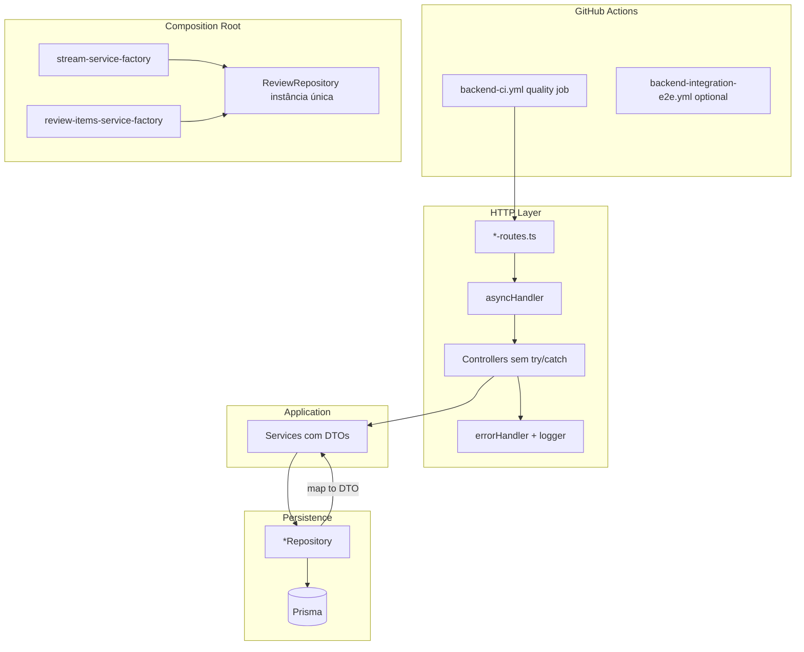
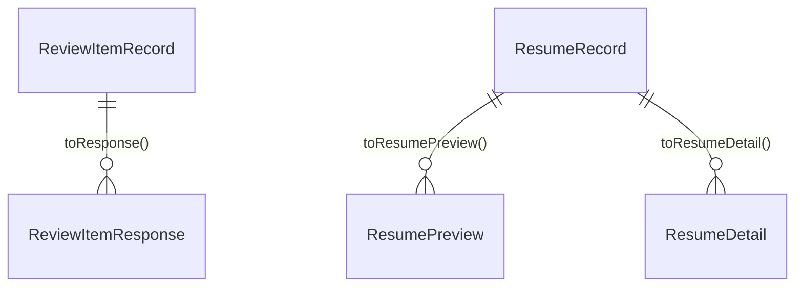

# Backend Sustainability Hardening — Design

**Spec**: `.specs/features/backend-sustainability-hardening/spec.md`  
**Status**: Approved (decisions locked below)

---

## Architecture Overview

Refatoração **horizontal e incremental**: nenhum novo bounded context pesado; reforço do composition root existente (`factories/`), util compartilhado para HTTP, workflows CI no monorepo, e **mapeamento Prisma → DTO** na borda dos repositórios. Comportamento HTTP e contratos JSON permanecem iguais (exceto remoção de código morto no auth).



---

## Locked Decisions (from spec)

| ID | Choice | Rationale |
|----|--------|-----------|
| **SUS-DEC-01** | **A** — Manter `GET /api/review-items` e módulo `review-items`; persistência em `interview` | Zero breaking change; alinha com [review-items-list-api](../review-items-list-api/spec.md) |
| **SUS-DEC-02** | **A** — `src/shared/utils/async-handler.ts` | Testável, exportável via `@/shared`, rotas explícitas |
| **SUS-DEC-03** | **A** — Job `quality` em todo PR; job `integration-e2e` em `push main` + `workflow_dispatch` | Espelha Husky; evita Docker obrigatório em todo PR |

---

## Code Reuse Analysis

### Existing Components to Leverage

| Component | Location | How to Use |
|-----------|----------|------------|
| `errorHandler` | `src/shared/middlewares/error-handler-middleware.ts` | Manter; remover `console.error` duplicado em 5xx |
| `logger` | `src/shared/logger.ts` | Único canal para 5xx (já usa `console.error` internamente) |
| `validate` middleware | `src/shared/middlewares/validation-middleware.ts` | Sem mudança |
| Factories `make*` | `src/factories/**` | Estender `stream-service-factory`; padrão para CI/worker |
| `ReviewItemResponse` | `review-items-schemas.ts` | DTO HTTP já existe; service deixa de usar `ReviewItem` Prisma |
| `ResumePreview` / `ResumeDetail` | `resume-service.ts` | Já são DTOs públicos; trocar `status: ResumeStatus` por union de domínio |
| `SessionSummary` / `SessionMessage` | `session-service.ts` | Já desacoplados; só remover import `ResumeStatus` Prisma |
| `toUserWithoutPassword` | `src/shared/types/user.ts` | Padrão de mapper a replicar em repositories |
| Vitest configs | `vitest.config.ts`, `vitest.integration.config.ts`, `vitest.e2e.config.ts` | Estender unit config com `coverage` |
| Husky pre-commit | `backend/.husky/pre-commit` | CI `quality` replica `lint` + `test` |

### Integration Points

| System | Integration |
|--------|-------------|
| GitHub Actions | Workflows na **raiz do monorepo** (`HB01-2026-nome_projeto/.github/workflows/`), `working-directory: Backend` |
| Express 5 | `asyncHandler` retorna `RequestHandler`; compatível com handlers bound (`controller.method`) |
| Prisma | Tipos ficam em `repository/` e `*.integration.test.ts` apenas |
| Frontend | Nenhuma mudança de URL ou JSON (DEC-01 A) |
| OpenAPI | Sem alteração de paths |

### Fragile Areas (mitigation)

| Área | Risco | Mitigação no design |
|------|-------|---------------------|
| `InterviewStreamService.streamTurn` | Regressão SSE | **Fora de escopo**; e2e `interview.e2e.test.ts` como gate pós-merge em `main` |
| `requestPasswordReset` controller | Catch legado `NotFoundError` | Remover catch ao migrar — service já retorna silenciosamente (SUS-04) |
| Múltiplas instâncias `ReviewRepository` | Estado inconsistente teórico | Uma instância por `makeInterviewStreamService()` |
| Worker global singleton | Difícil testar | Extrair funções puras testáveis (ver Worker) |

---

## Components

### 1. `asyncHandler`

- **Purpose**: Encapsular `Promise.resolve(fn(...)).catch(next)` para handlers async.
- **Location**: `src/shared/utils/async-handler.ts`
- **Interfaces**:

```typescript
import type { NextFunction, Request, Response, RequestHandler } from "express";

type AsyncRequestHandler = (
  req: Request,
  res: Response,
  next: NextFunction,
) => Promise<void>;

export function asyncHandler(fn: AsyncRequestHandler): RequestHandler;
```

- **Dependencies**: Express types only.
- **Reuses**: Padrão comum em apps Express; alinhado a `errorHandler` existente.

**Migration pattern**

1. Adicionar util + `async-handler.test.ts`.
2. Exportar em `src/shared/index.ts`: `export { asyncHandler } from "./utils/async-handler";`
3. Em cada `*-routes.ts`, envolver handlers: `asyncHandler(controller.signUp)` (bound arrow methods já são funções estáveis).
4. Remover `try/catch` e parâmetro `next` dos controllers **exceto** se houver lógica real em `catch` (nenhum após limpeza do auth).
5. Assinatura final do handler: `(req, res) => Promise<void>`.

**Rotas afetadas**

| File | Handlers (~count) |
|------|-------------------|
| `auth-routes.ts` | 5 |
| `interview-routes.ts` | 4 |
| `resumes-routes.ts` | 2 |
| `review-items-routes.ts` | 1 |

---

### 2. `ReviewItemsGeneratorAdapter` + interview factories

- **Purpose**: Injeção obrigatória de `ReviewRepository`; uma instância compartilhada com `ReviewMergeService` no stream.
- **Location**:
  - `src/infrastructure/ai/langgraph/review-items-generator-adapter.ts`
  - `src/factories/interview/stream-service-factory.ts`
- **Interfaces**:

```typescript
// adapter — construtor final
constructor(
  private readonly generateItems: ReviewItemsGeneratorNode,
  private readonly reviewRepository: ReviewRepository,
)
```

- **Dependencies**: `ReviewRepository`, `createReviewItemsGeneratorNode()`.
- **Reuses**: `makeReviewMergeService` pattern; pode inline merge no factory em vez de chamar `makeReviewMergeService()` para compartilhar repo.

**Factory wiring (target)**

```typescript
export function makeInterviewStreamService(): InterviewStreamService {
  const reviewRepository = new ReviewRepository();

  return new InterviewStreamService(
    new SessionRepository(),
    new MessageRepository(),
    new ResumeRepository(),
    makeInterviewGraph(),
    new ReviewMergeService(reviewRepository),
    new ReviewItemsGeneratorAdapter(
      createReviewItemsGeneratorNode(),
      reviewRepository,
    ),
  );
}
```

- **Tests**: Novo `review-items-generator-adapter.test.ts` com `listByUserId` mockado; gate: `bun run test`.

**Note**: `makeInterviewController()` continua criando `makeSessionService()` com repos **separados** — aceitável (sem transação cross-service). Consolidar tudo em `makeInterviewDeps()` fica como **melhoria futura**, não bloqueante para SUS-06/07.

---

### 3. GitHub Actions CI

- **Purpose**: Gate automático lint + types + unit; suite Docker em `main`.
- **Location** (monorepo root):
  - `.github/workflows/backend-ci.yml`
  - `.github/workflows/backend-integration-e2e.yml` (P3)

**`backend-ci.yml` (quality)**

| Step | Command | Cwd |
|------|---------|-----|
| Checkout | `actions/checkout@v4` | repo root |
| Setup Bun | `oven-sh/setup-bun@v2` (pin versão compatível com local) | — |
| Install | `bun install` | `Backend/` |
| Lint | `bun run lint` | `Backend/` |
| Types | `bun run check-types` | `Backend/` |
| Unit tests | `bun run test` | `Backend/` |

**Triggers**: `pull_request`, `push` to `main` / `master` (ajustar ao branch default).

**Env**: `NODE_ENV=test` para suprimir logs ruidosos se necessário; **sem** secrets de OpenAI/R2 no job unit.

**`backend-integration-e2e.yml`**

- `on: push: branches: [main], workflow_dispatch`
- Setup Bun + Docker (GitHub-hosted runners têm Docker)
- `bun run test:integration` && `bun run test:e2e` em `Backend/`
- Timeout generoso (e2e com Testcontainers ~10–15 min)

**Docs**: Atualizar `docs/TESTING.md` — seção "CI vs local vs Husky".

---

### 4. Error logging (5xx)

- **Purpose**: Um único log estruturado por erro de servidor.
- **Location**: `src/shared/middlewares/error-handler-middleware.ts`
- **Change**: Remover bloco `console.error` (linhas 33–38); manter apenas:

```typescript
logger.error(logMessage, { stack });
```

- **Dependencies**: `logger` já escreve em stderr via `console.error` encapsulado.
- **Tests**: Estender ou criar `error-handler-middleware.test.ts` com mock de `logger.error` (vi.spyOn).

---

### 5. DTO layer (Prisma isolation)

- **Purpose**: Services e controllers não importam `prisma/generated/client`.
- **Strategy**: **Mapper no repository** (retorno já tipado como record de domínio). Integration tests do repository podem continuar assertando valores contra Prisma enum.

#### 5a. Review — `ReviewItemRecord`

- **Location**: `src/modules/interview/types/review-item-record.ts`

```typescript
import type { ReviewPriority } from "@/modules/interview/validations/interview-schemas";

export type ReviewItemRecord = {
  id: string;
  userId: number;
  sessionId: string;
  topic: string;
  description: string;
  priority: ReviewPriority;
  createdAt: Date;
  updatedAt: Date;
};
```

- **Repository**: `ReviewRepository` métodos retornam `ReviewItemRecord`; função privada `toReviewItemRecord(row: PrismaReviewItem): ReviewItemRecord`.
- **ReviewItemsService**: importa `ReviewItemRecord`; `toResponse(record)` substitui `toResponse(ReviewItem)`.
- **ReviewMergeService** / adapter: consumir `ReviewItemRecord` onde hoje usam entidade Prisma.

#### 5b. Resume — `ResumeRecord` + `ResumeStatus`

- **Location**: `src/modules/resumes/types/resume-record.ts`

```typescript
export const RESUME_STATUSES = ["processing", "ready", "failed"] as const;
export type ResumeStatus = (typeof RESUME_STATUSES)[number];

export type ResumeRecord = {
  id: string;
  userId: number;
  name: string;
  status: ResumeStatus;
  pdfUrl: string;
  storageKey: string;
  structuredSummary: unknown | null;
  rawText: string | null;
  errorMessage: string | null;
  createdAt: Date;
  updatedAt: Date;
};
```

- **Repository**: retorna `ResumeRecord`; usa `ResumeStatus` enum Prisma **apenas** nas queries (`ResumeStatus.ready` → manter import prisma **só no repository**).
- **ResumeService**: `ResumePreview.status` e comparações usam `ResumeStatus` de domínio; removers `import type { Resume } from prisma`.
- **SessionService**: `resumeRepository.findByIdAndUserId` retorna `ResumeRecord | null`; comparar `resume.status === "ready"` (ou constante `RESUME_STATUS_READY`).

#### 5c. Session — já parcialmente ok

- `SessionSummary` / `SessionMessage` permanecem.
- Única mudança: dependência de resume via `ResumeRecord.status`.

**Ordem de implementação**: Review (SUS-11) → Session (SUS-10) → Resume (SUS-09) — menor blast radius primeiro.

---

### 6. Bounded context documentation (SUS-DEC-01 A)

- **Purpose**: Contrato explícito do que `review-items` pode importar de `interview`.
- **Location**: `src/modules/interview/README.md` (novo, curto)

**Conteúdo mínimo**

- **Dono da persistência**: `ReviewRepository`, merge, generator adapter.
- **API HTTP de listagem**: módulo `review-items` (read-only).
- **Imports permitidos para consumidores externos**:
  - `@/modules/interview/repository/review-repository`
  - `@/modules/interview/validations/interview-schemas` (`ReviewPriority`, etc.)
  - `@/modules/interview/types/review-item-record` (após DTO)
- **Imports proibidos**: `prompts/`, `langgraph`, `stream-service` (acoplamento indevido).

Sem mover arquivos; sem mudar OpenAPI.

---

### 7. Worker testability (P3)

- **Purpose**: Testar lógica de processamento sem Redis/BullMQ real.
- **Location**: `src/worker.ts` + `src/worker.test.ts`

**Refactor mínimo**

Extrair para o topo do arquivo (ou `src/worker/log-resume-job-result.ts` se preferir arquivo separado — YAGNI: manter no mesmo arquivo com export):

```typescript
export async function processResumeJob(
  resumeId: string,
  resumeService: Pick<ResumeService, "process">,
): Promise<ResumeProcessResult> {
  return resumeService.process(resumeId);
}

export { logResumeJobResult }; // já existe como function — exportar
```

- Worker BullMQ chama `processResumeJob(job.data.resumeId, resumeService)`.
- Testes: mock `resumeService.process`; assert em `logResumeJobResult` outcomes (`ready` / `failed` / `skipped`).

---

### 8. Coverage script (P3)

- **Location**: `vitest.config.ts`, `package.json`
- **Change**:

```json
"test:coverage": "vitest run --coverage"
```

```typescript
// vitest.config.ts — adicionar
coverage: {
  provider: "v8",
  reporter: ["text", "html"],
  include: ["src/**/*.ts"],
  exclude: [
    "src/**/*.test.ts",
    "src/test/**",
    "src/docs/**",
  ],
},
```

Sem threshold inicial (evitar flake no CI); documentar em TESTING.md.

---

## Data Models

### Domain records (internal to modules)

Ver seções 5a e 5b. Relação:



### HTTP DTOs (unchanged)

- `ReviewItemResponse` — Zod em `review-items-schemas.ts`
- `ResumePreview` / `ResumeDetail` — exportados do módulo resumes
- Auth / interview session JSON — sem alteração

---

## Error Handling Strategy

| Scenario | Handling | User impact |
|----------|----------|-------------|
| Handler async rejeita | `asyncHandler` → `next(err)` → `errorHandler` | JSON `{ message }` igual hoje |
| `HttpError` 4xx | `errorHandler` sem log ERROR | Mensagem de negócio |
| Erro não mapeado 5xx | `logger.error` once + 500 | `"Internal Server Error"` |
| `requestPasswordReset` usuário inexistente | Service no-op; controller 200 | Mensagem genérica (sem leak) |
| Multer / validação | Middlewares existentes | 400/422 sem mudança |

---

## Tech Decisions

| Decision | Choice | Rationale |
|----------|--------|-----------|
| Onde mapear Prisma → DTO | Repository private mapper | Um ponto por agregado; services ficam limpos |
| `asyncHandler` em rotas vs controllers | **Rotas** | Controllers não precisam de `next`; rotas já centralizam middleware chain |
| CI working directory | `Backend/` (capital B) | Path real no workspace Windows/monorepo |
| Shared `ReviewRepository` | Só no `stream-service-factory` | Escopo mínimo SUS-07; interview controller unchanged |
| Interface `IReviewRepository` | Não criar | YAGNI per spec |
| `PRIORITY_RANK` / `RANK` merge | Não unificar | Rule of three |
| Coverage threshold no CI | Não | Só script local + doc até o time definir meta |

---

## Requirement → Design Mapping

| Req ID | Design component |
|--------|------------------|
| SUS-01, SUS-02 | §3 CI + TESTING.md |
| SUS-03–SUS-05 | §1 asyncHandler |
| SUS-06–SUS-08 | §2 Adapter + factory + adapter test + e2e |
| SUS-09–SUS-11 | §5 DTOs |
| SUS-12 | §6 interview README |
| SUS-13 | §4 error handler |
| SUS-14 | §8 coverage |
| SUS-15 | §7 worker |
| SUS-16 | §3 integration-e2e workflow |

---

## Execution Order (for tasks.md)

1. **SUS-03–05** — asyncHandler + routes + controller cleanup (+ remover catch morto auth)
2. **SUS-06–08** — adapter DI + factory + unit test
3. **SUS-01–02** — backend-ci.yml + TESTING.md
4. **SUS-13** — error handler logging
5. **SUS-11 → SUS-10 → SUS-09** — DTOs incremental + ajustar testes
6. **SUS-12** — interview README
7. **SUS-14–16** — coverage, worker test, integration-e2e workflow

**Gate per task (Backend/)**: `bun run lint && bun run check-types && bun run test`  
**Gate before merge to main**: `bun run test:all` (local, Docker)

---

## Next Step

Create `tasks.md` with atomic tasks, dependencies, file paths, and verification gates per requirement ID.
