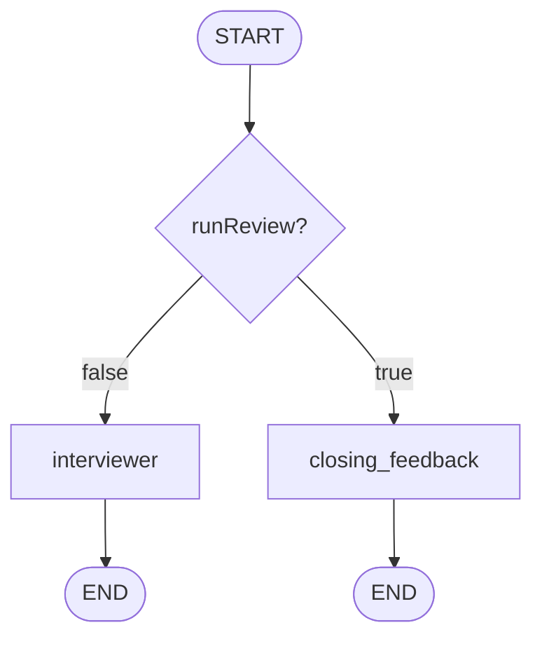
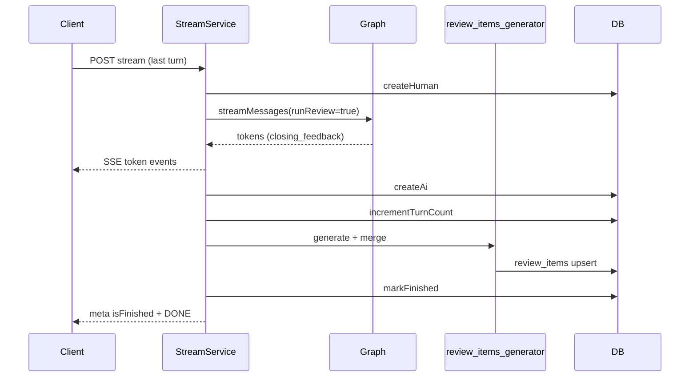

# Interview Closing Feedback — Specification

> **Superseded (graph routing):** [unified-interviewer-closing](../unified-interviewer-closing/spec.md) removes the separate `closing_feedback` LangGraph node. Closing feedback still uses `buildClosingFeedbackPrompt()` on the **final turn** inside the `interviewer` node when `runReview === true`. Requirements for closing **content**, CTA, SSE, and the post-graph review-items pipeline below remain valid unless noted otherwise in the unified spec.

## Problem Statement

On the last user turn of a mock interview, candidates only receive the same “interviewer question” behavior as earlier turns. There is no dedicated closing message with general performance feedback or guidance to open the review-items area. Structured review topics are generated after the SSE stream ends and are never reflected in the chat, which makes the end of the session feel abrupt.

This feature adds a **closing feedback** path in the LangGraph interview flow: on the final turn the graph skips the interviewer, streams a closing evaluation to the client, then ends. Structured **review items** continue to be produced **outside** the graph (renamed pipeline). Agent **tools are removed** entirely for v1.

## Goals

- [ ] On the user’s **last allowed turn**, the graph routes to a `closing_feedback` node (not `interviewer`) and streams that node’s LLM output over the existing SSE `token` events.
- [ ] Closing message includes **general interview feedback** and a **CTA** directing the user to the review-items tab (wording may be prompt-defined; must be present in normal success paths).
- [ ] Non-final turns keep the **interviewer-only** path with no tool loop.
- [ ] Final-turn criterion matches `InterviewStreamService`: `isFinalTurn = session.turnCount + 1 >= session.maxTurns`, exposed to the graph as `runReview` (or equivalent boolean).
- [ ] After the graph completes on the final turn, **`review_items_generator`** (renamed from `review_generator`) runs as today: generate structured items → merge into `review_items` → `markFinished`.
- [ ] Finished sessions reject new stream requests (`ConflictError`); chat is logically locked from the product perspective once `meta.isFinished` is true.

## Out of Scope

| Item | Reason |
|------|--------|
| Frontend UI / review-items tab implementation | Backend-only; CTA is text in the closing message |
| `GET /api/.../review-items` (or similar) | Not part of this feature; consumers may add separately |
| Streaming structured review items over SSE | Items stay in DB; tab loads via future/existing fetch |
| Re-introducing LangGraph tools | Explicitly removed for v1 |
| Two AI messages on final turn (interviewer + closing) | User decision: skip interviewer on last turn |
| Changing `max_turns` per level | Unchanged (`entry` 5, `mid` 7, `senior` 8) |
| PostgreSQL RLS | Application-level `userId` scoping unchanged |

---

## Relationship to Existing Feature

Builds on [AI Mock Interview](../ai-mock-interview/spec.md) (`AMI-*`). Does not replace that spec; narrows graph behavior, adds closing node, renames review pipeline, removes tools.

**Brownfield touchpoints:**

| Area | Current state | Change |
|------|---------------|--------|
| Graph | `START → interviewer ⇄ tool_executor → END` | `START → (interviewer \| closing_feedback) → END`; no `tool_executor` |
| `runReview` | Passed in state; unused by nodes | Drives routing on final turn |
| SSE | All `AIMessage` chunks from stream | Emit tokens only from `interviewer` and `closing_feedback` nodes |
| Review pipeline | `IReviewGenerator` / `review-generator-*` | Rename to `review_items_generator` / `review-items-generator-*` |
| Interviewer | `bindTools([list_review_items])` | Plain chat model, no tools |

---

## Architecture Overview

### Graph routing (final vs non-final)

Criterion (canonical, shared with service):

```ts
const isFinalTurn = session.turnCount + 1 >= session.maxTurns;
// Passed to graph input as runReview: isFinalTurn
```



- **Non-final turn:** human message persisted → graph `interviewer` → stream tokens → save AI message → increment `turnCount`.
- **Final turn:** human message persisted → graph `closing_feedback` only → stream tokens → save AI message → increment → `review_items_generator` + merge → `markFinished` → SSE `meta` with `isFinished: true`.

### Post-graph pipeline (unchanged placement, renamed types)



---

## User Stories

### P1: Closing feedback on last turn ⭐ MVP

**User Story**: As a candidate finishing a mock interview, I want a final chat message with overall feedback and a pointer to review items, so that I understand how the session went and where to see topics to study.

**Why P1**: Core product behavior for session closure.

**Acceptance Criteria**:

1. WHEN the user sends a message on the last allowed turn (`turnCount + 1 >= maxTurns`) THEN the graph SHALL route to `closing_feedback` and SHALL NOT invoke `interviewer` on that turn.
2. WHEN `closing_feedback` runs THEN the system SHALL stream LLM text to the client via existing SSE `event: token` frames.
3. WHEN `closing_feedback` completes successfully THEN the persisted AI message SHALL contain general interview feedback and SHALL include a clear CTA to access review items (e.g. tab/section wording defined in the closing prompt).
4. WHEN the closing stream completes THEN `InterviewStreamService` SHALL run `review_items_generator`, merge items, and set `isFinished` on the session before emitting final `meta`.
5. WHEN `meta.isFinished` is `true` THEN a subsequent `POST .../stream` for that session SHALL return `409 Conflict` (existing behavior).

**Independent Test**: Create a session at `maxTurns - 1` completed turns; send one more message; observe SSE tokens only from closing (no new interviewer question), then `meta.isFinished: true`; verify `review_items` rows created and no further stream accepted.

---

### P1: Interviewer on non-final turns ⭐ MVP

**User Story**: As a candidate mid-interview, I want the Tech Lead to ask questions normally until the last turn, so that the mock interview flow is unchanged for early turns.

**Acceptance Criteria**:

1. WHEN `turnCount + 1 < maxTurns` THEN the graph SHALL route to `interviewer` only and SHALL NOT route to `closing_feedback`.
2. WHEN `interviewer` runs THEN the system SHALL stream LLM tokens via SSE `event: token`.
3. WHEN `interviewer` completes THEN the system SHALL NOT run `review_items_generator` or `markFinished` on that turn.

**Independent Test**: First turn of a new session returns interviewer content; `meta.isFinished` is false; `review_items` count unchanged for that session.

---

### P1: SSE streams only interviewer and closing_feedback tokens ⭐ MVP

**User Story**: As a frontend consumer, I want SSE tokens to reflect only user-visible LLM output from interview nodes, so that internal graph noise does not appear in the chat.

**Acceptance Criteria**:

1. WHEN the graph streams with `streamMode: "messages"` THEN the adapter SHALL emit content only for chunks originating from nodes named `interviewer` or `closing_feedback`.
2. WHEN a chunk originates from any other node (if present in future) THEN the adapter SHALL NOT emit SSE tokens for that chunk.
3. WHEN either allowed node streams partial content THEN tokens SHALL be forwarded incrementally (same UX as today).

**Independent Test**: Unit test on stream adapter with mocked chunks tagged per node; assert only allowed nodes produce yielded tokens.

---

### P1: Remove agent tools ⭐ MVP

**User Story**: As a maintainer, I want the interview agent to run without tools in v1, so that the graph stays simple and predictable.

**Acceptance Criteria**:

1. WHEN the interview graph is compiled THEN it SHALL NOT include `tool_executor` or any tool-binding on `interviewer`.
2. WHEN `closing_feedback` runs THEN it SHALL NOT bind or invoke tools.
3. WHEN the codebase is updated THEN files used only for `list_review_items` and tool execution SHALL be removed or left unused with no graph references (prefer removal).
4. WHEN interviewer system prompt is built THEN it SHALL NOT instruct the model to call `list_review_items` or create review items.

**Independent Test**: Graph compilation test asserts node set `{ interviewer, closing_feedback }` and edges match routing diagram; no tool calls in integration tests.

---

### P2: Rename review_generator → review_items_generator

**User Story**: As a developer, I want names to reflect that the pipeline generates structured review **items**, not the closing chat feedback, so that the codebase is easier to navigate.

**Acceptance Criteria**:

1. WHEN referring to the structured-output pipeline THEN public names SHALL use `review_items_generator` (e.g. `IReviewItemsGenerator`, `ReviewItemsGeneratorAdapter`, `createReviewItemsGeneratorNode`, `buildReviewItemsGeneratorPrompt`).
2. WHEN `InterviewStreamService` depends on the pipeline THEN constructor parameter and factory wiring SHALL use the new names.
3. WHEN tests and exports under `@/modules/interview` are updated THEN old `review-generator` paths SHALL not remain as primary API (file renames acceptable).

**Independent Test**: `grep` for `ReviewGenerator` / `review-generator` in `src/` returns no production references (tests may use aliases only during migration if split PR).

---

## Functional Requirements (traceable)

### Graph & routing

| ID | Story | Requirement |
|----|-------|-------------|
| ICF-01 | P1 closing | Graph SHALL expose nodes `interviewer` and `closing_feedback`. |
| ICF-02 | P1 closing | Conditional entry from `START` SHALL use `runReview === true` → `closing_feedback`, else → `interviewer`. |
| ICF-03 | P1 closing | `runReview` SHALL be set in `InterviewStreamService` as `session.turnCount + 1 >= session.maxTurns`. |
| ICF-04 | P1 closing | `closing_feedback` SHALL have a single edge to `END` (no loops). |
| ICF-05 | P1 interviewer | `interviewer` SHALL have a single edge to `END` (no `tool_executor`). |

### Closing feedback content

| ID | Story | Requirement |
|----|-------|-------------|
| ICF-06 | P1 closing | Closing prompt SHALL instruct: no new interview questions; general feedback; encourage visiting review-items tab. |
| ICF-07 | P1 closing | Closing node SHALL use conversation history from checkpoint (`messages` state) plus résumé/level context comparable to interviewer. |
| ICF-08 | P1 closing | Closing output SHALL be a Markdown string (CommonMark: paragraph + `##` sections + `-` lists; not structured JSON) suitable for `interview_messages.content`. |

### Streaming

| ID | Story | Requirement |
|----|-------|-------------|
| ICF-09 | P1 SSE | `buildInterviewGraph().streamMessages` SHALL filter streamed messages to nodes `interviewer` and `closing_feedback` only. |
| ICF-10 | P1 SSE | Filter SHOULD use LangGraph stream metadata (e.g. `langgraph_node` / tuple tags from `streamMode: "messages"`) rather than heuristics on content alone. |

### Stream service & persistence

| ID | Story | Requirement |
|----|-------|-------------|
| ICF-11 | P1 closing | Order on final turn SHALL remain: `createHuman` → graph stream → `createAi` → `incrementTurnCount` → `review_items_generator.generate` → `upsertItems` → `markFinished` → `meta` + `DONE`. |
| ICF-12 | P1 closing | If `review_items_generator` fails after closing tokens were sent, SSE SHALL emit `error` + `DONE` (existing pattern); session finish policy MUST be defined in design (recommend: do not mark finished if items failed, or mark finished with partial data—default **do not mark finished** so user can retry). |
| ICF-13 | P1 | `isFinished` in graph input on final turn MAY remain `false` until service marks finished post-items (unchanged semantics). |

### Review items pipeline (rename, out of graph)

| ID | Story | Requirement |
|----|-------|-------------|
| ICF-14 | P2 | Structured item generation SHALL stay outside LangGraph in `InterviewStreamService` final-turn block. |
| ICF-15 | P2 | Rename all `review_generator` identifiers to `review_items_generator` per P2 story. |
| ICF-16 | P1 closing | Merge behavior (`ReviewMergeService`, `userId` + `topic` unique) SHALL NOT change. |

### Tools removal

| ID | Story | Requirement |
|----|-------|-------------|
| ICF-17 | P1 tools | Remove `tool_executor` node and `ReviewRepository` dependency from graph build (repository remains for items generator adapter). |
| ICF-18 | P1 tools | Remove `list_review_items` tool and interviewer `bindTools`. |

---

## Edge Cases

- WHEN the client aborts SSE after partial closing tokens THEN the service SHALL stop processing; human message may exist without AI message or items (existing abort semantics).
- WHEN `turnCount + 1 > maxTurns` due to race (double submit) THEN the service SHALL reject before graph with `409` (existing guard).
- WHEN closing LLM fails THEN SSE `error` event; AI message SHOULD NOT be persisted as success; items generator SHOULD NOT run.
- WHEN closing succeeds but items generator fails THEN see ICF-12 (document chosen policy in `design.md` during implementation).
- WHEN session has `maxTurns === 1` THEN first user message is final turn → only `closing_feedback` (no interviewer ever for that session after first human message—interviewer never runs if only one turn total; product accepts this).

---

## Non-Functional Notes

- **Latency:** Final turn = closing LLM stream + items LLM call (sequential). Acceptable; UI may show loading on review tab.
- **Checkpointer:** `thread_id = session_id` unchanged; `closing_feedback` messages append to same thread.
- **Tests:** Update `build-interview-graph.test.ts`, `stream-service.test.ts`, new `closing-feedback-node.test.ts`, stream filter tests; remove tool executor tests or delete files.

---

## Requirement Traceability

| Requirement ID | Story | Phase | Status |
|----------------|-------|-------|--------|
| ICF-01 | P1 closing | Design | Pending |
| ICF-02 | P1 closing | Design | Pending |
| ICF-03 | P1 closing | Design | Pending |
| ICF-04 | P1 closing | Design | Pending |
| ICF-05 | P1 interviewer | Design | Pending |
| ICF-06 | P1 closing | Design | Pending |
| ICF-07 | P1 closing | Design | Pending |
| ICF-08 | P1 closing | Design | Pending |
| ICF-09 | P1 SSE | Design | Pending |
| ICF-10 | P1 SSE | Design | Pending |
| ICF-11 | P1 closing | Tasks | Pending |
| ICF-12 | P1 closing | Tasks | Pending |
| ICF-13 | P1 | Tasks | Pending |
| ICF-14 | P2 | Tasks | Pending |
| ICF-15 | P2 | Tasks | Pending |
| ICF-16 | P1 closing | Tasks | Pending |
| ICF-17 | P1 tools | Tasks | Pending |
| ICF-18 | P1 tools | Tasks | Pending |

**Coverage:** 18 total, 0 mapped to tasks, 18 unmapped (expected until Design/Tasks phases).

---

## Success Criteria

- [ ] Last user turn produces a closing feedback message in chat (SSE + DB) without a new interviewer question.
- [ ] Closing message includes review-tab CTA in successful runs (verified via prompt test or snapshot).
- [ ] Review items still created in `review_items` after final turn; session marked finished.
- [ ] Graph has no tool nodes; interviewer uses chat-only model.
- [ ] Production code uses `review_items_generator` naming consistently.
- [ ] All existing interview stream tests updated and passing.

---

## Open Decisions (for Design phase)

| ID | Question | Recommendation |
|----|----------|----------------|
| ICF-DEC-01 | If items generator fails after closing streamed, mark session finished? | **No** — leave `isFinished` false; return error; allow retry policy in follow-up |
| ICF-DEC-02 | Exact CTA copy / i18n | Portuguese product copy in prompt constant; no i18n framework in v1 |
| ICF-DEC-03 | Rename `runReview` → `isFinalTurn` in graph state | Optional clarity rename; keep `runReview` if minimizing diff |

---

## Next Steps (TLC workflow)

1. **Review this spec** — confirm CTA wording expectations and ICF-DEC-01.
2. **Design** (`design.md`) — node signatures, prompt files, stream filter implementation, file rename map, test plan.
3. **Tasks** (`tasks.md`) — atomic implementation tasks with gates.
4. **Execute** — implement per tasks with requirement traceability updates.
