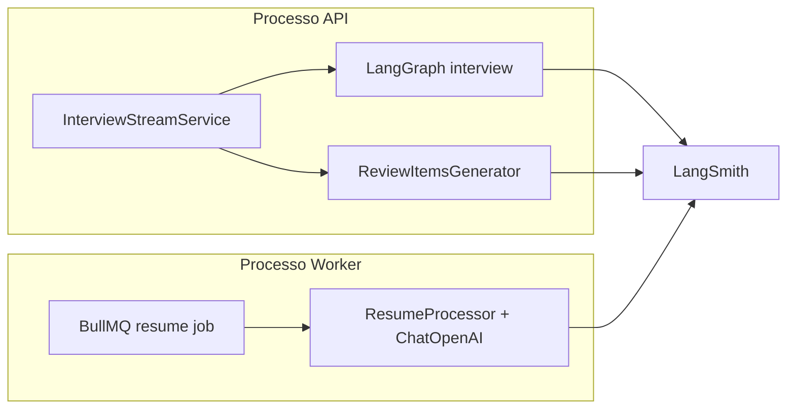

# LangSmith LLM Tracing Specification

## Problem Statement

O backend usa LangChain/LangGraph (`ChatOpenAI`, grafos de entrevista, extração de currículo) em **dois processos** (API Express e worker BullMQ), mas não há observabilidade centralizada das chamadas LLM. Sem tracing, é difícil depurar prompts, latência, custo, falhas de structured output e regressões entre ambientes.

## Goals

- [ ] **100% das invocações LLM** do backend aparecem no LangSmith quando o tracing estiver habilitado (entrevista, feedback final, review items, extração de currículo).
- [ ] Configuração via variáveis de ambiente validadas (sem hardcode de secrets), alinhada ao padrão `@t3-oss/env-core` existente.
- [ ] Tracing **desligado por padrão em testes** (`NODE_ENV=test`) para evitar ruído, custo e dependência de rede externa na CI.
- [ ] Runs agrupáveis por **sessão de entrevista** (`thread_id` / `sessionId`) e identificáveis por **tipo de fluxo** (interview vs resume-extraction).

## Out of Scope

| Feature | Reason |
| ------- | ------ |
| Dashboards/alertas customizados no LangSmith | Operação da plataforma; fora do escopo de código |
| Avaliação automatizada de prompts (datasets, evaluators) | Feature separada de observabilidade |
| Redação/mascaramento avançado de PII no LangSmith | Pode ser P2; MVP usa tracing nativo do LangChain |
| Substituir logs estruturados (`logger`) | LangSmith complementa, não substitui |
| Tracing de serviços não-LLM (SMTP, S3, Prisma) | Fora do escopo desta feature |
| Self-hosted LangSmith | Assumir cloud `api.smith.langchain.com` (EU configurável) |

---

## Contexto técnico (brownfield)

### Pontos de chamada LLM hoje

| Fluxo | Arquivo | Modelo | Processo |
| ----- | ------- | ------ | -------- |
| Entrevista (turno) | `interviewer-node.ts` | `OPENAI_MODEL_INTERVIEW` | API (`dev`) |
| Feedback de encerramento | `closing-feedback-node.ts` | `OPENAI_MODEL_INTERVIEW` | API |
| Review items pós-entrevista | `review-items-generator-node.ts` | `OPENAI_MODEL_REVIEW` | API |
| Extração estruturada de currículo | `resume-processor.ts` | `OPENAI_MODEL_EXTRACTION` | Worker (`dev:worker`) |

### Infraestrutura existente

- Modelos centralizados em `src/infrastructure/ai/openai-models.ts`.
- Grafo LangGraph em `build-interview-graph.ts` com `thread_id: sessionId` em `configurable`.
- `langsmith` já é dependência transitiva de `@langchain/core` (lockfile `langsmith@0.7.x`); não está declarado explicitamente em `package.json`.
- Nenhuma variável LangSmith em `server-schema.ts` ou `.env.example`.

### Abordagem esperada (referência docs LangSmith 2025)

Habilitar tracing via env (oficial):

- `LANGSMITH_TRACING=true`
- `LANGSMITH_API_KEY=<key>`
- `LANGSMITH_PROJECT=<nome>` (opcional; default `default`)
- `LANGSMITH_ENDPOINT` (opcional; ex. região EU)

LangChain JS propaga traces automaticamente para `ChatOpenAI.invoke`, `withStructuredOutput`, e execuções LangGraph quando o tracing está ativo.

---

## User Stories

### P1: Habilitar tracing global de LLM ⭐ MVP

**User Story**: Como desenvolvedor/tech lead, quero que todas as chamadas LangChain/OpenAI do backend sejam rastreadas no LangSmith quando configurado, para depurar prompts e falhas em produção e desenvolvimento.

**Why P1**: Entrega o valor central sem refatorar lógica de negócio.

**Acceptance Criteria**:

1. WHEN `LANGSMITH_TRACING=true` e `LANGSMITH_API_KEY` estão definidos no startup da API THEN o sistema SHALL enviar traces de `interviewer-node`, `closing-feedback-node` e `review-items-generator-node` ao LangSmith.
2. WHEN `LANGSMITH_TRACING=true` e `LANGSMITH_API_KEY` estão definidos no startup do worker THEN o sistema SHALL enviar traces de `ResumeProcessor` (structured output) ao LangSmith.
3. WHEN `LANGSMITH_TRACING` é `false`, ausente, ou `NODE_ENV=test` THEN o sistema SHALL NOT enviar traces ao LangSmith (comportamento atual preservado nos testes).
4. WHEN variáveis LangSmith inválidas são fornecidas (ex.: `LANGSMITH_TRACING=true` sem API key) THEN o sistema SHALL falhar no bootstrap de env com mensagem clara (validação Zod em `server-schema.ts`).
5. WHEN a aplicação inicia em `development` ou `production` com tracing habilitado THEN o bootstrap SHALL configurar `process.env` LangSmith **antes** de instanciar qualquer `ChatOpenAI` ou compilar o grafo.

**Independent Test**: Subir API + worker com credenciais LangSmith de dev; disparar um turno de entrevista e processar um PDF; confirmar 2+ runs no projeto LangSmith configurado.

---

### P2: Metadados para filtrar e correlacionar runs

**User Story**: Como desenvolvedor, quero filtrar traces por usuário, sessão e tipo de job para encontrar rapidamente uma entrevista ou um processamento de currículo específico.

**Why P2**: Auto-tracing sozinho gera muitos runs genéricos; metadados aumentam muito o valor operacional.

**Acceptance Criteria**:

1. WHEN uma entrevista é executada via LangGraph THEN cada run SHALL incluir metadata/tag com `sessionId` (equivalente ao `thread_id` já usado em `createInterviewGraphConfig`).
2. WHEN `userId` está disponível no estado do grafo THEN o run SHALL incluir metadata `userId`.
3. WHEN um currículo é processado no worker THEN o run SHALL incluir metadata `resumeId` e tag `resume-extraction`.
4. WHEN review items são gerados THEN o run SHALL incluir tag `review-items` e metadata `sessionId` quando aplicável.

**Independent Test**: Buscar no LangSmith UI por tag `resume-extraction` ou metadata `sessionId` após um fluxo completo.

---

### P3: Documentação e DX de ambiente

**User Story**: Como novo dev no time, quero `.env.example` e instruções claras para ativar LangSmith localmente sem adivinhar variáveis.

**Why P3**: Reduz fricção de onboarding; não bloqueia MVP funcional.

**Acceptance Criteria**:

1. WHEN um dev copia `.env.example` THEN o arquivo SHALL listar todas as variáveis LangSmith com comentários (obrigatórias vs opcionais).
2. WHEN tracing não é desejado localmente THEN o dev SHALL poder omitir `LANGSMITH_API_KEY` e manter `LANGSMITH_TRACING=false` (default).
3. WHEN `vitest` roda THEN `vitest.setup.ts` SHALL garantir `LANGSMITH_TRACING=false` (ou ausência de key) para não vazar traces de CI.

**Independent Test**: `bun test` passa sem credenciais LangSmith; dev com `.env` preenchido vê traces após um request manual.

---

## Edge Cases

- WHEN apenas API ou apenas worker tem tracing habilitado THEN cada processo SHALL rastrear independentemente o que executar (não assumir tracing cruzado).
- WHEN LangSmith API está indisponível THEN a aplicação SHALL continuar atendendo requests (tracing é best-effort; falha de export não derruba entrevista/extração).
- WHEN `LANGSMITH_PROJECT` não está definido THEN o sistema SHALL usar o projeto `default` do LangSmith.
- WHEN API key é de organização multi-workspace THEN `LANGSMITH_WORKSPACE_ID` SHALL ser suportado como variável opcional.
- WHEN conteúdo sensível (texto de currículo, respostas de entrevista) é enviado THEN traces SHALL conter o payload completo do LangChain por padrão — time deve estar ciente; redação fica fora do MVP.

---

## Open Questions (confirmar antes do Design)

1. **Toggle**: tracing só com `LANGSMITH_TRACING=true` explícito, ou auto-ligar quando `LANGSMITH_API_KEY` existir?
   - *Recomendação spec*: explícito (`false` default) — mais previsível em dev/CI.
2. **Nome do projeto**: um único `LANGSMITH_PROJECT` por ambiente (ex. `hackathon-dev`, `hackathon-prod`) ou derivar de `NODE_ENV`?
   - *Recomendação*: variável explícita; default `backend-{NODE_ENV}`.
3. **P2 no MVP?**: incluir metadados/tags já na primeira entrega ou em PR separado?
   - *Recomendação*: P1 primeiro; P2 na sequência se prazo apertado.

---

## Requirement Traceability

| Requirement ID | Story | Phase | Status |
| -------------- | ----- | ----- | ------ |
| LS-01 | P1: tracing API (grafo + review) | Execute | Verified |
| LS-02 | P1: tracing worker (resume) | Execute | Verified |
| LS-03 | P1: env schema + bootstrap ordem | Execute | Verified |
| LS-04 | P1: desligar em test | Execute | Verified |
| LS-05 | P2: metadata sessionId/userId | Execute | Verified |
| LS-06 | P2: metadata resumeId + tags | Execute | Verified |
| LS-07 | P3: .env.example + vitest | Execute | Verified |

**Coverage**: 7 total, 0 mapped to tasks, 7 unmapped

---

## Success Criteria

- [ ] Após um turno de entrevista + processamento de currículo em dev, runs visíveis no LangSmith com hierarquia pai/filho (grafo → nodes → LLM).
- [ ] Suite `bun test` verde sem `LANGSMITH_API_KEY` configurada.
- [ ] Nenhum secret LangSmith commitado; apenas `.env.example` com placeholders.
- [ ] Dois processos (`dev` e `dev:worker`) documentados como necessitando as mesmas env vars de tracing.

---

## Auto-sizing

| Aspecto | Classificação |
| ------- | ------------- |
| Escopo | **Medium** (~5–8 arquivos: env, bootstrap, openai-models ou callbacks, graph config, worker entry, tests, .env.example) |
| Próxima fase | **Design** recomendado (bootstrap centralizado, ordem de init, estratégia de metadata) |
| Tasks | Formal `tasks.md` se >5 passos na implementação |
