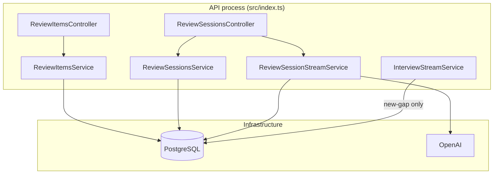
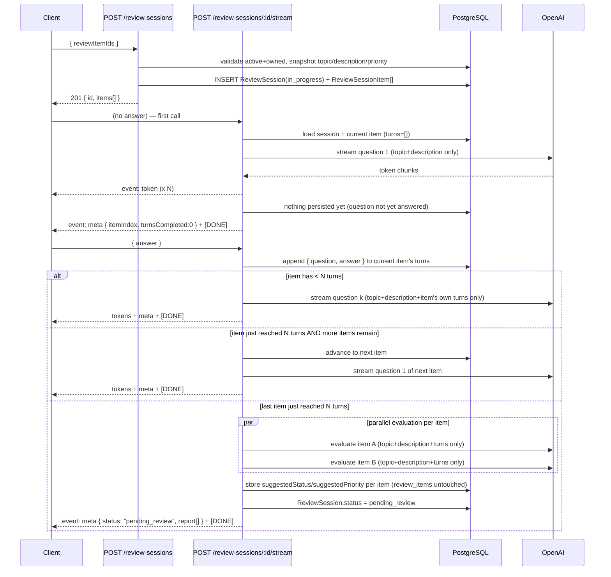
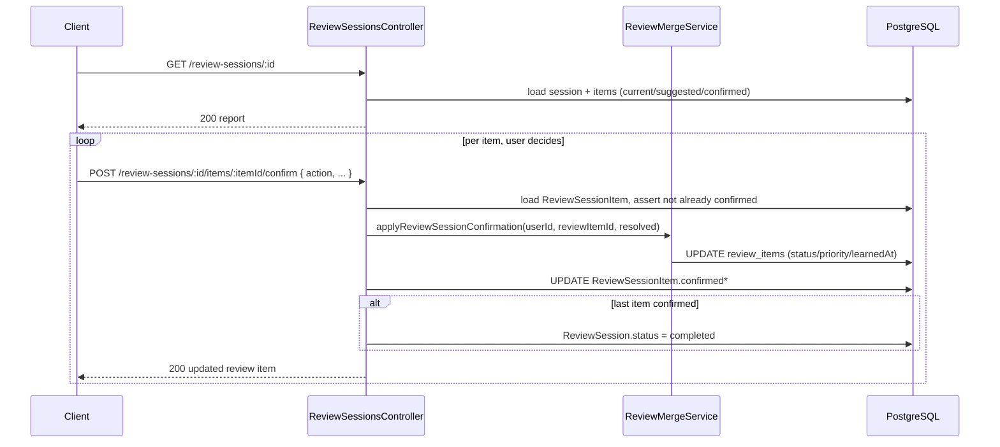

# Review Items Learned Status — Design

**Spec**: `.specs/features/review-items-learned-status/spec.md`
**Context**: `.specs/features/review-items-learned-status/context.md`
**Status**: Draft

---

## Architecture Overview

A new `review-sessions` module owns the entire Review Session lifecycle (selection → adaptive per-item Q&A over SSE → parallel suggestion evaluation → report → per-item confirmation). It reuses the existing SSE plumbing (`src/shared/utils/sse.ts`), the async-generator streaming pattern from `InterviewStreamService`, the AI rate limiter, token usage tracking, and the existing `ReviewRepository`/`ReviewMergeService` foundations — but everything is new code, not a fork of the interview module.

`InterviewStreamService` (existing) is trimmed: its final-turn block stops calling the "reassess everything" merge path and instead only inserts genuinely new topics, never touching existing `review_items` rows. `ReviewMergeService` gains a second, narrower method for that purpose; its original `upsertItems` bump/max logic is repurposed to compute **suggestions** inside Review Sessions instead of being applied automatically.



### Request flows

**Create + answer a Review Session (SSE)**



**Report + confirmation**



---

## Design Decisions

| ID | Decision | Choice | Rationale |
|----|----------|--------|-----------|
| RIL-DES-01 | New module boundary | `src/modules/review-sessions/` (separate from `review-items` and `interview`) | Route auto-discovery mounts by folder name (`src/config/routes.ts`) → `/api/review-sessions`; keeps the session/stream/confirm lifecycle isolated from the simple CRUD in `review-items` |
| RIL-DES-02 | Question generation mechanism | Plain `ChatOpenAI.stream()` call per question (no LangGraph `StateGraph`) | Review Sessions have no multi-node orchestration need (no tools, no branching graph); a single streamed call per turn is simpler and mirrors only the token-streaming *pattern* from `build-interview-graph.ts`, not its graph machinery |
| RIL-DES-03 | Evaluation mechanism | `ChatOpenAI.withStructuredOutput(reviewSessionEvaluationOutputSchema)`, one call per item, `Promise.all` | Matches existing `review-items-generator-node.ts` structured-output pattern; independent parallel calls need no shared state |
| RIL-DES-04 | Answer submission shape | Single reused endpoint `POST /review-sessions/:id/stream` with optional body `{ answer? }` — omitted/empty on the very first call, required on every subsequent call | Mirrors `ai-mock-interview`'s `POST .../stream` (`{ content }` each turn); avoids a second endpoint just for "submit answer" |
| RIL-DES-05 | `InterviewStreamService` final-turn behavior | Replace `reviewMergeService.upsertItems(...)` call with a new `reviewMergeService.insertNewTopicsOnly(...)` — inserts topics with no existing/similar match as `active`; **skips** (no-op) any topic that already matches an existing row, active or learned | Satisfies RIL-14/15 (normal interviews never mutate existing review items) with the smallest possible change; new-gap discovery behavior is otherwise unchanged in scope/timing |
| RIL-DES-06 | `ReviewMergeService.upsertItems` (bump/max logic) | **Kept**, but only called from the new evaluation node's post-processing to derive a *suggestion* — never called with intent to persist directly | Reuses the existing, already-tested bump/max/never-decrease-by-default logic as the algorithm for "what would the merge be" without persisting it |
| RIL-DES-07 | `ReviewSessionItem.turns` storage | `Json` column (`[{ question, answer }]`), not a child table | Bounded to `N` (default 3) entries; no querying needed across turns; simplest schema, matches spec's "Design-phase decision: JSON vs child table" |
| RIL-DES-08 | Question count `N` | New env var `REVIEW_SESSION_QUESTION_COUNT`, default `3` | Per `RIL-DEC-08`; follows existing `server-schema.ts` pattern (`z.coerce.number().default(3)`) |
| RIL-DES-09 | Confirm action validation | `z.discriminatedUnion("action", [...])` in Zod | Cleanly expresses "accept" (no extra fields) vs "override active" (needs `priority`) vs "override learned" (no `priority`) — matches existing codebase's Zod-first validation style |
| RIL-DES-10 | Manual `PATCH /api/review-items/:id` | Added to the **existing** `review-items` module (not `review-sessions`) | It's a manual override on a review item itself, independent of any session — belongs with the existing `GET`/`DELETE` for that resource |
| RIL-DES-11 | Ownership/ ownership errors | `404 NotFoundError` for any cross-user or invalid-ID access (session, item, review item) | Matches existing anti-enumeration convention (`review-items`, `interview` modules both use 404, never 403) |
| RIL-DES-12 | AI rate limiting on Review Session stream | Reuse `makeAiRateLimiter()` middleware on `POST /review-sessions/:id/stream` | Same as `POST /interview/sessions/:sessionId/stream`; both are AI-call-triggering endpoints |
| RIL-DES-13 | Model selection | Reuse `OPENAI_MODEL_REVIEW` (via `createReviewModel()`) for both question generation and evaluation | Both are lightweight, structured/short-form tasks; no need for a new model tier in v1 |

---

## Code Reuse Analysis

### Existing components to leverage

| Component | Location | How to use |
|-----------|----------|------------|
| SSE helpers | `src/shared/utils/sse.ts` | `writeEvent`/`writeDone` reused verbatim in `ReviewSessionStreamService` |
| SSE loop shape + abort handling | `src/modules/interview/service/stream-service.ts` | Template for `ReviewSessionStreamService.streamTurn` (headers, `res.on("close")`, async-generator loop) |
| `ReviewRepository` | `src/modules/interview/repository/review-repository.ts` | Add methods (`findActiveByIdsAndUserId`, `updateStatus`); reused by both `review-items` and the new merge logic |
| `ReviewMergeService` | `src/modules/interview/service/review-merge-service.ts` | Extended with `insertNewTopicsOnly` and `applyReviewSessionConfirmation`; existing bump/max logic reused as the suggestion algorithm |
| `createReviewModel()` | `src/infrastructure/ai/openai-models.ts` | Reused for both question streaming and evaluation calls |
| Structured-output node pattern | `src/infrastructure/ai/langgraph/nodes/review-items-generator-node.ts` | Template for `review-session-evaluation-node.ts` (`{prompt}` template trick, `schema.parse()` re-validation) |
| `createUsageCaptureCallback` / `TokenUsageService` | `src/modules/token-usage/**` | Reused per question-stream call and per evaluation call |
| `makeAiRateLimiter()` | `src/factories/shared/ai-rate-limiter-factory.ts` | Applied to `POST /review-sessions/:id/stream` |
| `validate()` middleware | `src/shared/middlewares/validation-middleware.ts` | Body validation on `POST /review-sessions`, `POST .../stream`, `POST .../confirm`, `PATCH /review-items/:id` |
| `asyncHandler` | `src/shared` | Wraps all new controller methods |
| `HttpError` hierarchy | `src/shared/errors/http-errors.ts` | `NotFoundError` (404), `ConflictError` (409), `BadRequestError` (400) — no new error classes needed |
| Route auto-discovery | `src/config/routes.ts` | New `src/modules/review-sessions/routes/review-sessions-routes.ts` auto-mounts at `/api/review-sessions` |
| Factory (`make*`) pattern | `src/factories/interview/*`, `src/factories/review-items/*` | Mirrored for `src/factories/review-sessions/*` |

### Integration points

| System | Integration method |
|--------|---------------------|
| PostgreSQL | New Prisma models `ReviewSession`, `ReviewSessionItem`; new columns on `ReviewItem` (`status`, `learnedAt`) |
| OpenAI | `@langchain/openai` `ChatOpenAI` — `.stream()` for questions, `.withStructuredOutput()` for evaluation |
| Existing `review_items` | Read for selection/snapshot; written only via `ReviewMergeService` (either `insertNewTopicsOnly` from normal interviews, or `applyReviewSessionConfirmation` from confirm) |

---

## Module & File Layout

```
src/
├── modules/
│   ├── review-items/                          # existing — gains PATCH
│   │   ├── controller/review-items-controller.ts     # + updateStatus
│   │   ├── service/review-items-service.ts           # + updateStatus
│   │   ├── routes/review-items-routes.ts             # + PATCH /:id
│   │   └── validations/review-items-schemas.ts       # + patchReviewItemSchema, status filter
│   │
│   ├── review-sessions/                       # NEW module
│   │   ├── controller/review-sessions-controller.ts
│   │   ├── service/
│   │   │   ├── review-sessions-service.ts            # create, getById (report), confirmItem
│   │   │   └── review-session-stream-service.ts       # SSE orchestration
│   │   ├── repository/review-session-repository.ts
│   │   ├── validations/review-session-schemas.ts
│   │   ├── protocols/
│   │   │   ├── review-session-question-generator.ts   # IReviewSessionQuestionGenerator
│   │   │   └── review-session-evaluator.ts             # IReviewSessionEvaluator
│   │   ├── types/review-session-record.ts
│   │   ├── routes/review-sessions-routes.ts
│   │   └── index.ts
│   │
│   └── interview/                              # existing — trimmed
│       └── service/
│           ├── stream-service.ts                # final-turn calls insertNewTopicsOnly (RIL-DES-05)
│           └── review-merge-service.ts          # + insertNewTopicsOnly, + applyReviewSessionConfirmation
│
├── infrastructure/ai/
│   ├── openai-models.ts                        # unchanged (reuse createReviewModel)
│   └── langgraph/
│       ├── stream-message-tokens.ts             # reused pattern reference (not imported directly)
│       └── nodes/
│           ├── review-items-generator-node.ts   # unchanged
│           ├── review-session-question-node.ts  # NEW — streaming text generator
│           └── review-session-evaluation-node.ts # NEW — structured output
│
└── factories/
    ├── review-items/                            # existing — gains no new factory files
    └── review-sessions/                         # NEW
        ├── review-sessions-controller-factory.ts
        ├── review-sessions-service-factory.ts
        └── review-session-stream-service-factory.ts
```

**Route map** (auto-mounted):

| Module folder | Mount prefix | Route file paths |
|----------------|--------------|-------------------|
| `review-items` | `/api/review-items` | `GET /`, `PATCH /:id`, `DELETE /:id` |
| `review-sessions` | `/api/review-sessions` | `POST /`, `GET /:id`, `POST /:id/stream`, `POST /:id/items/:itemId/confirm` |

---

## Data Models

### Prisma enums (`prisma/schema/ai-mock-interview.prisma`)

```prisma
enum ReviewItemStatus {
  active
  learned
}

enum ReviewSessionStatus {
  in_progress
  pending_review
  completed
}
```

### `ReviewItem` — additions

```prisma
model ReviewItem {
  id          String           @id @default(uuid())
  sessionId   String           @map("session_id")
  userId      Int              @map("user_id")
  topic       String
  description String           @db.Text
  priority    ReviewPriority
  status      ReviewItemStatus @default(active)               // NEW
  learnedAt   DateTime?        @map("learned_at")              // NEW
  createdAt   DateTime         @default(now()) @map("created_at")
  updatedAt   DateTime         @updatedAt @map("updated_at")

  session      InterviewSession     @relation(fields: [sessionId], references: [id], onDelete: Cascade)
  user         User                 @relation(fields: [userId], references: [id], onDelete: Cascade)
  sessionItems ReviewSessionItem[]                               // NEW back-relation

  @@map("review_items")
  @@unique([userId, topic])
  @@index([userId])
  @@index([userId, status])                                       // NEW — GET filter perf
}
```

### `ReviewSession` (new)

```prisma
model ReviewSession {
  id          String              @id @default(uuid())
  userId      Int                 @map("user_id")
  status      ReviewSessionStatus @default(in_progress)
  createdAt   DateTime            @default(now()) @map("created_at")
  evaluatedAt DateTime?           @map("evaluated_at")
  completedAt DateTime?           @map("completed_at")

  user  User               @relation(fields: [userId], references: [id], onDelete: Cascade)
  items ReviewSessionItem[]

  @@map("review_sessions")
  @@index([userId])
}
```

### `ReviewSessionItem` (new)

```prisma
model ReviewSessionItem {
  id                String            @id @default(uuid())
  reviewSessionId   String            @map("review_session_id")
  reviewItemId      String            @map("review_item_id")
  topic             String                                           // snapshot
  description       String            @db.Text                       // snapshot
  currentPriority   ReviewPriority    @map("current_priority")       // snapshot
  turns             Json              @default("[]")                 // [{ question, answer }], bounded to N
  order             Int                                              // position within the session (RIL-DES for deterministic sequencing)
  suggestedStatus   ReviewItemStatus? @map("suggested_status")
  suggestedPriority ReviewPriority?   @map("suggested_priority")
  confirmedStatus   ReviewItemStatus? @map("confirmed_status")
  confirmedPriority ReviewPriority?   @map("confirmed_priority")
  confirmedAt       DateTime?         @map("confirmed_at")
  createdAt         DateTime          @default(now()) @map("created_at")

  reviewSession ReviewSession @relation(fields: [reviewSessionId], references: [id], onDelete: Cascade)
  reviewItem    ReviewItem    @relation(fields: [reviewItemId], references: [id], onDelete: Cascade)

  @@map("review_session_items")
  @@unique([reviewSessionId, reviewItemId])
  @@index([reviewSessionId])
}
```

### `User` model extension

```prisma
reviewSessions ReviewSession[]
```

### Migration

New migration folder: `prisma/migrations/{timestamp}_add_review_learned_status_and_sessions/migration.sql` — adds both enums, the two `ReviewItem` columns + index, and the two new tables. Existing `review_items` rows backfill `status = 'active'`, `learned_at = NULL` (Prisma default handles this on `ALTER TABLE ... ADD COLUMN ... DEFAULT 'active'`).

### Zod schemas (`src/modules/review-sessions/validations/review-session-schemas.ts`)

```typescript
import { reviewPrioritySchema } from "@/modules/interview/validations/interview-schemas";
import { z } from "zod";

export const reviewItemStatusSchema = z.enum(["active", "learned"]);
export const reviewSessionStatusSchema = z.enum([
  "in_progress",
  "pending_review",
  "completed",
]);

export const createReviewSessionSchema = z.object({
  reviewItemIds: z
    .array(z.uuid())
    .min(1, "Select at least one review item")
    .max(10, "Select at most 10 review items per session")
    .refine((ids) => new Set(ids).size === ids.length, "Duplicate item IDs"),
});

export const reviewSessionStreamBodySchema = z.object({
  answer: z.string().trim().min(1).max(4_000).optional(),
});

export const confirmReviewSessionItemSchema = z.discriminatedUnion("action", [
  z.object({ action: z.literal("accept") }),
  z.object({
    action: z.literal("override"),
    status: z.literal("active"),
    priority: reviewPrioritySchema,
  }),
  z.object({
    action: z.literal("override"),
    status: z.literal("learned"),
  }),
]);

// LLM output — question generation is plain streamed text, no schema needed.

export const reviewSessionEvaluationOutputSchema = z.discriminatedUnion(
  "status",
  [
    z.object({ status: z.literal("learned") }),
    z.object({ status: z.literal("active"), priority: reviewPrioritySchema }),
  ],
);
```

`review-items-schemas.ts` (existing file) gains:

```typescript
export const patchReviewItemSchema = z.object({ status: reviewItemStatusSchema });

export const listReviewItemsQuerySchema = z.object({
  status: z.enum(["active", "learned", "all"]).default("active"),
});
```

---

## Components

### `ReviewSessionsController`

- **Purpose**: HTTP adapter for session creation, streaming, report, and confirmation.
- **Location**: `src/modules/review-sessions/controller/review-sessions-controller.ts`
- **Interfaces**:
  - `create(req, res)` — `POST /` → 201
  - `stream(req, res)` — `POST /:id/stream` → SSE
  - `getById(req, res)` — `GET /:id` → report
  - `confirmItem(req, res)` — `POST /:id/items/:itemId/confirm` → 200
- **Dependencies**: `ReviewSessionsService`, `ReviewSessionStreamService`
- **Reuses**: `asyncHandler` + try/catch delegation pattern from `InterviewController`

### `ReviewSessionsService`

- **Purpose**: Non-streaming business logic — selection validation, report assembly, confirmation.
- **Location**: `src/modules/review-sessions/service/review-sessions-service.ts`
- **Interfaces**:
  - `create(userId, reviewItemIds: string[]): Promise<ReviewSessionSummary>`
  - `getById(userId, sessionId): Promise<ReviewSessionReport>`
  - `confirmItem(userId, sessionId, itemId, action): Promise<ReviewItemResponse>`
- **`create` flow**: `ReviewRepository.findActiveByIdsAndUserId(userId, ids)` → if `matches.length !== ids.length` throw `NotFoundError` → `ReviewSessionRepository.create(userId, matches)` (snapshots `topic`/`description`/`priority` per item, `order` = input array index)
- **`confirmItem` flow**:
  1. Load `ReviewSessionItem` by `(sessionId, itemId)` scoped to `userId` via session join → 404 if missing.
  2. 409 if `confirmedStatus` already set.
  3. 400 if `action = "accept"` but `suggestedStatus` is `null` (failed evaluation — nothing to accept).
  4. Resolve `{ status, priority }`: `accept` → use `suggested*`; `override` → use body values.
  5. Call `ReviewMergeService.applyReviewSessionConfirmation(userId, reviewItemId, resolved)`.
  6. Persist `confirmedStatus`/`confirmedPriority`/`confirmedAt` on the `ReviewSessionItem`.
  7. If this was the last unconfirmed item in the session → `ReviewSessionRepository.markCompleted(sessionId)`.
- **Dependencies**: `ReviewRepository`, `ReviewSessionRepository`, `ReviewMergeService`
- **Reuses**: `NotFoundError`/`ConflictError`/`BadRequestError`; response-shaping pattern from `ReviewItemsService.toResponse`

### `ReviewSessionStreamService`

- **Purpose**: SSE orchestration for the adaptive Q&A loop and triggering parallel evaluation on completion.
- **Location**: `src/modules/review-sessions/service/review-session-stream-service.ts`
- **Interfaces**:
  - `streamTurn(userId, sessionId, answer: string | undefined, res: Response): Promise<void>`
- **Preconditions** (throw before SSE headers): session exists + owned; `status !== "completed"` and `status !== "pending_review"` (409 if so — client should call `GET`/`confirm` instead once past `in_progress`).
- **Flow**:
  1. Load session + ordered items (`order asc`) + current item = first item where `turns.length < N`.
  2. If `answer` is provided: validate current item exists and has `turns.length < N`; append `{ question: <last generated question>, answer }` to that item's `turns` (the last generated question is cached in-memory for the duration of the request — see RIL-DES note below — or re-derived by regenerating deterministically... **resolved**: store the just-emitted question in a transient DB column `pendingQuestion` on `ReviewSessionItem`, cleared once the answer is appended as a full turn).
  3. Determine next state:
     - Current item still has `turns.length < N` → generate next question for **that** item (`topic + description + turns 1..k-1`), stream tokens, persist to `pendingQuestion`, emit `meta` with progress, `[DONE]`.
     - Current item just reached `N` and more items remain → move to next item, generate its question 1, stream, emit `meta`, `[DONE]`.
     - Current item just reached `N` and it was the **last** item → run parallel evaluation (see below), persist suggestions, set session `pending_review`, emit final `meta` with `status: "pending_review"` + report array, `[DONE]`.
  4. If `answer` is omitted (very first call): generate question 1 for the first item, stream, persist `pendingQuestion`, emit `meta`, `[DONE]`.
- **Evaluation sub-step**: `Promise.all(items.map(item => evaluator.evaluate({ topic, description, currentPriority, turns: item.turns })))`; failures are caught per-item (`Promise.allSettled` in practice) so one failing item doesn't block others — failed items keep `suggestedStatus = null` and an `error` SSE event is emitted referencing that item's `id`.
- **Dependencies**: `ReviewSessionRepository`, `IReviewSessionQuestionGenerator`, `IReviewSessionEvaluator`, `ReviewMergeService` (not called here — evaluation only *suggests*), `TokenUsageService`
- **Reuses**: `writeEvent`/`writeDone`, SSE header block, abort-on-`close` handling — copied structure from `InterviewStreamService`

> **Note on `pendingQuestion`**: added as a `String?` column on `ReviewSessionItem` to avoid relying on in-memory state across HTTP requests (the API process may not be the same for two sequential calls in a scaled deployment). This is the one schema addition beyond what the spec anticipated — flagged here rather than silently added.

### `IReviewSessionQuestionGenerator` (protocol) + `review-session-question-node.ts`

- **Purpose**: Stream a single question's text given topic/description and prior turns for that item only.
- **Location**: protocol at `src/modules/review-sessions/protocols/review-session-question-generator.ts`; implementation at `src/infrastructure/ai/langgraph/nodes/review-session-question-node.ts`
- **Interface**:
  ```typescript
  interface IReviewSessionQuestionGenerator {
    streamQuestion(
      input: { topic: string; description: string; turns: { question: string; answer: string }[] },
      options?: { callbacks?: BaseCallbackHandler[] },
    ): AsyncGenerator<{ content: string }, { content: string; usage?: LlmUsage }>;
  }
  ```
- **Implementation**: `createReviewModel().stream(promptMessages)` where `promptMessages` is built from a small prompt template (`review-session-question-prompt.ts`): persona ("you are probing a candidate's understanding of exactly one topic") + topic + description + prior turns (if any) + instruction to ask exactly one focused question, no preamble.
- **Reuses**: `createReviewModel()`; token-forwarding loop pattern (not the LangGraph message-tuple parsing in `stream-message-tokens.ts`, since there's no graph — this iterates `ChatOpenAI.stream()` chunks directly and reads `.content`)

### `IReviewSessionEvaluator` (protocol) + `review-session-evaluation-node.ts`

- **Purpose**: Structured-output suggestion for one item.
- **Location**: protocol at `src/modules/review-sessions/protocols/review-session-evaluator.ts`; implementation at `src/infrastructure/ai/langgraph/nodes/review-session-evaluation-node.ts`
- **Interface**:
  ```typescript
  interface IReviewSessionEvaluator {
    evaluate(
      input: { topic: string; description: string; currentPriority: ReviewPriority; turns: { question: string; answer: string }[] },
      options?: { callbacks?: BaseCallbackHandler[] },
    ): Promise<{ status: "active" | "learned"; priority?: ReviewPriority }>;
  }
  ```
- **Implementation**: mirrors `review-items-generator-node.ts` — `createReviewModel().withStructuredOutput(reviewSessionEvaluationOutputSchema)`, `{prompt}` template trick, `schema.parse()` re-validation. Prompt (`review-session-evaluation-prompt.ts`) encodes the normative LLM instructions from spec §"LLM instructions (normative)" (mark learned only with sufficient demonstration; lower priority only with clear improvement evidence; never below `low`; bump-one-step baked in here when reinforced and no priority change signal — reusing `ReviewMergeService`'s `bump`/`maxPriority` helpers as pure functions the prompt's *result* is checked against, or simply instructing the model directly — **Design choice**: instruct the model directly per spec's RSE-01 contract; do not post-process with `bump`/`maxPriority`, since those are for the *normal-interview* insert path now, not this one).

### `ReviewMergeService` — extended

- **Purpose**: Deterministic persistence, now split into two distinct responsibilities.
- **Location**: `src/modules/interview/service/review-merge-service.ts` (stays in `interview` module — both `review-sessions` and `interview` depend on it; moving it would create a circular-ish cross-module dependency either way, and `ReviewRepository` already lives there)
- **New interfaces**:
  - `insertNewTopicsOnly(userId, sessionId, items: ReviewItemInput[]): Promise<void>` — for each item, look up existing by case-insensitive match OR similarity (both `active` and `learned`); if **any** match found → skip entirely (no update, no bump); if no match → insert as `status: "active"`.
  - `applyReviewSessionConfirmation(userId, reviewItemId, resolved: { status: "active"; priority: ReviewPriority } | { status: "learned" }): Promise<ReviewItemRecord>` — direct `UPDATE` by `id` (already resolved by the caller, no search/merge logic): sets `status`, `priority` (if active), `learnedAt` (`now()` if learned, `null` if active), `updatedAt`.
- **Existing `upsertItems`**: kept as-is (still fully unit-tested), but its only remaining caller becomes internal tooling/tests — it is **not** wired into any production flow after this feature ships (or, alternatively per RIL-DES-06, it becomes the pure function backing the wording of "bump when reinforced" if the evaluation prompt needs a deterministic cross-check — left as an **Agent's Discretion during Execute** whether to keep it wired anywhere or mark it deprecated with a comment).

### `ReviewSessionRepository`

- **Purpose**: Persistence for `ReviewSession`/`ReviewSessionItem`.
- **Location**: `src/modules/review-sessions/repository/review-session-repository.ts`
- **Interfaces**:
  - `create(userId, items: { reviewItemId, topic, description, currentPriority }[]): Promise<ReviewSessionRecord>`
  - `findByIdAndUserId(sessionId, userId): Promise<ReviewSessionRecord | null>` (includes ordered items)
  - `appendTurn(itemId, turn: { question: string; answer: string }): Promise<void>`
  - `setPendingQuestion(itemId, question: string | null): Promise<void>`
  - `saveSuggestions(itemId, suggestion: { status, priority } | null): Promise<void>`
  - `markPendingReview(sessionId): Promise<void>`
  - `confirmItem(itemId, confirmed: { status, priority }): Promise<void>`
  - `markCompletedIfAllConfirmed(sessionId): Promise<boolean>`
- **Dependencies**: Prisma client (singleton from `src/infrastructure/database`)
- **Reuses**: Same repository conventions as `ReviewRepository`/`SessionRepository` (plain class, no interface abstraction, Prisma calls scoped by `userId`)

### `ReviewItemsController` / `ReviewItemsService` — extended

- **Purpose**: Add manual mark/unmark and status filtering.
- **Location**: existing files under `src/modules/review-items/`
- **New/changed interfaces**:
  - `ReviewItemsController.updateStatus(req, res)` — `PATCH /:id`
  - `ReviewItemsService.listForUser(userId, status: "active" | "learned" | "all")` — filter added; default `"active"`
  - `ReviewItemsService.updateStatus(userId, id, status): Promise<ReviewItemResponse>` — 404 if not owned; sets `learnedAt = now()` when → `learned`, `null` when → `active`
- **Reuses**: Existing `compareReviewItems` sort (unchanged for `active`); new sort for `learned` (`learnedAt` desc, fallback `updatedAt` desc) added as a second comparator

---

## Environment Variables

Extend `src/config/env/server-schema.ts` and `.env.example`:

| Variable | Required | Default | Purpose |
|----------|----------|---------|---------|
| `REVIEW_SESSION_QUESTION_COUNT` | no | `3` | `N` — questions per Review Session item (RIL-DEC-08) |

No new OpenAI model variable — reuses `OPENAI_MODEL_REVIEW` for both question streaming and evaluation (RIL-DES-13).

---

## Error Handling Strategy

No new `HttpError` subclasses needed — existing `BadRequestError` (400), `NotFoundError` (404), `ConflictError` (409) cover every case.

| Scenario | Handling | Client response |
|----------|----------|------------------|
| `reviewItemIds` empty, duplicate, or >10 | Zod `validate()` | 422 |
| Any selected item not `active`/not owned | `NotFoundError` before session insert | 404 |
| Stream call on `pending_review`/`completed` session | `ConflictError` before SSE headers | 409 |
| Stream call missing `answer` when one is required (not the first call) | `BadRequestError` before SSE headers | 400 |
| `confirm` with `action: "accept"` but no `suggestedStatus` | `BadRequestError` | 400 |
| `confirm` on an already-confirmed item | `ConflictError` | 409 |
| `confirm`/`stream`/`GET` on session/item not owned | `NotFoundError` | 404 |
| Evaluation call throws for one item | Caught per-item (`Promise.allSettled`); that item's `suggestedStatus` stays `null`; SSE `error` event references the item; other items unaffected | 200 stream continues, with one `error` event |
| Question-generation stream throws mid-token | `closeWithError()` pattern (SSE `error` + `[DONE]` + `res.end()`), matching `InterviewStreamService` | 200 stream with error event |
| Client disconnect mid-question-stream | Stop writing; do **not** persist `pendingQuestion`/turn; session stays `in_progress` for resumption | Connection closed |
| `PATCH /review-items/:id` invalid body | Zod `validate()` | 422 |
| `PATCH`/`DELETE` on not-owned review item | `NotFoundError` | 404 |

**Cross-user access**: always `NotFoundError` (404), consistent with `review-items`/`interview` modules.

---

## Security

| ID | Implementation |
|----|-----------------|
| RIL-SEC-01 | All `userId` from `req.userId` (global JWT middleware); never trusted from body/params |
| RIL-SEC-02 | Every repository query scoped by `userId` (session ownership join for `ReviewSessionItem` access) |
| RIL-SEC-03 | `POST /review-sessions/:id/stream` protected by `makeAiRateLimiter()`, same as interview streaming |
| RIL-SEC-04 | Selection (`create`) re-validates `active` status server-side even if client UI already filtered — prevents selecting `learned` items via crafted request |
| RIL-SEC-05 | `confirm` action union validated by Zod discriminated union — a `status: "learned"` body can never sneak in a `priority` that gets silently applied |

---

## API Contracts (response shapes)

### `POST /api/review-sessions` → 201

Request: `{ "reviewItemIds": ["uuid", "uuid"] }`

```json
{
  "id": "uuid",
  "status": "in_progress",
  "items": [
    { "id": "uuid", "reviewItemId": "uuid", "topic": "system design", "currentPriority": "high" }
  ]
}
```

### `POST /api/review-sessions/:id/stream`

Request: `{ "answer": "string" }` (omitted on first call)

SSE events (reusing `src/shared/utils/sse.ts` framing):

```
event: token
data: {"content":"Can you walk me through"}

event: token
data: {"content":" how you'd shard this table?"}

event: meta
data: {"reviewSessionItemId":"uuid","itemIndex":0,"totalItems":2,"turnsCompleted":1,"questionsPerItem":3,"status":"in_progress"}

data: [DONE]
```

Final turn of the session:

```
event: meta
data: {
  "status": "pending_review",
  "report": [
    { "reviewSessionItemId": "uuid", "reviewItemId": "uuid", "topic": "system design", "currentPriority": "high", "suggestedStatus": "active", "suggestedPriority": "medium" },
    { "reviewSessionItemId": "uuid", "reviewItemId": "uuid", "topic": "rest apis", "currentPriority": "medium", "suggestedStatus": "learned", "suggestedPriority": null }
  ]
}

data: [DONE]
```

### `GET /api/review-sessions/:id` → 200

```json
{
  "id": "uuid",
  "status": "pending_review",
  "items": [
    {
      "id": "uuid",
      "reviewItemId": "uuid",
      "topic": "system design",
      "currentPriority": "high",
      "suggestedStatus": "active",
      "suggestedPriority": "medium",
      "confirmedStatus": null,
      "confirmedPriority": null
    }
  ]
}
```

### `POST /api/review-sessions/:id/items/:itemId/confirm` → 200

Request (one of):

```json
{ "action": "accept" }
```
```json
{ "action": "override", "status": "active", "priority": "high" }
```
```json
{ "action": "override", "status": "learned" }
```

Response: same shape as a `review_items` GET element (id, topic, description, priority, status, learnedAt, createdAt, updatedAt).

### `GET /api/review-items?status=active|learned|all` → 200 (existing, extended)

```json
{
  "reviewItems": [
    {
      "id": "uuid",
      "sessionId": "uuid",
      "topic": "system design",
      "description": "...",
      "priority": "high",
      "status": "active",
      "learnedAt": null,
      "createdAt": "ISO-8601",
      "updatedAt": "ISO-8601"
    }
  ]
}
```

### `PATCH /api/review-items/:id` → 200 (new)

Request: `{ "status": "learned" }` or `{ "status": "active" }`

Response: same shape as a GET element.

---

## Testing Strategy

Follow existing Vitest patterns (`bun test` + `bun run check-types` as the gate command per task):

| Layer | Approach |
|-------|----------|
| `ReviewMergeService.insertNewTopicsOnly` | Unit: no match → insert active; case-insensitive match → no-op; similarity match (active or learned) → no-op |
| `ReviewMergeService.applyReviewSessionConfirmation` | Unit: accept active → priority applied; accept learned → `learnedAt` set; override active → user priority wins verbatim; override learned → priority ignored |
| `ReviewSessionsService.create` | Unit: all active+owned → session created; any non-active/not-owned → 404, no partial insert |
| `ReviewSessionsService.confirmItem` | Unit: accept/override/mark-learned paths; 400 on accept-without-suggestion; 409 on already-confirmed; session completion transition on last item |
| `ReviewSessionStreamService` | Unit: mock question generator + evaluator; assert SSE token/meta sequence, per-item isolation (turns from other items never passed into prompt inputs), evaluation trigger only after all items reach `N`, partial evaluation failure handling |
| `review-session-question-node` / `review-session-evaluation-node` | Unit: mock `ChatOpenAI`; assert prompt inputs only include the single item's own data |
| `ReviewItemsService.updateStatus` / `listForUser` (status filter) | Unit: learned sets/clears `learnedAt`; filter behavior for `active`/`learned`/`all`; sort order per status |
| `InterviewStreamService` final turn | Update existing tests: assert `insertNewTopicsOnly` is called instead of `upsertItems`; assert an existing active item discussed in the interview is left unchanged |
| E2E | Full Review Session lifecycle: create → stream through all items → GET report → confirm each item (mix of accept/override/learned) → GET review-items reflects only confirmed state; auth scoping (404 on cross-user) for every new endpoint |

---

## Requirement Traceability (design coverage)

| Requirement | Design section |
|-------------|-----------------|
| RIL-01–05 | `ReviewSessionsService.create`, `ReviewSessionStreamService` (Q&A loop) |
| RIL-06–08 | `ReviewSessionStreamService` (parallel evaluation sub-step), `IReviewSessionEvaluator` |
| RIL-09–13 | `ReviewSessionsService.getById`/`confirmItem`, `ReviewMergeService.applyReviewSessionConfirmation` |
| RIL-14–15 | `InterviewStreamService` final-turn change, `ReviewMergeService.insertNewTopicsOnly` |
| RIL-16–19 | `ReviewItemsController.updateStatus`, `ReviewItemsService.updateStatus`/`listForUser` |
| RIL-20–22 | Testing Strategy section |
| RIL-SEC-01–05 | Security section |

---

## Out of Scope (unchanged from spec)

Frontend UI, spaced repetition, per-item rubric scores, normal-interview topic diversity/"mastered topic" tracking, system-suggested Review Sessions, user-configurable `N`, automatic deletion of learned items, bulk "accept all", automatic application of suggestions without confirmation.

---

## Next Steps

1. **Review and approve** this design — especially RIL-DES-04 (answer submission shape), RIL-DES-05/RIL-DES-06 (how `InterviewStreamService`/`ReviewMergeService` split responsibilities), and the `pendingQuestion` column addition (flagged as beyond the spec's original schema sketch).
2. **Tasks** (`tasks.md`) — break into phases: (1) Prisma migration + enums, (2) `ReviewMergeService` split + `InterviewStreamService` update, (3) `review-items` PATCH/filter, (4) `review-sessions` module (repository → protocols/nodes → services → controller/routes), (5) docs (`docs/frontend-mock-interview-api.md`), (6) tests/e2e.
3. **Execute** per task with gates from `docs/TESTING.md`.
