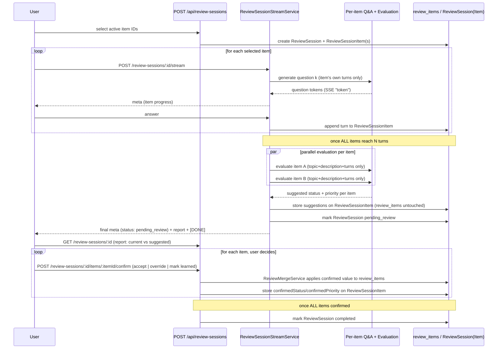

# Review Items Learned Status — Specification

## Problem Statement

Review items today only **escalate**: priority never decreases, there is no "mastered" state, and recurring gaps always bump priority. Candidates who later demonstrate sufficient understanding of a topic still see it in their study list at the same (or higher) priority. The product cannot reflect real progress across multiple mock interviews.

An earlier version of this spec proposed having the **normal mock interview's final turn** reassess *every* active review item on every session. Discovery revealed two problems with that approach: it made interviews repetitive (always circling back to the same known gaps) and forced the LLM to issue low-signal judgments on topics that were never actually discussed. This revision replaces that trigger with a dedicated, user-initiated **Review Session**: the user selects which active items to work on, answers a bounded, adaptive Q&A per item over SSE, and the backend evaluates all selected items **in parallel** once the session completes — producing **suggestions**, not automatic changes. The user reviews a report comparing current vs. suggested priority/learned status per item, and explicitly **confirms, overrides, or marks learned** before anything is persisted.

This feature introduces a **`learned` lifecycle** for review items, allows **priority decreases** for active items when a Review Session shows clear improvement, and **reactivates** semantically matching learned items when gaps reappear (via new-gap discovery, wherever that is triggered) — driven by user-confirmed Review Session suggestions and manual user actions.

## Goals

- [ ] Review items support `status`: `active` (default) or `learned` (archived from study list).
- [ ] User can start a **Review Session** by selecting a subset of their `active` review items.
- [ ] Review Session asks a fixed number (`N`) of adaptive follow-up questions per selected item, streamed over SSE, reusing the existing interview SSE infrastructure.
- [ ] Once every selected item has `N` answered turns, the backend evaluates **all items in parallel** and produces a per-item **suggestion**: `learned` or an adjusted priority (including decrease with evidence), scoped per item.
- [ ] After evaluation, the user sees a **review report** per session: each item's current priority vs. suggested priority/learned status.
- [ ] The user must **confirm** the suggestion, **override** it with a different priority, or **mark the item learned** themselves, before any change is persisted to `review_items`.
- [ ] Priority changes applied on confirmation follow the existing raise/decrease/bump rules; confirming/marking `learned` sets `learned_at`.
- [ ] `GET /api/review-items?status=active|learned|all` filters the list (default `active`).
- [ ] `PATCH /api/review-items/:id` lets users toggle `active` ↔ `learned` manually.
- [ ] Existing DELETE behavior preserved; no cross-user leakage.
- [ ] Normal mock interviews (`ai-mock-interview`) no longer mutate existing review items' status/priority.

## Out of Scope

| Item | Reason |
|------|--------|
| Frontend UI (learned tab, review session screen, badges, animations) | Backend-only; API contract for consumers |
| Spaced repetition / reminders | Separate product feature |
| Per-item confidence scores or rubric breakdown | LLM uses holistic per-item judgment only |
| Editing `topic` or `description` manually | Still LLM/system-managed; manual status only |
| Normal-interview topic diversity / "mastered topic" tracking (`topic_coverage`) | Separate follow-up feature; only the *removal* of review-item mutation from normal interviews is in scope here |
| System-suggested Review Session prompts (e.g. "you have 5 high-priority items") | Manual trigger only for this iteration |
| User-configurable number of questions per item (`N`) | Fixed default for MVP |
| Automatic deletion of learned items | Archive only; user may DELETE explicitly |
| Cross-item shared conversation context within a Review Session | Deliberately isolated per item to bound LLM cost |
| Automatic application of suggestions without user confirmation | Suggestions are always a proposal; persistence requires explicit user action (accept, override, or mark learned) |
| Session-level "accept all" bulk confirmation | May be added later as a convenience; not required for MVP (user confirms per item) |

---

## Relationship to Existing Features

| Feature | Link | Impact |
|---------|------|--------|
| AI Mock Interview | [spec.md](../ai-mock-interview/spec.md) (`AMI-23`–`AMI-26`) | Normal interview final turn **no longer** reassesses or mutates existing review items; it may still discover brand-new gaps (unchanged today), but "never decrease priority" is now moot for it since it doesn't touch existing items at all |
| Review Items List API | [spec.md](../review-items-list-api/spec.md) (`REV-*`) | Extends GET response + filter; adds PATCH; adds new Review Session endpoints |
| Interview Closing Feedback | [spec.md](../interview-closing-feedback/spec.md) | CTA still points to study list (`status=active`) |

**Brownfield touchpoints:**

| Area | Current state | Change |
|------|---------------|--------|
| Prisma `ReviewItem` | `priority`, no status | Add `ReviewItemStatus` enum + `status` column (default `active`); optional `learnedAt` |
| Prisma schema | No Review Session tables | Add `ReviewSession` + `ReviewSessionItem` (new, lightweight — not reusing `InterviewSession`) |
| `InterviewStreamService` (`src/modules/interview/service/stream-service.ts`) | Final turn calls `reviewItemsGenerator` + `reviewMergeService.upsertItems` for **all** active items | Remove the "reassess all active items" responsibility from this service; final turn keeps only new-gap discovery (unchanged scope, separate feature concern) |
| `ReviewMergeService` | `maxPriority` + `bump`; never decrease | Add status transitions (`learned`), conditional priority decrease with evidence; invoked per Review Session item instead of per interview final turn |
| `src/shared/utils/sse.ts` | Generic `writeEvent`/`writeDone` helpers | Reused as-is for the new Review Session stream |
| New: `ReviewSessionStreamService` | Does not exist | New orchestrator mirroring `InterviewStreamService`'s SSE loop shape, driving per-item adaptive Q&A instead of the interviewer graph node |
| `ReviewRepository` | `findSimilarByUserIdAndTopic` (all items) | Scoped variants for `learned`-only search (still used by whichever flow does new-gap discovery); `listByUserId` + status filter |
| `ReviewItemsService` | GET list + DELETE | GET filter, PATCH status, default `active` |

---

## Data Model (proposed)

### Enum `ReviewItemStatus`

| Value | Meaning |
|-------|---------|
| `active` | Visible on study list; has meaningful `priority` |
| `learned` | Archived; hidden from default list |

### `review_items` columns

| Column | Type | Notes |
|--------|------|-------|
| `status` | `ReviewItemStatus` | Default `active`; existing rows backfilled `active` |
| `learned_at` | `DateTime?` | Set when transitioning to `learned`; cleared on reactivation |
| `priority` | `ReviewPriority` | Retained for learned rows (last known) but not used for learned list ordering |

**Unique constraint unchanged:** `@@unique([userId, topic])`.

### New: `ReviewSession`

| Column | Type | Notes |
|--------|------|-------|
| `id` | uuid | PK |
| `userId` | FK | Owner |
| `status` | `in_progress` \| `pending_review` \| `completed` | Default `in_progress`; `pending_review` once evaluation produced suggestions and awaits user confirmation; `completed` once every item is confirmed |
| `createdAt` | DateTime | |
| `evaluatedAt` | DateTime? | Set when parallel evaluation produces suggestions (session enters `pending_review`) |
| `completedAt` | DateTime? | Set when the last item is confirmed |

### New: `ReviewSessionItem`

| Column | Type | Notes |
|--------|------|-------|
| `id` | uuid | PK |
| `reviewSessionId` | FK → `ReviewSession` | |
| `reviewItemId` | FK → `ReviewItem` | Must be `active` and owned by the session's user at selection time |
| `topic` | string | Snapshot at session start |
| `description` | string | Snapshot at session start |
| `turns` | JSON `[{ question: string, answer: string }]` | Bounded to `N` entries (default `N = 3`) |
| `currentPriority` | `ReviewPriority` | Snapshot of the item's priority at session start; shown as "current" in the report even if evaluation suggests a change |
| `suggestedStatus` | `active` \| `learned` \| `null` | Filled only after parallel evaluation; **not yet applied** to `review_items` |
| `suggestedPriority` | `ReviewPriority` \| `null` | Filled only after parallel evaluation; ignored when `suggestedStatus = learned` |
| `confirmedStatus` | `active` \| `learned` \| `null` | Filled only after the user confirms/overrides; drives the actual `review_items` update |
| `confirmedPriority` | `ReviewPriority` \| `null` | Filled only after the user confirms/overrides |
| `confirmedAt` | DateTime? | Set when the user acts on this item's suggestion |

Exact column types (JSON vs child table for `turns`) and additional indexes are a **Design-phase** decision.

---

## Review Session Flow

### RSF-01: Selection

`POST /api/review-sessions` with `{ "reviewItemIds": ["uuid", ...] }`.

- All IDs must be `active` review items owned by the requesting user; otherwise `400`/`404`.
- Creates one `ReviewSession` (`status = in_progress`) and one `ReviewSessionItem` per selected item (topic/description snapshotted).

### RSF-02: Per-item adaptive Q&A over SSE

- Reuses the existing SSE contract (`src/shared/utils/sse.ts`): events `token`, `meta`, `error`, terminal `[DONE]`. Same header setup (`res.writeHead`/`flushHeaders`) and abort-on-`close` handling as `InterviewStreamService`.
- For each `ReviewSessionItem`, in order:
  1. First question is generated from `topic` + `description` only.
  2. User submits an answer.
  3. The next question is generated using **only that item's own prior turns** (bounded, isolated context — no cross-item history, no full-session transcript).
  4. Repeats until the item has `N` answered turns (default `N = 3`), then advances to the next item.
- `meta` events communicate turn/item progress (e.g. current item index, turns completed for that item, whether the whole session is complete) — exact payload shape is a **Design-phase** decision, following the existing `meta` pattern (`turnCount`, `maxTurns`, `isFinished`).
- No item's questions are conditioned on another item's Q&A; this keeps per-call LLM context small and constant regardless of how many items are in the session.

### RSF-03: Parallel evaluation (suggestion generation)

- Triggered only once **every** `ReviewSessionItem` in the session has reached `N` answered turns.
- One evaluation call per item, run **in parallel** (e.g. `Promise.all`), each scoped to `{ topic, description, current stored priority, that item's turns }` — no shared context between items.
- Each evaluation call returns `{ status: "active" | "learned", priority?: "low" | "medium" | "high" }` (`priority` required when `status = "active"`, ignored when `learned`).
- Results are written to `ReviewSessionItem.suggestedStatus` / `suggestedPriority` **only** — this does **not** mutate the underlying `review_items` row yet.
- `ReviewSession.status` becomes `pending_review`, `evaluatedAt = now()`.

### RSF-04: Suggestion report and user confirmation

- The user retrieves a report for the session (e.g. `GET /api/review-sessions/:id`, or the final SSE `meta` payload) listing, per item: `topic`, `currentPriority`, `suggestedStatus`, `suggestedPriority`.
- For each item, the user takes exactly one action:
  1. **Accept** the suggestion as-is.
  2. **Override** with a different priority (item stays `active`).
  3. **Mark learned** themselves, regardless of what was suggested.
- Only on this action does the system call `ReviewMergeService` and persist the change to the underlying `review_items` row (see Merge & Persistence Rules), and set `ReviewSessionItem.confirmedStatus` / `confirmedPriority` / `confirmedAt`.
- Once every `ReviewSessionItem` in the session has a `confirmedStatus` THEN `ReviewSession.status` becomes `completed`, `completedAt = now()`.
- A session may sit in `pending_review` indefinitely — there is no forced auto-confirmation or expiry for this iteration.

### RSF-05: Failure handling

- If an item's evaluation call fails, that item has no `suggestedStatus`/`suggestedPriority` (left `null`), and the SSE stream emits an `error` event referencing that item; other items' evaluations still complete (parallel calls are independent).
- An item with a failed evaluation can still be resolved directly by the user (override / mark learned) without waiting on a re-run of that specific evaluation — exact retry-vs-manual-resolution UX is a **Design-phase** decision.
- The underlying `review_items` row for a failed item is left completely unchanged until the user acts.

---

## LLM Contract — Per-Item Review Suggestion

Replaces the previous `review_items_generator` "reassess everything" contract for this feature's concern. (New-gap discovery during normal interviews, if/when it continues to exist, is a separate contract outside this spec's scope.) The LLM output here is always a **suggestion** — it is never applied to `review_items` directly; see RSF-04.

### RSE-01: Per-item suggestion output

```json
{
  "status": "learned",
  "priority": null
}
```

or

```json
{
  "status": "active",
  "priority": "medium"
}
```

| Field | When required | Rules |
|-------|---------------|-------|
| `status` | Always | `active` or `learned` |
| `priority` | `status === "active"` | `low` \| `medium` \| `high` |
| `priority` | `status === "learned"` | Optional/ignored on persist (keep last active priority) |

### LLM inputs (per item, per evaluation call)

1. `topic` and `description` (snapshot from session start).
2. Current stored `priority` on the underlying `review_items` row.
3. That item's own `turns` (`N` question/answer pairs) — nothing from other items, nothing from the interview transcript.

### LLM instructions (normative)

- Mark `status: learned` when the answers demonstrate **sufficient** understanding of the topic (not merely "got one question right").
- Raise priority when answers reinforce the existing gap; **lower** priority only with **clear evidence of improvement** across the answers; never lower below `low`.
- If answers show no clear change (neither strong improvement nor reinforcement), keep the same priority.
- Never emit `status: active` without a `priority`.

### Question-generation contract (adaptive, per item)

- Question 1: generated from `topic` + `description` only.
- Question `k` (`k > 1`): generated from `topic` + `description` + the item's own turns `1..k-1` only.
- Exactly `N` questions per item (default `N = 3`, constant/env-configurable); no early-exit/early-stop logic for this iteration.

---

## Merge & Persistence Rules

Applied by `ReviewMergeService` (or successor) **only when the user confirms/overrides an item's suggestion** (RSF-04) — never automatically right after evaluation. Scoped to a single `review_items` row (the one snapshotted into the `ReviewSessionItem`):

### User confirms suggestion, or marks learned themselves → `learned`

1. Set `status = learned`, `learned_at = now()`, keep last known `priority` unchanged (not used for ordering while learned).
2. Persist `ReviewSessionItem.confirmedStatus = learned`, `confirmedAt = now()`.

### User confirms suggestion, or overrides with a chosen priority → `active`

1. If the user **accepted** the suggested priority: apply it directly (already validated as `low`/`medium`/`high`).
2. If the user **overrode** with a different priority: apply the user-chosen value directly — user override always wins, no bump/clamp logic applied on top of an explicit human choice.
3. Update `updated_at`. `description` may be refreshed from the Review Session's evaluation if the design decides to regenerate it; otherwise left unchanged (**Design-phase** decision).
4. Persist `ReviewSessionItem.confirmedStatus = active`, `confirmedPriority`, `confirmedAt = now()`.

### Existing bump-on-reinforcement safety net

- The **suggestion** itself (RSE-01) is where "bump one step when reinforced and LLM priority is unchanged" applies — it's baked into what gets suggested, not into the confirmation step. Confirmation only ever applies exactly what the user accepted or chose; it never re-derives priority.

### Items not part of any Review Session

- Left completely unchanged. There is no longer a "full active list reassessment" trigger anywhere in the system.

### New-gap discovery reactivating a `learned` item

- Out of this spec's direct flow (Review Sessions only operate on already-`active` items the user selected), but the existing semantic-match-then-reactivate mechanism (threshold 0.7 similarity against `learned` rows) remains the intended mechanism wherever new-gap discovery is triggered (currently: normal interview's existing gap-creation path, unchanged in scope/timing by this feature).

---

## API Contract (proposed)

### `GET /api/review-items?status=active|learned|all`

| Query | Default | Behavior |
|-------|---------|----------|
| `status=active` | **Yes** | Study list |
| `status=learned` | | Archive |
| `status=all` | | Both |

Response item shape (additions in **bold**):

```json
{
  "reviewItems": [
    {
      "id": "uuid",
      "sessionId": "uuid",
      "topic": "system design",
      "description": "...",
      "priority": "high",
      "status": "active",
      "learnedAt": null,
      "createdAt": "ISO-8601",
      "updatedAt": "ISO-8601"
    }
  ]
}
```

- `learnedAt`: ISO 8601 or `null`.
- Sort **active** list: `priority` desc, then `updatedAt` desc (unchanged `REV-DEC-01`).
- Sort **learned** list: `learnedAt` desc (fallback `updatedAt`).

### `PATCH /api/review-items/:id`

Body:

```json
{ "status": "learned" }
```

or

```json
{ "status": "active" }
```

| Status | When |
|--------|------|
| `200` | Updated item returned (same shape as GET element) |
| `400` | Invalid body |
| `401` | Unauthenticated |
| `404` | Item not found or not owned |

Manual `learned` sets `learned_at = now()`. Manual `active` clears `learned_at`.

### `DELETE /api/review-items/:id`

Unchanged.

### `POST /api/review-sessions` (new)

Body:

```json
{ "reviewItemIds": ["uuid", "uuid"] }
```

| Status | When |
|--------|------|
| `201` | Session created with one `ReviewSessionItem` per valid ID, in `in_progress` status |
| `400` | Empty list, invalid body, or duplicate IDs |
| `401` | Unauthenticated |
| `404` | Any ID not found, not owned, or not `active` |

### `POST /api/review-sessions/:id/stream` (new — SSE)

Drives the adaptive Q&A loop and, once all items are answered, the parallel evaluation. Exact request/response shape per turn (e.g. how the user's answer for the *current* question is submitted — separate endpoint vs. same streaming endpoint reused per turn like `ai-mock-interview`'s `/stream`) is a **Design-phase** decision; the SSE event contract (`token`/`meta`/`error`/`[DONE]`) is fixed by reuse of `src/shared/utils/sse.ts`.

| Status | When |
|--------|------|
| `200` (SSE) | Stream opens; emits next question tokens, then `meta` with item/session progress. On the turn that completes the last item, `meta` SHALL include `status: "pending_review"` and the full suggestion report (see `GET /api/review-sessions/:id`) instead of `isFinished: true` |
| `404` | Session not found or not owned |
| `409` | Session already `pending_review` or `completed` |

### `GET /api/review-sessions/:id` (new)

Returns the session's current state, including the per-item report once evaluation has produced suggestions.

```json
{
  "id": "uuid",
  "status": "pending_review",
  "items": [
    {
      "id": "uuid",
      "reviewItemId": "uuid",
      "topic": "system design",
      "currentPriority": "high",
      "suggestedStatus": "active",
      "suggestedPriority": "medium",
      "confirmedStatus": null,
      "confirmedPriority": null
    }
  ]
}
```

| Status | When |
|--------|------|
| `200` | Session returned (with or without suggestions depending on status) |
| `401` | Unauthenticated |
| `404` | Session not found or not owned |

### `POST /api/review-sessions/:id/items/:itemId/confirm` (new)

Applies the user's decision for one item and persists it to `review_items`.

Body — accept the suggestion as-is:

```json
{ "action": "accept" }
```

Body — override with a different priority (item stays `active`):

```json
{ "action": "override", "status": "active", "priority": "high" }
```

Body — mark learned regardless of suggestion:

```json
{ "action": "override", "status": "learned" }
```

| Status | When |
|--------|------|
| `200` | Item confirmed; updated `review_items` row returned; if this was the last unconfirmed item, `ReviewSession.status` becomes `completed` |
| `400` | Invalid body (e.g. `override` to `active` missing `priority`), or session not yet `pending_review` for this item |
| `401` | Unauthenticated |
| `404` | Session/item not found or not owned |
| `409` | Item already confirmed |

---

## User Stories

### P1: Start a Review Session and answer per-item questions — MVP

**User Story**: As a candidate, I want to pick specific weak topics from my study list and answer a short, focused round of questions on each, instead of a generic open-ended interview.

**Why P1**: Core mechanism that replaces the noisy "reassess everything" trigger and directly enables user goal #2 (focused review without repetition).

**Acceptance Criteria**:

1. WHEN the user calls `POST /api/review-sessions` with a list of owned `active` review item IDs THEN the system SHALL create a `ReviewSession` with one `ReviewSessionItem` per ID.
2. WHEN the user calls `POST /api/review-sessions/:id/stream` THEN the system SHALL stream the next question for the current item over SSE using the existing `token`/`meta`/`error`/`[DONE]` contract.
3. WHEN the user answers a question for an item THEN the next question for that item SHALL be generated using only that item's own prior turns (no cross-item or full-session context).
4. WHEN an item reaches `N` answered turns (default 3) THEN the session SHALL advance to the next selected item.
5. WHEN any selected item ID is not `active` or not owned by the user THEN the system SHALL respond `404` and create no session.

**Independent Test**: Select 2 active items → stream through all questions for both → verify each `ReviewSessionItem.turns` has exactly `N` entries scoped to its own item only.

**Requirements**: RIL-01, RIL-02, RIL-03, RIL-04, RIL-05

---

### P1: Parallel evaluation produces per-item suggestions — MVP

**User Story**: As a candidate who just finished reviewing my selected topics, I want each topic to be judged independently — some may be suggested as "learned," others suggested to go up or down in priority — without waiting on a slow, sequential process, and without anything changing on my study list until I say so.

**Why P1**: Core product value — real progress reflection, at controlled LLM cost, with the user staying in control of what actually changes.

**Acceptance Criteria**:

1. WHEN every `ReviewSessionItem` in a session reaches `N` answered turns THEN the backend SHALL evaluate all items **in parallel**, each call scoped only to that item's own topic/description/turns.
2. WHEN an evaluation returns a result for an item THEN the backend SHALL store it as `suggestedStatus`/`suggestedPriority` on that `ReviewSessionItem` and SHALL NOT modify the underlying `review_items` row.
3. WHEN all items have a suggestion (or a recorded failure) THEN the system SHALL mark `ReviewSession.status = pending_review` and set `evaluatedAt`.
4. WHEN `GET /api/review-items` is called after evaluation but before any confirmation THEN the system SHALL still return the pre-session status/priority for those items (no changes have been persisted yet).

**Independent Test**: Seed 2 active items, complete a Review Session's Q&A for both → verify both `ReviewSessionItem` rows have `suggestedStatus`/`suggestedPriority` populated, `ReviewSession.status = pending_review`, and `GET /api/review-items` still shows the original priorities.

**Requirements**: RIL-06, RIL-07, RIL-08

---

### P1: Review report and per-item confirmation — MVP

**User Story**: As a candidate, after finishing my review questions I want to see, for each topic, my current priority next to the suggested one, and decide myself whether to accept it, pick a different priority, or mark it as learned.

**Why P1**: Keeps the user in control of their own study list — the LLM proposes, the user disposes.

**Acceptance Criteria**:

1. WHEN a session is `pending_review` THEN `GET /api/review-sessions/:id` SHALL return, per item, `topic`, `currentPriority`, `suggestedStatus`, `suggestedPriority`, and any existing `confirmedStatus`/`confirmedPriority`.
2. WHEN the user sends `POST /api/review-sessions/:id/items/:itemId/confirm` with `{ "action": "accept" }` THEN the backend SHALL persist the item's `suggestedStatus`/`suggestedPriority` to the underlying `review_items` row exactly as suggested.
3. WHEN the user sends `{ "action": "override", "status": "active", "priority": "..." }` THEN the backend SHALL persist the user-chosen priority, regardless of what was suggested, and keep `status = active`.
4. WHEN the user sends `{ "action": "override", "status": "learned" }` THEN the backend SHALL persist `status = learned` and `learned_at = now()`, regardless of what was suggested.
5. WHEN every item in the session has a `confirmedStatus` THEN the system SHALL mark `ReviewSession.status = completed` and set `completedAt`.
6. WHEN `GET /api/review-items` is called after confirmation THEN the system SHALL reflect only the confirmed changes (not the raw suggestions for any items not yet confirmed).
7. WHEN `GET /api/review-items?status=learned` is called after a `learned` confirmation THEN the system SHALL return that item.

**Independent Test**: Seed 2 active items, complete Q&A + evaluation → confirm one item's suggestion as-is, override the other item's priority to a different value → `GET /api/review-items` reflects exactly those two confirmed outcomes, not the raw suggestions.

**Requirements**: RIL-09, RIL-10, RIL-11, RIL-12, RIL-13

---

### P1: Normal interviews stop mutating review items — MVP

**User Story**: As a candidate, I don't want my normal mock interviews to silently change my study list's priorities or mark things as learned — I want that to only happen when I explicitly review something.

**Why P1**: Directly required to make interviews non-repetitive and predictable; prevents the two flows from fighting over the same data.

**Acceptance Criteria**:

1. WHEN a normal mock interview (`ai-mock-interview`) reaches its final turn THEN the system SHALL NOT reassess or mutate the status/priority of existing `review_items` rows as part of that flow.
2. WHEN a normal mock interview finishes THEN any existing new-gap-discovery behavior (creating brand-new review items) MAY remain, but is out of this spec's scope to redesign.

**Independent Test**: Seed an active review item → complete a full normal interview session (final turn included) that discusses that exact topic → verify the item's `priority`/`status`/`updated_at` are unchanged after the interview finishes.

**Requirements**: RIL-14, RIL-15

---

### P2: Manual mark / unmark learned — should have

**User Story**: As a candidate, I want to manually mark a topic as learned or bring it back to my study list without starting a Review Session.

**Why P2**: User autonomy; evaluation may be conservative or wrong.

**Acceptance Criteria**:

1. WHEN user sends `PATCH /api/review-items/:id` with `{ "status": "learned" }` for an owned item THEN the system SHALL archive it and set `learned_at`.
2. WHEN user sends `{ "status": "active" }` on a learned item THEN the system SHALL reactivate it and clear `learned_at`.
3. WHEN the item is not owned THEN the system SHALL respond `404`.
4. WHEN token is missing THEN the system SHALL respond `401`.

**Independent Test**: PATCH active → learned → default GET excludes → PATCH active → reappears.

**Requirements**: RIL-16, RIL-17, RIL-18, RIL-19

---

### P3: Docs and automated tests — should have

**User Story**: As a maintainer, I want tests and API docs so merge rules, the Review Session flow, and filters do not regress.

**Acceptance Criteria**:

1. WHEN unit tests run THEN `ReviewMergeService` SHALL cover learned transition, priority decrease with evidence, and confirmation-driven persistence — scoped to per-item confirmation calls.
2. WHEN unit/integration tests run THEN the Review Session flow SHALL cover selection validation, per-item isolated question context, parallel evaluation (suggestion-only), partial-failure handling, and the accept/override/mark-learned confirmation paths.
3. WHEN e2e runs THEN GET filters, PATCH status, and the full Review Session lifecycle (`POST /api/review-sessions` → SSE stream → evaluation → report → per-item confirm) SHALL be covered with auth scoping.
4. WHEN Swagger / `docs/frontend-mock-interview-api.md` are updated THEN new fields and endpoints (including the Review Session SSE contract, report, and confirm endpoint) SHALL be documented.

**Requirements**: RIL-20, RIL-21, RIL-22

---

## Edge Cases

- WHEN user manually marks learned and a later Review Session somehow includes that same item (should be impossible since selection requires `active`) THEN the system SHALL reject selection of non-`active` items (`404`).
- WHEN a suggestion marks `learned` and `priority` is present in the LLM response THEN backend SHALL ignore priority; it is not offered as an editable field once the user chooses "mark learned" (accept or override).
- WHEN `status=all` on `GET /api/review-items` THEN response MAY mix active and learned; client sorts by status if needed.
- WHEN migration runs on existing rows THEN all SHALL default to `active` with `learned_at = null`.
- WHEN an evaluation call returns an invalid combination (e.g. `active` without `priority`) THEN the parser SHALL reject (Zod) and that item's suggestion SHALL be treated as failed (see RSF-05), not silently defaulted.
- WHEN a learned item is DELETE'd THEN row is removed; a future new-gap discovery may create a fresh `active` row for the same topic.
- WHEN the client disconnects mid-Review-Session (SSE `close`) THEN the system SHALL behave like the existing interview abort handling: stop writing, do not persist a partial/garbage turn, and leave the session `in_progress` for resumption (exact resumption UX is a **Design-phase** decision).
- WHEN a Review Session has only one selected item THEN the "parallel" evaluation degenerates to a single call — no special-casing needed.
- WHEN the user calls `POST /api/review-sessions/:id/items/:itemId/confirm` for an item that has no `suggestedStatus` (evaluation failed) AND the action is `"accept"` THEN the system SHALL respond `400` (nothing to accept) — the user must send `"override"` with an explicit choice instead.
- WHEN the user calls `confirm` on an item that already has a `confirmedStatus` THEN the system SHALL respond `409` (no re-confirmation/edits after the fact in this iteration — user must use `PATCH /api/review-items/:id` afterward if they change their mind).
- WHEN a session sits `pending_review` and the user separately calls `PATCH /api/review-items/:id` on one of its items before confirming that item in the session THEN the manual PATCH SHALL apply immediately; the session's later `confirm` call for that same item still applies on top (last write wins) — no special locking between the two flows in this iteration.

---

## Requirement Traceability

| Requirement ID | Story | Phase | Status |
|----------------|-------|-------|--------|
| RIL-01 | P1: Start Review Session | Design | Pending |
| RIL-02 | P1: Start Review Session | Design | Pending |
| RIL-03 | P1: Start Review Session | Design | Pending |
| RIL-04 | P1: Start Review Session | Design | Pending |
| RIL-05 | P1: Start Review Session | Design | Pending |
| RIL-06 | P1: Parallel evaluation (suggestions) | Design | Pending |
| RIL-07 | P1: Parallel evaluation (suggestions) | Design | Pending |
| RIL-08 | P1: Parallel evaluation (suggestions) | Design | Pending |
| RIL-09 | P1: Review report & confirmation | Design | Pending |
| RIL-10 | P1: Review report & confirmation | Design | Pending |
| RIL-11 | P1: Review report & confirmation | Design | Pending |
| RIL-12 | P1: Review report & confirmation | Design | Pending |
| RIL-13 | P1: Review report & confirmation | Design | Pending |
| RIL-14 | P1: Normal interviews stop mutating | Design | Pending |
| RIL-15 | P1: Normal interviews stop mutating | Design | Pending |
| RIL-16 | P2: Manual mark/unmark | Design | Pending |
| RIL-17 | P2: Manual mark/unmark | Design | Pending |
| RIL-18 | P2: Manual mark/unmark | Design | Pending |
| RIL-19 | P2: Manual mark/unmark | Design | Pending |
| RIL-20 | P3: Tests & docs | Execute | Pending |
| RIL-21 | P3: Tests & docs | Execute | Pending |
| RIL-22 | P3: Tests & docs | Execute | Pending |

**Coverage:** 22 total, 0 mapped to tasks, 22 unmapped

---

## Success Criteria

- [ ] Default study list shrinks when candidates confirm mastery suggestions from a Review Session.
- [ ] Normal mock interviews never change existing review items' status/priority.
- [ ] Users can start a Review Session, answer bounded per-item questions over SSE, see a suggestion report (current vs. suggested), and explicitly confirm/override/mark-learned each item before it persists.
- [ ] No review item ever changes status/priority without either a user's explicit Review Session confirmation or a manual `PATCH`.
- [ ] Users can manually archive or restore topics without data loss.
- [ ] No duplicate topics per user; auth scoping unchanged.
- [ ] Per-item LLM context (questions + evaluation) stays bounded regardless of how many items are in a session, keeping cost predictable.

---

## Decisions (resolved)

| ID | Decision |
|----|----------|
| RIL-DEC-01 | Review item mutation (status/priority) is triggered **only** by Review Sessions or manual `PATCH` — never by normal mock interviews |
| RIL-DEC-02 | Primary mastery signal = `learned` status, not priority reduction alone |
| RIL-DEC-03 | List API filter via `?status=active\|learned\|all`; default `active` |
| RIL-DEC-04 | Review Session trigger: user-initiated only (manual selection); no system-suggested trigger for this iteration |
| RIL-DEC-05 | Review Session = user selects `active` items → `N` adaptive questions per item (SSE, reusing existing infra) → parallel per-item evaluation once all items answered |
| RIL-DEC-06 | Priority decrease for active items only with clear improvement evidence, evaluated per item in isolation |
| RIL-DEC-07 | Each item's questions/evaluation use only that item's own topic/description/turns — no cross-item or full-session context, to bound LLM cost |
| RIL-DEC-08 | `N` (questions per item) is fixed/env-configurable (default 3), not user-configurable, for this iteration |
| RIL-DEC-09 | Review Session persistence uses new lightweight `ReviewSession`/`ReviewSessionItem` models, not the existing `InterviewSession`/message-turn models |
| RIL-DEC-10 | Reuse existing SSE infrastructure (`src/shared/utils/sse.ts`, `token`/`meta`/`error`/`[DONE]` contract, header/abort pattern from `InterviewStreamService`) for the Review Session stream |
| RIL-DEC-11 | Parallel evaluation output is a **suggestion** only; it is written to `ReviewSessionItem.suggestedStatus`/`suggestedPriority` and never applied to `review_items` automatically |
| RIL-DEC-12 | User must explicitly **confirm** (accept), **override** (different priority), or **mark learned** each item before it persists; only that action triggers `ReviewMergeService` |
| RIL-DEC-13 | `ReviewSession` lifecycle: `in_progress` (Q&A) → `pending_review` (suggestions ready) → `completed` (all items confirmed); no forced auto-confirmation or expiry |
| RIL-DEC-14 | User override always wins as-is (no bump/clamp reapplied on top of an explicit human choice); the bump-on-reinforcement safety net only affects what gets *suggested*, not the confirmation step |

---

## Architecture Overview



---

**Next steps after approval:** **Design** (`design.md`) — Prisma migration for `ReviewSession`/`ReviewSessionItem` (including `suggested*`/`confirmed*` columns), `ReviewSessionStreamService` implementation mirroring `InterviewStreamService`'s SSE loop, per-item question/suggestion prompts, Zod schemas for the new endpoints (including the report and confirm action union), and removal of the review-mutation block from `InterviewStreamService`. Then **Tasks** (`tasks.md`) given multi-layer scope. **Execute** per task with gates from `docs/TESTING.md`.
