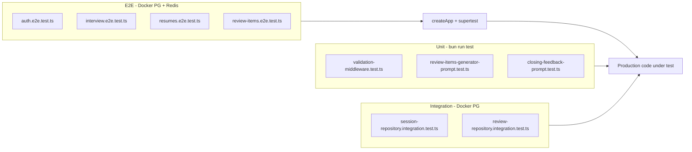

# Expansão de Cenários de Teste — Design

**Spec**: `.specs/features/test-scenario-coverage/spec.md`
**Status**: Draft
**Parent**: [test-structure-refactor](../test-structure-refactor/design.md)

---

## Architecture Overview

Esta feature é **test-only**. Não há novos módulos de produção. O design descreve como estender suites existentes reutilizando infraestrutura do refactor.



---

## Code Reuse Analysis

### Existing Components to Leverage

| Component | Location | How to Use |
|-----------|----------|------------|
| Auth helpers | `src/test/helpers/auth-helpers.ts` | `signUpUser`, `loginUser`, `authHeader`, `createSignupPayload` |
| Interview seed | `src/test/helpers/interview-seed-helpers.ts` | `seedReadyResume`; **estender** com `seedProcessingResume`, `seedFailedResume` |
| E2E truncate | `src/test/containers/truncate-tables.ts` | `beforeEach` em todas as suites |
| Integration reset | `src/test/integration/helpers.ts` | `resetDatabase`, `disconnectDatabase` |
| Interview graph mock | `interview.e2e.test.ts` | `vi.hoisted` + `vi.mock` factory — manter para stream happy path |
| Storage/queue mock | `resumes.e2e.test.ts` | `storageMock.put` / `resumeQueueMock.add` — rejeitar com `mockRejectedValueOnce` para 502/503 |
| Prompt unit pattern | `interviewer-system-prompt.test.ts` | Assertar headers, ordem de seções, conteúdo por `level` |
| Middleware unit pattern | `error-handler-middleware.test.ts` | Mock `req`/`res`/`next` para handlers |
| Session integration seed | `session-repository.integration.test.ts` | `seedUserAndResume()` via repos |

### Nothing to Build in Production

- Sem novos controllers, services ou rotas.
- Helpers novos apenas em `src/test/helpers/` se reduzirem duplicação E2E.

---

## E2E Design by Module

### Interview (`interview.e2e.test.ts`)

| Cenário | Seed / setup | Assert |
|---------|--------------|--------|
| Resume processing | `createProcessing` via Prisma ou `ResumeRepository` | POST sessions → 400 + message |
| Resume failed | `updateFailed` no resume | POST sessions → 400 |
| Resume 404 | `randomUUID()` ou resume de outro user | POST sessions → 404 |
| Stream 409 | Criar sessão; `prisma.interviewSession.update({ isFinished: true })` | POST stream → 409 (antes de SSE) |
| Stream 404 | UUID aleatório ou sessão de outro user | POST stream → 404 |
| Stream 422 | `{ content: "" }` ou campo ausente | 422 + `Validation failed` |
| 401 variants | Omitir header ou usar token inválido | 401 + message padrão |

**Nota:** Para 409, não é necessário mockar graph — o service valida sessão **antes** de abrir SSE.

### Resumes (`resumes.e2e.test.ts`)

| Cenário | Setup | Assert |
|---------|-------|--------|
| Sem arquivo | POST sem `.attach()` | 400 `PDF file is required` |
| Não-PDF | `.attach` com `contentType: text/plain` | 400 `Only PDF files are allowed` |
| Tamanho | Buffer > `env.RESUME_MAX_BYTES` | 400 com limite na mensagem |
| 502 | `storageMock.put.mockRejectedValueOnce(new Error("R2 down"))` | 502; opcional: assert `status: failed` no DB |
| 503 | `resumeQueueMock.add.mockRejectedValueOnce(...)` | 503; resume `failed` |
| GET 401 | GET sem header | 401 |

### Auth (`auth.e2e.test.ts`)

| Cenário | Setup | Assert |
|---------|-------|--------|
| Login 422 | `{ email: "bad" }` | 422 |
| Refresh inválido | `{ refreshToken: "not-a-real-token" }` | 401 |
| Request-reset 422 | email inválido | 422 |
| Reset-password 422 | senha curta / token ausente | 422 |
| Bearer malformado | `Authorization: Token xyz` em rota protegida | 401 `Authentication required` |
| Bearer inválido | `Authorization: Bearer invalid.jwt` | 401 `Invalid or expired token` |

Reutilizar padrão existente de `protected-smoke` para bearer tests.

### Review-items (`review-items.e2e.test.ts`)

| Cenário | Setup | Assert |
|---------|-------|--------|
| Lista vazia | Autenticar sem criar items | `reviewItems: []` |
| Isolamento | User A com items; User B autenticado | B vê `[]` ou só seus items |

---

## Integration Design

### SessionRepository

```typescript
// Após seedUserAndResume + create session
const session = await repository.create({ ... });
const updated = await repository.incrementTurnCount(session.id);
expect(updated.turnCount).toBe(1);

const finished = await repository.markFinished(session.id);
expect(finished.isFinished).toBe(true);
```

### ReviewRepository

**Case-insensitive:** upsert topic `system design`; find com `System Design` → mesmo registro.

**Similarity:** Ler threshold em `review-repository.ts` (ex.: `similarity > 0.3`). Seed dois tópicos próximos; assert match retornado. Se flaky, usar par fixo documentado no teste.

---

## Unit Design

### `validation-middleware.test.ts`

- Schema: `z.object({ name: z.string().min(1) })`
- Válido: `next` chamado 1x, `req.body` transformado
- Inválido: `res.status(422)`, `json` com `message` + `errors`, `next` não chamado

### Prompt tests

Espelhar `interviewer-system-prompt.test.ts`:

- Exportar constantes de header (`CLOSING_*`, `REVIEW_*`)
- `it.each` para levels `entry` | `mid` | `senior`
- `(none)` quando `existingItems.length === 0`

---

## Parallelism Assessment

| Suite | Parallel-Safe | Motivo |
|-------|---------------|--------|
| Unit (3 arquivos) | **Yes** `[P]` | Sem DB |
| Integration (session + review edits) | **No** | Mesmo PG, `fileParallelism: false` |
| E2E (4 arquivos) | **No** | PG + Redis compartilhados |

Tasks de E2E podem ser paralelizadas **por arquivo** apenas se executadas em processos Vitest separados — o projeto usa `fileParallelism: false`; **não marcar `[P]`** em tasks E2E/integration.

---

## Gate Check Commands

| Gate | Command | Docker |
|------|---------|--------|
| quick | `bun run test` | No |
| integration | `bun run test:integration` | Yes |
| e2e | `bun run test:e2e` | Yes |
| full | `bun run test:all` | Yes |

---

## Risks and Mitigations

| Risk | Mitigation |
|------|------------|
| Teste `findSimilar` flaky | Tópicos fixos; assert estrutura mínima; skip documentado se extensão pg_trgm ausente no container |
| Upload size depende de env | Ler `env.RESUME_MAX_BYTES` no teste ou import de `@/config/env` |
| Stream E2E timing | 409 retorna JSON antes de SSE — usar `expect(response.status).toBe(409)` sem parsear stream |

---

## Files Touched (summary)

| Action | Path |
|--------|------|
| Create | `src/shared/middlewares/validation-middleware.test.ts` |
| Create | `src/modules/interview/prompts/review-items-generator-prompt.test.ts` |
| Create | `src/modules/interview/prompts/closing-feedback-prompt.test.ts` |
| Extend | `src/test/helpers/interview-seed-helpers.ts` (optional) |
| Extend | `src/test/e2e/*.e2e.test.ts` (4 files) |
| Extend | `src/modules/interview/repository/*.integration.test.ts` (2 files) |
| Optional | `docs/TESTING.md` — matriz de cenários |
