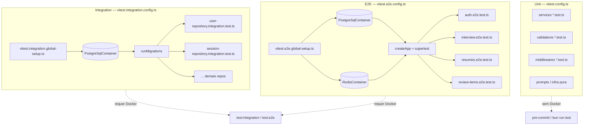
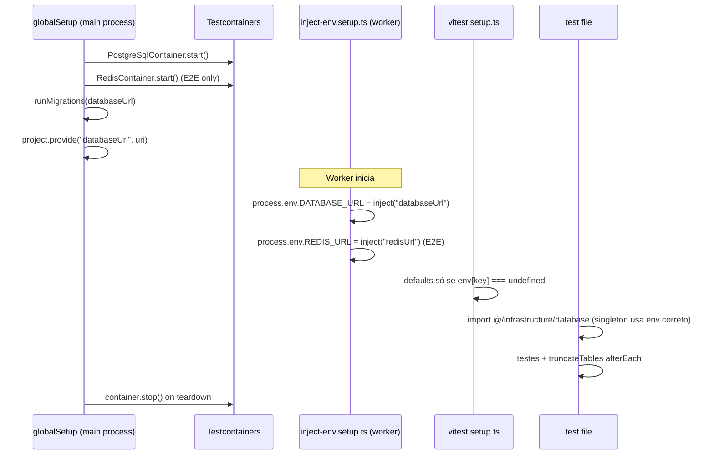

# Refatoração da Estrutura de Testes — Design

**Spec**: `.specs/features/test-structure-refactor/spec.md`
**Status**: Draft

---

## Architecture Overview

A refatoração reorganiza a pirâmide de testes em **três suites Vitest independentes**, compartilhando infraestrutura de banco via **Testcontainers**. Unit tests permanecem colocated e rápidos (sem Docker). Integration e E2E sobem containers efêmeros no `globalSetup`, injetam connection strings nos workers via `project.provide()` + `inject()`, e aplicam migrations Prisma antes de executar testes.



### Fluxo de bootstrap (integration/E2E)



---

## Decisões travadas (ex-gray areas da spec)

| ID | Decisão | Escolha |
|----|---------|---------|
| TEST-CTX-01 | Camadas `prompts/`, `infrastructure/ai` (funções puras), `queue/` | **Unit** — conforme extensão da spec |
| TEST-CTX-01 | `infrastructure/ai/checkpoint/` | **Nenhum** — deletar test existente |
| TEST-CTX-02 | Mailer adapter | **Manter unit** com transport injetado (padrão atual; E2E mocka nodemailer no módulo) |
| TEST-14 | `server.test.ts` | **Mover** para `server-schema.test.ts` colocado em `config/env/` |

---

## Code Reuse Analysis

### Existing Components to Leverage

| Component | Location | How to Use |
|-----------|----------|------------|
| Migration SQL reader | `src/test/e2e/database.ts` → `readAllMigrationSql()` | Extrair para `migrate-database.ts`; remover lógica de CREATE DATABASE / admin client |
| Truncate SQL | `src/test/e2e/database.ts` → `truncateE2ETables()` | Mover para `truncate-tables.ts`; parametrizar `databaseUrl` |
| Env defaults (sem DB/Redis) | `vitest.setup.ts`, `vitest.e2e.setup.ts` | Manter; remover `DATABASE_URL`/`REDIS_URL` hardcoded de `vitest.e2e.setup.ts` |
| E2E auth patterns | `src/test/e2e/auth.e2e.test.ts` | Extrair helpers; remover `initializeE2EDatabase` |
| Nodemailer mock pattern | `auth.e2e.test.ts` (`vi.hoisted` + `vi.mock`) | Reutilizar em helpers ou `src/test/mocks/nodemailer.ts` |
| Prisma factory | `src/infrastructure/database/index.ts` → `createPrismaClient()` | Usado indiretamente via singleton após env injection |
| Bun password mock | `src/test/mocks/bun-password.ts` | Manter alias `bun:` só na config unit |
| Repository test cases | `*.test.ts` mockados existentes | Reutilizar **cenários** (inputs/expects), reescrever asserts contra DB real |
| Controller test scenarios | `*-controller.test.ts` | Mapear cenários 4xx/2xx para checklist E2E antes de deletar |

### Integration Points

| System | Integration Method |
|--------|------------------|
| PostgreSQL | `PostgreSqlContainer` → `getConnectionUri()` → migrations → Prisma |
| Redis | `RedisContainer` → `getConnectionUrl()` → `REDIS_URL` para BullMQ (E2E) |
| Prisma | Singleton `@/infrastructure/database` — **requer env injection antes do import** |
| Express app | `createApp()` em E2E — usa env real + checkpointer Postgres |
| Vitest | `globalSetup` + `project.provide` + `inject()` + `setupFiles` ordenados |

---

## Components

### 1. `migrate-database.ts`

- **Purpose**: Aplicar SQL das migrations Prisma em container PostgreSQL fresco.
- **Location**: `src/test/containers/migrate-database.ts`
- **Interfaces**:

```typescript
/** Lê e concatena migration.sql de prisma/migrations/ em ordem lexicográfica. */
export async function readAllMigrationSql(): Promise<string>;

/** Conecta via pg Client e executa SQL. Container Testcontainers já tem DB criado. */
export async function runMigrations(databaseUrl: string): Promise<void>;
```

- **Dependencies**: `pg`, `node:fs/promises`, `node:path`
- **Reuses**: Lógica de `readAllMigrationSql()` de `e2e/database.ts`
- **Nota**: Não replicar `initializeE2EDatabase()` (CREATE DATABASE, admin client, DROP SCHEMA). Container Testcontainers entrega DB vazio pronto.

---

### 2. `truncate-tables.ts`

- **Purpose**: Isolar testes que compartilham o mesmo container por suite.
- **Location**: `src/test/containers/truncate-tables.ts`
- **Interfaces**:

```typescript
/** Trunca todas as tabelas de domínio com RESTART IDENTITY CASCADE. */
export async function truncateTables(databaseUrl?: string): Promise<void>;
```

- **Dependencies**: `pg`; URL de `databaseUrl` param ou `process.env.DATABASE_URL`
- **Reuses**: SQL de `truncateE2ETables()` existente
- **Tabelas** (ordem via CASCADE): `review_items`, `interview_messages`, `interview_sessions`, `resumes`, `refresh_tokens`, `users`

---

### 3. `vitest.integration.global-setup.ts`

- **Purpose**: Subir PostgreSQL efêmero para suite integration.
- **Location**: `src/test/containers/vitest.integration.global-setup.ts`
- **Interfaces**:

```typescript
export async function setup(project: TestProject): Promise<void>;
export async function teardown(): Promise<void>;
```

- **Implementação**:

```typescript
import {
  PostgreSqlContainer,
  type StartedPostgreSqlContainer,
} from "@testcontainers/postgresql";
import type { TestProject } from "vitest/node";
import { runMigrations } from "./migrate-database";

const POSTGRES_IMAGE = "postgres:16-alpine";

let postgresContainer: StartedPostgreSqlContainer | undefined;

export async function setup(project: TestProject) {
  postgresContainer = await new PostgreSqlContainer(POSTGRES_IMAGE)
    .withDatabase("test")
    .withUsername("test")
    .withPassword("test")
    .start();

  const databaseUrl = postgresContainer.getConnectionUri();
  process.env.DATABASE_URL = databaseUrl;
  project.provide("databaseUrl", databaseUrl);

  await runMigrations(databaseUrl);
}

export async function teardown() {
  await postgresContainer?.stop();
}
```

- **Dependencies**: `@testcontainers/postgresql`, Vitest node API
- **Sem `.withReuse()`** — containers efêmeros por execução

---

### 4. `vitest.e2e.global-setup.ts`

- **Purpose**: Subir PostgreSQL + Redis em paralelo para E2E.
- **Location**: `src/test/containers/vitest.e2e.global-setup.ts`
- **Interfaces**: Mesmo contrato `setup` / `teardown`
- **Implementação**: `Promise.all([PostgreSqlContainer.start(), RedisContainer("redis:8-alpine").start()])`
- **Provides**: `databaseUrl`, `redisUrl`
- **Reuses**: `runMigrations()` compartilhado

---

### 5. `inject-env.setup.ts`

- **Purpose**: Propagar valores do `globalSetup` para `process.env` **no worker**, antes de qualquer import de `@/config/env` ou `@/infrastructure/database`.
- **Location**: `src/test/containers/inject-env.setup.ts`
- **Interfaces**:

```typescript
import { inject } from "vitest";

process.env.DATABASE_URL = inject("databaseUrl");

const redisUrl = inject("redisUrl", { optional: true });
if (redisUrl) {
  process.env.REDIS_URL = redisUrl;
}
```

- **Dependencies**: Vitest `inject()` — requer tipagem em `vitest-env.d.ts`
- **Crítico**: Deve ser o **primeiro** entry em `setupFiles` das configs integration e E2E

---

### 6. `vitest-env.d.ts`

- **Purpose**: Tipar chaves de `inject()` para TypeScript strict.
- **Location**: `src/test/vitest-env.d.ts`
- **Interfaces**:

```typescript
declare module "vitest" {
  export interface ProvidedContext {
    databaseUrl: string;
    redisUrl?: string;
  }
}
```

- **Dependencies**: Adicionar `src/test/**/*.ts` ao `include` do `tsconfig.json` ou referência triple-slash

---

### 7. `integration/helpers.ts`

- **Purpose**: API única para testes de repositório — truncate e disconnect opcional.
- **Location**: `src/test/integration/helpers.ts`
- **Interfaces**:

```typescript
import { truncateTables } from "@/test/containers/truncate-tables";
import prisma from "@/infrastructure/database";

/** Hook padrão — chamar em afterEach de todo *.integration.test.ts */
export async function resetDatabase(): Promise<void> {
  await truncateTables();
}

export async function disconnectDatabase(): Promise<void> {
  await prisma.$disconnect();
}
```

- **Reuses**: `truncate-tables.ts`, prisma singleton

---

### 8. `helpers/auth-helpers.ts`

- **Purpose**: DRY para E2E autenticados — signup, login, bearer header.
- **Location**: `src/test/helpers/auth-helpers.ts`
- **Interfaces**:

```typescript
import type { Express } from "express";
import type supertest from "supertest";

export function createSignupPayload(overrides?: Partial<SignupPayload>): SignupPayload;
export async function signUpUser(app: Express, overrides?): Promise<{ payload; response: supertest.Response }>;
export async function loginUser(app: Express, overrides?): Promise<supertest.Response>;
export function authHeader(accessToken: string): { Authorization: string };
```

- **Reuses**: Extrair de `auth.e2e.test.ts` (`createSignupPayload`, `signUpUser`, `loginUser`)

---

### 9. `helpers/e2e-mocks.ts` (opcional, recomendado)

- **Purpose**: Centralizar mocks de serviços externos para E2E.
- **Location**: `src/test/mocks/nodemailer.ts`, `src/test/mocks/openai.ts`, etc.
- **Padrão**: `vi.hoisted()` + `vi.mock()` no topo de cada suite E2E (como auth) **ou** mock compartilhado importado antes de `createApp`
- **Reuses**: Padrão nodemailer de `auth.e2e.test.ts`

---

### 10. Repository integration test template

- **Purpose**: Contrato padrão para os 5 repositórios.
- **Location**: Colocated — `*.integration.test.ts` ao lado do repository
- **Pattern**:

```typescript
import { afterAll, afterEach, describe, expect, it } from "vitest";
import {
  disconnectDatabase,
  resetDatabase,
} from "@/test/integration/helpers";
import { UserRepository } from "./user-repository";

describe("UserRepository (integration)", () => {
  const repository = new UserRepository();

  afterEach(() => resetDatabase());
  afterAll(() => disconnectDatabase());

  it("create + getByEmail round-trip", async () => {
    const created = await repository.create({
      name: "Jane",
      email: "jane@test.com",
      password: "hash",
    });

    const found = await repository.getByEmail("jane@test.com");
    expect(found).toMatchObject({ id: created.id, email: "jane@test.com" });
  });

  // Demais cenários migrados do *.test.ts mockado — asserts de comportamento, não de mock calls
});
```

- **Regra**: Zero `vi.mock("@/infrastructure/database")`. Zero asserts em `toHaveBeenCalledWith` de Prisma.
- **Cenários por repo** (migrar do mock existente):

| Repository | Cenários mínimos |
|------------|------------------|
| `UserRepository` | create, getByEmail, getById, update, refresh token CRUD + expiry filter |
| `ResumeRepository` | create, findById, findByUserId, update status |
| `SessionRepository` | create session, list by user, find by id |
| `MessageRepository` | create message, list by session |
| `ReviewRepository` | upsert review items, list by session |

---

### 11. Vitest configs

#### `vitest.config.ts` (unit — ajuste)

```typescript
export default defineConfig({
  resolve: { alias: { "@": "...", bun: "..." } },
  test: {
    environment: "node",
    include: ["src/**/*.test.ts"],
    exclude: [
      "src/**/*.integration.test.ts",
      "src/**/*.e2e.test.ts",
    ],
    setupFiles: ["./vitest.setup.ts"],
    passWithNoTests: true,
  },
});
```

#### `vitest.integration.config.ts` (novo)

```typescript
export default defineConfig({
  resolve: { alias: { "@": path.resolve(__dirname, "./src") } },
  test: {
    environment: "node",
    include: ["src/**/*.integration.test.ts"],
    globalSetup: ["./src/test/containers/vitest.integration.global-setup.ts"],
    setupFiles: [
      "./src/test/containers/inject-env.setup.ts",
      "./vitest.setup.ts",
    ],
    fileParallelism: false,
    hookTimeout: 120_000,
    testTimeout: 30_000,
    passWithNoTests: true,
  },
});
```

#### `vitest.e2e.config.ts` (ajuste)

```typescript
export default defineConfig({
  resolve: { alias: { "@": path.resolve(__dirname, "./src") } },
  test: {
    environment: "node",
    include: ["src/**/*.e2e.test.ts"],
    globalSetup: ["./src/test/containers/vitest.e2e.global-setup.ts"],
    setupFiles: [
      "./src/test/containers/inject-env.setup.ts",
      "./vitest.setup.ts",
      "./vitest.e2e.setup.ts", // sem DATABASE_URL / REDIS_URL
    ],
    fileParallelism: false,
    hookTimeout: 120_000,
    testTimeout: 90_000,
  },
});
```

#### `vitest.e2e.setup.ts` (ajuste)

Remover linhas:

```typescript
DATABASE_URL: "postgresql://...",
REDIS_URL: "redis://localhost:6379",
```

Manter demais defaults (JWT, SMTP, OpenAI fake keys, R2, etc.).

---

### 12. E2E suites — escopo por módulo

Rotas descobertas via `config/routes.ts`: `/api/{module}`.

#### `auth.e2e.test.ts` (refatorar)

| Mudança | Detalhe |
|---------|---------|
| Remover | `initializeE2EDatabase`, import de `./database` |
| Adicionar | `afterEach(() => truncateTables())`, helpers de `auth-helpers.ts` |
| Manter | Todos os cenários existentes (já cobrem signup, login, refresh, reset, swagger) |

#### `interview.e2e.test.ts` (novo)

| Rota | Método | Cenários |
|------|--------|----------|
| `/api/interview/sessions` | POST | 201 cria sessão autenticada; 422 payload inválido; 401 sem token |
| `/api/interview/sessions` | GET | 200 lista sessões do user |
| `/api/interview/sessions/:id/messages` | GET | 200 com mensagens; 404 sessão alheia |
| `/api/interview/sessions/:id/stream` | POST | Smoke: 200 SSE headers (mock graph/LLM) |

**Mocks necessários**: LangGraph / OpenAI (`vi.mock` em factory ou adapter de graph).

#### `resumes.e2e.test.ts` (novo)

| Rota | Método | Cenários |
|------|--------|----------|
| `/api/resumes/` | POST | 201 upload PDF (buffer fake + mock storage/queue); 401 sem auth |
| `/api/resumes/:id` | GET | 200 resume do user; 404 inexistente; 404 de outro user |

**Mocks necessários**: Object storage (R2), opcionalmente queue worker.

#### `review-items.e2e.test.ts` (novo)

| Rota | Método | Cenários |
|------|--------|----------|
| `/api/review-items/` | GET | 200 lista items; 401 sem auth |

**Setup**: Seed via Prisma ou API de interview prévia (sessão com review items).

---

### 13. Controller deletion checklist

Antes de deletar cada `*-controller.test.ts`, verificar cobertura E2E equivalente:

| Controller test | Cenário | E2E equivalente |
|-----------------|---------|-----------------|
| auth-controller | 201 signup, 400 duplicate, 422 validation | auth.e2e ✅ |
| auth-controller | 401 login fail | auth.e2e ✅ |
| interview-controller | 201 createSession, 409 conflict | interview.e2e (criar) |
| interview-controller | stream delegates to service | interview.e2e smoke SSE |
| resumes-controller | 201 upload, 404 getById | resumes.e2e |
| review-items-controller | 200 list | review-items.e2e |

---

### 14. Validation unit tests — escopo

| Módulo | Arquivo | Schemas / foco |
|--------|---------|----------------|
| auth | `validations/auth-schemas.test.ts` (único arquivo) | signup (confirmPassword), login, refresh, password-reset, request-reset |
| resumes | `validations/resume-schemas.test.ts` | `structuredSummarySchema`, upload constraints |
| review-items | `validations/review-items-schemas.test.ts` | output/list schemas |
| config/env | `config/env/server-schema.test.ts` | mover de `server.test.ts` |

---

### 15. `package.json` scripts

```json
{
  "test": "vitest run",
  "test:integration": "vitest run -c vitest.integration.config.ts",
  "test:e2e": "vitest run -c vitest.e2e.config.ts",
  "test:all": "bun run test && bun run test:integration && bun run test:e2e"
}
```

**Pre-commit** (`.husky/pre-commit`): permanece `bun run test` — só unit, sem Docker.

---

## Error Handling Strategy

| Error Scenario | Handling | Developer Impact |
|----------------|----------|------------------|
| Docker daemon offline | Testcontainers throw on `.start()` | Mensagem clara; falha em <30s com `hookTimeout` |
| Migration SQL inválido | `runMigrations` throw | Falha no globalSetup antes de testes |
| `inject()` sem provide | Vitest error | Config incorreta — caught imediatamente |
| Prisma import antes de inject-env | Singleton aponta para URL errada | **Prevenção**: ordem de setupFiles; lint rule opcional |
| Truncate falha (FK) | CASCADE na query | Raro; log pg error |
| E2E OpenAI real chamada | `vi.mock` obrigatório nas suites AI | Teste falha/lento se mock ausente |
| Container pull lento | `hookTimeout: 120_000` | Primeira execução tolerante |

---

## Tech Decisions

| Decision | Choice | Rationale |
|----------|--------|-----------|
| DB provisioning | Testcontainers `PostgreSqlContainer` | Spec + docs oficiais; elimina compose manual |
| Redis provisioning | Testcontainers `RedisContainer` (E2E only) | Integration repos não usam Redis |
| Migration strategy | SQL direto via `pg` Client | Já funciona no projeto; sem depender de CLI Prisma no CI |
| Prisma access | Singleton existente + env injection | Evita refactor de produção; setupFiles garante ordem |
| Container reuse | **Não** (MVP) | Efêmero = determinístico; reuse documentado em TESTING.md (P3) |
| Imagens Docker | `postgres:16-alpine`, `redis:8-alpine` | Leves; alinhadas com docs Testcontainers |
| Integration isolation | Truncate `afterEach` | Simples; funciona com singleton Prisma |
| Mailer adapter tests | Unit com transport mock | Sem MSW overhead; E2E cobre fluxo email |
| E2E external services | `vi.mock` no módulo (nodemailer pattern) | Consistente com auth.e2e existente |
| Controller tests | Deletar após E2E equivalente | Política da spec |
| Bun runtime | Manter Bun para test runner | Projeto usa Bun; Testcontainers roda via Node APIs compatíveis |
| `testcontainers` core | Instalar explicitamente | Peer/transitive deps dos módulos `@testcontainers/*` |

---

## Implementation Phases

Ordem recomendada para minimizar risco e permitir validação incremental:

```mermaid
gantt
  title Fases de implementação
  dateFormat X
  axisFormat %s

  section P1 Foundation
  Deps + vitest configs           :a1, 0, 1
  containers/ (migrate, truncate) :a2, 1, 2
  globalSetups + inject-env       :a3, 2, 3
  Refatorar auth.e2e              :a4, 3, 4

  section P1 Repos
  5 repository integration tests  :b1, 4, 6
  Deletar mock repo tests         :b2, 6, 7
  Deletar controller tests        :b3, 7, 8
  Deletar checkpointer test       :b4, 7, 8

  section P2 E2E
  auth-helpers + mocks            :c1, 8, 9
  interview/resumes/review E2E    :c2, 9, 11

  section P2 Validations
  auth/resume/review schema tests :d1, 8, 10
  server-schema.test.ts           :d2, 8, 9

  section P3 Docs
  TESTING.md                      :e1, 11, 12
```



| Fase | Requirements | Gate check |
|------|--------------|------------|
| **1 — Foundation** | TEST-01, 02, 05, 18–22 | `bun run test:e2e` passa (auth only) com Docker |
| **2 — Repositories** | TEST-04, 03, 06 | `bun run test:integration` — 5 repos green |
| **3 — E2E expansion** | TEST-07–10 | `bun run test:e2e` — 4 suites green |
| **4 — Validations** | TEST-11–14 | `bun run test` — new schema tests green |
| **5 — Docs** | TEST-15 | TESTING.md completo |

---

## Files Changed Summary

### Criar

| Path | Purpose |
|------|---------|
| `vitest.integration.config.ts` | Suite integration |
| `src/test/containers/migrate-database.ts` | Migrations |
| `src/test/containers/truncate-tables.ts` | Isolamento |
| `src/test/containers/inject-env.setup.ts` | Env propagation |
| `src/test/containers/vitest.integration.global-setup.ts` | PG container |
| `src/test/containers/vitest.e2e.global-setup.ts` | PG + Redis |
| `src/test/integration/helpers.ts` | resetDatabase / disconnect |
| `src/test/vitest-env.d.ts` | inject() types |
| `src/test/helpers/auth-helpers.ts` | E2E auth DRY |
| `src/modules/*/repository/*.integration.test.ts` | 5 arquivos |
| `src/test/e2e/interview.e2e.test.ts` | E2E |
| `src/test/e2e/resumes.e2e.test.ts` | E2E |
| `src/test/e2e/review-items.e2e.test.ts` | E2E |
| `src/modules/auth/validations/auth-schemas.test.ts` | Unit |
| `src/modules/resumes/validations/resume-schemas.test.ts` | Unit |
| `src/modules/review-items/validations/review-items-schemas.test.ts` | Unit |
| `src/config/env/server-schema.test.ts` | Unit (movido) |
| `.specs/codebase/TESTING.md` | Docs |

### Modificar

| Path | Change |
|------|--------|
| `package.json` | deps Testcontainers + scripts |
| `vitest.config.ts` | exclude integration |
| `vitest.e2e.config.ts` | globalSetup + setupFiles order |
| `vitest.e2e.setup.ts` | remove DATABASE_URL, REDIS_URL |
| `tsconfig.json` | include test configs + vitest-env.d.ts |
| `src/test/e2e/auth.e2e.test.ts` | use helpers + truncate, drop initializeE2EDatabase |

### Deletar

| Path | Reason |
|------|--------|
| `src/test/e2e/database.ts` | Substituído por containers/ |
| `src/modules/*/controller/*.test.ts` | 4 arquivos — política |
| `src/modules/*/repository/*.test.ts` | 5 arquivos mock — substituídos por integration |
| `src/infrastructure/ai/checkpoint/postgres-checkpointer.test.ts` | Thin wrapper |
| `src/config/env/server.test.ts` | Movido para server-schema.test.ts |

---

## Requirement Traceability Update

| Requirement ID | Design Component | Status |
|----------------|------------------|--------|
| TEST-01 | §11 Vitest configs | Designed |
| TEST-02 | §15 package.json scripts | Designed |
| TEST-03 | §13 Controller deletion checklist | Designed |
| TEST-04 | §10 Repository integration template | Designed |
| TEST-05 | §1–5 containers/ | Designed |
| TEST-06 | Files Changed → Deletar | Designed |
| TEST-07–09 | §12 E2E suites | Designed |
| TEST-10 | §8 auth-helpers | Designed |
| TEST-11–13 | §14 Validation tests | Designed |
| TEST-14 | §14 server-schema.test.ts | Designed |
| TEST-15 | Files Changed → TESTING.md | Designed |
| TEST-16 | Decisões travadas — mailer unit | Designed |
| TEST-17 | Decisões travadas — infra extension | Designed |
| TEST-18 | §3–4 globalSetups + deps | Designed |
| TEST-19 | §3 vitest.integration.global-setup | Designed |
| TEST-20 | §4 vitest.e2e.global-setup | Designed |
| TEST-21 | §12 auth.e2e refactor | Designed |
| TEST-22 | §1 migrate-database replaces database.ts | Designed |

**Coverage:** 22/22 mapped to design ✅

---

## Risks & Mitigations

| Risk | Likelihood | Mitigation |
|------|------------|------------|
| Prisma singleton com env stale | Média | `inject-env.setup.ts` como primeiro setupFile; teste smoke que verifica conexão |
| Bun + Testcontainers incompatibilidade | Baixa | Testcontainers usa dockerode (Node); validar na Fase 1 |
| E2E interview stream flaky (SSE) | Média | Smoke test só verifica headers + primeiro chunk; mock graph |
| Tempo de CI com Docker pull | Média | Imagens alpine; cache Docker layer no CI (futuro) |
| `createApp()` + checkpointer lento | Baixa | hookTimeout 120s; container local |

---

## Open Questions (non-blocking)

1. **CI pipeline** — fora de escopo; design assume runner com Docker disponível.
2. **MSW para adapters HTTP** — deferido; mailer permanece unit + E2E module mock.
3. **Seed fixtures compartilhados** — interview/review-items E2E podem precisar factory de sessão; implementar em `src/test/helpers/` conforme necessidade na Fase 3.
