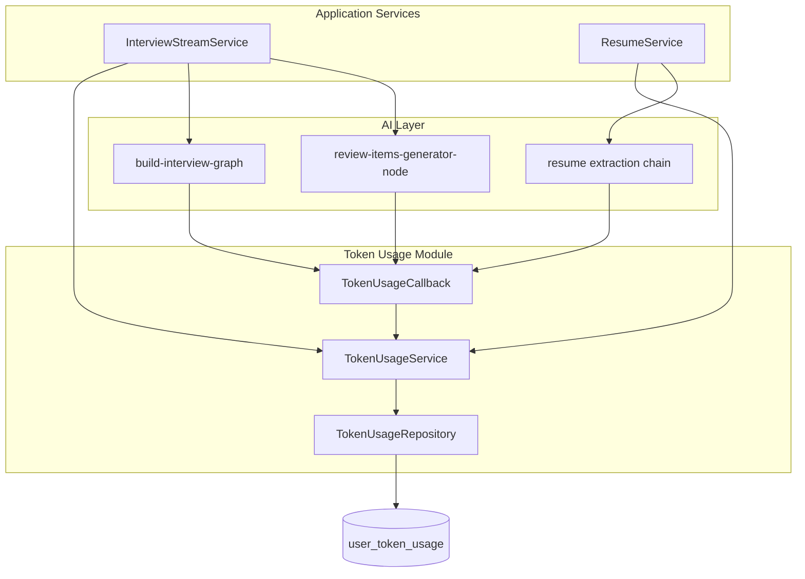

# Token Usage Limits — Design

**Spec**: `.specs/features/token-usage-limits/spec.md`

## Architecture

## Components

| Component | Location | Role |
|-----------|----------|------|
| `UserTokenUsage` | `prisma/schema/user.prisma` | Monthly usage row per user |
| `TokenUsageRepository` | `modules/token-usage/repository/` | Upsert + atomic increment |
| `TokenUsageService` | `modules/token-usage/service/` | `assertWithinLimit`, `recordUsage`, `getUsage` |
| `createUsageCaptureCallback` | `modules/token-usage/callbacks/` | LangChain `handleLLMEnd` capture |
| `extractLlmUsage` | `modules/token-usage/utils/` | Normalize metadata shapes |
| `TokenLimitExceededError` | `shared/errors/http-errors.ts` | 429 with quota message |

## Integration Points

1. **InterviewStreamService** — `assertWithinLimit` before `writeHead`; pass callbacks to graph; `recordUsage` after interviewer; repeat before/after review generator on final turn.
2. **build-interview-graph** — accept `callbacks` in stream options; pass to `graph.stream` config.
3. **review-items-generator-node** — accept optional `RunnableConfig` with callbacks.
4. **ResumeService.process** — assert before extraction; record after; fail resume on limit.

## Env Vars

| Variable | Default |
|----------|---------|
| `TOKEN_LIMIT_ENABLED` | `true` |
| `TOKEN_LIMIT_MONTHLY_MAX` | `500000` |
