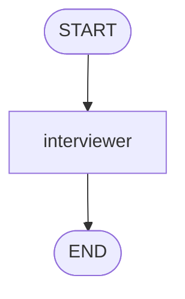
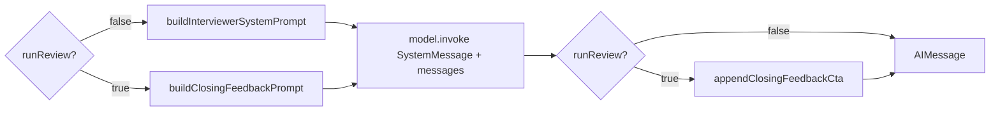
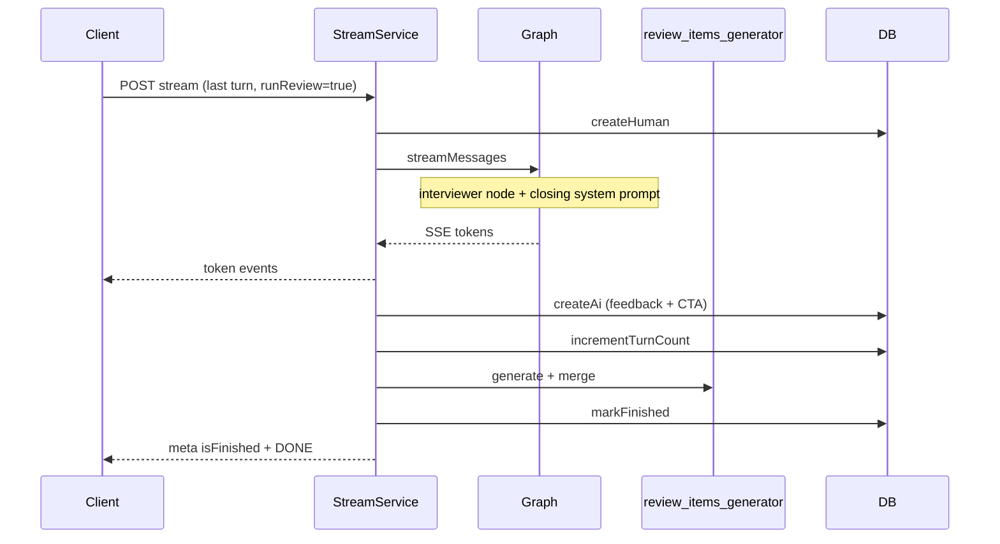

# Unified Interviewer Closing — Specification

## Problem Statement

The mock interview graph today uses **two LangGraph nodes** (`interviewer` and `closing_feedback`) that share the same model, checkpointed `messages`, and invoke pattern, but differ only in **which system prompt** is sent. Routing on the last turn (`runReview === true` → `closing_feedback`) adds graph complexity, duplicate node code, and SSE filtering for a second node name—without giving the closing path more conversation context than the interviewer already has.

We want a **single `interviewer` node** that, on the final turn, swaps to the **closing feedback system prompt** (today in `closing-feedback-prompt.ts`), evaluates the **full checkpointed conversation**, streams structured feedback + CTA, and leaves the **review items pipeline** unchanged outside the graph.

## Goals

- [x] Remove the `closing_feedback` LangGraph node and all graph routing to it.
- [x] On the final user turn, the **`interviewer` node** SHALL use `buildClosingFeedbackPrompt()` (not `buildInterviewerSystemPrompt()`) while still passing the **complete** `state.messages` history.
- [x] Preserve closing feedback product behavior: Markdown evaluation (CommonMark), candidate-only credit rules, résumé as background, CTA to review items, post-stream `review_items_generator` + `markFinished`.
- [x] Keep non-final turns unchanged: interviewer persona, conduct rules, one question per turn.
- [x] Simplify SSE streaming to a **single** allowed node name (`interviewer`).

## Out of Scope

| Item | Reason |
|------|--------|
| Merging `closing-feedback-prompt.ts` into `interviewer-system-prompt.ts` | Keep two prompt builders; only **selection** moves into `interviewer-node` |
| Changing review items generation, merge, or API | Unchanged post-graph pipeline |
| Frontend UI changes | Backend-only; SSE contract unchanged |
| Renaming `runReview` in graph input | May keep name; semantics become “use closing prompt” not “route to other node” |
| Filtering `state.messages` to human-only before `invoke` | Prompt-level rules only (same as today); optional follow-up feature |
| Different model / temperature for closing vs interview | Same `createInterviewModel()` unless a later design adds it |

---

## Relationship to Existing Features

| Spec | Relationship |
|------|----------------|
| [interview-closing-feedback](../interview-closing-feedback/spec.md) | **Superseded** for graph routing and `closing_feedback` node (ICF-01, ICF-02, ICF-04, ICF-09 partial). Closing **content** requirements (ICF-06–08, ICF-11–13) remain valid via unified interviewer. |
| [ai-mock-interview](../ai-mock-interview/spec.md) | Unchanged except cross-reference: final turn uses interviewer node with closing prompt. |

**Brownfield touchpoints (current → target):**

| Area | Current | Target |
|------|---------|--------|
| Graph | `START → (interviewer \| closing_feedback) → END` | `START → interviewer → END` |
| `runReview` | Routes to `closing_feedback` | Selects closing vs interview **system prompt** inside `interviewer` |
| `interviewer-node.ts` | Always `buildInterviewerSystemPrompt` | `runReview ? buildClosingFeedbackPrompt : buildInterviewerSystemPrompt` |
| `closing-feedback-node.ts` | Final-turn LLM + CTA append | **Deleted**; logic absorbed by `interviewer-node` |
| `build-interview-graph.ts` | Two nodes, `routeFromStart`, CTA suffix on `runReview` | One node; CTA append when `runReview` after stream |
| `stream-message-tokens.ts` | Allow `interviewer` + `closing_feedback` | Allow `interviewer` only |
| `closing-feedback-prompt.ts` | Used by closing node | Used by interviewer node on final turn |

---

## Architecture Overview

### Graph (simplified)



Inside `interviewer`:



### Final turn sequence (unchanged service order)



---

## User Stories

### P1: Single node, dual prompt on final turn ⭐ MVP

**User Story**: As a candidate finishing a mock interview, I want one consistent “interview” flow that ends with the same closing feedback as today, so that the session closes clearly without extra graph complexity behind the scenes.

**Why P1**: Core refactor; product behavior must not regress.

**Acceptance Criteria**:

1. WHEN the interview graph is compiled THEN it SHALL contain only the `interviewer` node (plus `START` / `END`) and SHALL NOT register `closing_feedback`.
2. WHEN `runReview === false` THEN `interviewer` SHALL invoke the model with `buildInterviewerSystemPrompt(...)` and the full checkpointed `state.messages`.
3. WHEN `runReview === true` (final turn: `session.turnCount + 1 >= session.maxTurns` in `InterviewStreamService`) THEN `interviewer` SHALL invoke the model with `buildClosingFeedbackPrompt({ level, resumeSummary })` and the **same** full `state.messages` (no truncation).
4. WHEN `runReview === true` and the model returns content THEN the persisted AI message SHALL include `appendClosingFeedbackCta` output (idempotent CTA suffix) as today.
5. WHEN `runReview === true` THEN the model output SHALL NOT be instructed to ask a new interview question (closing prompt rules preserved).

**Independent Test**: Unit test `interviewer-node`: mock state with `runReview: true` asserts system message content matches closing prompt headers (`## What to evaluate`, `## Format`); `runReview: false` asserts `## Conduct`. Graph compilation test: node set is `{ interviewer }` only.

---

### P1: Non-final turns unchanged ⭐ MVP

**User Story**: As a candidate mid-interview, I want the Tech Lead to behave exactly as before on non-final turns.

**Acceptance Criteria**:

1. WHEN `runReview === false` THEN the system SHALL use `buildInterviewerSystemPrompt` with `turnCount`, `maxTurns`, `level`, and `resumeSummary`.
2. WHEN a non-final turn completes THEN the system SHALL NOT append closing CTA or run `review_items_generator` / `markFinished`.

**Independent Test**: Existing interviewer prompt tests + stream service test with `runReview: false`.

---

### P1: SSE streams only from interviewer ⭐ MVP

**User Story**: As a frontend consumer, I want streamed tokens only from the interviewer node, since there is no separate closing node.

**Acceptance Criteria**:

1. WHEN the graph streams with `streamMode: "messages"` THEN `extractStreamTokenFromChunk` SHALL emit tokens only for chunks where `langgraph_node === "interviewer"`.
2. WHEN `runReview === true` THEN tokens SHALL still stream incrementally from the same node name (`interviewer`).

**Independent Test**: Update `stream-message-tokens.test.ts` to remove `closing_feedback` fixtures; final-turn scenario still yields tokens.

---

### P1: Remove closing_feedback implementation ⭐ MVP

**User Story**: As a maintainer, I want dead code removed so the codebase matches the single-node design.

**Acceptance Criteria**:

1. WHEN the feature is complete THEN `src/infrastructure/ai/langgraph/nodes/closing-feedback-node.ts` SHALL be deleted.
2. WHEN the feature is complete THEN `build-interview-graph.ts` SHALL NOT import `createClosingFeedbackNode` or define `routeFromStart` branching to `closing_feedback`.
3. WHEN searching production `src/` for `closing_feedback` (node name) or `createClosingFeedbackNode` THEN there SHALL be zero matches (tests may reference removal in migration notes only).

**Independent Test**: `grep` gate in CI or manual check; graph structure test updated.

---

### P2: Documentation and spec alignment

**User Story**: As a developer, I want docs and specs to describe the unified flow so onboarding matches the code.

**Acceptance Criteria**:

1. WHEN docs are updated THEN `docs/prompts-catalog.md` and `docs/frontend-mock-interview-api.md` SHALL state that prompt 2 (closing feedback) is invoked **via the interviewer node** on the last turn, not a separate graph node.
2. WHEN `interview-closing-feedback/spec.md` is updated THEN it SHALL reference this feature as superseding graph routing (or archive with pointer).

**Independent Test**: Doc review checklist in PR.

---

## Functional Requirements (traceable)

### Graph & node

| ID | Story | Requirement |
|----|-------|-------------|
| UIC-01 | P1 single node | Graph SHALL have exactly one LLM node: `interviewer`. |
| UIC-02 | P1 single node | `START` SHALL edge to `interviewer`; `interviewer` SHALL edge to `END`. |
| UIC-03 | P1 dual prompt | `interviewer` SHALL branch on `state.runReview` for system prompt only (not graph routing). |
| UIC-04 | P1 dual prompt | Final-turn criterion SHALL remain `session.turnCount + 1 >= session.maxTurns` → `runReview: true` in `InterviewStreamService`. |

### Closing behavior (preserved)

| ID | Story | Requirement |
|----|-------|-------------|
| UIC-05 | P1 closing | Closing system prompt SHALL remain `buildClosingFeedbackPrompt` (sections: Role, What to evaluate, Level, Résumé, Format, Security). |
| UIC-06 | P1 closing | Closing prompt SHALL instruct evaluation of candidate messages only; no credit for assistant coaching or résumé as demonstrated answers. |
| UIC-07 | P1 closing | Closing output SHALL be a Markdown string (CommonMark) suitable for `interview_messages.content`. |
| UIC-08 | P1 closing | CTA SHALL use `appendClosingFeedbackCta` / `closingFeedbackCtaStreamSuffix` from `closing-feedback-prompt.ts`. |

### Interview behavior (preserved)

| ID | Story | Requirement |
|----|-------|-------------|
| UIC-09 | P1 mid | Non-final turns SHALL use `buildInterviewerSystemPrompt` unchanged in product intent (conduct, anti-lecture, phase hints). |
| UIC-10 | P1 mid | Non-final turns SHALL NOT append closing CTA. |

### Streaming & service

| ID | Story | Requirement |
|----|-------|-------------|
| UIC-11 | P1 SSE | Stream filter allowlist SHALL be `["interviewer"]` only. |
| UIC-12 | P1 service | Final-turn order SHALL remain: `createHuman` → graph stream → `createAi` → `incrementTurnCount` → `review_items_generator` → merge → `markFinished` → `meta` + `DONE`. |
| UIC-13 | P1 service | `409` on stream to finished session SHALL remain unchanged. |

### Cleanup

| ID | Story | Requirement |
|----|-------|-------------|
| UIC-14 | P1 cleanup | Delete `closing-feedback-node.ts` and its dedicated unit tests (if any). |
| UIC-15 | P1 cleanup | Update `build-interview-graph.test.ts` mocks and assertions for single-node graph. |

### Documentation

| ID | Story | Requirement |
|----|-------|-------------|
| UIC-16 | P2 docs | Update prompt catalog and frontend API doc diagrams. |
| UIC-17 | P2 docs | Add supersession note to `interview-closing-feedback/spec.md`. |

---

## Edge Cases

- WHEN the model on a final turn asks an interview question despite closing prompt THEN behavior is **best-effort** (prompt-only); no code guard in v1. Manual QA on final turn after deploy.
- WHEN the candidate’s last message is empty or trivial THEN closing feedback SHALL still run; prompt already requires honesty about shallow participation.
- WHEN `review_items_generator` fails after feedback tokens were sent THEN existing error handling SHALL apply (ICF-12: prefer not `markFinished` if items failed—unchanged).
- WHEN client disconnects mid closing stream THEN existing partial-message policy applies (AMI-DEC-03).

---

## Requirement Traceability

| Requirement ID | Story | Phase | Status |
|----------------|-------|-------|--------|
| UIC-01 | P1 single node | Execute | Done |
| UIC-02 | P1 single node | Execute | Done |
| UIC-03 | P1 dual prompt | Execute | Done |
| UIC-04 | P1 dual prompt | Execute | Done |
| UIC-05 | P1 closing | Execute | Done |
| UIC-06 | P1 closing | Execute | Done |
| UIC-07 | P1 closing | Execute | Done |
| UIC-08 | P1 closing | Execute | Done |
| UIC-09 | P1 mid | Execute | Done |
| UIC-10 | P1 mid | Execute | Done |
| UIC-11 | P1 SSE | Execute | Done |
| UIC-12 | P1 service | Execute | Done |
| UIC-13 | P1 service | Execute | Done |
| UIC-14 | P1 cleanup | Execute | Done |
| UIC-15 | P1 cleanup | Execute | Done |
| UIC-16 | P2 docs | Execute | Done |
| UIC-17 | P2 docs | Execute | Done |

**Coverage:** 17 total, 17 implemented, 0 pending.

---

## Success Criteria

- [x] Graph compiles with one LLM node; all existing interview graph tests updated and passing.
- [ ] Final-turn E2E or integration path produces closing feedback format (`## What you did well` / `## What to work on` + `-` lists) + CTA, not a new interview question (manual smoke on mid session).
- [x] Non-final turns behave as before (regression on interviewer prompt tests).
- [x] No `closing_feedback` node references in `src/` production code.
- [ ] `npm test` passes for `langgraph`, `interview/prompts`, and `stream-service` suites.

---

## Suggested implementation notes (for Design / Tasks)

**`interviewer-node.ts` (conceptual):**

```ts
const systemPrompt = state.runReview
  ? buildClosingFeedbackPrompt({ level: state.level, resumeSummary: state.resumeSummary })
  : buildInterviewerSystemPrompt({
      level: state.level,
      resumeSummary: state.resumeSummary,
      turnCount: state.turnCount,
      maxTurns: state.maxTurns,
    });

const response = await model.invoke([new SystemMessage(systemPrompt), ...state.messages]);

// if runReview: appendClosingFeedbackCta on content before AIMessage
```

**Do not hybridize** interview + closing text in one system prompt string—**full swap** on final turn.

---

## Next steps (TLC workflow)

| Phase | Action |
|-------|--------|
| **Design** (recommended) | Optional short `design.md`: file delete list, test matrix, ICF → UIC mapping |
| **Tasks** | `tasks.md` with atomic items per UIC-01–15 |
| **Execute** | Implement after spec approval |

**Approve this spec** before Design/Execute. To implement in Agent mode, say *implement unified-interviewer-closing*.
