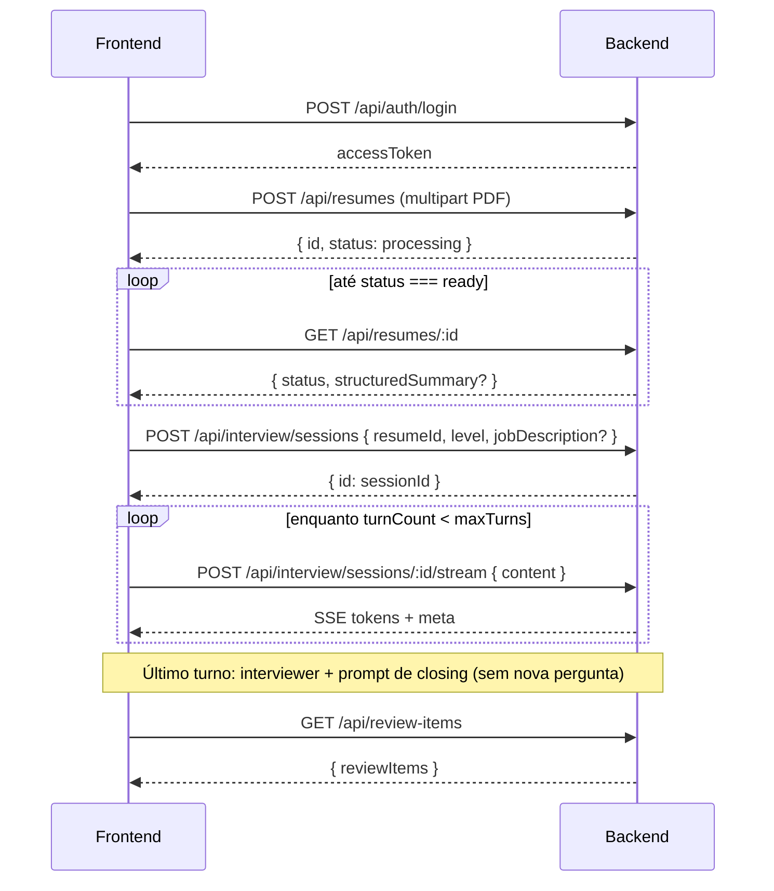
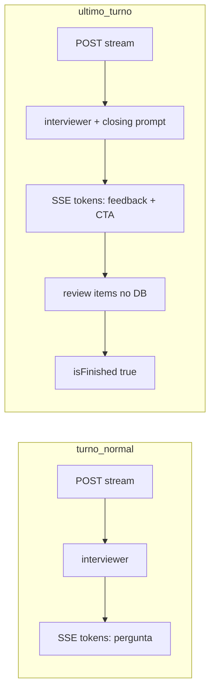
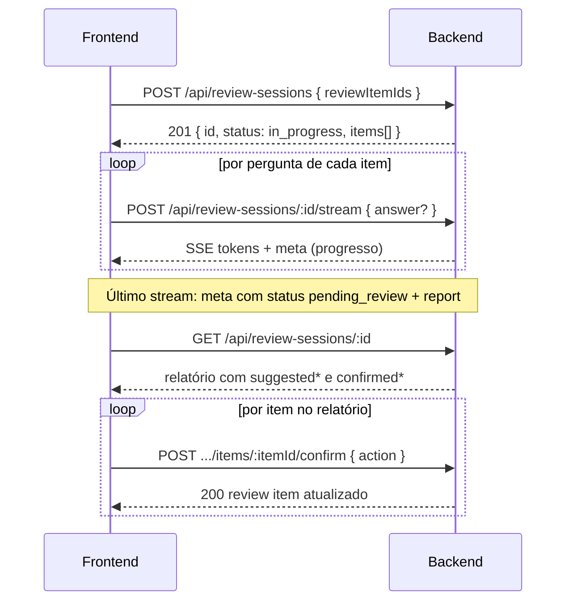

# API — Mock Interview (guia para o frontend)

Documento de integração para consumir o backend de **entrevista simulada com IA**, cobrindo:

1. **AI Mock Interview** — upload de currículo, sessão, chat via SSE e histórico.
2. **Interview Closing Feedback** — comportamento do **último turno** (feedback de encerramento em vez de nova pergunta do entrevistador).
3. **Review Items** — listagem com filtro por status, marcação manual e exclusão.
4. **Review Sessions** — sessão adaptativa de revisão por tópico (Q&A via SSE, avaliação e confirmação).

> **Base URL:** `{API_ORIGIN}/api` (ex.: `http://localhost:3000/api` se o backend roda na porta 3000).

---

## Índice

1. [Visão geral do fluxo](#visão-geral-do-fluxo)
2. [Autenticação](#autenticação)
3. [Convenções](#convenções)
4. [Currículos (`/resumes`)](#currículos-resumes)
5. [Entrevista (`/interview`)](#entrevista-interview)
6. [Streaming SSE (`POST .../stream`)](#streaming-sse-post-sessionidstream)
7. [Como a entrevista funciona (turnos e nós)](#como-a-entrevista-funciona-turnos-e-nós)
8. [Itens de revisão (review items)](#itens-de-revisão-review-items)
9. [Sessões de revisão (review sessions)](#sessões-de-revisão-review-sessions)
10. [Erros HTTP](#erros-http)
11. [CORS e limitações](#cors-e-limitações)
12. [Sugestão de estados na UI](#sugestão-de-estados-na-ui)

---

## Visão geral do fluxo



**Ordem recomendada na UI:**

1. Login → guardar `accessToken`.
2. Upload do PDF → guardar `resumeId` → polling em `GET /resumes/:id` até `ready` ou `failed`.
3. Escolher nível (`entry` | `mid` | `senior`) → `POST /interview/sessions`.
4. Tela de chat: cada resposta do candidato → `POST .../stream` e consumir SSE.
5. No último turno, exibir a mensagem de **feedback final** (não é pergunta) e direcionar para a aba de itens de revisão.
6. (Opcional) Iniciar uma **Review Session** a partir de itens `active` selecionados → Q&A via SSE → relatório → confirmar sugestões.

---

## Autenticação

Todas as rotas deste documento (exceto auth pública) exigem header:

```http
Authorization: Bearer <accessToken>
```

O `userId` vem **somente do JWT**; não envie `userId` no body.

### Login (referência)

| Método | Path | Body |
|--------|------|------|
| `POST` | `/api/auth/login` | Credenciais conforme módulo auth do projeto |

**Resposta (200):**

```json
{
  "accessToken": "eyJ...",
  "refreshToken": "..."
}
```

**Erros comuns:** `401` com `{ "message": "..." }` se o token estiver ausente, inválido ou expirado.

---

## Convenções

| Tópico | Detalhe |
|--------|---------|
| **JSON** | Campos em **camelCase** (`resumeId`, `turnCount`, `structuredSummary`). |
| **Datas** | ISO 8601 em JSON (`createdAt`). |
| **IDs** | UUID para currículo, sessão e mensagens. |
| **Erros** | Corpo `{ "message": "string" }` e status HTTP adequado. |
| **Ownership** | Recursos de outro usuário retornam `404` (sem vazar existência). |

---

## Currículos (`/resumes`)

O currículo é processado **de forma assíncrona** após o upload. A entrevista só pode começar com status `ready`.

### `POST /api/resumes` — Upload PDF

**Content-Type:** `multipart/form-data`  
**Campo do arquivo:** `file` (único arquivo PDF)

**Validações:**

- MIME: `application/pdf`
- Tamanho máximo: `RESUME_MAX_BYTES` (padrão **5 MB** = 5_242_880 bytes)

**Resposta (201):**

```json
{
  "id": "550e8400-e29b-41d4-a716-446655440000",
  "name": "curriculo.pdf",
  "status": "processing",
  "createdAt": "2026-05-27T12:00:00.000Z"
}
```

**Erros:**

| Status | Quando |
|--------|--------|
| `400` | Sem arquivo, não é PDF, ou excede tamanho |
| `401` | Não autenticado |
| `502` | Falha ao enviar para storage |
| `503` | Fila de processamento indisponível |

### `GET /api/resumes/:id` — Status e resumo estruturado

Use para **polling** após o upload (intervalo sugerido: 2–5 s até `ready` ou `failed`).

**Resposta (200) — ainda processando:**

```json
{
  "id": "...",
  "name": "curriculo.pdf",
  "status": "processing",
  "createdAt": "..."
}
```

**Resposta (200) — pronto:**

```json
{
  "id": "...",
  "name": "curriculo.pdf",
  "status": "ready",
  "createdAt": "...",
  "structuredSummary": {
    "personal_info": {
      "name": "Maria Silva",
      "title": "Desenvolvedora Backend",
      "about": "opcional"
    },
    "skills": ["TypeScript", "Node.js"],
    "experiences": [
      {
        "company": "Empresa X",
        "role": "Dev Pleno",
        "highlights": ["API REST", "PostgreSQL"]
      }
    ],
    "projects": [
      {
        "name": "Projeto Y",
        "description": "opcional",
        "technologies": ["opcional"],
        "highlights": ["opcional"]
      }
    ],
    "certifications": ["opcional"]
  }
}
```

**Status possíveis:** `processing` | `ready` | `failed`

> Quando `failed`, o backend persiste `errorMessage` no banco, mas **não expõe** esse campo no `GET` atual — trate `failed` na UI com mensagem genérica e opção de reenviar o PDF.

---

## Entrevista (`/interview`)

Prefixo das rotas: `/api/interview`.

### Limites de turnos por nível

| `level` | `maxTurns` (respostas do candidato por sessão) |
|---------|-----------------------------------------------|
| `entry` | 5 |
| `mid`   | 7 |
| `senior`| 8 |

Cada **turno** = uma mensagem do candidato (`human`) + uma resposta da IA (`ai`).

O backend expõe `turnCount` e `maxTurns` na listagem de sessões e no evento SSE `meta`.

---

### `POST /api/interview/sessions` — Criar sessão

**Body:**

```json
{
  "resumeId": "uuid-do-curriculo",
  "level": "entry",
  "jobDescription": "opcional — texto da vaga (máx. 5000 caracteres)"
}
```

`level`: `"entry"` | `"mid"` | `"senior"`

`jobDescription` (opcional): quando informado, o backend **sanitiza** o texto (remove HTML, neutraliza padrões comuns de prompt injection) antes de persistir e injetar no prompt do entrevistador. Omita o campo ou envie string vazia para entrevista genérica.

**Resposta (201):**

```json
{
  "id": "uuid-da-sessao"
}
```

**Pré-requisitos:**

- Currículo existe, pertence ao usuário autenticado e `status === "ready"`.

**Erros:**

| Status | Mensagem típica |
|--------|-----------------|
| `400` | `Resume is still being processed` / `Resume processing failed` / `Resume is not ready for interview` |
| `404` | Currículo inexistente ou de outro usuário |
| `401` | Não autenticado |

---

### `GET /api/interview/sessions` — Listar sessões do usuário

**Resposta (200):**

```json
{
  "sessions": [
    {
      "id": "uuid",
      "resumeId": "uuid",
      "level": "mid",
      "turnCount": 3,
      "maxTurns": 7,
      "isFinished": false,
      "hasJobDescription": true,
      "createdAt": "2026-05-27T12:00:00.000Z"
    }
  ]
}
```

Ordenação: mais recentes primeiro (`createdAt` desc).

---

### `GET /api/interview/sessions/:sessionId/messages` — Histórico do chat

**Resposta (200):**

```json
{
  "messages": [
    {
      "id": "uuid",
      "role": "human",
      "content": "Minha resposta...",
      "createdAt": "..."
    },
    {
      "id": "uuid",
      "role": "ai",
      "content": "Pergunta ou feedback do entrevistador...",
      "createdAt": "..."
    }
  ]
}
```

`role`: `"human"` | `"ai"` — ordem cronológica por `createdAt`.

**Erros:** `404` se a sessão não existir ou não pertencer ao usuário.

**Uso na UI:**

- Ao abrir uma sessão existente, carregue o histórico antes de permitir novo envio.
- Se `isFinished === true`, desabilite o input e mostre que a entrevista terminou.

---

## Streaming SSE (`POST .../stream`)

### `POST /api/interview/sessions/:sessionId/stream`

Envia a **resposta do candidato** e recebe a resposta da IA em **Server-Sent Events**.

**Body:**

```json
{
  "content": "Texto da resposta do candidato (não vazio após trim)"
}
```

**Headers da requisição:**

```http
Authorization: Bearer <token>
Content-Type: application/json
Accept: text/event-stream
```

**Resposta:** `200` com corpo `text/event-stream` (não é JSON único).

### Formato dos eventos SSE

O backend escreve eventos no formato padrão SSE:

```
event: token
data: {"content":"trecho"}

event: meta
data: {"turnCount":1,"maxTurns":5,"isFinished":false}

data: [DONE]

```

| Evento | Payload `data` | Quando |
|--------|----------------|--------|
| `token` | `{ "content": "string" }` | Fragmento de texto da IA (concatene na UI) |
| `meta` | `{ "turnCount": number, "maxTurns": number, "isFinished": boolean }` | Após a IA terminar e o turno ser persistido |
| `error` | `{ "message": "string" }` | Falha durante o stream |
| *(sem event name)* | `[DONE]` | Fim do stream (sempre após sucesso ou após `error`) |

### Consumo no frontend

`EventSource` nativo **não serve** aqui (só suporta GET). Use **`fetch` + `ReadableStream`** ou biblioteca equivalente:

```typescript
async function streamTurn(
  sessionId: string,
  content: string,
  accessToken: string,
  onToken: (chunk: string) => void,
  onMeta: (meta: { turnCount: number; maxTurns: number; isFinished: boolean }) => void,
) {
  const res = await fetch(
    `${API_ORIGIN}/api/interview/sessions/${sessionId}/stream`,
    {
      method: "POST",
      headers: {
        Authorization: `Bearer ${accessToken}`,
        "Content-Type": "application/json",
        Accept: "text/event-stream",
      },
      body: JSON.stringify({ content }),
    },
  );

  if (!res.ok) {
    const err = await res.json().catch(() => ({ message: res.statusText }));
    throw new Error(err.message);
  }

  const reader = res.body!.getReader();
  const decoder = new TextDecoder();
  let buffer = "";

  while (true) {
    const { done, value } = await reader.read();
    if (done) break;
    buffer += decoder.decode(value, { stream: true });

    const blocks = buffer.split("\n\n");
    buffer = blocks.pop() ?? "";

    for (const block of blocks) {
      if (block.includes("data: [DONE]")) continue;

      const eventMatch = block.match(/^event: (\w+)/m);
      const dataMatch = block.match(/^data: (.+)$/m);
      if (!dataMatch) continue;

      const event = eventMatch?.[1];
      const data = JSON.parse(dataMatch[1]);

      if (event === "token") onToken(data.content);
      if (event === "meta") onMeta(data);
      if (event === "error") throw new Error(data.message);
    }
  }
}
```

### Guardas antes de abrir o stream

O backend valida **antes** de iniciar o SSE:

| Condição | Status |
|----------|--------|
| Sessão inexistente / outro usuário | `404` |
| `isFinished === true` ou `turnCount >= maxTurns` | `409` — `"Interview session is finished"` |
| Body inválido (`content` vazio) | `400` |

### Comportamento em desconexão

Se o cliente **abortar** a conexão no meio do stream:

- O processamento no servidor para.
- A mensagem `human` **já foi salva** no início do turno.
- A mensagem `ai` pode **não** ser persistida se o stream não completou.
- Itens de revisão e `markFinished` **não** rodam se o turno final foi interrompido.

Na UI: trate abort como turno incompleto; considere recarregar mensagens com `GET .../messages`.

---

## Como a entrevista funciona (turnos e nós)

### Turnos normais (não é o último)

Quando `turnCount + 1 < maxTurns`:

1. Backend persiste mensagem `human`.
2. Grafo LangGraph executa o nó **`interviewer`** (Tech Lead faz **nova pergunta**).
3. Tokens são enviados via SSE (`event: token`).
4. Mensagem `ai` é salva; `turnCount` incrementa.
5. SSE `meta` com `isFinished: false` + `[DONE]`.

### Último turno — Closing Feedback

Quando `turnCount + 1 >= maxTurns` (critério interno: `runReview: true`):

1. Backend persiste mensagem `human`.
2. Grafo executa o nó **`interviewer`** com o prompt de **closing feedback** (`runReview: true`).
3. A IA envia **feedback geral** da entrevista (sem nova pergunta).
4. O backend acrescenta um **CTA fixo em inglês** sobre a aba de review items após o texto gerado pela IA (não é gerado pelo modelo).
5. Mensagem `ai` salva; `turnCount` incrementa.
6. Backend gera **itens de revisão estruturados** (LLM separado), insere apenas tópicos novos no banco e marca `isFinished: true`.
7. SSE `meta` com `isFinished: true` + `[DONE]`.



### Implicações para o chat na UI

| Turno | O que o usuário vê na bolha `ai` |
|-------|----------------------------------|
| 1 … N-1 | Pergunta do entrevistador (texto simples) |
| N (último) | Feedback de encerramento em **Markdown** (CommonMark: parágrafo + `##` + listas `-`) + CTA em texto simples |

No último turno, `content` é uma string Markdown compatível com **remark** / `react-markdown`. Acumule os tokens do SSE e renderize após o stream (remark não é incremental). O CTA fixo em inglês vem após `\n\n` e renderiza como parágrafo normal.

**Não espere** uma pergunta do entrevistador no último turno.

**Contador na UI:** use `turnCount` / `maxTurns` do `meta` ou da sessão. Ex.: `entry` com `maxTurns: 5` → após o 5º envio do candidato, `isFinished` passa a `true`.

### Primeira mensagem da sessão

O backend **não** envia mensagem inicial da IA automaticamente. Fluxos possíveis:

- **Opção A:** UI mostra texto fixo de boas-vindas e o candidato envia a primeira resposta (dispara o 1º stream).
- **Opção B:** Backend futuro com mensagem inicial (não implementado hoje).

---

## Itens de revisão (review items)

Após o **último turno** com sucesso, o backend:

- Gera tópicos `{ topic, description, priority }` com `priority`: `low` | `medium` | `high`.
- Insere apenas tópicos **novos** (sem match por `topic` existente); itens já cadastrados (ativos ou aprendidos) **não são alterados** pela entrevista normal.

Cada item possui `status`: `active` | `learned`. Itens aprendidos têm `learnedAt` preenchido; ao voltar para `active`, `learnedAt` é limpo (`null`).

### Listar itens (`GET /api/review-items`)

| Método | Path | Auth |
|--------|------|------|
| `GET` | `/api/review-items` | Bearer |

**Query (opcional):**

| Parâmetro | Valores | Padrão | Descrição |
|-----------|---------|--------|-----------|
| `status` | `active` \| `learned` \| `all` | `active` | Filtra itens por status |

Exemplos: `GET /api/review-items`, `GET /api/review-items?status=learned`, `GET /api/review-items?status=all`

**Resposta `200`:**

```json
{
  "reviewItems": [
    {
      "id": "550e8400-e29b-41d4-a716-446655440000",
      "sessionId": "660e8400-e29b-41d4-a716-446655440001",
      "topic": "system design",
      "description": "Practice scalability patterns and trade-offs.",
      "priority": "high",
      "status": "active",
      "learnedAt": null,
      "createdAt": "2026-05-28T12:00:00.000Z",
      "updatedAt": "2026-05-29T10:30:00.000Z"
    }
  ]
}
```

| Campo | Tipo | Notas |
|-------|------|-------|
| `priority` | `low` \| `medium` \| `high` | Badge / cor na UI |
| `status` | `active` \| `learned` | Estado de aprendizado |
| `learnedAt` | ISO 8601 ou `null` | Preenchido quando `status === "learned"` |

**Ordenação:**

- `status=active` ou `all`: prioridade (`high` → `medium` → `low`), depois `updatedAt` mais recente.
- `status=learned`: `learnedAt` desc (fallback `updatedAt` desc).

Lista **agregada por usuário** (um tópico por `topic`). Sem itens: `{ "reviewItems": [] }` (não usar `404`).

**Erros:** `422` se `status` inválido.

**Sugestão de UI:** após `meta.isFinished === true` no último stream, chamar este endpoint (ou refetch ao abrir a aba). O CTA no closing feedback já aponta para essa aba.

### Atualizar status manualmente (`PATCH /api/review-items/:id`)

Marca ou desmarca um item como aprendido **fora** de uma Review Session.

| Método | Path | Auth |
|--------|------|------|
| `PATCH` | `/api/review-items/:id` | Bearer |

**Body:**

```json
{ "status": "learned" }
```

ou

```json
{ "status": "active" }
```

**Resposta `200`:** mesmo shape de um elemento da listagem (objeto único, não envelopado):

```json
{
  "id": "550e8400-e29b-41d4-a716-446655440000",
  "sessionId": "660e8400-e29b-41d4-a716-446655440001",
  "topic": "system design",
  "description": "Practice scalability patterns and trade-offs.",
  "priority": "high",
  "status": "learned",
  "learnedAt": "2026-07-07T15:00:00.000Z",
  "createdAt": "2026-05-28T12:00:00.000Z",
  "updatedAt": "2026-07-07T15:00:00.000Z"
}
```

**Comportamento:**

- `status: "learned"` → define `learnedAt` para o momento atual.
- `status: "active"` → limpa `learnedAt` (`null`). `priority` **não** é alterada.

**Erros:**

| Status | Quando |
|--------|--------|
| `404` | Item inexistente ou de outro usuário |
| `422` | Body inválido |

---

## Sessões de revisão (review sessions)

Prefixo das rotas: `/api/review-sessions`.

Fluxo completo: selecionar itens `active` → criar sessão → Q&A adaptativo por item via SSE → relatório com sugestões → confirmar cada item individualmente.

Cada item da sessão recebe **N perguntas** (padrão **3**, configurável no servidor via `REVIEW_SESSION_QUESTION_COUNT`). O backend faz snapshot de `topic`, `description` e `currentPriority` no momento da criação.



### `POST /api/review-sessions` — Criar sessão

**Body:**

```json
{
  "reviewItemIds": [
    "550e8400-e29b-41d4-a716-446655440000",
    "660e8400-e29b-41d4-a716-446655440001"
  ]
}
```

| Regra | Detalhe |
|-------|---------|
| Mínimo | 1 item |
| Máximo | 10 itens |
| Duplicatas | Não permitidas |
| Seleção | Todos devem ser `active` e pertencer ao usuário |

**Resposta (201):**

```json
{
  "id": "770e8400-e29b-41d4-a716-446655440002",
  "status": "in_progress",
  "items": [
    {
      "id": "880e8400-e29b-41d4-a716-446655440003",
      "reviewItemId": "550e8400-e29b-41d4-a716-446655440000",
      "topic": "system design",
      "currentPriority": "high"
    },
    {
      "id": "990e8400-e29b-41d4-a716-446655440004",
      "reviewItemId": "660e8400-e29b-41d4-a716-446655440001",
      "topic": "rest apis",
      "currentPriority": "medium"
    }
  ]
}
```

> O `id` em cada elemento de `items` é o **ReviewSessionItem** (use-o em `confirm`). `reviewItemId` referencia o `review_items` original.

**Erros:**

| Status | Quando |
|--------|--------|
| `404` | Qualquer ID inexistente, de outro usuário ou com `status !== "active"` |
| `422` | Body inválido (vazio, duplicado, >10) |

---

### `POST /api/review-sessions/:id/stream` — Q&A via SSE

Mesmo padrão de consumo da entrevista (`fetch` + `ReadableStream`), mas com body `{ answer? }` em vez de `{ content }`.

**Primeira chamada** (início da sessão): body vazio `{}` ou sem campo `answer`.

**Chamadas seguintes:** body obrigatório com resposta à pergunta pendente:

```json
{
  "answer": "Texto da resposta do candidato (1–4000 caracteres após trim)"
}
```

**Headers:**

```http
Authorization: Bearer <token>
Content-Type: application/json
Accept: text/event-stream
```

**Resposta:** `200` com `text/event-stream`.

#### Eventos SSE — turno intermediário

```
event: token
data: {"content":"Can you walk me through"}

event: token
data: {"content":" how you'd shard this table?"}

event: meta
data: {"reviewSessionItemId":"880e8400-e29b-41d4-a716-446655440003","itemIndex":0,"totalItems":2,"turnsCompleted":1,"questionsPerItem":3,"status":"in_progress"}

data: [DONE]
```

| Evento | Payload `data` | Quando |
|--------|----------------|--------|
| `token` | `{ "content": "string" }` | Fragmento da pergunta (concatene na UI) |
| `meta` | Ver tabela abaixo | Após a pergunta ser gerada e persistida como pendente |
| `error` | `{ "message": "string" }` ou `{ "message": "string", "reviewSessionItemId": "uuid" }` | Falha na geração ou na avaliação de um item |
| *(sem event name)* | `[DONE]` | Fim do stream |

**`meta` intermediário:**

| Campo | Tipo | Descrição |
|-------|------|-----------|
| `reviewSessionItemId` | UUID | Item da sessão em foco |
| `itemIndex` | number | Índice 0-based na ordem da sessão |
| `totalItems` | number | Total de itens selecionados |
| `turnsCompleted` | number | Respostas já dadas **neste** item (antes da pergunta emitida) |
| `questionsPerItem` | number | N (padrão 3) |
| `status` | `"in_progress"` | Status da sessão |

#### Eventos SSE — último turno (avaliação concluída)

Após o candidato responder a última pergunta do último item, o backend avalia todos os itens em paralelo e emite:

```
event: meta
data: {
  "status": "pending_review",
  "report": [
    {
      "reviewSessionItemId": "880e8400-e29b-41d4-a716-446655440003",
      "reviewItemId": "550e8400-e29b-41d4-a716-446655440000",
      "topic": "system design",
      "currentPriority": "high",
      "suggestedStatus": "active",
      "suggestedPriority": "medium"
    },
    {
      "reviewSessionItemId": "990e8400-e29b-41d4-a716-446655440004",
      "reviewItemId": "660e8400-e29b-41d4-a716-446655440001",
      "topic": "rest apis",
      "currentPriority": "medium",
      "suggestedStatus": "learned",
      "suggestedPriority": null
    }
  ]
}

data: [DONE]
```

| Campo do `report[]` | Tipo | Descrição |
|---------------------|------|-----------|
| `reviewSessionItemId` | UUID | ID para `confirm` |
| `reviewItemId` | UUID | ID do `review_items` original |
| `topic` | string | Snapshot do tópico |
| `currentPriority` | `low` \| `medium` \| `high` | Prioridade no momento da criação |
| `suggestedStatus` | `active` \| `learned` \| `null` | Sugestão da IA (`null` se avaliação falhou) |
| `suggestedPriority` | `low` \| `medium` \| `high` \| `null` | Nova prioridade sugerida (só quando `suggestedStatus === "active"`) |

> Itens com avaliação falha mantêm `suggestedStatus: null`; a UI deve oferecer apenas `override` (não `accept`) nesses casos.

#### Guardas antes de abrir o stream

| Condição | Status |
|----------|--------|
| Sessão inexistente / outro usuário | `404` |
| `status === "pending_review"` ou `"completed"` | `409` — `"Review session is not accepting answers"` |
| Não é a primeira chamada e `answer` ausente/vazio | `400` — `"Answer is required"` |
| `answer` enviado sem pergunta pendente | `400` — `"No pending question to answer"` |

#### Comportamento em desconexão

Se o cliente abortar no meio do stream:

- A geração para; `pendingQuestion` **não** é persistida.
- Turnos já confirmados permanecem; a sessão fica `in_progress` para retomada.

---

### `GET /api/review-sessions/:id` — Relatório

Retorna o estado atual da sessão e de cada item (sugestões e confirmações).

**Resposta (200):**

```json
{
  "id": "770e8400-e29b-41d4-a716-446655440002",
  "status": "pending_review",
  "items": [
    {
      "id": "880e8400-e29b-41d4-a716-446655440003",
      "reviewItemId": "550e8400-e29b-41d4-a716-446655440000",
      "topic": "system design",
      "currentPriority": "high",
      "suggestedStatus": "active",
      "suggestedPriority": "medium",
      "confirmedStatus": null,
      "confirmedPriority": null
    },
    {
      "id": "990e8400-e29b-41d4-a716-446655440004",
      "reviewItemId": "660e8400-e29b-41d4-a716-446655440001",
      "topic": "rest apis",
      "currentPriority": "medium",
      "suggestedStatus": "learned",
      "suggestedPriority": null,
      "confirmedStatus": "learned",
      "confirmedPriority": null
    }
  ]
}
```

**`status` da sessão:** `in_progress` | `pending_review` | `completed`

**Erros:** `404` se a sessão não existir ou não pertencer ao usuário.

---

### `POST /api/review-sessions/:id/items/:itemId/confirm` — Confirmar item

Aplica a decisão do usuário sobre um item do relatório. `:itemId` é o **ReviewSessionItem** `id` (não o `reviewItemId`).

**Body (uma das formas):**

Aceitar sugestão da IA:

```json
{ "action": "accept" }
```

Sobrescrever mantendo ativo (prioridade obrigatória):

```json
{ "action": "override", "status": "active", "priority": "high" }
```

Sobrescrever marcando como aprendido (sem `priority`):

```json
{ "action": "override", "status": "learned" }
```

**Resposta (200):** shape de um elemento de `review_items` (objeto único):

```json
{
  "id": "550e8400-e29b-41d4-a716-446655440000",
  "sessionId": "660e8400-e29b-41d4-a716-446655440001",
  "topic": "system design",
  "description": "Practice scalability patterns and trade-offs.",
  "priority": "medium",
  "status": "active",
  "learnedAt": null,
  "createdAt": "2026-05-28T12:00:00.000Z",
  "updatedAt": "2026-07-07T15:30:00.000Z"
}
```

**Comportamento:**

- `accept` → aplica `suggestedStatus` / `suggestedPriority`.
- `override` → aplica os valores do body.
- Ao confirmar o **último** item pendente, a sessão passa para `status: "completed"`.
- Alterações em `review_items` só ocorrem após `confirm` (sugestões do SSE/GET não alteram a listagem).

**Erros:**

| Status | Quando |
|--------|--------|
| `400` | `action: "accept"` mas `suggestedStatus` é `null` |
| `404` | Sessão ou item inexistente / outro usuário |
| `409` | Item já confirmado (`"Review session item already confirmed"`) |
| `422` | Body inválido (ex.: `override` + `learned` com `priority`) |

---

## Erros HTTP

| Status | Uso |
|--------|-----|
| `400` | Validação (body, PDF, currículo não pronto, stream sem resposta quando obrigatória) |
| `401` | Token ausente/inválido |
| `404` | Recurso não encontrado ou não pertence ao usuário |
| `409` | Sessão já finalizada (stream de entrevista ou review session em `pending_review`/`completed`); item de review session já confirmado |
| `422` | Validação Zod (body/query inválidos em review-items e review-sessions) |
| `502` | Falha de storage no upload |
| `503` | Fila de processamento indisponível |
| `500` | Erro interno (`{ "message": "Internal Server Error" }`) |

### Erros durante SSE

- Resposta já começou como `200` + stream.
- Falha no meio → `event: error` + `[DONE]`.
- Se o turno era o **final** e a geração de review items falhar após os tokens de closing, a sessão **pode permanecer** `isFinished: false` (política atual: não marcar como finalizada se o pós-processamento falhar).

---

## CORS e limitações

Configuração atual do backend:

- **Origins:** valor de `CORS_ORIGIN` no `.env` do servidor.
- **Métodos permitidos:** `GET`, `POST`, `PATCH`, `DELETE`, `OPTIONS` (confira `src/config/app.ts` — `PATCH` deve estar listado para `PATCH /review-items/:id` a partir do browser).
- **Headers:** `Content-Type`, `Authorization`.
- **Credentials:** `true` (cookies só se o frontend enviar `credentials: "include"`).

Não há WebSocket; interação em tempo real usa **SSE sobre POST** (entrevista e review sessions).

---

## Sugestão de estados na UI

### Currículo

```
idle → uploading → polling(processing) → ready | failed
```

- `ready`: habilitar “Iniciar entrevista”.
- `failed`: permitir novo upload.

### Sessão de entrevista

```
active (turnCount < maxTurns && !isFinished)
  → streaming (aguardando SSE)
  → active

final_turn (próximo envio será o último)
  → streaming (closing feedback)
  → generating_review (opcional: loading na aba de revisão)
  → finished

finished (isFinished)
  → somente leitura do histórico
```

### Desabilitar envio quando

- `isFinished === true`, ou
- `turnCount >= maxTurns`, ou
- stream em andamento (evitar double submit → `409`).

### Review Session

```
selecting_items → creating → in_progress (Q&A SSE)
  → pending_review (relatório)
  → confirming (por item)
  → completed
```

- Durante `in_progress`: habilitar input apenas quando não há stream ativo.
- Em `pending_review`: desabilitar stream; exibir relatório e botões de confirm por item.
- Após cada `confirm`, refetch `GET /review-sessions/:id` e/ou `GET /review-items`.
- Itens com `suggestedStatus: null` no relatório: oferecer só `override`.

---

## Referência rápida de rotas

| Método | Path | Descrição |
|--------|------|-----------|
| `POST` | `/api/resumes` | Upload PDF |
| `GET` | `/api/resumes/:id` | Status + `structuredSummary` se `ready` |
| `POST` | `/api/interview/sessions` | Criar sessão |
| `GET` | `/api/interview/sessions` | Listar sessões |
| `GET` | `/api/interview/sessions/:sessionId/messages` | Histórico |
| `POST` | `/api/interview/sessions/:sessionId/stream` | Turno (SSE) |
| `GET` | `/api/review-items` | Tópicos de estudo (`?status=` active, learned ou all) |
| `PATCH` | `/api/review-items/:id` | Marcar/desmarcar como aprendido |
| `DELETE` | `/api/review-items/:id` | Remover item |
| `POST` | `/api/review-sessions` | Criar Review Session |
| `POST` | `/api/review-sessions/:id/stream` | Q&A adaptativo (SSE) |
| `GET` | `/api/review-sessions/:id` | Relatório da sessão |
| `POST` | `/api/review-sessions/:id/items/:itemId/confirm` | Confirmar sugestão de um item |

---

## Specs de origem (backend)

- [AI Mock Interview spec](../../.specs/features/ai-mock-interview/spec.md)
- [AI Mock Interview design](../../.specs/features/ai-mock-interview/design.md)
- [Review Items Learned Status spec](../../.specs/features/review-items-learned-status/spec.md)
- [Review Items Learned Status design](../../.specs/features/review-items-learned-status/design.md)

---

*Última atualização: alinhado à implementação em `src/modules/resumes`, `src/modules/interview`, `src/modules/review-items` e `src/modules/review-sessions`.*
