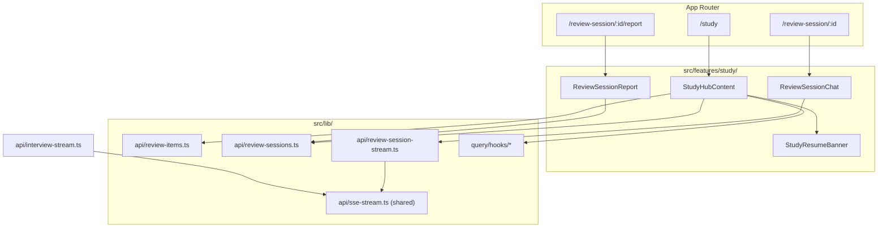
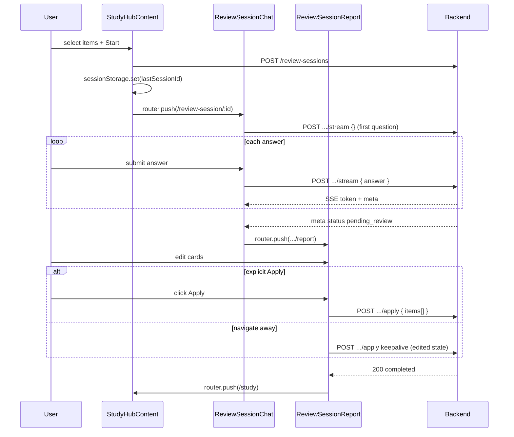

# Study Hub & Review Sessions — Design

**Spec**: `.specs/features/study-hub-review-sessions/spec.md`
**Context**: `.specs/features/study-hub-review-sessions/context.md`
**Status**: Draft

---

## Architecture Overview

A new `study` feature module owns the `/study` hub and orchestrates Review Session routes. Data flows through the existing layered stack (`lib/api` → `lib/query/hooks` → `features/study` → App Router pages). Review Session Q&A reuses the interview SSE transport pattern but keeps **local-only message state** (no `GET .../messages` on the backend). Report confirmation uses a new bulk `apply` endpoint (backend prerequisite).



### End-to-end flow



---

## Design Decisions

| ID | Decision | Choice | Rationale |
|----|----------|--------|-----------|
| STUDY-DES-01 | SSE parser duplication | Extract shared `readSseStream()` in `src/lib/api/sse-stream.ts`; refactor `interview-stream.ts` to use it | CONCERNS.md flags fragile manual parser — one implementation for both flows |
| STUDY-DES-02 | Resume banner data source | `sessionStorage` key + `GET /api/review-sessions/:id` validation on `/study` mount | No list endpoint on backend today; avoids extra backend work for P2; storage updated on session create |
| STUDY-DES-03 | Q&A message persistence | Local React state only (no server message history) | Backend Review Session has no messages API; turns live on `ReviewSessionItem.turns` server-side only |
| STUDY-DES-04 | Topic transitions in chat | Insert a centered **topic divider** message when `meta.itemIndex` advances | Makes multi-topic sessions readable without cross-item transcript |
| STUDY-DES-05 | Report card initial values | `suggestedStatus`/`suggestedPriority` when present; else `active` + `currentPriority` | Failed evaluation (`suggestedStatus: null`) still yields an editable card with safe defaults |
| STUDY-DES-06 | Auto-apply on leave | `fetch(..., { keepalive: true })` via dedicated `applyReviewSessionKeepalive()` | `sendBeacon` cannot set `Authorization` header reliably; `keepalive` fetch supports Bearer token on tab close |
| STUDY-DES-07 | Auto-apply guard | `appliedRef` boolean; skip if already applied or apply in flight | Prevents double-apply on unmount after successful explicit Apply |
| STUDY-DES-08 | Mutation pattern | Imperative async + `getAccessToken()` + `toast` (no `useMutation`) | Matches `interview-chat.tsx` and `interview-human-feedback` convention |
| STUDY-DES-09 | Priority badge reuse | Extract `ReviewPriorityBadge` from `review-items-grid.tsx` | Single source for priority styling across dashboard, feedback, study |
| STUDY-DES-10 | Sidebar nav | Label **Study**, icon `BookOpen`, href `/study`, placed after Feedback | Distinct from Feedback (interview-derived); BookOpen fits backlog metaphor |
| STUDY-DES-11 | Selection UX | Sticky footer bar on Active tab when ≥1 selected | Keeps "Start review session" visible while scrolling long backlogs |
| STUDY-DES-12 | Backend bulk apply | **Hard prerequisite** — frontend types/API wired to `POST .../apply`; report routes feature-flagged or shipped after backend lands | Per `STUDY-DEC-09`; per-item confirm not used |

---

## Backend Prerequisites (cross-repo)

These must ship in `Backend/` before the report/apply slice is complete. Track as **BE-STUDY-01** (can be a task in Backend STATE or a frontend tasks.md dependency).

### BE-STUDY-01: `POST /api/review-sessions/:id/apply`

Replace per-item confirm. Request/response per `spec.md` Prerequisites section.

**Suggested backend implementation sketch** (for backend agent):

- Zod schema: `applyReviewSessionSchema = z.object({ items: z.array(z.object({ reviewSessionItemId: z.uuid(), status: reviewItemStatusSchema, priority: reviewPrioritySchema.optional() })).min(1) })` with refine: `priority` required when `status === "active"`.
- Service: validate session `pending_review`, all items belong to session, none already confirmed; loop `ReviewMergeService.applyReviewSessionConfirmation`; mark session `completed`.
- Remove route `POST /:id/items/:itemId/confirm` and update E2E.
- Update `docs/frontend-mock-interview-api.md`.

### BE-STUDY-02 (optional, deferred): `GET /api/review-sessions?status=`

Not required for MVP if `STUDY-DES-02` is used. Add later if users can have multiple open sessions across devices.

---

## Code Reuse Analysis

### Existing components to leverage

| Component | Location | How to use |
|-----------|----------|------------|
| SSE fetch + parse loop | `src/lib/api/interview-stream.ts` | Extract core parser to `sse-stream.ts`; both streams call shared helper |
| Chat input | `src/features/interview/interview-chat-input.tsx` | Reuse as-is with `isFinished` derived from session status / pending_review redirect |
| Message list + bubbles | `src/features/interview/interview-message-list.tsx` | Reuse `DisplayMessage` shape; pass local messages from `ReviewSessionChat` |
| Priority styles | `src/features/dashboard/review-items-grid.tsx` | Extract `ReviewPriorityBadge`; grid imports it |
| App shell / auth | `src/features/dashboard/app-shell.tsx`, `auth-guard.tsx` | Wrap new pages identically to `/feedback` |
| API client | `src/lib/api/client.ts` | `apiRequest`, `ApiError` for REST; raw `fetch` for SSE and keepalive apply |
| Auth token access | `src/features/auth/session-provider.tsx` | `fetchWithAuth`, `getAccessToken` |
| Query invalidation | `src/lib/query/keys.ts` | Extend keys; invalidate `reviewItems` after PATCH/DELETE/apply |
| Toast errors | `sonner` | Same pattern as `feedback/page.tsx`, `interview-chat.tsx` |

### Integration points

| System | Integration method |
|--------|-------------------|
| `GET/PATCH/DELETE /api/review-items` | Extend `review-items.ts`; parametric `useReviewItems(status)` |
| `POST/GET /api/review-sessions` | New `review-sessions.ts` |
| `POST .../stream` (SSE) | New `review-session-stream.ts` sharing `sse-stream.ts` |
| `POST .../apply` | `review-sessions.ts` — normal + keepalive variants |
| `sessionStorage` | `src/features/study/lib/review-session-storage.ts` — last open session id |
| Next.js App Router | Three new pages under `(app)/` |

### CONCERNS.md mitigations

| Concern | Mitigation in this design |
|---------|---------------------------|
| Fragile SSE parser | STUDY-DES-01 — single shared parser, both streams refactored together |
| Optimistic message complexity | Simpler than interview: no query cache merge for messages; append to local array only; drop pending human on stream error |
| No automated tests | Tasks gate on `lint + check-types + build`; optional manual UAT checklist in validate phase |
| Client-only auth | Unchanged; inherited `AuthGuard` |

---

## Module & File Layout

```
src/
├── app/(app)/
│   ├── study/
│   │   └── page.tsx                          # StudyHubContent + AppShell
│   └── review-session/[sessionId]/
│       ├── page.tsx                          # ReviewSessionChat
│       └── report/
│           └── page.tsx                      # ReviewSessionReport
│
├── features/
│   ├── dashboard/
│   │   ├── app-sidebar.tsx                   # + Study nav item
│   │   └── review-items-grid.tsx             # import ReviewPriorityBadge
│   └── study/                                # NEW feature module
│       ├── study-hub-content.tsx             # tabs, selection state, start session
│       ├── study-tabs.tsx                    # Active | Learned tab switcher
│       ├── study-item-card.tsx               # card + checkbox + actions
│       ├── study-selection-bar.tsx           # sticky footer: count + Start
│       ├── study-resume-banner.tsx           # in_progress / pending_review CTA
│       ├── review-session-chat.tsx           # SSE Q&A orchestrator
│       ├── review-session-progress.tsx       # "Topic 2/3 — Question 2/3"
│       ├── review-session-report.tsx         # report page content + Apply
│       ├── review-report-card.tsx            # editable single item card
│       ├── review-priority-badge.tsx         # extracted shared badge
│       └── lib/
│           ├── build-apply-payload.ts          # ReportCardState[] → ApplyRequest
│           ├── report-card-state.ts            # init + update helpers
│           ├── review-session-storage.ts       # sessionStorage last id
│           └── review-display-messages.ts      # local message model helpers
│
├── lib/
│   ├── api/
│   │   ├── sse-stream.ts                     # NEW shared SSE reader
│   │   ├── interview-stream.ts               # refactor → use sse-stream
│   │   ├── review-items.ts                   # + list(status), patch, delete
│   │   ├── review-sessions.ts                # NEW create, getById, apply, applyKeepalive
│   │   └── review-session-stream.ts          # NEW streamReviewSessionTurn
│   ├── query/
│   │   ├── keys.ts                           # + reviewItems(status), reviewSession(id)
│   │   └── hooks/
│   │       ├── use-review-items.ts           # parametric status
│   │       ├── use-review-session.ts           # NEW
│   │       └── use-open-review-session.ts    # NEW banner helper
│   └── types/  → actually src/types/
│
└── types/
    ├── review-items.ts                       # + status, learnedAt
    └── review-sessions.ts                    # NEW
```

---

## Data Models

### `src/types/review-items.ts` (extend)

```typescript
export type ReviewItemStatus = "active" | "learned";

export type ReviewItem = {
  id: string;
  sessionId: string;
  topic: string;
  description: string;
  priority: ReviewPriority;
  status: ReviewItemStatus;
  learnedAt: string | null;
  createdAt: string;
  updatedAt: string;
};

export type ReviewItemsStatusFilter = "active" | "learned" | "all";
```

### `src/types/review-sessions.ts` (new)

```typescript
export type ReviewSessionStatus = "in_progress" | "pending_review" | "completed";

export type ReviewSessionItemReport = {
  id: string; // ReviewSessionItem id
  reviewItemId: string;
  topic: string;
  currentPriority: ReviewPriority;
  suggestedStatus: ReviewItemStatus | null;
  suggestedPriority: ReviewPriority | null;
  confirmedStatus: ReviewItemStatus | null;
  confirmedPriority: ReviewPriority | null;
};

export type ReviewSession = {
  id: string;
  status: ReviewSessionStatus;
  items: ReviewSessionItemReport[];
};

export type CreateReviewSessionResponse = {
  id: string;
  status: "in_progress";
  items: Array<{
    id: string;
    reviewItemId: string;
    topic: string;
    currentPriority: ReviewPriority;
  }>;
};

/** SSE meta — in-progress turn */
export type ReviewSessionStreamMetaProgress = {
  reviewSessionItemId: string;
  itemIndex: number;
  totalItems: number;
  turnsCompleted: number;
  questionsPerItem: number;
  status: "in_progress";
};

/** SSE meta — evaluation complete */
export type ReviewSessionStreamMetaComplete = {
  status: "pending_review";
  report: Array<{
    reviewSessionItemId: string;
    reviewItemId: string;
    topic: string;
    currentPriority: ReviewPriority;
    suggestedStatus: ReviewItemStatus | null;
    suggestedPriority: ReviewPriority | null;
  }>;
};

export type ReviewSessionStreamMeta =
  | ReviewSessionStreamMetaProgress
  | ReviewSessionStreamMetaComplete;

export type ApplyReviewSessionItem = {
  reviewSessionItemId: string;
  status: ReviewItemStatus;
  priority?: ReviewPriority; // required when status === "active"
};

export type ApplyReviewSessionRequest = {
  items: ApplyReviewSessionItem[];
};
```

### Local UI state — report cards (`report-card-state.ts`)

```typescript
export type ReportCardState = {
  reviewSessionItemId: string;
  topic: string;
  currentPriority: ReviewPriority;
  suggestedStatus: ReviewItemStatus | null;
  suggestedPriority: ReviewPriority | null;
  evaluationFailed: boolean;
  /** User-editable outcome */
  status: ReviewItemStatus;
  priority: ReviewPriority | null; // null when status === "learned"
};
```

`initReportCardState(item: ReviewSessionItemReport): ReportCardState` — see STUDY-DES-05.

### Local UI state — Q&A messages (`review-display-messages.ts`)

```typescript
export type ReviewDisplayMessage =
  | { id: string; kind: "topic"; topic: string; itemIndex: number }
  | { id: string; kind: "human"; content: string; createdAt: string }
  | { id: string; kind: "ai"; content: string; createdAt: string; streaming?: boolean };
```

Not persisted to server; rebuilt only within the session page visit (resume mid-Q&A shows prior turns only via next stream call — server holds turns; UI may be sparse on resume until next question streams).

---

## API Clients

### `src/lib/api/sse-stream.ts` (new)

```typescript
export type SseStreamCallbacks = {
  onToken: (content: string) => void;
  onMeta: (data: Record<string, unknown>) => void;
  onError?: (message: string, extra?: Record<string, unknown>) => void;
  signal?: AbortSignal;
};

export async function readSseStream(
  response: Response,
  callbacks: SseStreamCallbacks,
): Promise<void>;
```

Parses `event: token|meta|error` + `data: [DONE]` — extracted from current `interview-stream.ts` logic.

### `src/lib/api/review-session-stream.ts` (new)

```typescript
export async function streamReviewSessionTurn(
  sessionId: string,
  answer: string | undefined,
  token: string,
  callbacks: {
    onToken: (chunk: string) => void;
    onMeta: (meta: ReviewSessionStreamMeta) => void;
    signal?: AbortSignal;
  },
): Promise<void>;
```

- URL: `POST ${SERVER}/api/review-sessions/${sessionId}/stream`
- Body: `answer` omitted on first call; `{ answer }` on subsequent calls
- Uses `readSseStream`; throws `ApiError` on HTTP error or `event: error`

### `src/lib/api/review-sessions.ts` (new)

| Method | Endpoint | Notes |
|--------|----------|-------|
| `create(token, reviewItemIds)` | `POST /api/review-sessions` | Returns `CreateReviewSessionResponse` |
| `getById(token, sessionId)` | `GET /api/review-sessions/:id` | Returns `ReviewSession` |
| `apply(token, sessionId, body)` | `POST /api/review-sessions/:id/apply` | Standard `apiRequest` |
| `applyKeepalive(token, sessionId, body)` | Same URL | Raw `fetch` with `keepalive: true`, no response body read |

### `src/lib/api/review-items.ts` (extend)

| Method | Endpoint |
|--------|----------|
| `list(token, status?: ReviewItemsStatusFilter)` | `GET /api/review-items?status=` |
| `patchStatus(token, id, status)` | `PATCH /api/review-items/:id` |
| `delete(token, id)` | `DELETE /api/review-items/:id` |

---

## Query Layer

### Keys (`keys.ts`)

```typescript
reviewItems: (status: ReviewItemsStatusFilter = "active") =>
  ["review-items", status] as const,
reviewSession: (sessionId: string) =>
  ["review-sessions", sessionId] as const,
```

### Hooks

| Hook | Purpose |
|------|---------|
| `useReviewItems(status)` | Replace current hook; `queryKey: queryKeys.reviewItems(status)` |
| `useReviewSession(sessionId)` | `getById`; `enabled` when id present |
| `useOpenReviewSession()` | Reads `sessionStorage` id → `useReviewSession` → returns `{ session, clear }` if status is `in_progress` or `pending_review` |

**Backward compatibility:** Update existing `useReviewItems()` call sites to pass `"active"` (default) or `"all"` where dashboard counts all items — check `dashboard-stats.ts` (likely wants active only or all).

---

## Components

### `StudyHubContent`

- **Purpose**: Main `/study` page — tabs, item lists, selection, session start, resume banner.
- **Location**: `src/features/study/study-hub-content.tsx`
- **State**: `activeTab: "active" | "learned"`; `selectedIds: Set<string>`; `isStarting: boolean`
- **Dependencies**: `useReviewItems`, `useOpenReviewSession`, `reviewSessionsApi.create`, `router`
- **Reuses**: `AppShell`, `StudyItemCard`, `StudySelectionBar`, `StudyResumeBanner`

**Selection rules:**

- Toggle checkbox on `StudyItemCard` (Active tab only).
- Max 10: on toggle that would exceed 10 → `toast.error("You can select at most 10 topics per session")`.
- `Start review session`: disabled when `selectedIds.size === 0`; shows count in `StudySelectionBar`.

**On successful create:**

1. `setLastReviewSessionId(id)` in sessionStorage
2. `router.push(/review-session/${id})`

### `StudyItemCard`

- **Purpose**: Single review item with priority badge, description, and contextual actions.
- **Props**: `item: ReviewItem`; `selectable?: boolean`; `selected?: boolean`; `onSelectToggle?`; action callbacks
- **Active actions**: Mark as learned, Delete
- **Learned actions**: Reactivate, Delete
- **Reuses**: `ReviewPriorityBadge`, `cn()`, confirm dialog for delete (`window.confirm` — same as feedback page)

### `StudyResumeBanner`

- **Purpose**: Surface interrupted session with deep link.
- **Copy**: `in_progress` → "Continue your review session"; `pending_review` → "Review your suggestions"
- **Link**: `/review-session/[id]` or `.../report` respectively
- **On 404** from parent fetch: `clearLastReviewSessionId()` + hide banner

### `ReviewSessionChat`

- **Purpose**: SSE-driven Q&A for one Review Session.
- **Location**: `src/features/study/review-session-chat.tsx`
- **Mount behavior**:
  1. `useReviewSession(sessionId)` — if `pending_review` → redirect to report; if `completed` → redirect `/study`
  2. `useEffect` on mount: call `streamReviewSessionTurn(sessionId, undefined, ...)` once (first question)
- **Send answer**: Same as interview — optimistic human message, stream AI question, append on complete
- **On `meta` progress**: Update `ReviewSessionProgress` state
- **On `meta` complete**: `router.push(.../report)`; optionally seed report query cache from `meta.report`
- **409 on stream**: Redirect to report or study per status from `getById`
- **Reuses**: `InterviewChatInput`, `InterviewMessageList`, `streamReviewSessionTurn`, `AbortController` on unmount

### `ReviewSessionProgress`

- **Purpose**: Header strip showing `Topic ${itemIndex + 1}/${totalItems} — Question ${turnsCompleted + 1}/${questionsPerItem}`.
- **Note**: `turnsCompleted` in meta is count *before* the emitted question; display uses `turnsCompleted + 1` for current question number.

### `ReviewSessionReport`

- **Purpose**: Editable suggestion cards + single Apply; auto-apply on leave.
- **Location**: `src/features/study/review-session-report.tsx`
- **Init**: `useReviewSession` → map items to `ReportCardState[]` via `initReportCardState`
- **Apply click**: `buildApplyPayload(cards)` → validate → `reviewSessionsApi.apply` → invalidate queries → toast success → `clearLastReviewSessionId` → `/study`
- **Auto-apply** (STUDY-DES-06/07):
  - `useEffect` return (): if `!appliedRef && !applyingRef` → `applyKeepalive`
  - `beforeunload` handler: same guard (best-effort)
  - Next.js `useRouter` navigation: cleanup runs on route change
- **Reuses**: `ReviewReportCard`, `getAccessToken`, query invalidation

### `ReviewReportCard`

- **Purpose**: One editable report row.
- **UI**:
  - Topic title + current priority badge
  - Suggested line: "Suggested: medium priority" or "Suggested: mark as learned" or warning if evaluation failed
  - Toggle or tabs: **Keep active** (shows priority `<select>`) vs **Mark as learned**
  - Priority select: `low` | `medium` | `high` (disabled when learned)
- **Props**: `card: ReportCardState`; `onChange: (patch) => void`

### `ReviewPriorityBadge` (extracted)

- **Purpose**: Consistent priority chip.
- **Location**: `src/features/study/review-priority-badge.tsx` (or `src/components/patterns/` — prefer study if only study+dashboard use it; export from study, import in dashboard grid)

---

## Pages (thin wrappers)

| Page | Renders |
|------|---------|
| `study/page.tsx` | `<AppShell><StudyHubContent /></AppShell>` |
| `review-session/[sessionId]/page.tsx` | `<AppShell><ReviewSessionChat sessionId={...} /></AppShell>` |
| `review-session/[sessionId]/report/page.tsx` | `<AppShell><ReviewSessionReport sessionId={...} /></AppShell>` |

`AppShell` active state: sidebar highlights Study when path starts with `/study` or `/review-session` (update `app-sidebar.tsx` active check).

---

## `buildApplyPayload` validation

```typescript
function buildApplyPayload(cards: ReportCardState[]): ApplyReviewSessionRequest {
  return {
    items: cards.map((c) => ({
      reviewSessionItemId: c.reviewSessionItemId,
      status: c.status,
      ...(c.status === "active" ? { priority: c.priority! } : {}),
    })),
  };
}
```

Client-side: throw/show toast if any active card lacks `priority`.

---

## Error Handling Strategy

| Scenario | Handling | User impact |
|----------|----------|-------------|
| `POST /review-sessions` 404 | Toast error; refetch active items | Stays on `/study` |
| `POST /review-sessions` 422 | Toast with validation message | Stays on `/study` |
| Stream HTTP 409 | `getById` → redirect report or study | Automatic navigation |
| Stream `event: error` | Toast; re-enable input; retry same answer | Can resubmit |
| Stream abort (nav away) | Silent abort; session stays `in_progress` | Resume banner later |
| PATCH/DELETE 404 | Toast + invalidate lists | Card may disappear on refetch |
| Apply 400/409 | Toast; remain on report | Retry Apply |
| Apply network error | Toast | Retry Apply |
| Auto-apply on leave fails | Silent (best-effort); banner remains | User returns via banner |
| `getById` 404 on report | Toast + redirect `/study` | Clear storage |
| Not authenticated | Toast "Not authenticated" | No request sent |

---

## Testing Strategy

No frontend test runner today (`TESTING.md`). Per-task gates:

| Gate | Command |
|------|---------|
| Quick | `bun run lint && bun run check-types` |
| Build | `bun run lint && bun run check-types && bun run build` |

**Manual UAT checklist** (for Validate phase):

1. `/study` Active/Learned tabs load correct API filters
2. Mark learned → item moves to Learned tab
3. Multi-select 2 items → session → answer all questions → land on report
4. Edit priority on one card → Apply → verify API payload and `/study` list
5. Edit cards → navigate away without Apply → verify keepalive apply (network tab)
6. Mid-session leave → banner → resume Q&A
7. Delete item on both tabs

**Recommended follow-up (out of scope):** Vitest for `buildApplyPayload`, `initReportCardState`, `readSseStream` with fixture SSE strings.

---

## Requirement Traceability (design coverage)

| Requirement | Design section |
|-------------|----------------|
| STUDY-01–05 | `StudyHubContent`, `StudyTabs`, pages, sidebar |
| STUDY-06–09 | `StudyItemCard` actions, `review-items.ts` |
| STUDY-10–13 | Selection state, `StudySelectionBar`, `create` |
| STUDY-14–19 | `ReviewSessionChat`, `review-session-stream.ts`, `sse-stream.ts` |
| STUDY-20–25 | `ReviewSessionReport`, `ReviewReportCard`, `buildApplyPayload`, BE-STUDY-01 |
| STUDY-26–28 | `StudyResumeBanner`, `review-session-storage.ts`, `useOpenReviewSession` |

---

## Out of Scope (unchanged from spec)

Completed session history, system-suggested prompts, configurable N, Portuguese copy, `/feedback` cross-link, backend list endpoint (optional BE-STUDY-02).

---

## Next Steps

1. **Review and approve** this design — especially STUDY-DES-02 (sessionStorage resume), STUDY-DES-06 (keepalive auto-apply), and BE-STUDY-01 dependency.
2. **Backend**: implement `POST .../apply` (BE-STUDY-01) before frontend report tasks.
3. **Tasks** (`tasks.md`) — phased breakdown: types/API → study hub → SSE chat → report (blocked on BE) → resume banner → nav/docs.
4. **Execute** per task with build gate.
