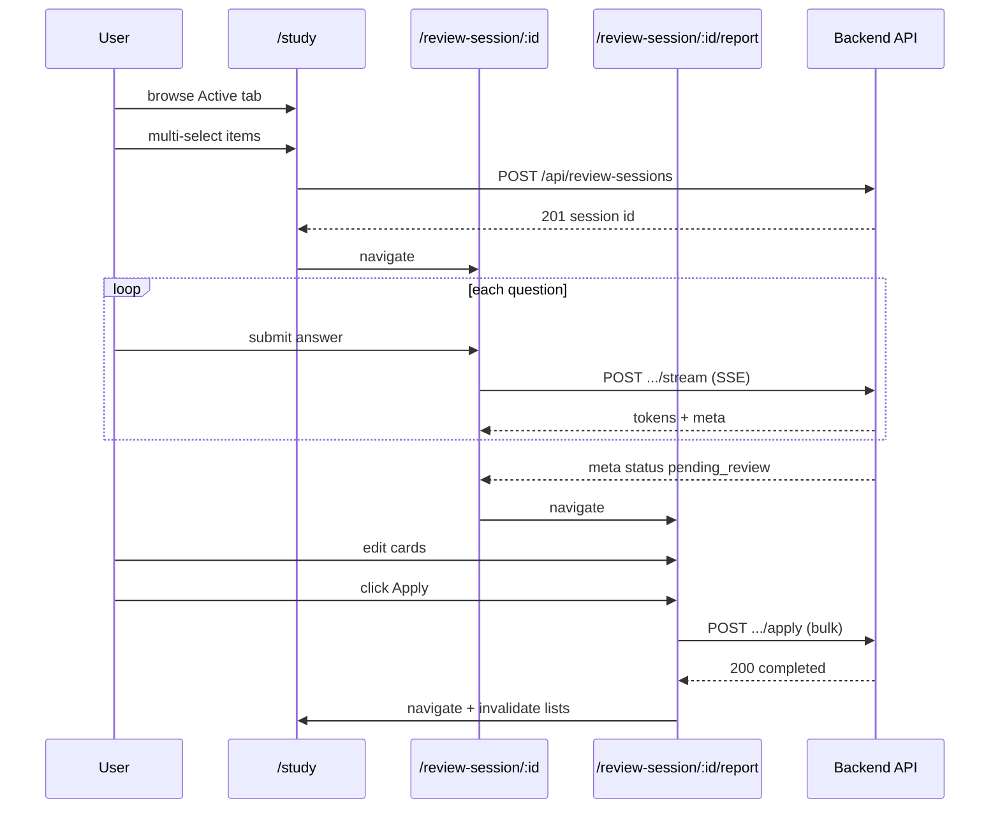

# Study Hub & Review Sessions (Frontend) — Specification

## Problem Statement

The backend ships a full **Review Items Learned Status** capability: `active` / `learned` lifecycle, manual status toggles, and user-initiated **Review Sessions** (select topics → adaptive Q&A over SSE → LLM suggestions → persist to `review_items`). The frontend today only lists review items read-only on `/dashboard` and `/feedback` — no `status`/`learnedAt` fields, no PATCH/DELETE, no Review Session flow, and no way for candidates to demonstrate progress and shrink their study backlog.

Candidates need a dedicated **Study** experience to manage topics, run focused review sessions without polluting normal mock interviews, and apply LLM suggestions on their own terms.

## Goals

- [ ] Authenticated users manage review items on `/study` with **Active** and **Learned** views.
- [ ] Users start a Review Session by multi-selecting 1–10 active items and complete adaptive Q&A via SSE (chat-like UI).
- [ ] After evaluation, users review editable suggestion cards and apply all decisions with a **single Apply** action (including auto-apply on navigation away with edited values).
- [ ] Users manually mark topics learned, reactivate learned topics, and delete items without starting a session.
- [ ] Interrupted sessions (`in_progress`, `pending_review`) are discoverable and resumable from `/study`.

## Out of Scope

| Item | Reason |
|------|--------|
| Backend implementation of bulk apply | Separate backend work item; frontend spec defines the contract and blocks report features until it exists |
| Completed Review Session history UI | Deferred — see `context.md` |
| System-suggested session prompts ("you have 5 high-priority items") | Backend defers; manual trigger only |
| User-configurable questions per item (`N`) | Fixed server default (3); not exposed in UI |
| Changes to normal mock interview flow | Backend already stops mutating existing review items on interview final turn |
| Spaced repetition, streaks, analytics | Separate product features |
| Portuguese UI copy | English for this iteration (`STUDY-DEC-08`) |

---

## Relationship to Existing Features

| Feature / doc | Link | Impact |
|---------------|------|--------|
| Review Items Learned Status (Backend) | [spec.md](../../../../Backend/.specs/features/review-items-learned-status/spec.md) | Source of truth for API behavior, SSE contract, session lifecycle |
| Review Items Learned Status (Backend) | [design.md](../../../../Backend/.specs/features/review-items-learned-status/design.md) | Response shapes, meta payloads, error codes |
| Frontend architecture | [ARCHITECTURE.md](../../codebase/ARCHITECTURE.md) | Feature-sliced layout, TanStack Query, SSE via `fetch` |
| Frontend integrations | [INTEGRATIONS.md](../../codebase/INTEGRATIONS.md) | `review-items` API today; extend with review-sessions |
| Interview chat (SSE) | `src/features/interview/interview-chat.tsx` | Template for Review Session Q&A UI |
| Review items grid | `src/features/dashboard/review-items-grid.tsx` | Reuse priority badges / card layout |
| Feedback page | `src/app/(app)/feedback/page.tsx` | Unchanged primary purpose; optional future link to `/study` |

**Brownfield touchpoints:**

| Area | Current state | Change |
|------|---------------|--------|
| `src/types/review-items.ts` | No `status`, `learnedAt` | Extend type |
| `src/lib/api/review-items.ts` | `list()` only | Add `list(status)`, `patchStatus`, `delete` |
| `src/lib/query/hooks/use-review-items.ts` | Single list query | Status-filtered queries or param |
| `src/lib/query/keys.ts` | `reviewItems` key | Add review-session keys |
| App routes | No `/study`, no review-session routes | Add `(app)/study`, `(app)/review-session/[sessionId]`, report sub-route |
| `AppShell` navigation | No Study entry | Add nav link |
| Backend confirm API | Per-item `POST .../items/:itemId/confirm` | **Replace** with bulk `POST .../apply` (prerequisite) |

---

## Prerequisites (Backend)

The grilling session locked a frontend UX that **conflicts** with the shipped per-item confirm endpoint. Before the report/Apply stories ship:

### `POST /api/review-sessions/:id/apply` (new — bulk)

**Request:**

```json
{
  "items": [
    { "reviewSessionItemId": "uuid", "status": "active", "priority": "medium" },
    { "reviewSessionItemId": "uuid", "status": "learned" }
  ]
}
```

| Field | Rules |
|-------|-------|
| `items` | Non-empty array; must include **every** unconfirmed `ReviewSessionItem` in the session (or explicitly document partial apply — **decision: all items required**) |
| `reviewSessionItemId` | `ReviewSessionItem.id` (not `reviewItemId`) |
| `status` | `active` \| `learned` |
| `priority` | Required when `status === "active"`; omitted/ignored when `learned` |

| Status | When |
|--------|------|
| `200` | All items applied; underlying `review_items` updated; session `completed` |
| `400` | Invalid body, session not `pending_review`, or missing priority on active item |
| `404` | Session not found or not owned |
| `409` | Session already `completed`, or item already confirmed |

**Deprecation:** Remove `POST /api/review-sessions/:id/items/:itemId/confirm` once bulk apply is live and E2E updated.

### `GET /api/review-sessions` (recommended — list open sessions)

Not in the original backend spec. Required for the resume banner unless the frontend persists the last open `sessionId` in `sessionStorage` (fragile). **Design-phase decision:** prefer a lightweight list endpoint filtered by `status=in_progress,pending_review`; if omitted, banner uses last-known session id from client storage with `GET /:id` validation.

---

## Decisions (resolved)

| ID | Decision |
|----|----------|
| STUDY-DEC-01 | Primary hub at `/study` with Active \| Learned tabs |
| STUDY-DEC-02 | Review Session Q&A reuses interview chat SSE UX |
| STUDY-DEC-03 | Report uses editable cards + **single Apply** (bulk), not per-item confirm |
| STUDY-DEC-04 | On navigation away from report without Apply, auto-apply **edited** card state |
| STUDY-DEC-05 | Session start via multi-select (1–10 active items) on Active tab |
| STUDY-DEC-06 | Resume banner on `/study` for `in_progress` and `pending_review` sessions |
| STUDY-DEC-07 | DELETE allowed on active and learned items |
| STUDY-DEC-08 | English UI copy for all new strings |
| STUDY-DEC-09 | Bulk apply backend endpoint is a **hard prerequisite** for report stories |

---

## User Stories

### P1: Study hub — Active & Learned backlog ⭐ MVP

**User Story**: As a candidate, I want a dedicated Study page listing my active topics and archived learned topics, so I can see what I still need to work on and what I've mastered.

**Why P1**: Entry point for all other flows; extends the read-only grid into a manageable backlog.

**Acceptance Criteria**:

1. WHEN an authenticated user navigates to `/study` THEN the page SHALL display two tabs: **Active** (default) and **Learned**.
2. WHEN the Active tab is selected THEN the UI SHALL fetch `GET /api/review-items?status=active` and render cards with topic, description, and priority badge (reuse existing priority styling).
3. WHEN the Learned tab is selected THEN the UI SHALL fetch `GET /api/review-items?status=learned` and render cards with topic, description, and `learnedAt` (formatted date).
4. WHEN a tab has zero items THEN the UI SHALL show an appropriate empty state (Active: prompt to complete interviews; Learned: "No mastered topics yet").
5. WHEN the user is unauthenticated THEN `AuthGuard` SHALL redirect to `/login` (inherited from `(app)` layout).
6. WHEN `/study` is added THEN `AppShell` navigation SHALL include a link to `/study`.

**Independent Test**: Log in → open `/study` → verify Active list matches API; switch to Learned → verify learned items only.

**Requirements**: STUDY-01, STUDY-02, STUDY-03, STUDY-04, STUDY-05

---

### P1: Manual mark learned, reactivate, and delete ⭐ MVP

**User Story**: As a candidate, I want to archive, restore, or remove topics without running a Review Session, so I stay in control of my study list.

**Why P1**: Backend P2 stories; low-effort, high-value autonomy on `/study`.

**Acceptance Criteria**:

1. WHEN the user clicks **Mark as learned** on an active card THEN the UI SHALL call `PATCH /api/review-items/:id` with `{ "status": "learned" }`, show success feedback, and invalidate review-items queries.
2. WHEN the user clicks **Reactivate** on a learned card THEN the UI SHALL call `PATCH` with `{ "status": "active" }` and refresh lists.
3. WHEN the user confirms delete on any card THEN the UI SHALL call `DELETE /api/review-items/:id` and remove the card from the current view.
4. WHEN PATCH or DELETE returns `404` THEN the UI SHALL show an error toast and refetch the list.
5. WHEN an action is in flight THEN the triggering control SHALL be disabled to prevent duplicate requests.

**Independent Test**: Mark one active item learned → appears on Learned tab; reactivate → returns to Active; delete from either tab → gone from both.

**Requirements**: STUDY-06, STUDY-07, STUDY-08, STUDY-09

---

### P1: Start Review Session (multi-select) ⭐ MVP

**User Story**: As a candidate, I want to select specific weak topics and start a focused review session, so I can work on known gaps without a full mock interview.

**Why P1**: Core mechanism replacing interview-final-turn reassessment.

**Acceptance Criteria**:

1. WHEN the Active tab is shown THEN each card SHALL have a selection checkbox.
2. WHEN the user selects 1–10 active items and clicks **Start review session** THEN the UI SHALL call `POST /api/review-sessions` with `{ reviewItemIds }` and navigate to `/review-session/[sessionId]`.
3. WHEN the user selects more than 10 items THEN the UI SHALL NOT submit; SHALL show feedback (toast: max 10 items).
4. WHEN `POST` returns `404` (invalid/non-active/not-owned ID) THEN the UI SHALL show an error toast and remain on `/study`.
5. WHEN `POST` returns `201` THEN the UI SHALL store the session id and navigate to the Q&A route.
6. WHEN zero items are selected THEN **Start review session** SHALL be disabled.

**Independent Test**: Select 2 active items → start → land on Q&A page with session id in URL; verify network call body.

**Requirements**: STUDY-10, STUDY-11, STUDY-12, STUDY-13

---

### P1: Review Session Q&A over SSE (chat-like) ⭐ MVP

**User Story**: As a candidate in a Review Session, I want to answer adaptive follow-up questions per topic with streaming feedback, similar to my mock interview chat, so the experience feels familiar and responsive.

**Why P1**: Delivers the backend RSF-02 flow; reuses proven SSE client patterns.

**Acceptance Criteria**:

1. WHEN the user opens `/review-session/[sessionId]` for an `in_progress` session THEN the UI SHALL call `POST /api/review-sessions/:id/stream` with **no** `answer` to receive the first question via SSE.
2. WHEN the user submits an answer THEN the UI SHALL call the same stream endpoint with `{ answer }`, display the user's message optimistically, and stream the next question tokens into an AI message bubble.
3. WHEN SSE emits `event: token` THEN the UI SHALL append `content` to the streaming question display (same parser pattern as `streamInterviewTurn`).
4. WHEN SSE emits `event: meta` with progress fields (`itemIndex`, `totalItems`, `turnsCompleted`, `questionsPerItem`, `status`) THEN the UI SHALL show a progress indicator (e.g. "Topic 2/3 — Question 2/3").
5. WHEN SSE emits `event: meta` with `status: "pending_review"` THEN the UI SHALL stop accepting answers and navigate to `/review-session/[sessionId]/report` (report may also be embedded in meta — use `GET` as fallback).
6. WHEN SSE emits `event: error` THEN the UI SHALL show an error state/toast; user MAY retry the stream call if session remains `in_progress`.
7. WHEN the user navigates away mid-Q&A THEN the in-flight stream SHALL be aborted (`AbortSignal`); session remains `in_progress` for resume.
8. WHEN stream returns `409` (session already `pending_review` or `completed`) THEN the UI SHALL redirect to the report page or `/study` as appropriate.

**Independent Test**: Start session with 1 item → answer 3 questions → verify redirect to report; inspect SSE meta progression.

**Requirements**: STUDY-14, STUDY-15, STUDY-16, STUDY-17, STUDY-18, STUDY-19

---

### P1: Suggestion report — editable cards + bulk Apply ⭐ MVP

**User Story**: As a candidate who finished review questions, I want to see suggested outcomes per topic, adjust them if needed, and apply everything at once, so my study list updates in one deliberate action.

**Why P1**: Core product value — LLM proposes, user disposes; matches grilling decisions (bulk, not per-item).

**Acceptance Criteria**:

1. WHEN the user opens `/review-session/[sessionId]/report` for a `pending_review` session THEN the UI SHALL load `GET /api/review-sessions/:id` and render one card per item with: topic, `currentPriority`, `suggestedStatus`, `suggestedPriority` (if any).
2. WHEN a card is rendered THEN the user SHALL be able to edit the outcome: priority select (`low`/`medium`/`high`) when staying active, or toggle **Mark as learned**.
3. WHEN `suggestedStatus` is `null` (evaluation failed) THEN the card SHALL show a warning and rely on user-edited values only.
4. WHEN the user clicks **Apply** THEN the UI SHALL call `POST /api/review-sessions/:id/apply` with all cards' current edited state and disable the button while in flight.
5. WHEN apply succeeds THEN the UI SHALL invalidate `review-items` queries, show success feedback, and navigate to `/study` (Active tab).
6. WHEN apply fails THEN the UI SHALL show an error toast and keep editable state for retry.
7. WHEN the user navigates away from the report (route change, browser back, tab close) **without** having successfully applied THEN the UI SHALL attempt to call the same bulk apply with the **current edited** card values (auto-apply on leave — `STUDY-DEC-04`).
8. WHEN auto-apply on leave fails (network) THEN the session SHALL remain `pending_review` and the resume banner on `/study` SHALL allow return.

**Independent Test**: Complete Q&A → edit one card's priority → Apply → verify `GET /api/review-items` reflects changes; separate test: edit cards → navigate away → verify items updated.

**Requirements**: STUDY-20, STUDY-21, STUDY-22, STUDY-23, STUDY-24, STUDY-25

**Blocked by**: Backend bulk `POST .../apply` (`STUDY-DEC-09`)

---

### P2: Resume interrupted sessions — should have

**User Story**: As a candidate who left mid-review, I want to see and continue my open Review Session from the Study page, so I don't lose progress.

**Why P2**: Backend sessions persist `in_progress` and `pending_review`; UX polish that prevents dead-ends.

**Acceptance Criteria**:

1. WHEN the user opens `/study` AND has a session in `in_progress` THEN a banner SHALL appear: "Continue your review session" linking to `/review-session/[id]`.
2. WHEN the user has a session in `pending_review` (report not applied) THEN a banner SHALL appear: "Review your suggestions" linking to `/review-session/[id]/report`.
3. WHEN multiple open sessions exist (edge case) THEN the UI SHALL surface the most recently created session (Design: list endpoint vs client storage).
4. WHEN the linked session returns `404` on load THEN the banner SHALL be dismissed and queries invalidated.

**Independent Test**: Start session, answer one question, leave → return to `/study` → banner → resume Q&A.

**Requirements**: STUDY-26, STUDY-27, STUDY-28

---

## Edge Cases

- WHEN the user selects items then one is manually learned via PATCH before session start THEN `POST /api/review-sessions` MAY return `404` — UI SHALL toast and refetch Active list.
- WHEN Active tab is empty THEN multi-select and **Start review session** SHALL be hidden or disabled.
- WHEN apply payload has `status: "active"` without `priority` THEN client-side validation SHALL block submit before calling API.
- WHEN session has exactly one item THEN Q&A and report flows SHALL behave identically (no special UI branch beyond progress showing 1/1).
- WHEN stream disconnects mid-token THEN UI SHALL not append a partial turn; user retries the same answer submission.
- WHEN user double-clicks **Apply** THEN only one apply request SHALL be in flight.
- WHEN auto-apply on `beforeunload` fires THEN use a transport suitable for page unload (`keepalive` or `sendBeacon` with JSON) — Design-phase detail.
- WHEN `GET /api/review-items?status=all` is needed for resume logic THEN prefer separate filtered calls to match existing list hooks.

---

## API & Data Layer (frontend contract)

### Types (`src/types/`)

- Extend `ReviewItem` with `status: "active" | "learned"`, `learnedAt: string | null`.
- New `review-sessions.ts`: session status, session item, stream meta, apply payload/response.

### API clients (`src/lib/api/`)

| Module | Methods |
|--------|---------|
| `review-items.ts` | `list(token, status?)`, `patchStatus(token, id, status)`, `delete(token, id)` |
| `review-sessions.ts` | `create(token, reviewItemIds)`, `getById(token, sessionId)`, `apply(token, sessionId, items)` |
| `review-session-stream.ts` | `streamReviewSessionTurn(sessionId, answer?, token, callbacks)` |

### Query hooks (`src/lib/query/hooks/`)

- `useReviewItems(status)` or parametric list hook.
- `useReviewSession(sessionId)`.
- Mutations: patch/delete review item, create session, apply session (or imperative calls matching `interview-chat` pattern).

### Routes

| Route | Purpose |
|-------|---------|
| `/study` | Hub (tabs, actions, resume banner) |
| `/review-session/[sessionId]` | Q&A (SSE chat) |
| `/review-session/[sessionId]/report` | Editable report + Apply |

---

## Architecture Overview



---

## Requirement Traceability

| Requirement ID | Story | Phase | Status |
|----------------|-------|-------|--------|
| STUDY-01 | P1: Study hub | Design | Pending |
| STUDY-02 | P1: Study hub | Design | Pending |
| STUDY-03 | P1: Study hub | Design | Pending |
| STUDY-04 | P1: Study hub | Design | Pending |
| STUDY-05 | P1: Study hub | Design | Pending |
| STUDY-06 | P1: Manual actions | Design | Pending |
| STUDY-07 | P1: Manual actions | Design | Pending |
| STUDY-08 | P1: Manual actions | Design | Pending |
| STUDY-09 | P1: Manual actions | Design | Pending |
| STUDY-10 | P1: Start session | Design | Pending |
| STUDY-11 | P1: Start session | Design | Pending |
| STUDY-12 | P1: Start session | Design | Pending |
| STUDY-13 | P1: Start session | Design | Pending |
| STUDY-14 | P1: Q&A SSE | Design | Pending |
| STUDY-15 | P1: Q&A SSE | Design | Pending |
| STUDY-16 | P1: Q&A SSE | Design | Pending |
| STUDY-17 | P1: Q&A SSE | Design | Pending |
| STUDY-18 | P1: Q&A SSE | Design | Pending |
| STUDY-19 | P1: Q&A SSE | Design | Pending |
| STUDY-20 | P1: Report + Apply | Design | Pending |
| STUDY-21 | P1: Report + Apply | Design | Pending |
| STUDY-22 | P1: Report + Apply | Design | Pending |
| STUDY-23 | P1: Report + Apply | Design | Pending |
| STUDY-24 | P1: Report + Apply | Design | Pending |
| STUDY-25 | P1: Report + Apply | Design | Pending |
| STUDY-26 | P2: Resume banner | Design | Pending |
| STUDY-27 | P2: Resume banner | Design | Pending |
| STUDY-28 | P2: Resume banner | Design | Pending |

**Coverage:** 28 total, 0 mapped to tasks, 28 unmapped

---

## Success Criteria

- [ ] Candidate can manage active/learned backlog on `/study` without using API tools directly.
- [ ] Candidate can complete a full Review Session (select → Q&A → report → apply) and see `review_items` update only after apply.
- [ ] Bulk apply (explicit or on-leave) persists user-edited values, not raw suggestions when edits differ.
- [ ] Interrupted `in_progress` and `pending_review` sessions are resumable from `/study`.
- [ ] No regression to existing `/feedback` or mock interview flows.
- [ ] All new UI strings in English.

---

## TLC Scope Assessment

**Size:** **Large** — multi-route feature, new API layer, SSE reuse, backend prerequisite, P1+P2 stories.

**Next phases after spec approval:**

1. **Design** (`design.md`) — component tree, hook shapes, bulk-apply client, auto-apply on leave strategy, resume banner data source.
2. **Tasks** (`tasks.md`) — atomic tasks with gates; backend bulk-apply task may be a cross-repo dependency or tracked in Backend STATE.
3. **Execute** — implement per task; interactive UAT recommended for full session walkthrough.

---

**Next step:** Review and approve this spec → **Design** (`design.md`).
